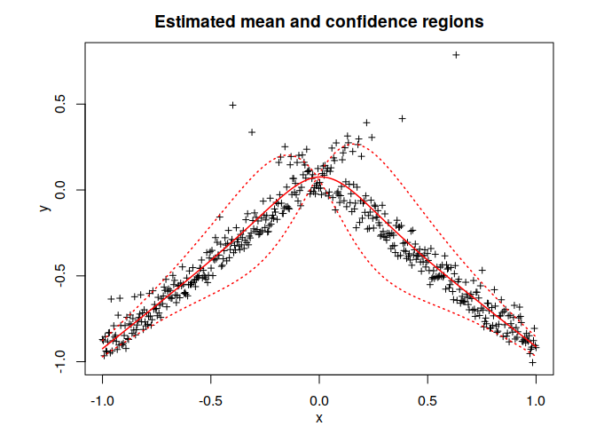
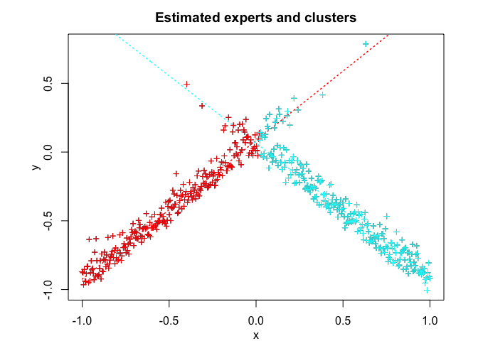
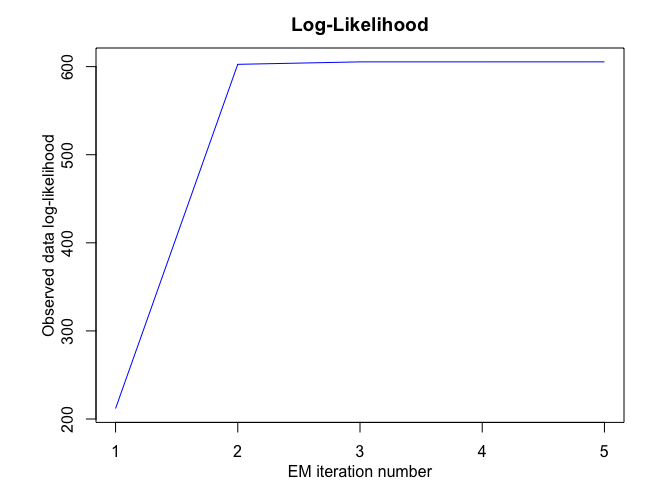

<!-- README.md is generated from README.Rmd. Please edit that file -->
Overview
--------

<!-- badges: start -->
<!-- badges: end -->
MEteorit
========

Mixtures-of-ExperTs modEling for cOmplex and non-noRmal dIsTributions

MEteoritS is a toolbox containg several original and flexible mixtures-of-experts models to model, cluster and classify heteregenous data in many complex situations where the data are distributed according non-normal, possibly skewed distributions, and when they might be corrupted by atypical observations. The toolbox contains in particular sparse mixture-of-experts models for high-dimensional data.

Our (dis-)covered meteorites are for instance the following: - NMoE - NNMoE - tMoE - StMoE - SNMoE : : User-friendly and flexible algorithm for modeling, sampling, inference, and clustering heteregenous data with the Skew-Normal Mixture-of-Experts (SNMoE) model. - RMoE

The models and algorithms are developped and written in Matlab by Faicel Chamroukhi, and translated and designed into R packages by Florian Lecocq, Marius Bartcus and Faicel Chamroukhi.

Installation
------------

You can install the development version of STMoE from [GitHub](https://github.com/) with:

``` r
# install.packages("devtools")
devtools::install_github("fchamroukhi/MEteorits")
```

To build *vignettes* for examples of usage, type the command below instead:

``` r
# install.packages("devtools")
devtools::install_github("fchamroukhi/MEteorits", 
                         build_opts = c("--no-resave-data", "--no-manual"), 
                         build_vignettes = TRUE)
```

Use the following command to display vignettes:

``` r
browseVignettes("MEteorits")
```

Usage
-----

<details> <summary>SNMoE</summary>

``` r
library(meteorit)

data("simulatedstructureddata")

K <- 2 # Number of regimes (mixture components)
p <- 1 # Dimension of beta (order of the polynomial regressors)
q <- 1 # Dimension of w (order of the logistic regression: to be set to 1 for segmentation)

n_tries <- 1
max_iter <- 1500
threshold <- 1e-6
verbose <- TRUE
verbose_IRLS <- FALSE

snmoe <- emSNMoE(simulatedstructureddata$X, matrix(simulatedstructureddata$Y), 
                 K, p, q, n_tries, max_iter, threshold, verbose, verbose_IRLS)

snmoe$plot()
```

 </details>

<details> <summary>StMoE</summary>

``` r
library(meteorit)

data("simulatedstructureddata")

K <- 2 # Number of regimes (mixture components)
p <- 1 # Dimension of beta (order of the polynomial regressors)
q <- 1 # Dimension of w (order of the logistic regression: to be set to 1 for segmentation)

n_tries <- 1
max_iter <- 1500
threshold <- 1e-5
verbose <- TRUE
verbose_IRLS <- FALSE

stmoe <- emStMoE(simulatedstructureddata$X, matrix(simulatedstructureddata$Y), 
                 K, p, q, n_tries, max_iter, threshold, verbose, verbose_IRLS)

stmoe$plot()
```

 </details>

<details> <summary>TMoE</summary>

``` r
library(meteorit)

data("simulatedstructureddata")

K <- 2 # Number of regimes (mixture components)
p <- 1 # Dimension of beta (order of the polynomial regressors)
q <- 1 # Dimension of w (order of the logistic regression: to be set to 1 for segmentation)

n_tries <- 1
max_iter <- 1500
threshold <- 1e-5
verbose <- TRUE
verbose_IRLS <- FALSE

tmoe <- emTMoE(simulatedstructureddata$X, matrix(simulatedstructureddata$Y), K, p, q, n_tries, max_iter, threshold, verbose, verbose_IRLS)

tmoe$plot()
```


</details>

References
==========

Chamroukhi, F, and Bao T Huynh. 2019. “Regularized Maximum Likelihood Estimation and Feature Selection in Mixtures-of-Experts Models.” *Journal de La Société Française de Statistique* 160(1): 57–85.

Chamroukhi, F. 2010. “Hidden Process Regression for Curve Modeling, Classification and Tracking.” Ph.D. Thesis, Université de Technologie de Compiègne. <https://chamroukhi.com/papers/FChamroukhi-Thesis.pdf>.

———. 2015. “Statistical Learning of Latent Data Models for Complex Data Analysis.” Habilitation Thesis (HDR), Université de Toulon. <https://chamroukhi.com/Dossier/FChamroukhi-Habilitation.pdf>.

Chamroukhi, F., A. Samé, G. Govaert, and P. Aknin. 2009. “Time Series Modeling by a Regression Approach Based on a Latent Process.” *Neural Networks* 22 (5-6). Elsevier Science Ltd.: 593–602. <https://chamroukhi.com/papers/Chamroukhi_Neural_Networks_2009.pdf>.

Chamroukhi", F. 2016. “Skew-Normal Mixture of Experts.” In *The International Joint Conference on Neural Networks (Ijcnn)*. <https://chamroukhi.com/papers/Chamroukhi-SNMoE-IJCNN2016.pdf>.

———. 2017. “Skew T Mixture of Experts.” *Neurocomputing - Elsevier* 266: 390–408. <https://chamroukhi.com/papers/STMoE.pdf>.

Nguyen, Hien D., and F. Chamroukhi. 2018. “Practical and Theoretical Aspects of Mixture-of-Experts Modeling: An Overview.” *Wiley Interdisciplinary Reviews: Data Mining and Knowledge Discovery*. Wiley Periodicals, Inc, e1246–n/a. doi:[10.1002/widm.1246](https://doi.org/10.1002/widm.1246).
