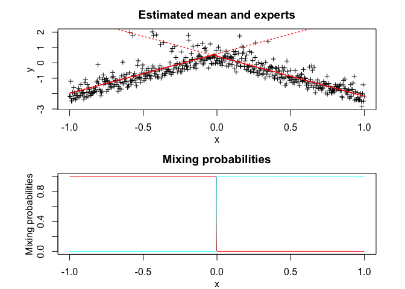

<!-- README.md is generated from README.Rmd. Please edit that file -->

# **MEteorits:** Mixtures-of-ExperTs modEling for cOmplex and non-noRmal dIsTributions

<!-- badges: start -->

[](https://travis-ci.org/fchamroukhi/MEteorits)
[](https://CRAN.R-project.org/package=meteorits)
<!-- badges: end -->

MEteorits is an open source toolbox (available in R and Matlab)
containing several original and flexible mixtures-of-experts models to
model, cluster and classify heteregenous data in many complex situations
where the data are distributed according to non-normal and possibly
skewed distributions, and when they might be corrupted by atypical
observations. The toolbox also contains sparse mixture-of-experts models
for high-dimensional data.

Our (dis-)covered meteorits are for instance the following ones:

  - NMoE (Normal Mixtures-of-Experts);
  - tMoE (t Mixtures-of-Experts);
  - SNMoE (Skew-Normal Mixtures-of-Experts);
  - StMoE (Skew t Mixtures-of-Experts).

The models and algorithms are developped and written in Matlab by Faicel
Chamroukhi, and translated and designed into R packages by Florian
Lecocq, Marius Bartcus and Faicel Chamroukhi.

# Installation

You can install the development version of MEteorits from
[GitHub](https://github.com/fchamroukhi/MEteorits) with:

``` r
# install.packages("devtools")
devtools::install_github("fchamroukhi/MEteorits")
```

To build *vignettes* for examples of usage, type the command below
instead:

``` r
# install.packages("devtools")
devtools::install_github("fchamroukhi/MEteorits", 
                         build_opts = c("--no-resave-data", "--no-manual"), 
                         build_vignettes = TRUE)
```

Use the following command to display vignettes:

``` r
browseVignettes("meteorits")
```

# Usage

``` r
library(meteorits)
```

<details>

<summary>NMoE</summary>

``` r
# Application to a simulated data set

n <- 500 # Size of the sample
alphak <- matrix(c(0, 8), ncol = 1) # Parameters of the gating network
betak <- matrix(c(0, -2.5, 0, 2.5), ncol = 2) # Regression coefficients of the experts
sigmak <- c(1, 1) # Standard deviations of the experts
x <- seq.int(from = -1, to = 1, length.out = n) # Inputs (predictors)

# Generate sample of size n
sample <- sampleUnivNMoE(alphak = alphak, betak = betak, 
                         sigmak = sigmak, x = x)
y <- sample$y

K <- 2 # Number of regressors/experts
p <- 1 # Order of the polynomial regression (regressors/experts)
q <- 1 # Order of the logistic regression (gating network)

nmoe <- emNMoE(X = x, Y = y, K = K, p = p, q = q, verbose = TRUE)
#> EM NMoE: Iteration: 1 | log-likelihood: -850.659719240158
#> EM NMoE: Iteration: 2 | log-likelihood: -850.524629010475
#> EM NMoE: Iteration: 3 | log-likelihood: -850.430788051698
#> EM NMoE: Iteration: 4 | log-likelihood: -850.283793706938
#> EM NMoE: Iteration: 5 | log-likelihood: -849.97811162098
#> EM NMoE: Iteration: 6 | log-likelihood: -849.309846170774
#> EM NMoE: Iteration: 7 | log-likelihood: -847.853073877546
#> EM NMoE: Iteration: 8 | log-likelihood: -844.760254765814
#> EM NMoE: Iteration: 9 | log-likelihood: -838.538908952736
#> EM NMoE: Iteration: 10 | log-likelihood: -827.124841419721
#> EM NMoE: Iteration: 11 | log-likelihood: -809.002195790739
#> EM NMoE: Iteration: 12 | log-likelihood: -786.082845509062
#> EM NMoE: Iteration: 13 | log-likelihood: -765.697860048611
#> EM NMoE: Iteration: 14 | log-likelihood: -753.84437315637
#> EM NMoE: Iteration: 15 | log-likelihood: -748.545284749922
#> EM NMoE: Iteration: 16 | log-likelihood: -746.181369709665
#> EM NMoE: Iteration: 17 | log-likelihood: -745.062227019926
#> EM NMoE: Iteration: 18 | log-likelihood: -744.517209155278
#> EM NMoE: Iteration: 19 | log-likelihood: -744.248035626126
#> EM NMoE: Iteration: 20 | log-likelihood: -744.113273238347
#> EM NMoE: Iteration: 21 | log-likelihood: -744.04458797388
#> EM NMoE: Iteration: 22 | log-likelihood: -744.008709857418
#> EM NMoE: Iteration: 23 | log-likelihood: -743.989337491229
#> EM NMoE: Iteration: 24 | log-likelihood: -743.978422442498
#> EM NMoE: Iteration: 25 | log-likelihood: -743.971951246252
#> EM NMoE: Iteration: 26 | log-likelihood: -743.967895060795
#> EM NMoE: Iteration: 27 | log-likelihood: -743.965208755974
#> EM NMoE: Iteration: 28 | log-likelihood: -743.963339864259
#> EM NMoE: Iteration: 29 | log-likelihood: -743.961986174011
#> EM NMoE: Iteration: 30 | log-likelihood: -743.960975097926
#> EM NMoE: Iteration: 31 | log-likelihood: -743.960202991077
#> EM NMoE: Iteration: 32 | log-likelihood: -743.959604173327

nmoe$summary()
#> ------------------------------------------
#> Fitted Normal Mixture-of-Experts model
#> ------------------------------------------
#> 
#> NMoE model with K = 2 experts:
#> 
#>  log-likelihood df       AIC      BIC       ICL
#>       -743.9596  8 -751.9596 -768.818 -827.3815
#> 
#> Clustering table (Number of observations in each expert):
#> 
#>   1   2 
#> 292 208 
#> 
#> Regression coefficients:
#> 
#>     Beta(k = 1) Beta(k = 2)
#> 1    0.01265767  -0.1734812
#> X^1  2.26644322  -2.4105137
#> 
#> Variances:
#> 
#>  Sigma2(k = 1) Sigma2(k = 2)
#>       1.103732     0.8591557

nmoe$plot()
```


``` r
# Application to a real data set

data("tempanomalies")
x <- tempanomalies$Year
y <- tempanomalies$AnnualAnomaly

K <- 2 # Number of regressors/experts
p <- 1 # Order of the polynomial regression (regressors/experts)
q <- 1 # Order of the logistic regression (gating network)

nmoe <- emNMoE(X = x, Y = y, K = K, p = p, q = q, verbose = TRUE)
#> EM NMoE: Iteration: 1 | log-likelihood: 48.3988726040827
#> EM NMoE: Iteration: 2 | log-likelihood: 48.9326207295142
#> EM NMoE: Iteration: 3 | log-likelihood: 50.051039377426
#> EM NMoE: Iteration: 4 | log-likelihood: 52.9250961462781
#> EM NMoE: Iteration: 5 | log-likelihood: 59.1669854674966
#> EM NMoE: Iteration: 6 | log-likelihood: 67.5520185593279
#> EM NMoE: Iteration: 7 | log-likelihood: 73.0997722565129
#> EM NMoE: Iteration: 8 | log-likelihood: 75.5728843281524
#> EM NMoE: Iteration: 9 | log-likelihood: 77.1804335125676
#> EM NMoE: Iteration: 10 | log-likelihood: 78.8228583260898
#> EM NMoE: Iteration: 11 | log-likelihood: 80.7994256495649
#> EM NMoE: Iteration: 12 | log-likelihood: 83.4327216902578
#> EM NMoE: Iteration: 13 | log-likelihood: 87.167207159755
#> EM NMoE: Iteration: 14 | log-likelihood: 91.7548816275664
#> EM NMoE: Iteration: 15 | log-likelihood: 94.8386054468416
#> EM NMoE: Iteration: 16 | log-likelihood: 95.8702965168198
#> EM NMoE: Iteration: 17 | log-likelihood: 96.201217475001
#> EM NMoE: Iteration: 18 | log-likelihood: 96.3427273583883
#> EM NMoE: Iteration: 19 | log-likelihood: 96.4312445403178
#> EM NMoE: Iteration: 20 | log-likelihood: 96.5068035716238
#> EM NMoE: Iteration: 21 | log-likelihood: 96.5827848006443
#> EM NMoE: Iteration: 22 | log-likelihood: 96.664497621724
#> EM NMoE: Iteration: 23 | log-likelihood: 96.7544065779447
#> EM NMoE: Iteration: 24 | log-likelihood: 96.8535649805854
#> EM NMoE: Iteration: 25 | log-likelihood: 96.9618980067147
#> EM NMoE: Iteration: 26 | log-likelihood: 97.0781807281132
#> EM NMoE: Iteration: 27 | log-likelihood: 97.2000668915646
#> EM NMoE: Iteration: 28 | log-likelihood: 97.3243471857001
#> EM NMoE: Iteration: 29 | log-likelihood: 97.4475005220902
#> EM NMoE: Iteration: 30 | log-likelihood: 97.566473896656
#> EM NMoE: Iteration: 31 | log-likelihood: 97.6794841146006
#> EM NMoE: Iteration: 32 | log-likelihood: 97.7865826549208
#> EM NMoE: Iteration: 33 | log-likelihood: 97.8897593890552
#> EM NMoE: Iteration: 34 | log-likelihood: 97.9924846700633
#> EM NMoE: Iteration: 35 | log-likelihood: 98.0988320818964
#> EM NMoE: Iteration: 36 | log-likelihood: 98.2124589670307
#> EM NMoE: Iteration: 37 | log-likelihood: 98.3358032691223
#> EM NMoE: Iteration: 38 | log-likelihood: 98.4698046243747
#> EM NMoE: Iteration: 39 | log-likelihood: 98.6142554980094
#> EM NMoE: Iteration: 40 | log-likelihood: 98.7685998935106
#> EM NMoE: Iteration: 41 | log-likelihood: 98.9327260646186
#> EM NMoE: Iteration: 42 | log-likelihood: 99.1075255399307
#> EM NMoE: Iteration: 43 | log-likelihood: 99.2951330061669
#> EM NMoE: Iteration: 44 | log-likelihood: 99.4990978545361
#> EM NMoE: Iteration: 45 | log-likelihood: 99.724781385219
#> EM NMoE: Iteration: 46 | log-likelihood: 99.9802114334364
#> EM NMoE: Iteration: 47 | log-likelihood: 100.277506353508
#> EM NMoE: Iteration: 48 | log-likelihood: 100.634603770888
#> EM NMoE: Iteration: 49 | log-likelihood: 101.074685777405
#> EM NMoE: Iteration: 50 | log-likelihood: 101.609342261681
#> EM NMoE: Iteration: 51 | log-likelihood: 102.167518045425
#> EM NMoE: Iteration: 52 | log-likelihood: 102.591482251134
#> EM NMoE: Iteration: 53 | log-likelihood: 102.692086561759
#> EM NMoE: Iteration: 54 | log-likelihood: 102.721983731666
#> EM NMoE: Iteration: 55 | log-likelihood: 102.721991417921

nmoe$summary()
#> ------------------------------------------
#> Fitted Normal Mixture-of-Experts model
#> ------------------------------------------
#> 
#> NMoE model with K = 2 experts:
#> 
#>  log-likelihood df      AIC      BIC      ICL
#>         102.722  8 94.72199 83.07137 83.17998
#> 
#> Clustering table (Number of observations in each expert):
#> 
#>  1  2 
#> 52 84 
#> 
#> Regression coefficients:
#> 
#>      Beta(k = 1)   Beta(k = 2)
#> 1   -42.36252836 -12.667270814
#> X^1   0.02149289   0.006474796
#> 
#> Variances:
#> 
#>  Sigma2(k = 1) Sigma2(k = 2)
#>     0.01193084    0.01352335

nmoe$plot()
```


</details>

<details>

<summary>TMoE</summary>

``` r
# Application to a simulated data set

n <- 500 # Size of the sample
alphak <- matrix(c(0, 8), ncol = 1) # Parameters of the gating network
betak <- matrix(c(0, -2.5, 0, 2.5), ncol = 2) # Regression coefficients of the experts
sigmak <- c(0.5, 0.5) # Standard deviations of the experts
nuk <- c(5, 7) # Degrees of freedom of the experts network t densities
x <- seq.int(from = -1, to = 1, length.out = n) # Inputs (predictors)

# Generate sample of size n
sample <- sampleUnivTMoE(alphak = alphak, betak = betak, sigmak = sigmak, 
                         nuk = nuk, x = x)
y <- sample$y

K <- 2 # Number of regressors/experts
p <- 1 # Order of the polynomial regression (regressors/experts)
q <- 1 # Order of the logistic regression (gating network)

tmoe <- emTMoE(X = x, Y = y, K = K, p = p, q = q, verbose = TRUE)
#> EM - tMoE: Iteration: 1 | log-likelihood: -552.125213974242
#> EM - tMoE: Iteration: 2 | log-likelihood: -547.987183857056
#> EM - tMoE: Iteration: 3 | log-likelihood: -546.40733469181
#> EM - tMoE: Iteration: 4 | log-likelihood: -544.898386695277
#> EM - tMoE: Iteration: 5 | log-likelihood: -543.502686575021
#> EM - tMoE: Iteration: 6 | log-likelihood: -542.283105674398
#> EM - tMoE: Iteration: 7 | log-likelihood: -541.266467232123
#> EM - tMoE: Iteration: 8 | log-likelihood: -540.450661063362
#> EM - tMoE: Iteration: 9 | log-likelihood: -539.815711994686
#> EM - tMoE: Iteration: 10 | log-likelihood: -539.333458769544
#> EM - tMoE: Iteration: 11 | log-likelihood: -538.974215771526
#> EM - tMoE: Iteration: 12 | log-likelihood: -538.710672092328
#> EM - tMoE: Iteration: 13 | log-likelihood: -538.519646653311
#> EM - tMoE: Iteration: 14 | log-likelihood: -538.38248504553
#> EM - tMoE: Iteration: 15 | log-likelihood: -538.284724625379
#> EM - tMoE: Iteration: 16 | log-likelihood: -538.215449987784
#> EM - tMoE: Iteration: 17 | log-likelihood: -538.166584335222
#> EM - tMoE: Iteration: 18 | log-likelihood: -538.132238929576
#> EM - tMoE: Iteration: 19 | log-likelihood: -538.108167974741
#> EM - tMoE: Iteration: 20 | log-likelihood: -538.09133618607
#> EM - tMoE: Iteration: 21 | log-likelihood: -538.07958783267
#> EM - tMoE: Iteration: 22 | log-likelihood: -538.071399628517
#> EM - tMoE: Iteration: 23 | log-likelihood: -538.065699459315
#> EM - tMoE: Iteration: 24 | log-likelihood: -538.061735113966
#> EM - tMoE: Iteration: 25 | log-likelihood: -538.058980140461
#> EM - tMoE: Iteration: 26 | log-likelihood: -538.05706681974
#> EM - tMoE: Iteration: 27 | log-likelihood: -538.055738714103
#> EM - tMoE: Iteration: 28 | log-likelihood: -538.054817220152
#> EM - tMoE: Iteration: 29 | log-likelihood: -538.054178073834
#> EM - tMoE: Iteration: 30 | log-likelihood: -538.053734891082

tmoe$summary()
#> -------------------------------------
#> Fitted t Mixture-of-Experts model
#> -------------------------------------
#> 
#> tMoE model with K = 2 experts:
#> 
#>  log-likelihood df       AIC       BIC       ICL
#>       -538.0537 10 -548.0537 -569.1268 -569.1248
#> 
#> Clustering table (Number of observations in each expert):
#> 
#>   1   2 
#> 249 251 
#> 
#> Regression coefficients:
#> 
#>     Beta(k = 1) Beta(k = 2)
#> 1     0.1725939 -0.08414846
#> X^1   2.7387008 -2.33997997
#> 
#> Variances:
#> 
#>  Sigma2(k = 1) Sigma2(k = 2)
#>      0.2727009     0.4847398

tmoe$plot()
```


``` r
# Application to a real data set

library(MASS)
data("mcycle")
x <- mcycle$times
y <- mcycle$accel

K <- 4 # Number of regressors/experts
p <- 2 # Order of the polynomial regression (regressors/experts)
q <- 1 # Order of the logistic regression (gating network)

tmoe <- emTMoE(X = x, Y = y, K = K, p = p, q = q, verbose = TRUE)
#> EM - tMoE: Iteration: 1 | log-likelihood: -605.266571357791
#> EM - tMoE: Iteration: 2 | log-likelihood: -599.044701698548
#> EM - tMoE: Iteration: 3 | log-likelihood: -595.501279714269
#> EM - tMoE: Iteration: 4 | log-likelihood: -593.009530361222
#> EM - tMoE: Iteration: 5 | log-likelihood: -590.714969153092
#> EM - tMoE: Iteration: 6 | log-likelihood: -587.897449166264
#> EM - tMoE: Iteration: 7 | log-likelihood: -583.582012360803
#> EM - tMoE: Iteration: 8 | log-likelihood: -578.122132426342
#> EM - tMoE: Iteration: 9 | log-likelihood: -573.081475929554
#> EM - tMoE: Iteration: 10 | log-likelihood: -570.74014908355
#> EM - tMoE: Iteration: 11 | log-likelihood: -569.7657737772
#> EM - tMoE: Iteration: 12 | log-likelihood: -568.885074316649
#> EM - tMoE: Iteration: 13 | log-likelihood: -568.011955227929
#> EM - tMoE: Iteration: 14 | log-likelihood: -567.159312820848
#> EM - tMoE: Iteration: 15 | log-likelihood: -566.350991948378
#> EM - tMoE: Iteration: 16 | log-likelihood: -565.616862268021
#> EM - tMoE: Iteration: 17 | log-likelihood: -564.990448386782
#> EM - tMoE: Iteration: 18 | log-likelihood: -564.496384022067
#> EM - tMoE: Iteration: 19 | log-likelihood: -564.13571445338
#> EM - tMoE: Iteration: 20 | log-likelihood: -563.887578265863
#> EM - tMoE: Iteration: 21 | log-likelihood: -563.72301337972
#> EM - tMoE: Iteration: 22 | log-likelihood: -563.61586828125
#> EM - tMoE: Iteration: 23 | log-likelihood: -563.546554999698
#> EM - tMoE: Iteration: 24 | log-likelihood: -563.501679965445
#> EM - tMoE: Iteration: 25 | log-likelihood: -563.472480239373
#> EM - tMoE: Iteration: 26 | log-likelihood: -563.453334332534
#> EM - tMoE: Iteration: 27 | log-likelihood: -563.440660583559
#> EM - tMoE: Iteration: 28 | log-likelihood: -563.43217720637
#> EM - tMoE: Iteration: 29 | log-likelihood: -563.426425658754
#> EM - tMoE: Iteration: 30 | log-likelihood: -563.422468915477
#> EM - tMoE: Iteration: 31 | log-likelihood: -563.41970146878
#> EM - tMoE: Iteration: 32 | log-likelihood: -563.417729585165
#> EM - tMoE: Iteration: 33 | log-likelihood: -563.416295552506
#> EM - tMoE: Iteration: 34 | log-likelihood: -563.415229512982
#> EM - tMoE: Iteration: 35 | log-likelihood: -563.414418669214
#> EM - tMoE: Iteration: 36 | log-likelihood: -563.413787491396
#> EM - tMoE: Iteration: 37 | log-likelihood: -563.413284930069

tmoe$summary()
#> -------------------------------------
#> Fitted t Mixture-of-Experts model
#> -------------------------------------
#> 
#> tMoE model with K = 4 experts:
#> 
#>  log-likelihood df       AIC       BIC       ICL
#>       -563.4133 26 -589.4133 -626.9878 -626.9753
#> 
#> Clustering table (Number of observations in each expert):
#> 
#>  1  2  3  4 
#> 28 36 32 37 
#> 
#> Regression coefficients:
#> 
#>      Beta(k = 1) Beta(k = 2)  Beta(k = 3) Beta(k = 4)
#> 1   -1.037712416  1774.38349 -1434.398457 292.6068438
#> X^1 -0.111685768  -189.85966    84.930824 -12.1664690
#> X^2 -0.007693142     4.74843    -1.205771   0.1248612
#> 
#> Variances:
#> 
#>  Sigma2(k = 1) Sigma2(k = 2) Sigma2(k = 3) Sigma2(k = 4)
#>       1.585304      30.88009      588.3835      572.0153

tmoe$plot()
```


</details>

<details>

<summary>SNMoE</summary>

``` r
# Application to a simulated data set

n <- 500 # Size of the sample
alphak <- matrix(c(0, 8), ncol = 1) # Parameters of the gating network
betak <- matrix(c(0, -2.5, 0, 2.5), ncol = 2) # Regression coefficients of the experts
lambdak <- c(3, 5) # Skewness parameters of the experts
sigmak <- c(1, 1) # Standard deviations of the experts
x <- seq.int(from = -1, to = 1, length.out = n) # Inputs (predictors)

# Generate sample of size n
sample <- sampleUnivSNMoE(alphak = alphak, betak = betak, 
                          sigmak = sigmak, lambdak = lambdak, 
                          x = x)
y <- sample$y

K <- 2 # Number of regressors/experts
p <- 1 # Order of the polynomial regression (regressors/experts)
q <- 1 # Order of the logistic regression (gating network)

snmoe <- emSNMoE(X = x, Y = y, K = K, p = p, q = q, verbose = TRUE)
#> EM - SNMoE: Iteration: 1 | log-likelihood: -624.23502477139
#> EM - SNMoE: Iteration: 2 | log-likelihood: -506.408654239152
#> EM - SNMoE: Iteration: 3 | log-likelihood: -501.732792195309
#> EM - SNMoE: Iteration: 4 | log-likelihood: -500.859509544961
#> EM - SNMoE: Iteration: 5 | log-likelihood: -500.597208229948
#> EM - SNMoE: Iteration: 6 | log-likelihood: -500.433113585124
#> EM - SNMoE: Iteration: 7 | log-likelihood: -500.281152659166
#> EM - SNMoE: Iteration: 8 | log-likelihood: -500.133110076618
#> EM - SNMoE: Iteration: 9 | log-likelihood: -499.99191573382
#> EM - SNMoE: Iteration: 10 | log-likelihood: -499.859975065605
#> EM - SNMoE: Iteration: 11 | log-likelihood: -499.738162701963
#> EM - SNMoE: Iteration: 12 | log-likelihood: -499.626441124172
#> EM - SNMoE: Iteration: 13 | log-likelihood: -499.524203019735
#> EM - SNMoE: Iteration: 14 | log-likelihood: -499.430767562131
#> EM - SNMoE: Iteration: 15 | log-likelihood: -499.345391721334
#> EM - SNMoE: Iteration: 16 | log-likelihood: -499.267327179952
#> EM - SNMoE: Iteration: 17 | log-likelihood: -499.195801598347
#> EM - SNMoE: Iteration: 18 | log-likelihood: -499.130253804223
#> EM - SNMoE: Iteration: 19 | log-likelihood: -499.070132602352
#> EM - SNMoE: Iteration: 20 | log-likelihood: -499.014947707728
#> EM - SNMoE: Iteration: 21 | log-likelihood: -498.964221084507
#> EM - SNMoE: Iteration: 22 | log-likelihood: -498.917518912217
#> EM - SNMoE: Iteration: 23 | log-likelihood: -498.874538031141
#> EM - SNMoE: Iteration: 24 | log-likelihood: -498.834888076035
#> EM - SNMoE: Iteration: 25 | log-likelihood: -498.7983021104
#> EM - SNMoE: Iteration: 26 | log-likelihood: -498.764480641263
#> EM - SNMoE: Iteration: 27 | log-likelihood: -498.733202141712
#> EM - SNMoE: Iteration: 28 | log-likelihood: -498.704238852666
#> EM - SNMoE: Iteration: 29 | log-likelihood: -498.677392482473
#> EM - SNMoE: Iteration: 30 | log-likelihood: -498.652491791682
#> EM - SNMoE: Iteration: 31 | log-likelihood: -498.629390755752
#> EM - SNMoE: Iteration: 32 | log-likelihood: -498.607918269276
#> EM - SNMoE: Iteration: 33 | log-likelihood: -498.587910911632
#> EM - SNMoE: Iteration: 34 | log-likelihood: -498.569277705623
#> EM - SNMoE: Iteration: 35 | log-likelihood: -498.55190826306
#> EM - SNMoE: Iteration: 36 | log-likelihood: -498.535687200215
#> EM - SNMoE: Iteration: 37 | log-likelihood: -498.520537677872
#> EM - SNMoE: Iteration: 38 | log-likelihood: -498.506416782001
#> EM - SNMoE: Iteration: 39 | log-likelihood: -498.49320047472
#> EM - SNMoE: Iteration: 40 | log-likelihood: -498.480827889945
#> EM - SNMoE: Iteration: 41 | log-likelihood: -498.469228245683
#> EM - SNMoE: Iteration: 42 | log-likelihood: -498.458344857453
#> EM - SNMoE: Iteration: 43 | log-likelihood: -498.448123845995
#> EM - SNMoE: Iteration: 44 | log-likelihood: -498.438545657271
#> EM - SNMoE: Iteration: 45 | log-likelihood: -498.429540998034
#> EM - SNMoE: Iteration: 46 | log-likelihood: -498.421074031024
#> EM - SNMoE: Iteration: 47 | log-likelihood: -498.41311296707
#> EM - SNMoE: Iteration: 48 | log-likelihood: -498.405605264825
#> EM - SNMoE: Iteration: 49 | log-likelihood: -498.398521521705
#> EM - SNMoE: Iteration: 50 | log-likelihood: -498.391844793288
#> EM - SNMoE: Iteration: 51 | log-likelihood: -498.38552887206
#> EM - SNMoE: Iteration: 52 | log-likelihood: -498.379572728608
#> EM - SNMoE: Iteration: 53 | log-likelihood: -498.37396103451
#> EM - SNMoE: Iteration: 54 | log-likelihood: -498.36866047334
#> EM - SNMoE: Iteration: 55 | log-likelihood: -498.363644517078
#> EM - SNMoE: Iteration: 56 | log-likelihood: -498.358892274563
#> EM - SNMoE: Iteration: 57 | log-likelihood: -498.354380407258
#> EM - SNMoE: Iteration: 58 | log-likelihood: -498.350094791915
#> EM - SNMoE: Iteration: 59 | log-likelihood: -498.34602480772
#> EM - SNMoE: Iteration: 60 | log-likelihood: -498.3421684725
#> EM - SNMoE: Iteration: 61 | log-likelihood: -498.338506556813
#> EM - SNMoE: Iteration: 62 | log-likelihood: -498.33503223395
#> EM - SNMoE: Iteration: 63 | log-likelihood: -498.331713804265
#> EM - SNMoE: Iteration: 64 | log-likelihood: -498.328571094787
#> EM - SNMoE: Iteration: 65 | log-likelihood: -498.325590361659
#> EM - SNMoE: Iteration: 66 | log-likelihood: -498.322755553246
#> EM - SNMoE: Iteration: 67 | log-likelihood: -498.320046428647
#> EM - SNMoE: Iteration: 68 | log-likelihood: -498.317443740077
#> EM - SNMoE: Iteration: 69 | log-likelihood: -498.314960477939
#> EM - SNMoE: Iteration: 70 | log-likelihood: -498.312594638119
#> EM - SNMoE: Iteration: 71 | log-likelihood: -498.310343053809
#> EM - SNMoE: Iteration: 72 | log-likelihood: -498.308196455546
#> EM - SNMoE: Iteration: 73 | log-likelihood: -498.306147088082
#> EM - SNMoE: Iteration: 74 | log-likelihood: -498.304192065459
#> EM - SNMoE: Iteration: 75 | log-likelihood: -498.302317083505
#> EM - SNMoE: Iteration: 76 | log-likelihood: -498.300526286387
#> EM - SNMoE: Iteration: 77 | log-likelihood: -498.298822583771
#> EM - SNMoE: Iteration: 78 | log-likelihood: -498.297194394597
#> EM - SNMoE: Iteration: 79 | log-likelihood: -498.295624150138
#> EM - SNMoE: Iteration: 80 | log-likelihood: -498.294116793465
#> EM - SNMoE: Iteration: 81 | log-likelihood: -498.292667126523
#> EM - SNMoE: Iteration: 82 | log-likelihood: -498.291273946415
#> EM - SNMoE: Iteration: 83 | log-likelihood: -498.289934769731
#> EM - SNMoE: Iteration: 84 | log-likelihood: -498.28864214422
#> EM - SNMoE: Iteration: 85 | log-likelihood: -498.287406098769
#> EM - SNMoE: Iteration: 86 | log-likelihood: -498.286223595463
#> EM - SNMoE: Iteration: 87 | log-likelihood: -498.28508616981
#> EM - SNMoE: Iteration: 88 | log-likelihood: -498.283997340883
#> EM - SNMoE: Iteration: 89 | log-likelihood: -498.282950283835
#> EM - SNMoE: Iteration: 90 | log-likelihood: -498.281940546453
#> EM - SNMoE: Iteration: 91 | log-likelihood: -498.280971375546
#> EM - SNMoE: Iteration: 92 | log-likelihood: -498.28003834533
#> EM - SNMoE: Iteration: 93 | log-likelihood: -498.279136372523
#> EM - SNMoE: Iteration: 94 | log-likelihood: -498.278266652903
#> EM - SNMoE: Iteration: 95 | log-likelihood: -498.277436244929
#> EM - SNMoE: Iteration: 96 | log-likelihood: -498.27663442817
#> EM - SNMoE: Iteration: 97 | log-likelihood: -498.275865623848
#> EM - SNMoE: Iteration: 98 | log-likelihood: -498.275123197331
#> EM - SNMoE: Iteration: 99 | log-likelihood: -498.274404273745
#> EM - SNMoE: Iteration: 100 | log-likelihood: -498.273705295173
#> EM - SNMoE: Iteration: 101 | log-likelihood: -498.273034134751
#> EM - SNMoE: Iteration: 102 | log-likelihood: -498.272385781012
#> EM - SNMoE: Iteration: 103 | log-likelihood: -498.271755604265
#> EM - SNMoE: Iteration: 104 | log-likelihood: -498.271148680279
#> EM - SNMoE: Iteration: 105 | log-likelihood: -498.270561891543
#> EM - SNMoE: Iteration: 106 | log-likelihood: -498.269995057457
#> EM - SNMoE: Iteration: 107 | log-likelihood: -498.269443948584
#> EM - SNMoE: Iteration: 108 | log-likelihood: -498.268911556956
#> EM - SNMoE: Iteration: 109 | log-likelihood: -498.268399011873
#> EM - SNMoE: Iteration: 110 | log-likelihood: -498.267901191242

snmoe$summary()
#> -----------------------------------------------
#> Fitted Skew-Normal Mixture-of-Experts model
#> -----------------------------------------------
#> 
#> SNMoE model with K = 2 experts:
#> 
#>  log-likelihood df       AIC       BIC       ICL
#>       -498.2679 10 -508.2679 -529.3409 -529.3804
#> 
#> Clustering table (Number of observations in each expert):
#> 
#>   1   2 
#> 249 251 
#> 
#> Regression coefficients:
#> 
#>     Beta(k = 1) Beta(k = 2)
#> 1     0.9709634    1.021977
#> X^1   2.6703213   -2.736127
#> 
#> Variances:
#> 
#>  Sigma2(k = 1) Sigma2(k = 2)
#>      0.4324076     0.4345685

snmoe$plot()
```


``` r
# Application to a real data set

data("tempanomalies")
x <- tempanomalies$Year
y <- tempanomalies$AnnualAnomaly

K <- 2 # Number of regressors/experts
p <- 1 # Order of the polynomial regression (regressors/experts)
q <- 1 # Order of the logistic regression (gating network)

snmoe <- emSNMoE(X = x, Y = y, K = K, p = p, q = q, verbose = TRUE)
#> EM - SNMoE: Iteration: 1 | log-likelihood: 62.292138332677
#> EM - SNMoE: Iteration: 2 | log-likelihood: 87.9145425373437
#> EM - SNMoE: Iteration: 3 | log-likelihood: 89.0086739618696
#> EM - SNMoE: Iteration: 4 | log-likelihood: 89.3937914630249
#> EM - SNMoE: Iteration: 5 | log-likelihood: 89.6535757640902
#> EM - SNMoE: Iteration: 6 | log-likelihood: 89.8306729565452
#> EM - SNMoE: Iteration: 7 | log-likelihood: 89.9327809726066
#> EM - SNMoE: Iteration: 8 | log-likelihood: 89.9900101339138
#> EM - SNMoE: Iteration: 9 | log-likelihood: 90.0239748570575
#> EM - SNMoE: Iteration: 10 | log-likelihood: 90.0475270018937
#> EM - SNMoE: Iteration: 11 | log-likelihood: 90.0668977115359
#> EM - SNMoE: Iteration: 12 | log-likelihood: 90.0840572217388
#> EM - SNMoE: Iteration: 13 | log-likelihood: 90.0996801870063
#> EM - SNMoE: Iteration: 14 | log-likelihood: 90.114322139282
#> EM - SNMoE: Iteration: 15 | log-likelihood: 90.1282969436904
#> EM - SNMoE: Iteration: 16 | log-likelihood: 90.1417415969409
#> EM - SNMoE: Iteration: 17 | log-likelihood: 90.1547229730222
#> EM - SNMoE: Iteration: 18 | log-likelihood: 90.1672833715162
#> EM - SNMoE: Iteration: 19 | log-likelihood: 90.1794404195207
#> EM - SNMoE: Iteration: 20 | log-likelihood: 90.1912239923447
#> EM - SNMoE: Iteration: 21 | log-likelihood: 90.2026508363525
#> EM - SNMoE: Iteration: 22 | log-likelihood: 90.2137384324658
#> EM - SNMoE: Iteration: 23 | log-likelihood: 90.2245065555815
#> EM - SNMoE: Iteration: 24 | log-likelihood: 90.2349750729752
#> EM - SNMoE: Iteration: 25 | log-likelihood: 90.2452036384708
#> EM - SNMoE: Iteration: 26 | log-likelihood: 90.255194718755
#> EM - SNMoE: Iteration: 27 | log-likelihood: 90.2649308422496
#> EM - SNMoE: Iteration: 28 | log-likelihood: 90.2744302834456
#> EM - SNMoE: Iteration: 29 | log-likelihood: 90.2837106908074
#> EM - SNMoE: Iteration: 30 | log-likelihood: 90.2928990112787
#> EM - SNMoE: Iteration: 31 | log-likelihood: 90.3016166594444
#> EM - SNMoE: Iteration: 32 | log-likelihood: 90.3102947751805
#> EM - SNMoE: Iteration: 33 | log-likelihood: 90.318900466279
#> EM - SNMoE: Iteration: 34 | log-likelihood: 90.3274306744404
#> EM - SNMoE: Iteration: 35 | log-likelihood: 90.3358671627185
#> EM - SNMoE: Iteration: 36 | log-likelihood: 90.3443859982734
#> EM - SNMoE: Iteration: 37 | log-likelihood: 90.3526959594068
#> EM - SNMoE: Iteration: 38 | log-likelihood: 90.3609977875098
#> EM - SNMoE: Iteration: 39 | log-likelihood: 90.3692807155406
#> EM - SNMoE: Iteration: 40 | log-likelihood: 90.3774653899762
#> EM - SNMoE: Iteration: 41 | log-likelihood: 90.3856183967777
#> EM - SNMoE: Iteration: 42 | log-likelihood: 90.393720562392
#> EM - SNMoE: Iteration: 43 | log-likelihood: 90.4017868140956
#> EM - SNMoE: Iteration: 44 | log-likelihood: 90.4098062308868
#> EM - SNMoE: Iteration: 45 | log-likelihood: 90.4177820881849
#> EM - SNMoE: Iteration: 46 | log-likelihood: 90.4257087087515
#> EM - SNMoE: Iteration: 47 | log-likelihood: 90.4335795968909
#> EM - SNMoE: Iteration: 48 | log-likelihood: 90.4413904823497
#> EM - SNMoE: Iteration: 49 | log-likelihood: 90.4491411451583
#> EM - SNMoE: Iteration: 50 | log-likelihood: 90.4568177335901
#> EM - SNMoE: Iteration: 51 | log-likelihood: 90.4644226598137
#> EM - SNMoE: Iteration: 52 | log-likelihood: 90.4719514584366
#> EM - SNMoE: Iteration: 53 | log-likelihood: 90.479401028492
#> EM - SNMoE: Iteration: 54 | log-likelihood: 90.4867728675382
#> EM - SNMoE: Iteration: 55 | log-likelihood: 90.4940408877717
#> EM - SNMoE: Iteration: 56 | log-likelihood: 90.5012509412612
#> EM - SNMoE: Iteration: 57 | log-likelihood: 90.5083684584508
#> EM - SNMoE: Iteration: 58 | log-likelihood: 90.5154189149307
#> EM - SNMoE: Iteration: 59 | log-likelihood: 90.5223930629885
#> EM - SNMoE: Iteration: 60 | log-likelihood: 90.5292946631728
#> EM - SNMoE: Iteration: 61 | log-likelihood: 90.5361177953662
#> EM - SNMoE: Iteration: 62 | log-likelihood: 90.5428708142414
#> EM - SNMoE: Iteration: 63 | log-likelihood: 90.5495499096576
#> EM - SNMoE: Iteration: 64 | log-likelihood: 90.5561559212972
#> EM - SNMoE: Iteration: 65 | log-likelihood: 90.5626843501471
#> EM - SNMoE: Iteration: 66 | log-likelihood: 90.5691420841755
#> EM - SNMoE: Iteration: 67 | log-likelihood: 90.5755235491849
#> EM - SNMoE: Iteration: 68 | log-likelihood: 90.5818282391941
#> EM - SNMoE: Iteration: 69 | log-likelihood: 90.588057662454
#> EM - SNMoE: Iteration: 70 | log-likelihood: 90.5942112112893
#> EM - SNMoE: Iteration: 71 | log-likelihood: 90.6002904111158
#> EM - SNMoE: Iteration: 72 | log-likelihood: 90.6062951042856
#> EM - SNMoE: Iteration: 73 | log-likelihood: 90.6122217992879
#> EM - SNMoE: Iteration: 74 | log-likelihood: 90.6180722178595
#> EM - SNMoE: Iteration: 75 | log-likelihood: 90.6238454668585
#> EM - SNMoE: Iteration: 76 | log-likelihood: 90.6295405360689
#> EM - SNMoE: Iteration: 77 | log-likelihood: 90.6351564394961
#> EM - SNMoE: Iteration: 78 | log-likelihood: 90.6406924459854
#> EM - SNMoE: Iteration: 79 | log-likelihood: 90.6461477415273
#> EM - SNMoE: Iteration: 80 | log-likelihood: 90.6515164371587
#> EM - SNMoE: Iteration: 81 | log-likelihood: 90.6568037706302
#> EM - SNMoE: Iteration: 82 | log-likelihood: 90.6620091052585
#> EM - SNMoE: Iteration: 83 | log-likelihood: 90.667130410317
#> EM - SNMoE: Iteration: 84 | log-likelihood: 90.6721658072011
#> EM - SNMoE: Iteration: 85 | log-likelihood: 90.6771148463352
#> EM - SNMoE: Iteration: 86 | log-likelihood: 90.681975635394
#> EM - SNMoE: Iteration: 87 | log-likelihood: 90.6867485519895
#> EM - SNMoE: Iteration: 88 | log-likelihood: 90.6914280877635
#> EM - SNMoE: Iteration: 89 | log-likelihood: 90.6960216984873
#> EM - SNMoE: Iteration: 90 | log-likelihood: 90.700522990832
#> EM - SNMoE: Iteration: 91 | log-likelihood: 90.7049253352189
#> EM - SNMoE: Iteration: 92 | log-likelihood: 90.709224577687
#> EM - SNMoE: Iteration: 93 | log-likelihood: 90.7134204651541
#> EM - SNMoE: Iteration: 94 | log-likelihood: 90.7175128344209
#> EM - SNMoE: Iteration: 95 | log-likelihood: 90.7215671817578
#> EM - SNMoE: Iteration: 96 | log-likelihood: 90.7252765782458
#> EM - SNMoE: Iteration: 97 | log-likelihood: 90.7291598798633
#> EM - SNMoE: Iteration: 98 | log-likelihood: 90.7327071459299
#> EM - SNMoE: Iteration: 99 | log-likelihood: 90.7361862704723
#> EM - SNMoE: Iteration: 100 | log-likelihood: 90.7395673235959
#> EM - SNMoE: Iteration: 101 | log-likelihood: 90.7428509976105
#> EM - SNMoE: Iteration: 102 | log-likelihood: 90.7460719415064
#> EM - SNMoE: Iteration: 103 | log-likelihood: 90.749148330663
#> EM - SNMoE: Iteration: 104 | log-likelihood: 90.7521504284841
#> EM - SNMoE: Iteration: 105 | log-likelihood: 90.7550452978402
#> EM - SNMoE: Iteration: 106 | log-likelihood: 90.7578330083901
#> EM - SNMoE: Iteration: 107 | log-likelihood: 90.7605218349915
#> EM - SNMoE: Iteration: 108 | log-likelihood: 90.7631207727075
#> EM - SNMoE: Iteration: 109 | log-likelihood: 90.7656309322501
#> EM - SNMoE: Iteration: 110 | log-likelihood: 90.7681987652464
#> EM - SNMoE: Iteration: 111 | log-likelihood: 90.7705554083849
#> EM - SNMoE: Iteration: 112 | log-likelihood: 90.7727831095643
#> EM - SNMoE: Iteration: 113 | log-likelihood: 90.7749301181656
#> EM - SNMoE: Iteration: 114 | log-likelihood: 90.7770198273515
#> EM - SNMoE: Iteration: 115 | log-likelihood: 90.7790073891405
#> EM - SNMoE: Iteration: 116 | log-likelihood: 90.7809308289703
#> EM - SNMoE: Iteration: 117 | log-likelihood: 90.7827763625305
#> EM - SNMoE: Iteration: 118 | log-likelihood: 90.7845439068696
#> EM - SNMoE: Iteration: 119 | log-likelihood: 90.7862393745289
#> EM - SNMoE: Iteration: 120 | log-likelihood: 90.7878675208113
#> EM - SNMoE: Iteration: 121 | log-likelihood: 90.7894302838505
#> EM - SNMoE: Iteration: 122 | log-likelihood: 90.7909296453262
#> EM - SNMoE: Iteration: 123 | log-likelihood: 90.7923678843603
#> EM - SNMoE: Iteration: 124 | log-likelihood: 90.7938593408333
#> EM - SNMoE: Iteration: 125 | log-likelihood: 90.7951720999987
#> EM - SNMoE: Iteration: 126 | log-likelihood: 90.7964313348435
#> EM - SNMoE: Iteration: 127 | log-likelihood: 90.7976391837204
#> EM - SNMoE: Iteration: 128 | log-likelihood: 90.7987952062374
#> EM - SNMoE: Iteration: 129 | log-likelihood: 90.7999014144276
#> EM - SNMoE: Iteration: 130 | log-likelihood: 90.8009598238791
#> EM - SNMoE: Iteration: 131 | log-likelihood: 90.8019888206512
#> EM - SNMoE: Iteration: 132 | log-likelihood: 90.8029562142312
#> EM - SNMoE: Iteration: 133 | log-likelihood: 90.8038899405207
#> EM - SNMoE: Iteration: 134 | log-likelihood: 90.8047809346196
#> EM - SNMoE: Iteration: 135 | log-likelihood: 90.8056288697112
#> EM - SNMoE: Iteration: 136 | log-likelihood: 90.8064365102508
#> EM - SNMoE: Iteration: 137 | log-likelihood: 90.8072083975976
#> EM - SNMoE: Iteration: 138 | log-likelihood: 90.8079459623392
#> EM - SNMoE: Iteration: 139 | log-likelihood: 90.8086504624255
#> EM - SNMoE: Iteration: 140 | log-likelihood: 90.8093228982677
#> EM - SNMoE: Iteration: 141 | log-likelihood: 90.8099654751608
#> EM - SNMoE: Iteration: 142 | log-likelihood: 90.8106446102449
#> EM - SNMoE: Iteration: 143 | log-likelihood: 90.8112306380695
#> EM - SNMoE: Iteration: 144 | log-likelihood: 90.8117910134191
#> EM - SNMoE: Iteration: 145 | log-likelihood: 90.8123264869821
#> EM - SNMoE: Iteration: 146 | log-likelihood: 90.8128353064792
#> EM - SNMoE: Iteration: 147 | log-likelihood: 90.813320758887
#> EM - SNMoE: Iteration: 148 | log-likelihood: 90.8137841377893
#> EM - SNMoE: Iteration: 149 | log-likelihood: 90.8142266707801
#> EM - SNMoE: Iteration: 150 | log-likelihood: 90.8146593536573
#> EM - SNMoE: Iteration: 151 | log-likelihood: 90.8150625412625
#> EM - SNMoE: Iteration: 152 | log-likelihood: 90.8154579266665
#> EM - SNMoE: Iteration: 153 | log-likelihood: 90.8158258545648
#> EM - SNMoE: Iteration: 154 | log-likelihood: 90.8161773354621
#> EM - SNMoE: Iteration: 155 | log-likelihood: 90.8165130292432
#> EM - SNMoE: Iteration: 156 | log-likelihood: 90.8168339082089
#> EM - SNMoE: Iteration: 157 | log-likelihood: 90.8171408598141
#> EM - SNMoE: Iteration: 158 | log-likelihood: 90.8174343507612
#> EM - SNMoE: Iteration: 159 | log-likelihood: 90.8177150405841
#> EM - SNMoE: Iteration: 160 | log-likelihood: 90.8179829474516
#> EM - SNMoE: Iteration: 161 | log-likelihood: 90.8182386605315
#> EM - SNMoE: Iteration: 162 | log-likelihood: 90.8185290095565
#> EM - SNMoE: Iteration: 163 | log-likelihood: 90.818718303285
#> EM - SNMoE: Iteration: 164 | log-likelihood: 90.8189892103138
#> EM - SNMoE: Iteration: 165 | log-likelihood: 90.8192039239698
#> EM - SNMoE: Iteration: 166 | log-likelihood: 90.8193641478361
#> EM - SNMoE: Iteration: 167 | log-likelihood: 90.8196070442012
#> EM - SNMoE: Iteration: 168 | log-likelihood: 90.8197949331449
#> EM - SNMoE: Iteration: 169 | log-likelihood: 90.81997483171
#> EM - SNMoE: Iteration: 170 | log-likelihood: 90.8201473016286
#> EM - SNMoE: Iteration: 171 | log-likelihood: 90.8203136768737
#> EM - SNMoE: Iteration: 172 | log-likelihood: 90.8204744695155
#> EM - SNMoE: Iteration: 173 | log-likelihood: 90.820628259348
#> EM - SNMoE: Iteration: 174 | log-likelihood: 90.8207754470074
#> EM - SNMoE: Iteration: 175 | log-likelihood: 90.8209167839697
#> EM - SNMoE: Iteration: 176 | log-likelihood: 90.8210525848093
#> EM - SNMoE: Iteration: 177 | log-likelihood: 90.8211826587277
#> EM - SNMoE: Iteration: 178 | log-likelihood: 90.8213073953412
#> EM - SNMoE: Iteration: 179 | log-likelihood: 90.8214281260729
#> EM - SNMoE: Iteration: 180 | log-likelihood: 90.8215444184688
#> EM - SNMoE: Iteration: 181 | log-likelihood: 90.821656408958
#> EM - SNMoE: Iteration: 182 | log-likelihood: 90.8217642942328
#> EM - SNMoE: Iteration: 183 | log-likelihood: 90.8218682729254
#> EM - SNMoE: Iteration: 184 | log-likelihood: 90.8219689323786
#> EM - SNMoE: Iteration: 185 | log-likelihood: 90.8220661409908
#> EM - SNMoE: Iteration: 186 | log-likelihood: 90.8221825393501
#> EM - SNMoE: Iteration: 187 | log-likelihood: 90.8222726222892

snmoe$summary()
#> -----------------------------------------------
#> Fitted Skew-Normal Mixture-of-Experts model
#> -----------------------------------------------
#> 
#> SNMoE model with K = 2 experts:
#> 
#>  log-likelihood df      AIC    BIC      ICL
#>        90.82227 10 80.82227 66.259 66.16274
#> 
#> Clustering table (Number of observations in each expert):
#> 
#>  1  2 
#> 69 67 
#> 
#> Regression coefficients:
#> 
#>       Beta(k = 1)  Beta(k = 2)
#> 1   -14.217412214 -32.63731250
#> X^1   0.007303448   0.01668922
#> 
#> Variances:
#> 
#>  Sigma2(k = 1) Sigma2(k = 2)
#>     0.01492812    0.03739716

snmoe$plot()
```


</details>

<details>

<summary>StMoE</summary>

``` r
# Applicartion to a simulated data set

n <- 500 # Size of the sample
alphak <- matrix(c(0, 8), ncol = 1) # Parameters of the gating network
betak <- matrix(c(0, -2.5, 0, 2.5), ncol = 2) # Regression coefficients of the experts
sigmak <- c(0.5, 0.5) # Standard deviations of the experts
lambdak <- c(3, 5) # Skewness parameters of the experts
nuk <- c(5, 7) # Degrees of freedom of the experts network t densities
x <- seq.int(from = -1, to = 1, length.out = n) # Inputs (predictors)

# Generate sample of size n
sample <- sampleUnivStMoE(alphak = alphak, betak = betak, 
                          sigmak = sigmak, lambdak = lambdak, 
                          nuk = nuk, x = x)
y <- sample$y

K <- 2 # Number of regressors/experts
p <- 1 # Order of the polynomial regression (regressors/experts)
q <- 1 # Order of the logistic regression (gating network)

stmoe <- emStMoE(X = x, Y = y, K = K, p = p, q = q, verbose = TRUE)
#> EM - StMoE: Iteration: 1 | log-likelihood: -440.883552325807
#> EM - StMoE: Iteration: 2 | log-likelihood: -375.041451068938
#> EM - StMoE: Iteration: 3 | log-likelihood: -362.870294323756
#> EM - StMoE: Iteration: 4 | log-likelihood: -353.094409813433
#> EM - StMoE: Iteration: 5 | log-likelihood: -345.084704974844
#> EM - StMoE: Iteration: 6 | log-likelihood: -338.385721447189
#> EM - StMoE: Iteration: 7 | log-likelihood: -332.711434207247
#> EM - StMoE: Iteration: 8 | log-likelihood: -327.869250919329
#> EM - StMoE: Iteration: 9 | log-likelihood: -323.722486281363
#> EM - StMoE: Iteration: 10 | log-likelihood: -320.174322569213
#> EM - StMoE: Iteration: 11 | log-likelihood: -317.145317584615
#> EM - StMoE: Iteration: 12 | log-likelihood: -314.564125534049
#> EM - StMoE: Iteration: 13 | log-likelihood: -312.365799387958
#> EM - StMoE: Iteration: 14 | log-likelihood: -310.494816434848
#> EM - StMoE: Iteration: 15 | log-likelihood: -308.90734115717
#> EM - StMoE: Iteration: 16 | log-likelihood: -307.562662018129
#> EM - StMoE: Iteration: 17 | log-likelihood: -306.431863696511
#> EM - StMoE: Iteration: 18 | log-likelihood: -305.491159408921
#> EM - StMoE: Iteration: 19 | log-likelihood: -304.713201844797
#> EM - StMoE: Iteration: 20 | log-likelihood: -304.076291722324
#> EM - StMoE: Iteration: 21 | log-likelihood: -303.556264095577
#> EM - StMoE: Iteration: 22 | log-likelihood: -303.133105733088
#> EM - StMoE: Iteration: 23 | log-likelihood: -302.788962131677
#> EM - StMoE: Iteration: 24 | log-likelihood: -302.510214757931
#> EM - StMoE: Iteration: 25 | log-likelihood: -302.284355856085
#> EM - StMoE: Iteration: 26 | log-likelihood: -302.102709492201
#> EM - StMoE: Iteration: 27 | log-likelihood: -301.952229413618
#> EM - StMoE: Iteration: 28 | log-likelihood: -301.828306594261
#> EM - StMoE: Iteration: 29 | log-likelihood: -301.727844905847
#> EM - StMoE: Iteration: 30 | log-likelihood: -301.648397641675
#> EM - StMoE: Iteration: 31 | log-likelihood: -301.587551566133
#> EM - StMoE: Iteration: 32 | log-likelihood: -301.543221465035
#> EM - StMoE: Iteration: 33 | log-likelihood: -301.513271473494
#> EM - StMoE: Iteration: 34 | log-likelihood: -301.493057761561
#> EM - StMoE: Iteration: 35 | log-likelihood: -301.479539851439
#> EM - StMoE: Iteration: 36 | log-likelihood: -301.472848664551
#> EM - StMoE: Iteration: 37 | log-likelihood: -301.470938151252
#> EM - StMoE: Iteration: 38 | log-likelihood: -301.473915142384
#> EM - StMoE: Iteration: 39 | log-likelihood: -301.482189626534
#> EM - StMoE: Iteration: 40 | log-likelihood: -301.492724445284
#> EM - StMoE: Iteration: 41 | log-likelihood: -301.504430808141
#> EM - StMoE: Iteration: 42 | log-likelihood: -301.520362479513
#> EM - StMoE: Iteration: 43 | log-likelihood: -301.537844646926
#> EM - StMoE: Iteration: 44 | log-likelihood: -301.558557865998
#> EM - StMoE: Iteration: 45 | log-likelihood: -301.580326531981
#> EM - StMoE: Iteration: 46 | log-likelihood: -301.6019097139
#> EM - StMoE: Iteration: 47 | log-likelihood: -301.622978880623
#> EM - StMoE: Iteration: 48 | log-likelihood: -301.643425685362
#> EM - StMoE: Iteration: 49 | log-likelihood: -301.663097097178
#> EM - StMoE: Iteration: 50 | log-likelihood: -301.682215354801
#> EM - StMoE: Iteration: 51 | log-likelihood: -301.70079024187
#> EM - StMoE: Iteration: 52 | log-likelihood: -301.719757725239
#> EM - StMoE: Iteration: 53 | log-likelihood: -301.739381113304
#> EM - StMoE: Iteration: 54 | log-likelihood: -301.759540649247
#> EM - StMoE: Iteration: 55 | log-likelihood: -301.779249480904
#> EM - StMoE: Iteration: 56 | log-likelihood: -301.797911724126
#> EM - StMoE: Iteration: 57 | log-likelihood: -301.81623977499
#> EM - StMoE: Iteration: 58 | log-likelihood: -301.833272923682
#> EM - StMoE: Iteration: 59 | log-likelihood: -301.849360112204
#> EM - StMoE: Iteration: 60 | log-likelihood: -301.864650313966
#> EM - StMoE: Iteration: 61 | log-likelihood: -301.879219103222
#> EM - StMoE: Iteration: 62 | log-likelihood: -301.893072095918
#> EM - StMoE: Iteration: 63 | log-likelihood: -301.906573460693
#> EM - StMoE: Iteration: 64 | log-likelihood: -301.919762960663
#> EM - StMoE: Iteration: 65 | log-likelihood: -301.932522405111
#> EM - StMoE: Iteration: 66 | log-likelihood: -301.945156344736
#> EM - StMoE: Iteration: 67 | log-likelihood: -301.957387126573
#> EM - StMoE: Iteration: 68 | log-likelihood: -301.969115554813
#> EM - StMoE: Iteration: 69 | log-likelihood: -301.98037510572
#> EM - StMoE: Iteration: 70 | log-likelihood: -301.991617754184
#> EM - StMoE: Iteration: 71 | log-likelihood: -302.002560717356
#> EM - StMoE: Iteration: 72 | log-likelihood: -302.013087192795
#> EM - StMoE: Iteration: 73 | log-likelihood: -302.023158356658
#> EM - StMoE: Iteration: 74 | log-likelihood: -302.033353078519
#> EM - StMoE: Iteration: 75 | log-likelihood: -302.043205904383
#> EM - StMoE: Iteration: 76 | log-likelihood: -302.052643511154
#> EM - StMoE: Iteration: 77 | log-likelihood: -302.061810797848
#> EM - StMoE: Iteration: 78 | log-likelihood: -302.070902764504
#> EM - StMoE: Iteration: 79 | log-likelihood: -302.07973925995
#> EM - StMoE: Iteration: 80 | log-likelihood: -302.088242899838
#> EM - StMoE: Iteration: 81 | log-likelihood: -302.096388313632
#> EM - StMoE: Iteration: 82 | log-likelihood: -302.104175694891
#> EM - StMoE: Iteration: 83 | log-likelihood: -302.111617068742
#> EM - StMoE: Iteration: 84 | log-likelihood: -302.118925441493
#> EM - StMoE: Iteration: 85 | log-likelihood: -302.125457707218
#> EM - StMoE: Iteration: 86 | log-likelihood: -302.13197004521
#> EM - StMoE: Iteration: 87 | log-likelihood: -302.138129224314
#> EM - StMoE: Iteration: 88 | log-likelihood: -302.144160520975
#> EM - StMoE: Iteration: 89 | log-likelihood: -302.149916599427
#> EM - StMoE: Iteration: 90 | log-likelihood: -302.155426446231
#> EM - StMoE: Iteration: 91 | log-likelihood: -302.160714471348
#> EM - StMoE: Iteration: 92 | log-likelihood: -302.165802591342
#> EM - StMoE: Iteration: 93 | log-likelihood: -302.170710814011
#> EM - StMoE: Iteration: 94 | log-likelihood: -302.175457223439
#> EM - StMoE: Iteration: 95 | log-likelihood: -302.180057795817
#> EM - StMoE: Iteration: 96 | log-likelihood: -302.184526236955
#> EM - StMoE: Iteration: 97 | log-likelihood: -302.188117253055
#> EM - StMoE: Iteration: 98 | log-likelihood: -302.191944047832
#> EM - StMoE: Iteration: 99 | log-likelihood: -302.195764719166
#> EM - StMoE: Iteration: 100 | log-likelihood: -302.199416754305
#> EM - StMoE: Iteration: 101 | log-likelihood: -302.202913987336
#> EM - StMoE: Iteration: 102 | log-likelihood: -302.206266279947
#> EM - StMoE: Iteration: 103 | log-likelihood: -302.209481287433
#> EM - StMoE: Iteration: 104 | log-likelihood: -302.21256540455
#> EM - StMoE: Iteration: 105 | log-likelihood: -302.215524201826
#> EM - StMoE: Iteration: 106 | log-likelihood: -302.21844028189
#> EM - StMoE: Iteration: 107 | log-likelihood: -302.221347360257
#> EM - StMoE: Iteration: 108 | log-likelihood: -302.224198487454
#> EM - StMoE: Iteration: 109 | log-likelihood: -302.226968823771
#> EM - StMoE: Iteration: 110 | log-likelihood: -302.22964637945
#> EM - StMoE: Iteration: 111 | log-likelihood: -302.232226540156
#> EM - StMoE: Iteration: 112 | log-likelihood: -302.234708840608
#> EM - StMoE: Iteration: 113 | log-likelihood: -302.237095073969
#> EM - StMoE: Iteration: 114 | log-likelihood: -302.239388193955
#> EM - StMoE: Iteration: 115 | log-likelihood: -302.241591686042
#> EM - StMoE: Iteration: 116 | log-likelihood: -302.243709214893
#> EM - StMoE: Iteration: 117 | log-likelihood: -302.245744433168
#> EM - StMoE: Iteration: 118 | log-likelihood: -302.247700883553
#> EM - StMoE: Iteration: 119 | log-likelihood: -302.24958195369
#> EM - StMoE: Iteration: 120 | log-likelihood: -302.251390860385
#> EM - StMoE: Iteration: 121 | log-likelihood: -302.253130649339
#> EM - StMoE: Iteration: 122 | log-likelihood: -302.254804202543
#> EM - StMoE: Iteration: 123 | log-likelihood: -302.256414248943
#> EM - StMoE: Iteration: 124 | log-likelihood: -302.257963375992
#> EM - StMoE: Iteration: 125 | log-likelihood: -302.25945404088
#> EM - StMoE: Iteration: 126 | log-likelihood: -302.260888580875
#> EM - StMoE: Iteration: 127 | log-likelihood: -302.262269222598
#> EM - StMoE: Iteration: 128 | log-likelihood: -302.263598090208
#> EM - StMoE: Iteration: 129 | log-likelihood: -302.264877212588
#> EM - StMoE: Iteration: 130 | log-likelihood: -302.266108529644
#> EM - StMoE: Iteration: 131 | log-likelihood: -302.26729389785
#> EM - StMoE: Iteration: 132 | log-likelihood: -302.268435095155
#> EM - StMoE: Iteration: 133 | log-likelihood: -302.269533825348
#> EM - StMoE: Iteration: 134 | log-likelihood: -302.270591721985
#> EM - StMoE: Iteration: 135 | log-likelihood: -302.271610351937
#> EM - StMoE: Iteration: 136 | log-likelihood: -302.272591218634
#> EM - StMoE: Iteration: 137 | log-likelihood: -302.273535765038
#> EM - StMoE: Iteration: 138 | log-likelihood: -302.274445376409
#> EM - StMoE: Iteration: 139 | log-likelihood: -302.276048594329
#> EM - StMoE: Iteration: 140 | log-likelihood: -302.277295858768
#> EM - StMoE: Iteration: 141 | log-likelihood: -302.278329251585
#> EM - StMoE: Iteration: 142 | log-likelihood: -302.27922826416
#> EM - StMoE: Iteration: 143 | log-likelihood: -302.280037968947
#> EM - StMoE: Iteration: 144 | log-likelihood: -302.280784391465
#> EM - StMoE: Iteration: 145 | log-likelihood: -302.28148293074
#> EM - StMoE: Iteration: 146 | log-likelihood: -302.282142994437
#> EM - StMoE: Iteration: 147 | log-likelihood: -302.282770566065
#> EM - StMoE: Iteration: 148 | log-likelihood: -302.283369637877
#> EM - StMoE: Iteration: 149 | log-likelihood: -302.283943018484
#> EM - StMoE: Iteration: 150 | log-likelihood: -302.284492793652
#> EM - StMoE: Iteration: 151 | log-likelihood: -302.285020593249
#> EM - StMoE: Iteration: 152 | log-likelihood: -302.285527748826
#> EM - StMoE: Iteration: 153 | log-likelihood: -302.286015388739
#> EM - StMoE: Iteration: 154 | log-likelihood: -302.286484497098
#> EM - StMoE: Iteration: 155 | log-likelihood: -302.286935951393
#> EM - StMoE: Iteration: 156 | log-likelihood: -302.287370547269
#> EM - StMoE: Iteration: 157 | log-likelihood: -302.287789015395
#> EM - StMoE: Iteration: 158 | log-likelihood: -302.288192033309
#> EM - StMoE: Iteration: 159 | log-likelihood: -302.288580234002
#> EM - StMoE: Iteration: 160 | log-likelihood: -302.288954212308
#> EM - StMoE: Iteration: 161 | log-likelihood: -302.28931452978
#> EM - StMoE: Iteration: 162 | log-likelihood: -302.289661718499
#> EM - StMoE: Iteration: 163 | log-likelihood: -302.289996284107
#> EM - StMoE: Iteration: 164 | log-likelihood: -302.290318708259
#> EM - StMoE: Iteration: 165 | log-likelihood: -302.290629450648
#> EM - StMoE: Iteration: 166 | log-likelihood: -302.290928950694

stmoe$summary()
#> ------------------------------------------
#> Fitted Skew t Mixture-of-Experts model
#> ------------------------------------------
#> 
#> StMoE model with K = 2 experts:
#> 
#>  log-likelihood df       AIC       BIC      ICL
#>       -302.2909 12 -314.2909 -339.5786 -339.576
#> 
#> Clustering table (Number of observations in each expert):
#> 
#>   1   2 
#> 249 251 
#> 
#> Regression coefficients:
#> 
#>     Beta(k = 1) Beta(k = 2)
#> 1    0.06643398 -0.02736487
#> X^1  2.57061178 -2.64710637
#> 
#> Variances:
#> 
#>  Sigma2(k = 1) Sigma2(k = 2)
#>      0.1031365     0.6024446

stmoe$plot()
```



    #> Warning in sqrt(stat$Vary): production de NaN
    
    #> Warning in sqrt(stat$Vary): production de NaN


``` r
# Applicartion to a real data set

library(MASS)
data("mcycle")
x <- mcycle$times
y <- mcycle$accel

K <- 4 # Number of regressors/experts
p <- 2 # Order of the polynomial regression (regressors/experts)
q <- 1 # Order of the logistic regression (gating network)

stmoe <- emStMoE(X = x, Y = y, K = K, p = p, q = q, verbose = TRUE)
#> EM - StMoE: Iteration: 1 | log-likelihood: -599.970868260844
#> EM - StMoE: Iteration: 2 | log-likelihood: -584.761753783483
#> EM - StMoE: Iteration: 3 | log-likelihood: -584.739108683906
#> EM - StMoE: Iteration: 4 | log-likelihood: -583.152667091195
#> EM - StMoE: Iteration: 5 | log-likelihood: -577.01758775371
#> EM - StMoE: Iteration: 6 | log-likelihood: -570.545320839571
#> EM - StMoE: Iteration: 7 | log-likelihood: -566.102216660141
#> EM - StMoE: Iteration: 8 | log-likelihood: -564.005208184307
#> EM - StMoE: Iteration: 9 | log-likelihood: -563.473769874151
#> EM - StMoE: Iteration: 10 | log-likelihood: -563.371015164243
#> EM - StMoE: Iteration: 11 | log-likelihood: -563.325639042004
#> EM - StMoE: Iteration: 12 | log-likelihood: -563.260956368371
#> EM - StMoE: Iteration: 13 | log-likelihood: -563.160103139318
#> EM - StMoE: Iteration: 14 | log-likelihood: -563.036208961213
#> EM - StMoE: Iteration: 15 | log-likelihood: -562.929568309038
#> EM - StMoE: Iteration: 16 | log-likelihood: -562.873926288988
#> EM - StMoE: Iteration: 17 | log-likelihood: -562.863056340075
#> EM - StMoE: Iteration: 18 | log-likelihood: -562.872058840866
#> EM - StMoE: Iteration: 19 | log-likelihood: -562.884298969276
#> EM - StMoE: Iteration: 20 | log-likelihood: -562.892257042228
#> EM - StMoE: Iteration: 21 | log-likelihood: -562.893400819209
#> EM - StMoE: Iteration: 22 | log-likelihood: -562.886326886739
#> EM - StMoE: Iteration: 23 | log-likelihood: -562.869734547993
#> EM - StMoE: Iteration: 24 | log-likelihood: -562.843373338597
#> EM - StMoE: Iteration: 25 | log-likelihood: -562.806530223593
#> EM - StMoE: Iteration: 26 | log-likelihood: -562.759209213378
#> EM - StMoE: Iteration: 27 | log-likelihood: -562.701759556614
#> EM - StMoE: Iteration: 28 | log-likelihood: -562.637851562422
#> EM - StMoE: Iteration: 29 | log-likelihood: -562.578679951567
#> EM - StMoE: Iteration: 30 | log-likelihood: -562.544706088763
#> EM - StMoE: Iteration: 31 | log-likelihood: -562.547659760017
#> EM - StMoE: Iteration: 32 | log-likelihood: -562.573594841724
#> EM - StMoE: Iteration: 33 | log-likelihood: -562.606224655412
#> EM - StMoE: Iteration: 34 | log-likelihood: -562.639170956927
#> EM - StMoE: Iteration: 35 | log-likelihood: -562.670887429489
#> EM - StMoE: Iteration: 36 | log-likelihood: -562.700977889776
#> EM - StMoE: Iteration: 37 | log-likelihood: -562.729333904045
#> EM - StMoE: Iteration: 38 | log-likelihood: -562.75594302018
#> EM - StMoE: Iteration: 39 | log-likelihood: -562.780915483106
#> EM - StMoE: Iteration: 40 | log-likelihood: -562.804273764516
#> EM - StMoE: Iteration: 41 | log-likelihood: -562.826081748726
#> EM - StMoE: Iteration: 42 | log-likelihood: -562.846465069854
#> EM - StMoE: Iteration: 43 | log-likelihood: -562.865494990344
#> EM - StMoE: Iteration: 44 | log-likelihood: -562.883363535599
#> EM - StMoE: Iteration: 45 | log-likelihood: -562.899766649106
#> EM - StMoE: Iteration: 46 | log-likelihood: -562.915105887419
#> EM - StMoE: Iteration: 47 | log-likelihood: -562.929369415829
#> EM - StMoE: Iteration: 48 | log-likelihood: -562.942618350082
#> EM - StMoE: Iteration: 49 | log-likelihood: -562.954914681938
#> EM - StMoE: Iteration: 50 | log-likelihood: -562.966324704433
#> EM - StMoE: Iteration: 51 | log-likelihood: -562.976892924208
#> EM - StMoE: Iteration: 52 | log-likelihood: -562.986679129858
#> EM - StMoE: Iteration: 53 | log-likelihood: -562.995698141401
#> EM - StMoE: Iteration: 54 | log-likelihood: -563.004199322622
#> EM - StMoE: Iteration: 55 | log-likelihood: -563.011948719677
#> EM - StMoE: Iteration: 56 | log-likelihood: -563.019092394262
#> EM - StMoE: Iteration: 57 | log-likelihood: -563.025788220585
#> EM - StMoE: Iteration: 58 | log-likelihood: -563.032130750582
#> EM - StMoE: Iteration: 59 | log-likelihood: -563.038101658285
#> EM - StMoE: Iteration: 60 | log-likelihood: -563.043686700587
#> EM - StMoE: Iteration: 61 | log-likelihood: -563.048913316641
#> EM - StMoE: Iteration: 62 | log-likelihood: -563.053800034428
#> EM - StMoE: Iteration: 63 | log-likelihood: -563.058367081312
#> EM - StMoE: Iteration: 64 | log-likelihood: -563.062634411041
#> EM - StMoE: Iteration: 65 | log-likelihood: -563.066621029848
#> EM - StMoE: Iteration: 66 | log-likelihood: -563.070344865861
#> EM - StMoE: Iteration: 67 | log-likelihood: -563.073822774497
#> EM - StMoE: Iteration: 68 | log-likelihood: -563.077068884576
#> EM - StMoE: Iteration: 69 | log-likelihood: -563.080101318079
#> EM - StMoE: Iteration: 70 | log-likelihood: -563.082932976016
#> EM - StMoE: Iteration: 71 | log-likelihood: -563.085576456654
#> EM - StMoE: Iteration: 72 | log-likelihood: -563.088043769262
#> EM - StMoE: Iteration: 73 | log-likelihood: -563.090354748117
#> EM - StMoE: Iteration: 74 | log-likelihood: -563.092543476789
#> EM - StMoE: Iteration: 75 | log-likelihood: -563.094432674549
#> EM - StMoE: Iteration: 76 | log-likelihood: -563.09630477819
#> EM - StMoE: Iteration: 77 | log-likelihood: -563.098074257544
#> EM - StMoE: Iteration: 78 | log-likelihood: -563.099724441976
#> EM - StMoE: Iteration: 79 | log-likelihood: -563.101258071476
#> EM - StMoE: Iteration: 80 | log-likelihood: -563.102682505525
#> EM - StMoE: Iteration: 81 | log-likelihood: -563.104005588245
#> EM - StMoE: Iteration: 82 | log-likelihood: -563.105234621045
#> EM - StMoE: Iteration: 83 | log-likelihood: -563.106376189189
#> EM - StMoE: Iteration: 84 | log-likelihood: -563.107436197855
#> EM - StMoE: Iteration: 85 | log-likelihood: -563.108419942485
#> EM - StMoE: Iteration: 86 | log-likelihood: -563.109332171131
#> EM - StMoE: Iteration: 87 | log-likelihood: -563.110177132063
#> EM - StMoE: Iteration: 88 | log-likelihood: -563.11095860863
#> EM - StMoE: Iteration: 89 | log-likelihood: -563.11167994535
#> EM - StMoE: Iteration: 90 | log-likelihood: -563.112344067246
#> EM - StMoE: Iteration: 91 | log-likelihood: -563.112953493273
#> EM - StMoE: Iteration: 92 | log-likelihood: -563.113510345457

stmoe$summary()
#> ------------------------------------------
#> Fitted Skew t Mixture-of-Experts model
#> ------------------------------------------
#> 
#> StMoE model with K = 4 experts:
#> 
#>  log-likelihood df       AIC       BIC       ICL
#>       -563.1135 30 -593.1135 -636.4687 -636.4969
#> 
#> Clustering table (Number of observations in each expert):
#> 
#>  1  2  3  4 
#> 28 37 31 37 
#> 
#> Regression coefficients:
#> 
#>     Beta(k = 1) Beta(k = 2)  Beta(k = 3)  Beta(k = 4)
#> 1   -3.52358475  996.077085 -1616.483001 134.35786999
#> X^1  0.88184631 -104.419255    95.549943  -6.74970173
#> X^2 -0.08184845    2.446371    -1.386852   0.07092188
#> 
#> Variances:
#> 
#>  Sigma2(k = 1) Sigma2(k = 2) Sigma2(k = 3) Sigma2(k = 4)
#>       14.09186      448.3051      1404.488      1385.116

stmoe$plot()
```


</details>

# References

<div id="refs" class="references">

<div id="ref-Chamroukhi-STMoE-2017">

Chamroukhi, F. 2017. Skew-T Mixture of Experts. *Neurocomputing -
Elsevier* 266: 390408. <https://chamroukhi.com/papers/STMoE.pdf>.

</div>

<div id="ref-Chamroukhi-TMoE-2016">

Chamroukhi, F. 2016a. Robust Mixture of Experts Modeling Using the
T-Distribution. *Neural Networks - Elsevier* 79: 2036.
<https://chamroukhi.com/papers/TMoE.pdf>.

</div>

<div id="ref-Chamroukhi-SNMoE-IJCNN-2016">

Chamroukhi, F. 2016b. Skew-Normal Mixture of Experts. In *The
International Joint Conference on Neural Networks (IJCNN)*. Vancouver,
Canada. <https://chamroukhi.com/papers/Chamroukhi-SNMoE-IJCNN2016.pdf>.

</div>

<div id="ref-Chamroukhi-NNMoE-2015">

Chamroukhi, F. 2015a. Non-Normal Mixtures of Experts.
<http://arxiv.org/pdf/1506.06707.pdf>.

</div>

<div id="ref-Chamroukhi-HDR-2015">

Chamroukhi, F. 2015b. Statistical Learning of Latent Data Models for
Complex Data Analysis. Habilitation Thesis (HDR), Universit de Toulon.
<https://chamroukhi.com/FChamroukhi-HDR.pdf>.

</div>

<div id="ref-Chamroukhi_PhD_2010">

Chamroukhi, F. 2010. Hidden Process Regression for Curve Modeling,
Classification and Tracking. Ph.D. Thesis, Universit de Technologie de
Compigne. <https://chamroukhi.com/FChamroukhi-PhD.pdf>.

</div>

<div id="ref-chamroukhi_et_al_NN2009">

Chamroukhi, F., A. Sam, G. Govaert, and P. Aknin. 2009. Time Series
Modeling by a Regression Approach Based on a Latent Process. *Neural
Networks* 22 (5-6): 593602.
<https://chamroukhi.com/papers/Chamroukhi_Neural_Networks_2009.pdf>.

</div>

</div>
