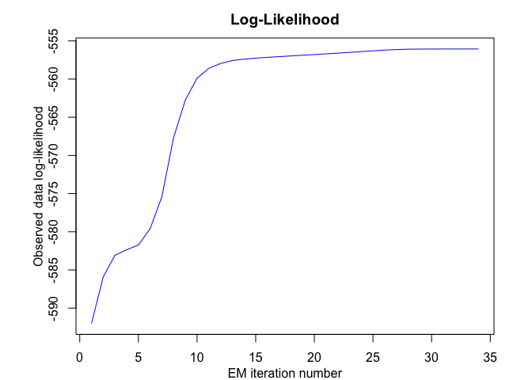

<!-- README.md is generated from README.Rmd. Please edit that file -->

# **MEteorits:** Mixtures-of-ExperTs modEling for cOmplex and non-noRmal dIsTributions

<!-- badges: start -->

[](https://travis-ci.org/fchamroukhi/MEteorits)
[](https://CRAN.R-project.org/package=meteorits)
[](https://CRAN.R-project.org/package=meteorits)
<!-- badges: end -->

MEteorits is an open source toolbox (available in R and Matlab)
containing several original and flexible mixtures-of-experts models to
model, cluster and classify heteregenous data in many complex situations
where the data are distributed according to non-normal and possibly
skewed distributions, and when they might be corrupted by atypical
observations. The toolbox also contains sparse mixture-of-experts models
for high-dimensional data.

Our (dis-)covered meteorits are for instance the following ones:

  - NMoE (Normal Mixtures-of-Experts);
  - tMoE (t Mixtures-of-Experts);
  - SNMoE (Skew-Normal Mixtures-of-Experts);
  - StMoE (Skew t Mixtures-of-Experts).

The models and algorithms are developped and written in Matlab by Faicel
Chamroukhi, and translated and designed into R packages by Florian
Lecocq, Marius Bartcus and Faicel Chamroukhi.

# Installation

You can install the development version of MEteorits from
[GitHub](https://github.com/fchamroukhi/MEteorits) with:

``` r
# install.packages("devtools")
devtools::install_github("fchamroukhi/MEteorits")
```

To build *vignettes* for examples of usage, type the command below
instead:

``` r
# install.packages("devtools")
devtools::install_github("fchamroukhi/MEteorits", 
                         build_opts = c("--no-resave-data", "--no-manual"), 
                         build_vignettes = TRUE)
```

Use the following command to display vignettes:

``` r
browseVignettes("meteorits")
```

# Usage

``` r
library(meteorits)
```

<details>

<summary>NMoE</summary>

``` r
# Application to a simulated data set

n <- 500 # Size of the sample
alphak <- matrix(c(0, 8), ncol = 1) # Parameters of the gating network
betak <- matrix(c(0, -2.5, 0, 2.5), ncol = 2) # Regression coefficients of the experts
sigmak <- c(1, 1) # Standard deviations of the experts
x <- seq.int(from = -1, to = 1, length.out = n) # Inputs (predictors)

# Generate sample of size n
sample <- sampleUnivNMoE(alphak = alphak, betak = betak, 
                         sigmak = sigmak, x = x)
y <- sample$y

K <- 2 # Number of regressors/experts
p <- 1 # Order of the polynomial regression (regressors/experts)
q <- 1 # Order of the logistic regression (gating network)

nmoe <- emNMoE(X = x, Y = y, K = K, p = p, q = q, verbose = TRUE)
#> EM NMoE: Iteration: 1 | log-likelihood: -809.706810650029
#> EM NMoE: Iteration: 2 | log-likelihood: -809.442090250403
#> EM NMoE: Iteration: 3 | log-likelihood: -808.852756811148
#> EM NMoE: Iteration: 4 | log-likelihood: -807.387369287918
#> EM NMoE: Iteration: 5 | log-likelihood: -803.803404913624
#> EM NMoE: Iteration: 6 | log-likelihood: -795.586002509039
#> EM NMoE: Iteration: 7 | log-likelihood: -779.101038601797
#> EM NMoE: Iteration: 8 | log-likelihood: -752.947339798869
#> EM NMoE: Iteration: 9 | log-likelihood: -723.277180356222
#> EM NMoE: Iteration: 10 | log-likelihood: -700.214068128507
#> EM NMoE: Iteration: 11 | log-likelihood: -687.850948104595
#> EM NMoE: Iteration: 12 | log-likelihood: -682.555023512367
#> EM NMoE: Iteration: 13 | log-likelihood: -680.204899081706
#> EM NMoE: Iteration: 14 | log-likelihood: -679.033769002642
#> EM NMoE: Iteration: 15 | log-likelihood: -678.405210015841
#> EM NMoE: Iteration: 16 | log-likelihood: -678.054258475696
#> EM NMoE: Iteration: 17 | log-likelihood: -677.853595138956
#> EM NMoE: Iteration: 18 | log-likelihood: -677.73682703741
#> EM NMoE: Iteration: 19 | log-likelihood: -677.66777562903
#> EM NMoE: Iteration: 20 | log-likelihood: -677.626247937934
#> EM NMoE: Iteration: 21 | log-likelihood: -677.600810250821
#> EM NMoE: Iteration: 22 | log-likelihood: -677.584918737434
#> EM NMoE: Iteration: 23 | log-likelihood: -677.574786964063
#> EM NMoE: Iteration: 24 | log-likelihood: -677.568196149185
#> EM NMoE: Iteration: 25 | log-likelihood: -677.563826399688
#> EM NMoE: Iteration: 26 | log-likelihood: -677.560878727727
#> EM NMoE: Iteration: 27 | log-likelihood: -677.558860023671
#> EM NMoE: Iteration: 28 | log-likelihood: -677.557459664186
#> EM NMoE: Iteration: 29 | log-likelihood: -677.556477895271
#> EM NMoE: Iteration: 30 | log-likelihood: -677.555783673916
#> EM NMoE: Iteration: 31 | log-likelihood: -677.555289432746

nmoe$summary()
#> ------------------------------------------
#> Fitted Normal Mixture-of-Experts model
#> ------------------------------------------
#> 
#> NMoE model with K = 2 experts:
#> 
#>  log-likelihood df       AIC       BIC       ICL
#>       -677.5553  8 -685.5553 -702.4137 -760.6137
#> 
#> Clustering table (Number of observations in each expert):
#> 
#>   1   2 
#> 268 232 
#> 
#> Regression coefficients:
#> 
#>     Beta(k = 1) Beta(k = 2)
#> 1    -0.1620135  0.08250916
#> X^1   2.2161222 -2.65134465
#> 
#> Variances:
#> 
#>  Sigma2(k = 1) Sigma2(k = 2)
#>      0.6812473     0.9282329

nmoe$plot()
```


``` r
# Application to a real data set

data("tempanomalies")
x <- tempanomalies$Year
y <- tempanomalies$AnnualAnomaly

K <- 2 # Number of regressors/experts
p <- 1 # Order of the polynomial regression (regressors/experts)
q <- 1 # Order of the logistic regression (gating network)

nmoe <- emNMoE(X = x, Y = y, K = K, p = p, q = q, verbose = TRUE)
#> EM NMoE: Iteration: 1 | log-likelihood: 50.6432153456244
#> EM NMoE: Iteration: 2 | log-likelihood: 53.934649108107
#> EM NMoE: Iteration: 3 | log-likelihood: 60.6701497541516
#> EM NMoE: Iteration: 4 | log-likelihood: 68.9876834981437
#> EM NMoE: Iteration: 5 | log-likelihood: 74.1535330063919
#> EM NMoE: Iteration: 6 | log-likelihood: 76.3689210150024
#> EM NMoE: Iteration: 7 | log-likelihood: 77.8597911004522
#> EM NMoE: Iteration: 8 | log-likelihood: 79.4627195649828
#> EM NMoE: Iteration: 9 | log-likelihood: 81.4837858519191
#> EM NMoE: Iteration: 10 | log-likelihood: 84.2932240458227
#> EM NMoE: Iteration: 11 | log-likelihood: 88.3307671999169
#> EM NMoE: Iteration: 12 | log-likelihood: 92.8592341186395
#> EM NMoE: Iteration: 13 | log-likelihood: 95.2679963002817
#> EM NMoE: Iteration: 14 | log-likelihood: 95.969626511667
#> EM NMoE: Iteration: 15 | log-likelihood: 96.1994384324512
#> EM NMoE: Iteration: 16 | log-likelihood: 96.3064683737163
#> EM NMoE: Iteration: 17 | log-likelihood: 96.3800876391194
#> EM NMoE: Iteration: 18 | log-likelihood: 96.4463383343654
#> EM NMoE: Iteration: 19 | log-likelihood: 96.514119992817
#> EM NMoE: Iteration: 20 | log-likelihood: 96.5872942455468
#> EM NMoE: Iteration: 21 | log-likelihood: 96.668028488323
#> EM NMoE: Iteration: 22 | log-likelihood: 96.757665343346
#> EM NMoE: Iteration: 23 | log-likelihood: 96.8568152587353
#> EM NMoE: Iteration: 24 | log-likelihood: 96.9651985426369
#> EM NMoE: Iteration: 25 | log-likelihood: 97.0814715110024
#> EM NMoE: Iteration: 26 | log-likelihood: 97.2032041950014
#> EM NMoE: Iteration: 27 | log-likelihood: 97.327125847162
#> EM NMoE: Iteration: 28 | log-likelihood: 97.4496781949017
#> EM NMoE: Iteration: 29 | log-likelihood: 97.5678015059268
#> EM NMoE: Iteration: 30 | log-likelihood: 97.6797400473156
#> EM NMoE: Iteration: 31 | log-likelihood: 97.785604172513
#> EM NMoE: Iteration: 32 | log-likelihood: 97.8874644819064
#> EM NMoE: Iteration: 33 | log-likelihood: 97.9888835891911
#> EM NMoE: Iteration: 34 | log-likelihood: 98.0940258913524
#> EM NMoE: Iteration: 35 | log-likelihood: 98.2066267073865
#> EM NMoE: Iteration: 36 | log-likelihood: 98.3291698309732
#> EM NMoE: Iteration: 37 | log-likelihood: 98.4625894354259
#> EM NMoE: Iteration: 38 | log-likelihood: 98.6066182698173
#> EM NMoE: Iteration: 39 | log-likelihood: 98.7606060332526
#> EM NMoE: Iteration: 40 | log-likelihood: 98.9243461022025
#> EM NMoE: Iteration: 41 | log-likelihood: 99.0986530262074
#> EM NMoE: Iteration: 42 | log-likelihood: 99.2856009487651
#> EM NMoE: Iteration: 43 | log-likelihood: 99.488675773663
#> EM NMoE: Iteration: 44 | log-likelihood: 99.7131452064343
#> EM NMoE: Iteration: 45 | log-likelihood: 99.9668844369062
#> EM NMoE: Iteration: 46 | log-likelihood: 100.261773573947
#> EM NMoE: Iteration: 47 | log-likelihood: 100.615437531682
#> EM NMoE: Iteration: 48 | log-likelihood: 101.050949808851
#> EM NMoE: Iteration: 49 | log-likelihood: 101.581512353992
#> EM NMoE: Iteration: 50 | log-likelihood: 102.142889167434
#> EM NMoE: Iteration: 51 | log-likelihood: 102.576392562953
#> EM NMoE: Iteration: 52 | log-likelihood: 102.691222666866
#> EM NMoE: Iteration: 53 | log-likelihood: 102.721963174691
#> EM NMoE: Iteration: 54 | log-likelihood: 102.721971347465

nmoe$summary()
#> ------------------------------------------
#> Fitted Normal Mixture-of-Experts model
#> ------------------------------------------
#> 
#> NMoE model with K = 2 experts:
#> 
#>  log-likelihood df      AIC      BIC      ICL
#>         102.722  8 94.72197 83.07135 83.17815
#> 
#> Clustering table (Number of observations in each expert):
#> 
#>  1  2 
#> 52 84 
#> 
#> Regression coefficients:
#> 
#>      Beta(k = 1)   Beta(k = 2)
#> 1   -42.36218611 -12.667281991
#> X^1   0.02149272   0.006474802
#> 
#> Variances:
#> 
#>  Sigma2(k = 1) Sigma2(k = 2)
#>       0.011931    0.01352343

nmoe$plot()
```


</details>

<details>

<summary>TMoE</summary>

``` r
# Application to a simulated data set

n <- 500 # Size of the sample
alphak <- matrix(c(0, 8), ncol = 1) # Parameters of the gating network
betak <- matrix(c(0, -2.5, 0, 2.5), ncol = 2) # Regression coefficients of the experts
sigmak <- c(0.5, 0.5) # Standard deviations of the experts
nuk <- c(5, 7) # Degrees of freedom of the experts network t densities
x <- seq.int(from = -1, to = 1, length.out = n) # Inputs (predictors)

# Generate sample of size n
sample <- sampleUnivTMoE(alphak = alphak, betak = betak, sigmak = sigmak, 
                         nuk = nuk, x = x)
y <- sample$y

K <- 2 # Number of regressors/experts
p <- 1 # Order of the polynomial regression (regressors/experts)
q <- 1 # Order of the logistic regression (gating network)

tmoe <- emTMoE(X = x, Y = y, K = K, p = p, q = q, verbose = TRUE)
#> EM - tMoE: Iteration: 1 | log-likelihood: -511.796749974532
#> EM - tMoE: Iteration: 2 | log-likelihood: -510.3107406311
#> EM - tMoE: Iteration: 3 | log-likelihood: -509.912809848235
#> EM - tMoE: Iteration: 4 | log-likelihood: -509.537358561964
#> EM - tMoE: Iteration: 5 | log-likelihood: -509.188177260593
#> EM - tMoE: Iteration: 6 | log-likelihood: -508.875273121335
#> EM - tMoE: Iteration: 7 | log-likelihood: -508.604291722729
#> EM - tMoE: Iteration: 8 | log-likelihood: -508.376624857194
#> EM - tMoE: Iteration: 9 | log-likelihood: -508.190325164907
#> EM - tMoE: Iteration: 10 | log-likelihood: -508.041274611462
#> EM - tMoE: Iteration: 11 | log-likelihood: -507.924274800282
#> EM - tMoE: Iteration: 12 | log-likelihood: -507.833886045062
#> EM - tMoE: Iteration: 13 | log-likelihood: -507.764975577989
#> EM - tMoE: Iteration: 14 | log-likelihood: -507.713013717814
#> EM - tMoE: Iteration: 15 | log-likelihood: -507.674186179779
#> EM - tMoE: Iteration: 16 | log-likelihood: -507.645389796845
#> EM - tMoE: Iteration: 17 | log-likelihood: -507.624164803072
#> EM - tMoE: Iteration: 18 | log-likelihood: -507.608600184335
#> EM - tMoE: Iteration: 19 | log-likelihood: -507.597234407864
#> EM - tMoE: Iteration: 20 | log-likelihood: -507.58896352802
#> EM - tMoE: Iteration: 21 | log-likelihood: -507.5829619525
#> EM - tMoE: Iteration: 22 | log-likelihood: -507.578617186637
#> EM - tMoE: Iteration: 23 | log-likelihood: -507.575477773876
#> EM - tMoE: Iteration: 24 | log-likelihood: -507.573212714482
#> EM - tMoE: Iteration: 25 | log-likelihood: -507.571580377022
#> EM - tMoE: Iteration: 26 | log-likelihood: -507.570404998184
#> EM - tMoE: Iteration: 27 | log-likelihood: -507.569559103405
#> EM - tMoE: Iteration: 28 | log-likelihood: -507.568950465063
#> EM - tMoE: Iteration: 29 | log-likelihood: -507.568512491032

tmoe$summary()
#> -------------------------------------
#> Fitted t Mixture-of-Experts model
#> -------------------------------------
#> 
#> tMoE model with K = 2 experts:
#> 
#>  log-likelihood df       AIC       BIC       ICL
#>       -507.5685 10 -517.5685 -538.6416 -538.6463
#> 
#> Clustering table (Number of observations in each expert):
#> 
#>   1   2 
#> 249 251 
#> 
#> Regression coefficients:
#> 
#>     Beta(k = 1) Beta(k = 2)
#> 1     0.1460788   0.1217012
#> X^1   2.7009774  -2.5532779
#> 
#> Variances:
#> 
#>  Sigma2(k = 1) Sigma2(k = 2)
#>      0.2974055     0.4646762

tmoe$plot()
```


``` r
# Application to a real data set

library(MASS)
data("mcycle")
x <- mcycle$times
y <- mcycle$accel

K <- 4 # Number of regressors/experts
p <- 2 # Order of the polynomial regression (regressors/experts)
q <- 1 # Order of the logistic regression (gating network)

tmoe <- emTMoE(X = x, Y = y, K = K, p = p, q = q, verbose = TRUE)
#> EM - tMoE: Iteration: 1 | log-likelihood: -594.554792082464
#> EM - tMoE: Iteration: 2 | log-likelihood: -583.302955759072
#> EM - tMoE: Iteration: 3 | log-likelihood: -578.292340897525
#> EM - tMoE: Iteration: 4 | log-likelihood: -575.357409690206
#> EM - tMoE: Iteration: 5 | log-likelihood: -573.401056800228
#> EM - tMoE: Iteration: 6 | log-likelihood: -571.744054768806
#> EM - tMoE: Iteration: 7 | log-likelihood: -569.136161930618
#> EM - tMoE: Iteration: 8 | log-likelihood: -564.112283927706
#> EM - tMoE: Iteration: 9 | log-likelihood: -559.722060181244
#> EM - tMoE: Iteration: 10 | log-likelihood: -557.301099054472
#> EM - tMoE: Iteration: 11 | log-likelihood: -554.83754622596
#> EM - tMoE: Iteration: 12 | log-likelihood: -553.251636169726
#> EM - tMoE: Iteration: 13 | log-likelihood: -552.594047630798
#> EM - tMoE: Iteration: 14 | log-likelihood: -552.137380727804
#> EM - tMoE: Iteration: 15 | log-likelihood: -551.773084065302
#> EM - tMoE: Iteration: 16 | log-likelihood: -551.562703767913
#> EM - tMoE: Iteration: 17 | log-likelihood: -551.480319490202
#> EM - tMoE: Iteration: 18 | log-likelihood: -551.449597088406
#> EM - tMoE: Iteration: 19 | log-likelihood: -551.435398277139
#> EM - tMoE: Iteration: 20 | log-likelihood: -551.427556692329
#> EM - tMoE: Iteration: 21 | log-likelihood: -551.42279183321
#> EM - tMoE: Iteration: 22 | log-likelihood: -551.419783414396
#> EM - tMoE: Iteration: 23 | log-likelihood: -551.417798841385
#> EM - tMoE: Iteration: 24 | log-likelihood: -551.41644326963
#> EM - tMoE: Iteration: 25 | log-likelihood: -551.415484460335
#> EM - tMoE: Iteration: 26 | log-likelihood: -551.41478442124
#> EM - tMoE: Iteration: 27 | log-likelihood: -551.41425984316

tmoe$summary()
#> -------------------------------------
#> Fitted t Mixture-of-Experts model
#> -------------------------------------
#> 
#> tMoE model with K = 4 experts:
#> 
#>  log-likelihood df       AIC       BIC       ICL
#>       -551.4143 26 -577.4143 -614.9888 -614.9855
#> 
#> Clustering table (Number of observations in each expert):
#> 
#>  1  2  3  4 
#> 28 37 31 37 
#> 
#> Regression coefficients:
#> 
#>     Beta(k = 1) Beta(k = 2)  Beta(k = 3) Beta(k = 4)
#> 1   -1.53687875 1174.996409 -1806.449666 341.6895146
#> X^1  0.02911007 -124.107064   111.188095 -14.2528609
#> X^2 -0.01747138    2.977398    -1.664968   0.1466402
#> 
#> Variances:
#> 
#>  Sigma2(k = 1) Sigma2(k = 2) Sigma2(k = 3) Sigma2(k = 4)
#>      0.9642408      333.5289      571.8198      307.2462

tmoe$plot()
```


</details>

<details>

<summary>SNMoE</summary>

``` r
# Application to a simulated data set

n <- 500 # Size of the sample
alphak <- matrix(c(0, 8), ncol = 1) # Parameters of the gating network
betak <- matrix(c(0, -2.5, 0, 2.5), ncol = 2) # Regression coefficients of the experts
lambdak <- c(3, 5) # Skewness parameters of the experts
sigmak <- c(1, 1) # Standard deviations of the experts
x <- seq.int(from = -1, to = 1, length.out = n) # Inputs (predictors)

# Generate sample of size n
sample <- sampleUnivSNMoE(alphak = alphak, betak = betak, 
                          sigmak = sigmak, lambdak = lambdak, 
                          x = x)
y <- sample$y

K <- 2 # Number of regressors/experts
p <- 1 # Order of the polynomial regression (regressors/experts)
q <- 1 # Order of the logistic regression (gating network)

snmoe <- emSNMoE(X = x, Y = y, K = K, p = p, q = q, verbose = TRUE)
#> EM - SNMoE: Iteration: 1 | log-likelihood: -631.309036318284
#> EM - SNMoE: Iteration: 2 | log-likelihood: -537.252636784745
#> EM - SNMoE: Iteration: 3 | log-likelihood: -532.917080153521
#> EM - SNMoE: Iteration: 4 | log-likelihood: -531.703042239986
#> EM - SNMoE: Iteration: 5 | log-likelihood: -531.1711410093
#> EM - SNMoE: Iteration: 6 | log-likelihood: -530.814493267482
#> EM - SNMoE: Iteration: 7 | log-likelihood: -530.508339347582
#> EM - SNMoE: Iteration: 8 | log-likelihood: -530.218466379583
#> EM - SNMoE: Iteration: 9 | log-likelihood: -529.933967336988
#> EM - SNMoE: Iteration: 10 | log-likelihood: -529.650837824693
#> EM - SNMoE: Iteration: 11 | log-likelihood: -529.367357898818
#> EM - SNMoE: Iteration: 12 | log-likelihood: -529.082627260304
#> EM - SNMoE: Iteration: 13 | log-likelihood: -528.796455422429
#> EM - SNMoE: Iteration: 14 | log-likelihood: -528.508969085963
#> EM - SNMoE: Iteration: 15 | log-likelihood: -528.220433402732
#> EM - SNMoE: Iteration: 16 | log-likelihood: -527.93134698678
#> EM - SNMoE: Iteration: 17 | log-likelihood: -527.642314756036
#> EM - SNMoE: Iteration: 18 | log-likelihood: -527.354005979265
#> EM - SNMoE: Iteration: 19 | log-likelihood: -527.067098501214
#> EM - SNMoE: Iteration: 20 | log-likelihood: -526.782329168682
#> EM - SNMoE: Iteration: 21 | log-likelihood: -526.500371331609
#> EM - SNMoE: Iteration: 22 | log-likelihood: -526.221977442859
#> EM - SNMoE: Iteration: 23 | log-likelihood: -525.947606946605
#> EM - SNMoE: Iteration: 24 | log-likelihood: -525.677880997808
#> EM - SNMoE: Iteration: 25 | log-likelihood: -525.413360688199
#> EM - SNMoE: Iteration: 26 | log-likelihood: -525.154517638292
#> EM - SNMoE: Iteration: 27 | log-likelihood: -524.901707284626
#> EM - SNMoE: Iteration: 28 | log-likelihood: -524.655277657396
#> EM - SNMoE: Iteration: 29 | log-likelihood: -524.415555933881
#> EM - SNMoE: Iteration: 30 | log-likelihood: -524.182742163388
#> EM - SNMoE: Iteration: 31 | log-likelihood: -523.956920280081
#> EM - SNMoE: Iteration: 32 | log-likelihood: -523.738308043729
#> EM - SNMoE: Iteration: 33 | log-likelihood: -523.526981404845
#> EM - SNMoE: Iteration: 34 | log-likelihood: -523.32296202017
#> EM - SNMoE: Iteration: 35 | log-likelihood: -523.126260102853
#> EM - SNMoE: Iteration: 36 | log-likelihood: -522.936861275025
#> EM - SNMoE: Iteration: 37 | log-likelihood: -522.754692108266
#> EM - SNMoE: Iteration: 38 | log-likelihood: -522.579741333715
#> EM - SNMoE: Iteration: 39 | log-likelihood: -522.411831140534
#> EM - SNMoE: Iteration: 40 | log-likelihood: -522.250863099239
#> EM - SNMoE: Iteration: 41 | log-likelihood: -522.096722252837
#> EM - SNMoE: Iteration: 42 | log-likelihood: -521.949288385349
#> EM - SNMoE: Iteration: 43 | log-likelihood: -521.808368200773
#> EM - SNMoE: Iteration: 44 | log-likelihood: -521.673781503988
#> EM - SNMoE: Iteration: 45 | log-likelihood: -521.545415355624
#> EM - SNMoE: Iteration: 46 | log-likelihood: -521.423129238641
#> EM - SNMoE: Iteration: 47 | log-likelihood: -521.306666897177
#> EM - SNMoE: Iteration: 48 | log-likelihood: -521.195846237171
#> EM - SNMoE: Iteration: 49 | log-likelihood: -521.090509815711
#> EM - SNMoE: Iteration: 50 | log-likelihood: -520.990492422228
#> EM - SNMoE: Iteration: 51 | log-likelihood: -520.895581256893
#> EM - SNMoE: Iteration: 52 | log-likelihood: -520.805587138507
#> EM - SNMoE: Iteration: 53 | log-likelihood: -520.720322121167
#> EM - SNMoE: Iteration: 54 | log-likelihood: -520.639636853218
#> EM - SNMoE: Iteration: 55 | log-likelihood: -520.563323534687
#> EM - SNMoE: Iteration: 56 | log-likelihood: -520.491199906309
#> EM - SNMoE: Iteration: 57 | log-likelihood: -520.42309042302
#> EM - SNMoE: Iteration: 58 | log-likelihood: -520.358814864216
#> EM - SNMoE: Iteration: 59 | log-likelihood: -520.298200188454
#> EM - SNMoE: Iteration: 60 | log-likelihood: -520.241068369625
#> EM - SNMoE: Iteration: 61 | log-likelihood: -520.187252049961
#> EM - SNMoE: Iteration: 62 | log-likelihood: -520.136659884325
#> EM - SNMoE: Iteration: 63 | log-likelihood: -520.089074763469
#> EM - SNMoE: Iteration: 64 | log-likelihood: -520.044344708013
#> EM - SNMoE: Iteration: 65 | log-likelihood: -520.002314895737
#> EM - SNMoE: Iteration: 66 | log-likelihood: -519.96284459272
#> EM - SNMoE: Iteration: 67 | log-likelihood: -519.925799118801
#> EM - SNMoE: Iteration: 68 | log-likelihood: -519.891050423917
#> EM - SNMoE: Iteration: 69 | log-likelihood: -519.858483464306
#> EM - SNMoE: Iteration: 70 | log-likelihood: -519.827959088607
#> EM - SNMoE: Iteration: 71 | log-likelihood: -519.799364667304
#> EM - SNMoE: Iteration: 72 | log-likelihood: -519.77256333263
#> EM - SNMoE: Iteration: 73 | log-likelihood: -519.74750334494
#> EM - SNMoE: Iteration: 74 | log-likelihood: -519.724042697972
#> EM - SNMoE: Iteration: 75 | log-likelihood: -519.702099286162
#> EM - SNMoE: Iteration: 76 | log-likelihood: -519.681567463672
#> EM - SNMoE: Iteration: 77 | log-likelihood: -519.662378960166
#> EM - SNMoE: Iteration: 78 | log-likelihood: -519.644442375396
#> EM - SNMoE: Iteration: 79 | log-likelihood: -519.62768083651
#> EM - SNMoE: Iteration: 80 | log-likelihood: -519.612021156047
#> EM - SNMoE: Iteration: 81 | log-likelihood: -519.597401707085
#> EM - SNMoE: Iteration: 82 | log-likelihood: -519.583741251167
#> EM - SNMoE: Iteration: 83 | log-likelihood: -519.570986072888
#> EM - SNMoE: Iteration: 84 | log-likelihood: -519.559077525864
#> EM - SNMoE: Iteration: 85 | log-likelihood: -519.547979907515
#> EM - SNMoE: Iteration: 86 | log-likelihood: -519.53760883324
#> EM - SNMoE: Iteration: 87 | log-likelihood: -519.527929570053
#> EM - SNMoE: Iteration: 88 | log-likelihood: -519.51889536959
#> EM - SNMoE: Iteration: 89 | log-likelihood: -519.51046340298
#> EM - SNMoE: Iteration: 90 | log-likelihood: -519.502598095163
#> EM - SNMoE: Iteration: 91 | log-likelihood: -519.495262081533
#> EM - SNMoE: Iteration: 92 | log-likelihood: -519.488412765177
#> EM - SNMoE: Iteration: 93 | log-likelihood: -519.4820227045
#> EM - SNMoE: Iteration: 94 | log-likelihood: -519.476058860464
#> EM - SNMoE: Iteration: 95 | log-likelihood: -519.470493415188
#> EM - SNMoE: Iteration: 96 | log-likelihood: -519.465336864985
#> EM - SNMoE: Iteration: 97 | log-likelihood: -519.460475275808
#> EM - SNMoE: Iteration: 98 | log-likelihood: -519.455932791559
#> EM - SNMoE: Iteration: 99 | log-likelihood: -519.451688949145
#> EM - SNMoE: Iteration: 100 | log-likelihood: -519.447724174288
#> EM - SNMoE: Iteration: 101 | log-likelihood: -519.444019655969
#> EM - SNMoE: Iteration: 102 | log-likelihood: -519.440557693364
#> EM - SNMoE: Iteration: 103 | log-likelihood: -519.437321600411
#> EM - SNMoE: Iteration: 104 | log-likelihood: -519.434295710852
#> EM - SNMoE: Iteration: 105 | log-likelihood: -519.431465509687
#> EM - SNMoE: Iteration: 106 | log-likelihood: -519.428817709875
#> EM - SNMoE: Iteration: 107 | log-likelihood: -519.426340146422
#> EM - SNMoE: Iteration: 108 | log-likelihood: -519.424021548017
#> EM - SNMoE: Iteration: 109 | log-likelihood: -519.421851341056
#> EM - SNMoE: Iteration: 110 | log-likelihood: -519.419819581921
#> EM - SNMoE: Iteration: 111 | log-likelihood: -519.417916919703
#> EM - SNMoE: Iteration: 112 | log-likelihood: -519.41613491089
#> EM - SNMoE: Iteration: 113 | log-likelihood: -519.414465937502
#> EM - SNMoE: Iteration: 114 | log-likelihood: -519.4129022627
#> EM - SNMoE: Iteration: 115 | log-likelihood: -519.411436872827
#> EM - SNMoE: Iteration: 116 | log-likelihood: -519.410062762453
#> EM - SNMoE: Iteration: 117 | log-likelihood: -519.40877335535
#> EM - SNMoE: Iteration: 118 | log-likelihood: -519.407563613529
#> EM - SNMoE: Iteration: 119 | log-likelihood: -519.406428456552
#> EM - SNMoE: Iteration: 120 | log-likelihood: -519.405357137863
#> EM - SNMoE: Iteration: 121 | log-likelihood: -519.40435129624
#> EM - SNMoE: Iteration: 122 | log-likelihood: -519.403405510927
#> EM - SNMoE: Iteration: 123 | log-likelihood: -519.402514965295
#> EM - SNMoE: Iteration: 124 | log-likelihood: -519.401680534394
#> EM - SNMoE: Iteration: 125 | log-likelihood: -519.400898552185
#> EM - SNMoE: Iteration: 126 | log-likelihood: -519.400164106511
#> EM - SNMoE: Iteration: 127 | log-likelihood: -519.399470618852
#> EM - SNMoE: Iteration: 128 | log-likelihood: -519.398819973594
#> EM - SNMoE: Iteration: 129 | log-likelihood: -519.398208199004
#> EM - SNMoE: Iteration: 130 | log-likelihood: -519.397633636504
#> EM - SNMoE: Iteration: 131 | log-likelihood: -519.397092754912
#> EM - SNMoE: Iteration: 132 | log-likelihood: -519.396581854022

snmoe$summary()
#> -----------------------------------------------
#> Fitted Skew-Normal Mixture-of-Experts model
#> -----------------------------------------------
#> 
#> SNMoE model with K = 2 experts:
#> 
#>  log-likelihood df       AIC       BIC       ICL
#>       -519.3966 10 -529.3966 -550.4696 -550.5454
#> 
#> Clustering table (Number of observations in each expert):
#> 
#>   1   2 
#> 249 251 
#> 
#> Regression coefficients:
#> 
#>     Beta(k = 1) Beta(k = 2)
#> 1      1.056898  0.09250734
#> X^1    2.738163 -2.77424777
#> 
#> Variances:
#> 
#>  Sigma2(k = 1) Sigma2(k = 2)
#>      0.4776785       1.28622

snmoe$plot()
```


``` r
# Application to a real data set

data("tempanomalies")
x <- tempanomalies$Year
y <- tempanomalies$AnnualAnomaly

K <- 2 # Number of regressors/experts
p <- 1 # Order of the polynomial regression (regressors/experts)
q <- 1 # Order of the logistic regression (gating network)

snmoe <- emSNMoE(X = x, Y = y, K = K, p = p, q = q, verbose = TRUE)
#> EM - SNMoE: Iteration: 1 | log-likelihood: 75.6582267640552
#> EM - SNMoE: Iteration: 2 | log-likelihood: 87.5506009066281
#> EM - SNMoE: Iteration: 3 | log-likelihood: 88.8080286154849
#> EM - SNMoE: Iteration: 4 | log-likelihood: 89.1077515059606
#> EM - SNMoE: Iteration: 5 | log-likelihood: 89.329753019168
#> EM - SNMoE: Iteration: 6 | log-likelihood: 89.5469789751687
#> EM - SNMoE: Iteration: 7 | log-likelihood: 89.697275319303
#> EM - SNMoE: Iteration: 8 | log-likelihood: 89.7820968154708
#> EM - SNMoE: Iteration: 9 | log-likelihood: 89.8270945728553
#> EM - SNMoE: Iteration: 10 | log-likelihood: 89.8522823286919
#> EM - SNMoE: Iteration: 11 | log-likelihood: 89.8690413856779
#> EM - SNMoE: Iteration: 12 | log-likelihood: 89.8823842200577
#> EM - SNMoE: Iteration: 13 | log-likelihood: 89.893711335446
#> EM - SNMoE: Iteration: 14 | log-likelihood: 89.903651007628
#> EM - SNMoE: Iteration: 15 | log-likelihood: 89.9126919526382
#> EM - SNMoE: Iteration: 16 | log-likelihood: 89.9210534477009
#> EM - SNMoE: Iteration: 17 | log-likelihood: 89.9287996641882
#> EM - SNMoE: Iteration: 18 | log-likelihood: 89.9359421699094
#> EM - SNMoE: Iteration: 19 | log-likelihood: 89.9424784760293
#> EM - SNMoE: Iteration: 20 | log-likelihood: 89.9484058745788
#> EM - SNMoE: Iteration: 21 | log-likelihood: 89.9537266360716
#> EM - SNMoE: Iteration: 22 | log-likelihood: 89.958612102315
#> EM - SNMoE: Iteration: 23 | log-likelihood: 89.9629445037021
#> EM - SNMoE: Iteration: 24 | log-likelihood: 89.9666778358523
#> EM - SNMoE: Iteration: 25 | log-likelihood: 89.9698373326217
#> EM - SNMoE: Iteration: 26 | log-likelihood: 89.9724223286294
#> EM - SNMoE: Iteration: 27 | log-likelihood: 89.9741838443145
#> EM - SNMoE: Iteration: 28 | log-likelihood: 89.9763727182534
#> EM - SNMoE: Iteration: 29 | log-likelihood: 89.9769284082082
#> EM - SNMoE: Iteration: 30 | log-likelihood: 89.9777832354772
#> EM - SNMoE: Iteration: 31 | log-likelihood: 89.9783880081162
#> EM - SNMoE: Iteration: 32 | log-likelihood: 89.9788726718781
#> EM - SNMoE: Iteration: 33 | log-likelihood: 89.979612939516
#> EM - SNMoE: Iteration: 34 | log-likelihood: 89.9799560042027
#> EM - SNMoE: Iteration: 35 | log-likelihood: 89.9800683243663
#> EM - SNMoE: Iteration: 36 | log-likelihood: 89.980320341829
#> EM - SNMoE: Iteration: 37 | log-likelihood: 89.9804747778964
#> EM - SNMoE: Iteration: 38 | log-likelihood: 89.9805125106536

snmoe$summary()
#> -----------------------------------------------
#> Fitted Skew-Normal Mixture-of-Experts model
#> -----------------------------------------------
#> 
#> SNMoE model with K = 2 experts:
#> 
#>  log-likelihood df      AIC      BIC      ICL
#>        89.98051 10 79.98051 65.41724 65.30907
#> 
#> Clustering table (Number of observations in each expert):
#> 
#>  1  2 
#> 70 66 
#> 
#> Regression coefficients:
#> 
#>       Beta(k = 1)  Beta(k = 2)
#> 1   -14.190861693 -33.78223673
#> X^1   0.007245948   0.01719786
#> 
#> Variances:
#> 
#>  Sigma2(k = 1) Sigma2(k = 2)
#>      0.0171769    0.01724323

snmoe$plot()
```


</details>

<details>

<summary>StMoE</summary>

``` r
# Applicartion to a simulated data set

n <- 500 # Size of the sample
alphak <- matrix(c(0, 8), ncol = 1) # Parameters of the gating network
betak <- matrix(c(0, -2.5, 0, 2.5), ncol = 2) # Regression coefficients of the experts
sigmak <- c(0.5, 0.5) # Standard deviations of the experts
lambdak <- c(3, 5) # Skewness parameters of the experts
nuk <- c(5, 7) # Degrees of freedom of the experts network t densities
x <- seq.int(from = -1, to = 1, length.out = n) # Inputs (predictors)

# Generate sample of size n
sample <- sampleUnivStMoE(alphak = alphak, betak = betak, 
                          sigmak = sigmak, lambdak = lambdak, 
                          nuk = nuk, x = x)
y <- sample$y

K <- 2 # Number of regressors/experts
p <- 1 # Order of the polynomial regression (regressors/experts)
q <- 1 # Order of the logistic regression (gating network)

stmoe <- emStMoE(X = x, Y = y, K = K, p = p, q = q, verbose = TRUE)
#> EM - StMoE: Iteration: 1 | log-likelihood: -370.726750513745
#> EM - StMoE: Iteration: 2 | log-likelihood: -341.192546514273
#> EM - StMoE: Iteration: 3 | log-likelihood: -329.085781379873
#> EM - StMoE: Iteration: 4 | log-likelihood: -323.871742557316
#> EM - StMoE: Iteration: 5 | log-likelihood: -320.914075401737
#> EM - StMoE: Iteration: 6 | log-likelihood: -318.939500521666
#> EM - StMoE: Iteration: 7 | log-likelihood: -317.233506074405
#> EM - StMoE: Iteration: 8 | log-likelihood: -315.350600501805
#> EM - StMoE: Iteration: 9 | log-likelihood: -312.982352570411
#> EM - StMoE: Iteration: 10 | log-likelihood: -309.931503956206
#> EM - StMoE: Iteration: 11 | log-likelihood: -306.182624326178
#> EM - StMoE: Iteration: 12 | log-likelihood: -301.920963379431
#> EM - StMoE: Iteration: 13 | log-likelihood: -297.475855851536
#> EM - StMoE: Iteration: 14 | log-likelihood: -293.180807902264
#> EM - StMoE: Iteration: 15 | log-likelihood: -289.269523609631
#> EM - StMoE: Iteration: 16 | log-likelihood: -285.851021856506
#> EM - StMoE: Iteration: 17 | log-likelihood: -282.937428542089
#> EM - StMoE: Iteration: 18 | log-likelihood: -280.484548212553
#> EM - StMoE: Iteration: 19 | log-likelihood: -278.430299627705
#> EM - StMoE: Iteration: 20 | log-likelihood: -276.701583635741
#> EM - StMoE: Iteration: 21 | log-likelihood: -275.23510650157
#> EM - StMoE: Iteration: 22 | log-likelihood: -273.976046055447
#> EM - StMoE: Iteration: 23 | log-likelihood: -272.875088586673
#> EM - StMoE: Iteration: 24 | log-likelihood: -271.891182155167
#> EM - StMoE: Iteration: 25 | log-likelihood: -270.989590901097
#> EM - StMoE: Iteration: 26 | log-likelihood: -270.142463780709
#> EM - StMoE: Iteration: 27 | log-likelihood: -269.326043191357
#> EM - StMoE: Iteration: 28 | log-likelihood: -268.520669614896
#> EM - StMoE: Iteration: 29 | log-likelihood: -267.718525247743
#> EM - StMoE: Iteration: 30 | log-likelihood: -266.914433053862
#> EM - StMoE: Iteration: 31 | log-likelihood: -266.111243863019
#> EM - StMoE: Iteration: 32 | log-likelihood: -265.313221476057
#> EM - StMoE: Iteration: 33 | log-likelihood: -264.526690891787
#> EM - StMoE: Iteration: 34 | log-likelihood: -263.75624425922
#> EM - StMoE: Iteration: 35 | log-likelihood: -263.01001436157
#> EM - StMoE: Iteration: 36 | log-likelihood: -262.289637286734
#> EM - StMoE: Iteration: 37 | log-likelihood: -261.607364812145
#> EM - StMoE: Iteration: 38 | log-likelihood: -260.963612856337
#> EM - StMoE: Iteration: 39 | log-likelihood: -260.362020161207
#> EM - StMoE: Iteration: 40 | log-likelihood: -259.807479377133
#> EM - StMoE: Iteration: 41 | log-likelihood: -259.294751978309
#> EM - StMoE: Iteration: 42 | log-likelihood: -258.823929923216
#> EM - StMoE: Iteration: 43 | log-likelihood: -258.393864732422
#> EM - StMoE: Iteration: 44 | log-likelihood: -258.003583888492
#> EM - StMoE: Iteration: 45 | log-likelihood: -257.651663760473
#> EM - StMoE: Iteration: 46 | log-likelihood: -257.336473657702
#> EM - StMoE: Iteration: 47 | log-likelihood: -257.053719743825
#> EM - StMoE: Iteration: 48 | log-likelihood: -256.800315380835
#> EM - StMoE: Iteration: 49 | log-likelihood: -256.574930491759
#> EM - StMoE: Iteration: 50 | log-likelihood: -256.375231949913
#> EM - StMoE: Iteration: 51 | log-likelihood: -256.202157051131
#> EM - StMoE: Iteration: 52 | log-likelihood: -256.051653014697
#> EM - StMoE: Iteration: 53 | log-likelihood: -255.919749562333
#> EM - StMoE: Iteration: 54 | log-likelihood: -255.805927749667
#> EM - StMoE: Iteration: 55 | log-likelihood: -255.706492867034
#> EM - StMoE: Iteration: 56 | log-likelihood: -255.618724055303
#> EM - StMoE: Iteration: 57 | log-likelihood: -255.54144944194
#> EM - StMoE: Iteration: 58 | log-likelihood: -255.473122006403
#> EM - StMoE: Iteration: 59 | log-likelihood: -255.413654295168
#> EM - StMoE: Iteration: 60 | log-likelihood: -255.363004199483
#> EM - StMoE: Iteration: 61 | log-likelihood: -255.319582824904
#> EM - StMoE: Iteration: 62 | log-likelihood: -255.282198769895
#> EM - StMoE: Iteration: 63 | log-likelihood: -255.249941110261
#> EM - StMoE: Iteration: 64 | log-likelihood: -255.22274913182
#> EM - StMoE: Iteration: 65 | log-likelihood: -255.200812034839
#> EM - StMoE: Iteration: 66 | log-likelihood: -255.1827230173
#> EM - StMoE: Iteration: 67 | log-likelihood: -255.167717740071
#> EM - StMoE: Iteration: 68 | log-likelihood: -255.156061184902
#> EM - StMoE: Iteration: 69 | log-likelihood: -255.147002502619
#> EM - StMoE: Iteration: 70 | log-likelihood: -255.140155018189
#> EM - StMoE: Iteration: 71 | log-likelihood: -255.135121688847
#> EM - StMoE: Iteration: 72 | log-likelihood: -255.131604303183
#> EM - StMoE: Iteration: 73 | log-likelihood: -255.129369013648
#> EM - StMoE: Iteration: 74 | log-likelihood: -255.128220393441
#> EM - StMoE: Iteration: 75 | log-likelihood: -255.128009161635

stmoe$summary()
#> ------------------------------------------
#> Fitted Skew t Mixture-of-Experts model
#> ------------------------------------------
#> 
#> StMoE model with K = 2 experts:
#> 
#>  log-likelihood df      AIC       BIC       ICL
#>        -255.128 12 -267.128 -292.4157 -292.4248
#> 
#> Clustering table (Number of observations in each expert):
#> 
#>   1   2 
#> 249 251 
#> 
#> Regression coefficients:
#> 
#>     Beta(k = 1) Beta(k = 2)
#> 1   -0.04373447 -0.03343631
#> X^1  2.56882321 -2.59525820
#> 
#> Variances:
#> 
#>  Sigma2(k = 1) Sigma2(k = 2)
#>      0.6109932     0.3072589

stmoe$plot()
```


``` r
# Applicartion to a real data set

library(MASS)
data("mcycle")
x <- mcycle$times
y <- mcycle$accel

K <- 4 # Number of regressors/experts
p <- 2 # Order of the polynomial regression (regressors/experts)
q <- 1 # Order of the logistic regression (gating network)

stmoe <- emStMoE(X = x, Y = y, K = K, p = p, q = q, verbose = TRUE)
#> EM - StMoE: Iteration: 1 | log-likelihood: -592.004336622621
#> EM - StMoE: Iteration: 2 | log-likelihood: -585.916900610996
#> EM - StMoE: Iteration: 3 | log-likelihood: -583.076094509161
#> EM - StMoE: Iteration: 4 | log-likelihood: -582.35303957367
#> EM - StMoE: Iteration: 5 | log-likelihood: -581.734074076419
#> EM - StMoE: Iteration: 6 | log-likelihood: -579.595449281258
#> EM - StMoE: Iteration: 7 | log-likelihood: -575.42344389975
#> EM - StMoE: Iteration: 8 | log-likelihood: -567.664506233259
#> EM - StMoE: Iteration: 9 | log-likelihood: -562.744630287675
#> EM - StMoE: Iteration: 10 | log-likelihood: -559.883103523731
#> EM - StMoE: Iteration: 11 | log-likelihood: -558.5958354343
#> EM - StMoE: Iteration: 12 | log-likelihood: -557.957404163152
#> EM - StMoE: Iteration: 13 | log-likelihood: -557.580087963646
#> EM - StMoE: Iteration: 14 | log-likelihood: -557.380380786243
#> EM - StMoE: Iteration: 15 | log-likelihood: -557.254189800172
#> EM - StMoE: Iteration: 16 | log-likelihood: -557.15021434204
#> EM - StMoE: Iteration: 17 | log-likelihood: -557.055670910678
#> EM - StMoE: Iteration: 18 | log-likelihood: -556.965014162961
#> EM - StMoE: Iteration: 19 | log-likelihood: -556.875501292633
#> EM - StMoE: Iteration: 20 | log-likelihood: -556.78537227562
#> EM - StMoE: Iteration: 21 | log-likelihood: -556.693406619935
#> EM - StMoE: Iteration: 22 | log-likelihood: -556.598768102611
#> EM - StMoE: Iteration: 23 | log-likelihood: -556.500831004615
#> EM - StMoE: Iteration: 24 | log-likelihood: -556.399708827442
#> EM - StMoE: Iteration: 25 | log-likelihood: -556.297492762027
#> EM - StMoE: Iteration: 26 | log-likelihood: -556.20141494444
#> EM - StMoE: Iteration: 27 | log-likelihood: -556.126170836946
#> EM - StMoE: Iteration: 28 | log-likelihood: -556.083951793487
#> EM - StMoE: Iteration: 29 | log-likelihood: -556.067066602711
#> EM - StMoE: Iteration: 30 | log-likelihood: -556.060627935558
#> EM - StMoE: Iteration: 31 | log-likelihood: -556.057569070043
#> EM - StMoE: Iteration: 32 | log-likelihood: -556.055860006502
#> EM - StMoE: Iteration: 33 | log-likelihood: -556.054981626471
#> EM - StMoE: Iteration: 34 | log-likelihood: -556.054660968923

stmoe$summary()
#> ------------------------------------------
#> Fitted Skew t Mixture-of-Experts model
#> ------------------------------------------
#> 
#> StMoE model with K = 4 experts:
#> 
#>  log-likelihood df       AIC       BIC      ICL
#>       -556.0547 30 -586.0547 -629.4099 -629.406
#> 
#> Clustering table (Number of observations in each expert):
#> 
#>  1  2  3  4 
#> 28 37 31 37 
#> 
#> Regression coefficients:
#> 
#>     Beta(k = 1) Beta(k = 2)  Beta(k = 3) Beta(k = 4)
#> 1   -3.64134439 1271.108412 -1831.574242 319.1508761
#> X^1  0.92120299 -137.891056   113.065461 -13.2640845
#> X^2 -0.08468105    3.367926    -1.698854   0.1361425
#> 
#> Variances:
#> 
#>  Sigma2(k = 1) Sigma2(k = 2) Sigma2(k = 3) Sigma2(k = 4)
#>       14.72618      1002.282      545.9523      425.1502

stmoe$plot()
```



</details>

# References

<div id="refs" class="references">

<div id="ref-Chamroukhi-STMoE-2017">

Chamroukhi, F. 2017. “Skew-T Mixture of Experts.” *Neurocomputing -
Elsevier* 266: 390–408. <https://chamroukhi.com/papers/STMoE.pdf>.

</div>

<div id="ref-Chamroukhi-TMoE-2016">

Chamroukhi, F. 2016a. “Robust Mixture of Experts Modeling Using the
T-Distribution.” *Neural Networks - Elsevier* 79: 20–36.
<https://chamroukhi.com/papers/TMoE.pdf>.

</div>

<div id="ref-Chamroukhi-SNMoE-IJCNN-2016">

Chamroukhi, F. 2016b. “Skew-Normal Mixture of Experts.” In *The
International Joint Conference on Neural Networks (IJCNN)*, 3000–3007.
Vancouver, Canada.
<https://chamroukhi.com/papers/Chamroukhi-SNMoE-IJCNN2016.pdf>.

</div>

<div id="ref-Chamroukhi-NNMoE-2015">

Chamroukhi, F. 2015a. “Non-Normal Mixtures of Experts.”
<http://arxiv.org/pdf/1506.06707.pdf>.

</div>

<div id="ref-Chamroukhi-HDR-2015">

Chamroukhi, F. 2015b. “Statistical Learning of Latent Data Models for
Complex Data Analysis.” Habilitation Thesis (HDR), Université de Toulon.
<https://chamroukhi.com/FChamroukhi-HDR.pdf>.

</div>

<div id="ref-Chamroukhi_PhD_2010">

Chamroukhi, F. 2010. “Hidden Process Regression for Curve Modeling,
Classification and Tracking.” Ph.D. Thesis, Université de Technologie de
Compiègne. <https://chamroukhi.com/FChamroukhi-PhD.pdf>.

</div>

<div id="ref-chamroukhi_et_al_NN2009">

Chamroukhi, F., A. Samé, G. Govaert, and P. Aknin. 2009. “Time Series
Modeling by a Regression Approach Based on a Latent Process.” *Neural
Networks* 22 (5-6): 593–602.
<https://chamroukhi.com/papers/Chamroukhi_Neural_Networks_2009.pdf>.

</div>

</div>
