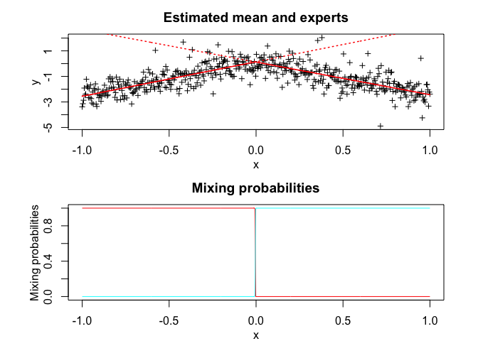

<!-- README.md is generated from README.Rmd. Please edit that file -->

<!-- badges: start -->

[](https://travis-ci.org/fchamroukhi/MEteorits)
<!-- badges: end -->

# **MEteorits:** Mixtures-of-ExperTs modEling for cOmplex and non-noRmal dIsTributions

MEteoritS is an open source toolbox (available in R and Matlab) containg
several original and flexible mixtures-of-experts models to model,
cluster and classify heteregenous data in many complex situations where
the data are distributed according to non-normal and possibly skewed
distributions, and when they might be corrupted by atypical
observations. The toolbox also contains sparse mixture-of-experts models
for high-dimensional data.

Our (dis-)covered meteorits are for instance the following ones:

  - NMoE;
  - tMoE;
  - SNMoE;
  - StMoE.

The models and algorithms are developped and written in Matlab by Faicel
Chamroukhi, and translated and designed into R packages by Florian
Lecocq, Marius Bartcus and Faicel Chamroukhi.

# Installation

You can install the development version of MEteorits from
[GitHub](https://github.com/fchamroukhi/MEteorits) with:

``` r
# install.packages("devtools")
devtools::install_github("fchamroukhi/MEteorits")
```

To build *vignettes* for examples of usage, type the command below
instead:

``` r
# install.packages("devtools")
devtools::install_github("fchamroukhi/MEteorits", 
                         build_opts = c("--no-resave-data", "--no-manual"), 
                         build_vignettes = TRUE)
```

Use the following command to display vignettes:

``` r
browseVignettes("meteorits")
```

# Usage

``` r
library(meteorits)
```

<details>

<summary>NMoE</summary>

``` r
# (fyi: NMoE is for  the standard normal mixture-of-experts model)

n <- 500 # Size of the sample
K <- 2 # Number of regressors/experts
p <- 1 # Order of the polynomial regression (regressors/experts)
q <- 1 # Order of the logistic regression (gating network)

alphak <- matrix(c(0, 8), ncol = K - 1) # Parameters of the gating network
betak <- matrix(c(0, -2.5, 0, 2.5), ncol = K) # Regression coefficients of the experts
sigmak <- c(1, 1) # Standard deviations of the experts
x <- seq.int(from = -1, to = 1, length.out = n) # Inputs (predictors)

# Generate sample of size n
sample <- sampleUnivNMoE(alphak = alphak, betak = betak, sigmak = sigmak, x = x)

n_tries <- 1
max_iter <- 1500
threshold <- 1e-5
verbose <- TRUE
verbose_IRLS <- FALSE

nmoe <- emNMoE(x, matrix(sample$y), K, p, q, n_tries, max_iter, 
               threshold, verbose, verbose_IRLS)
#> EM NMoE: Iteration: 1 | log-likelihood: -969.269285326179
#> EM NMoE: Iteration: 2 | log-likelihood: -775.636922370797
#> EM NMoE: Iteration: 3 | log-likelihood: -768.787661396998
#> EM NMoE: Iteration: 4 | log-likelihood: -765.419880152921
#> EM NMoE: Iteration: 5 | log-likelihood: -763.816470011544
#> EM NMoE: Iteration: 6 | log-likelihood: -763.030418935918
#> EM NMoE: Iteration: 7 | log-likelihood: -762.620566770368
#> EM NMoE: Iteration: 8 | log-likelihood: -762.393851118553
#> EM NMoE: Iteration: 9 | log-likelihood: -762.262461294646
#> EM NMoE: Iteration: 10 | log-likelihood: -762.183600931018
#> EM NMoE: Iteration: 11 | log-likelihood: -762.134984304397
#> EM NMoE: Iteration: 12 | log-likelihood: -762.104367450534
#> EM NMoE: Iteration: 13 | log-likelihood: -762.084739943511
#> EM NMoE: Iteration: 14 | log-likelihood: -762.071960390248
#> EM NMoE: Iteration: 15 | log-likelihood: -762.063520517218
#> EM NMoE: Iteration: 16 | log-likelihood: -762.057870631776

nmoe$plot()
```


</details>

<details>

<summary>TMoE</summary>

``` r

n <- 500 # Size of the sample
K <- 2 # Number of regressors/experts
p <- 1 # Order of the polynomial regression (regressors/experts)
q <- 1 # Order of the logistic regression (gating network)

alphak <- matrix(c(0, 8), ncol = K - 1) # Parameters of the gating network
betak <- matrix(c(0, -2.5, 0, 2.5), ncol = K) # Regression coefficients of the experts
sigmak <- c(0.5, 0.5) # Standard deviations of the experts
nuk <- c(7, 9) # Degrees of freedom of the experts network t densities
x <- seq.int(from = -1, to = 1, length.out = n) # Inputs (predictors)

# Generate sample of size n
sample <- sampleUnivTMoE(alphak = alphak, betak = betak, sigmak = sigmak, 
                         nuk = nuk, x = x)

n_tries <- 1
max_iter <- 1500
threshold <- 1e-5
verbose <- TRUE
verbose_IRLS <- FALSE

tmoe <- emTMoE(x, matrix(sample$y), K, p, q, n_tries, max_iter, 
               threshold, verbose, verbose_IRLS)
#> EM - tMoE: Iteration: 1 | log-likelihood: -725.709591341761
#> EM - tMoE: Iteration: 2 | log-likelihood: -477.072692816388
#> EM - tMoE: Iteration: 3 | log-likelihood: -470.220743871285
#> EM - tMoE: Iteration: 4 | log-likelihood: -468.802561269643
#> EM - tMoE: Iteration: 5 | log-likelihood: -468.362374897533
#> EM - tMoE: Iteration: 6 | log-likelihood: -468.174014430362
#> EM - tMoE: Iteration: 7 | log-likelihood: -468.064271136418
#> EM - tMoE: Iteration: 8 | log-likelihood: -467.984324651128
#> EM - tMoE: Iteration: 9 | log-likelihood: -467.918295688184
#> EM - tMoE: Iteration: 10 | log-likelihood: -467.860354366354
#> EM - tMoE: Iteration: 11 | log-likelihood: -467.808093464223
#> EM - tMoE: Iteration: 12 | log-likelihood: -467.760377264177
#> EM - tMoE: Iteration: 13 | log-likelihood: -467.716581308022
#> EM - tMoE: Iteration: 14 | log-likelihood: -467.676303735676
#> EM - tMoE: Iteration: 15 | log-likelihood: -467.639247837548
#> EM - tMoE: Iteration: 16 | log-likelihood: -467.605170934437
#> EM - tMoE: Iteration: 17 | log-likelihood: -467.573860747157
#> EM - tMoE: Iteration: 18 | log-likelihood: -467.545123959053
#> EM - tMoE: Iteration: 19 | log-likelihood: -467.518780526191
#> EM - tMoE: Iteration: 20 | log-likelihood: -467.494660826543
#> EM - tMoE: Iteration: 21 | log-likelihood: -467.472604244311
#> EM - tMoE: Iteration: 22 | log-likelihood: -467.452458494762
#> EM - tMoE: Iteration: 23 | log-likelihood: -467.434079301434
#> EM - tMoE: Iteration: 24 | log-likelihood: -467.417330240261
#> EM - tMoE: Iteration: 25 | log-likelihood: -467.40208264103
#> EM - tMoE: Iteration: 26 | log-likelihood: -467.38821549122
#> EM - tMoE: Iteration: 27 | log-likelihood: -467.375615315281
#> EM - tMoE: Iteration: 28 | log-likelihood: -467.364176018156
#> EM - tMoE: Iteration: 29 | log-likelihood: -467.353798690581
#> EM - tMoE: Iteration: 30 | log-likelihood: -467.344391378506
#> EM - tMoE: Iteration: 31 | log-likelihood: -467.335868821381
#> EM - tMoE: Iteration: 32 | log-likelihood: -467.328152165138
#> EM - tMoE: Iteration: 33 | log-likelihood: -467.321168655998
#> EM - tMoE: Iteration: 34 | log-likelihood: -467.314851321031
#> EM - tMoE: Iteration: 35 | log-likelihood: -467.309138640926
#> EM - tMoE: Iteration: 36 | log-likelihood: -467.303974219903
#> EM - tMoE: Iteration: 37 | log-likelihood: -467.299306456991

tmoe$plot()
```


</details>

<details>

<summary>SNMoE</summary>

``` r

n <- 500 # Size of the sample
K <- 2 # Number of regressors/experts
p <- 1 # Order of the polynomial regression (regressors/experts)
q <- 1 # Order of the logistic regression (gating network)

alphak <- matrix(c(0, 8), ncol = K - 1) # Parameters of the gating network
betak <- matrix(c(0, -2.5, 0, 2.5), ncol = K) # Regression coefficients of the experts
lambdak <- c(3, 5) # Skewness parameters of the experts
sigmak <- c(1, 1) # Standard deviations of the experts
x <- seq.int(from = -1, to = 1, length.out = n) # Inputs (predictors)

# Generate sample of size n
sample <- sampleUnivSNMoE(alphak = alphak, betak = betak, sigmak = sigmak, 
                          lambdak = lambdak, x = x)

n_tries <- 1
max_iter <- 1500
threshold <- 1e-6
verbose <- TRUE
verbose_IRLS <- FALSE

snmoe <- emSNMoE(x, matrix(sample$y), K, p, q, n_tries, max_iter, 
                 threshold, verbose, verbose_IRLS)
#> EM - SNMoE: Iteration: 1 | log-likelihood: -815.746748875848
#> EM - SNMoE: Iteration: 2 | log-likelihood: -527.214815483415
#> EM - SNMoE: Iteration: 3 | log-likelihood: -522.591587358205
#> EM - SNMoE: Iteration: 4 | log-likelihood: -520.710871697885
#> EM - SNMoE: Iteration: 5 | log-likelihood: -519.583589640124
#> EM - SNMoE: Iteration: 6 | log-likelihood: -518.726417407423
#> EM - SNMoE: Iteration: 7 | log-likelihood: -517.973615049749
#> EM - SNMoE: Iteration: 8 | log-likelihood: -517.260368997347
#> EM - SNMoE: Iteration: 9 | log-likelihood: -516.556843181681
#> EM - SNMoE: Iteration: 10 | log-likelihood: -515.847921760895
#> EM - SNMoE: Iteration: 11 | log-likelihood: -515.126014552167
#> EM - SNMoE: Iteration: 12 | log-likelihood: -514.388175922366
#> EM - SNMoE: Iteration: 13 | log-likelihood: -513.634529687308
#> EM - SNMoE: Iteration: 14 | log-likelihood: -512.86717542076
#> EM - SNMoE: Iteration: 15 | log-likelihood: -512.089137349432
#> EM - SNMoE: Iteration: 16 | log-likelihood: -511.304667052167
#> EM - SNMoE: Iteration: 17 | log-likelihood: -510.518076447198
#> EM - SNMoE: Iteration: 18 | log-likelihood: -509.733799614242
#> EM - SNMoE: Iteration: 19 | log-likelihood: -508.955280056582
#> EM - SNMoE: Iteration: 20 | log-likelihood: -508.185509308406
#> EM - SNMoE: Iteration: 21 | log-likelihood: -507.426798422795
#> EM - SNMoE: Iteration: 22 | log-likelihood: -506.680808129465
#> EM - SNMoE: Iteration: 23 | log-likelihood: -505.948847986925
#> EM - SNMoE: Iteration: 24 | log-likelihood: -505.23256862046
#> EM - SNMoE: Iteration: 25 | log-likelihood: -504.534955934608
#> EM - SNMoE: Iteration: 26 | log-likelihood: -503.861312389159
#> EM - SNMoE: Iteration: 27 | log-likelihood: -503.219439021682
#> EM - SNMoE: Iteration: 28 | log-likelihood: -502.618263846575
#> EM - SNMoE: Iteration: 29 | log-likelihood: -502.065215445709
#> EM - SNMoE: Iteration: 30 | log-likelihood: -501.564121845922
#> EM - SNMoE: Iteration: 31 | log-likelihood: -501.114809933431
#> EM - SNMoE: Iteration: 32 | log-likelihood: -500.714209174039
#> EM - SNMoE: Iteration: 33 | log-likelihood: -500.357839689061
#> EM - SNMoE: Iteration: 34 | log-likelihood: -500.040885824132
#> EM - SNMoE: Iteration: 35 | log-likelihood: -499.758765177082
#> EM - SNMoE: Iteration: 36 | log-likelihood: -499.507338846194
#> EM - SNMoE: Iteration: 37 | log-likelihood: -499.282885682501
#> EM - SNMoE: Iteration: 38 | log-likelihood: -499.08234631581
#> EM - SNMoE: Iteration: 39 | log-likelihood: -498.902984638856
#> EM - SNMoE: Iteration: 40 | log-likelihood: -498.742360527385
#> EM - SNMoE: Iteration: 41 | log-likelihood: -498.59837025361
#> EM - SNMoE: Iteration: 42 | log-likelihood: -498.469169614936
#> EM - SNMoE: Iteration: 43 | log-likelihood: -498.353137656006
#> EM - SNMoE: Iteration: 44 | log-likelihood: -498.248846275905
#> EM - SNMoE: Iteration: 45 | log-likelihood: -498.15503465637
#> EM - SNMoE: Iteration: 46 | log-likelihood: -498.070587614161
#> EM - SNMoE: Iteration: 47 | log-likelihood: -497.994517158982
#> EM - SNMoE: Iteration: 48 | log-likelihood: -497.925946691121
#> EM - SNMoE: Iteration: 49 | log-likelihood: -497.864105567085
#> EM - SNMoE: Iteration: 50 | log-likelihood: -497.808305948071
#> EM - SNMoE: Iteration: 51 | log-likelihood: -497.757881585738
#> EM - SNMoE: Iteration: 52 | log-likelihood: -497.71232355486
#> EM - SNMoE: Iteration: 53 | log-likelihood: -497.671139367693
#> EM - SNMoE: Iteration: 54 | log-likelihood: -497.633889275554
#> EM - SNMoE: Iteration: 55 | log-likelihood: -497.60018027822
#> EM - SNMoE: Iteration: 56 | log-likelihood: -497.569660815279
#> EM - SNMoE: Iteration: 57 | log-likelihood: -497.542016096119
#> EM - SNMoE: Iteration: 58 | log-likelihood: -497.516963871851
#> EM - SNMoE: Iteration: 59 | log-likelihood: -497.494251266083
#> EM - SNMoE: Iteration: 60 | log-likelihood: -497.473651060043
#> EM - SNMoE: Iteration: 61 | log-likelihood: -497.45495912171
#> EM - SNMoE: Iteration: 62 | log-likelihood: -497.437991922914
#> EM - SNMoE: Iteration: 63 | log-likelihood: -497.422584342987
#> EM - SNMoE: Iteration: 64 | log-likelihood: -497.408587722945
#> EM - SNMoE: Iteration: 65 | log-likelihood: -497.395868139146
#> EM - SNMoE: Iteration: 66 | log-likelihood: -497.384307671279
#> EM - SNMoE: Iteration: 67 | log-likelihood: -497.373797656636
#> EM - SNMoE: Iteration: 68 | log-likelihood: -497.364238709095
#> EM - SNMoE: Iteration: 69 | log-likelihood: -497.355526028986
#> EM - SNMoE: Iteration: 70 | log-likelihood: -497.347594897733
#> EM - SNMoE: Iteration: 71 | log-likelihood: -497.34037280994
#> EM - SNMoE: Iteration: 72 | log-likelihood: -497.333794093648
#> EM - SNMoE: Iteration: 73 | log-likelihood: -497.327799310696
#> EM - SNMoE: Iteration: 74 | log-likelihood: -497.322334669633
#> EM - SNMoE: Iteration: 75 | log-likelihood: -497.317351480783
#> EM - SNMoE: Iteration: 76 | log-likelihood: -497.312805659431
#> EM - SNMoE: Iteration: 77 | log-likelihood: -497.308657276595
#> EM - SNMoE: Iteration: 78 | log-likelihood: -497.304870154348
#> EM - SNMoE: Iteration: 79 | log-likelihood: -497.301411501799
#> EM - SNMoE: Iteration: 80 | log-likelihood: -497.298251587741
#> EM - SNMoE: Iteration: 81 | log-likelihood: -497.295363446222
#> EM - SNMoE: Iteration: 82 | log-likelihood: -497.292722611602
#> EM - SNMoE: Iteration: 83 | log-likelihood: -497.290306880004
#> EM - SNMoE: Iteration: 84 | log-likelihood: -497.288096094398
#> EM - SNMoE: Iteration: 85 | log-likelihood: -497.286071950862
#> EM - SNMoE: Iteration: 86 | log-likelihood: -497.284217823817
#> EM - SNMoE: Iteration: 87 | log-likelihood: -497.282518608311
#> EM - SNMoE: Iteration: 88 | log-likelihood: -497.280960575473
#> EM - SNMoE: Iteration: 89 | log-likelihood: -497.279531249585
#> EM - SNMoE: Iteration: 90 | log-likelihood: -497.278219287965
#> EM - SNMoE: Iteration: 91 | log-likelihood: -497.277014281355
#> EM - SNMoE: Iteration: 92 | log-likelihood: -497.275906612131
#> EM - SNMoE: Iteration: 93 | log-likelihood: -497.274887244929
#> EM - SNMoE: Iteration: 94 | log-likelihood: -497.273948511156
#> EM - SNMoE: Iteration: 95 | log-likelihood: -497.273083454112
#> EM - SNMoE: Iteration: 96 | log-likelihood: -497.272285744159
#> EM - SNMoE: Iteration: 97 | log-likelihood: -497.271549617168
#> EM - SNMoE: Iteration: 98 | log-likelihood: -497.270869821044
#> EM - SNMoE: Iteration: 99 | log-likelihood: -497.270241568362
#> EM - SNMoE: Iteration: 100 | log-likelihood: -497.269663598173
#> EM - SNMoE: Iteration: 101 | log-likelihood: -497.269128704075
#> EM - SNMoE: Iteration: 102 | log-likelihood: -497.268633156943

snmoe$plot()
```



</details>

<details>

<summary>StMoE</summary>

``` r

n <- 500 # Size of the sample
K <- 2 # Number of regressors/experts
p <- 1 # Order of the polynomial regression (regressors/experts)
q <- 1 # Order of the logistic regression (gating network)

alphak <- matrix(c(0, 8), ncol = K - 1) # Parameters of the gating network
betak <- matrix(c(0, -2.5, 0, 2.5), ncol = K) # Regression coefficients of the experts
sigmak <- c(.5, .5) # Standard deviations of the experts
lambdak <- c(3, 5) # Skewness parameters of the experts
nuk <- c(5, 7) # Degrees of freedom of the experts network t densities
x <- seq.int(from = -1, to = 1, length.out = n) # Inputs (predictors)

# Generate sample of size n
sample <- sampleUnivSTMoE(alphak = alphak, betak = betak, sigmak = sigmak, 
                          lambdak = lambdak, nuk = nuk, x = x)

n_tries <- 1
max_iter <- 1500
threshold <- 1e-5
verbose <- TRUE
verbose_IRLS <- FALSE

stmoe <- emStMoE(x, matrix(sample$y), K, p, q, n_tries, max_iter, 
                 threshold, verbose, verbose_IRLS)
#> EM - StMoE: Iteration: 1 | log-likelihood: -698.589487664279
#> EM - StMoE: Iteration: 2 | log-likelihood: -686.415168645564
#> EM - StMoE: Iteration: 3 | log-likelihood: -678.915718779943
#> EM - StMoE: Iteration: 4 | log-likelihood: -673.947999923291
#> EM - StMoE: Iteration: 5 | log-likelihood: -663.505481174529
#> EM - StMoE: Iteration: 6 | log-likelihood: -638.460952627167
#> EM - StMoE: Iteration: 7 | log-likelihood: -589.105800602204
#> EM - StMoE: Iteration: 8 | log-likelihood: -509.653312505414
#> EM - StMoE: Iteration: 9 | log-likelihood: -420.105825600077
#> EM - StMoE: Iteration: 10 | log-likelihood: -349.881647880887
#> EM - StMoE: Iteration: 11 | log-likelihood: -307.222087691378
#> EM - StMoE: Iteration: 12 | log-likelihood: -290.954819808501
#> EM - StMoE: Iteration: 13 | log-likelihood: -281.866652742776
#> EM - StMoE: Iteration: 14 | log-likelihood: -277.462317863459
#> EM - StMoE: Iteration: 15 | log-likelihood: -275.737314868035
#> EM - StMoE: Iteration: 16 | log-likelihood: -274.218337430916
#> EM - StMoE: Iteration: 17 | log-likelihood: -272.727137466493
#> EM - StMoE: Iteration: 18 | log-likelihood: -271.538353430325
#> EM - StMoE: Iteration: 19 | log-likelihood: -270.543641356382
#> EM - StMoE: Iteration: 20 | log-likelihood: -269.653569839181
#> EM - StMoE: Iteration: 21 | log-likelihood: -268.848098109069
#> EM - StMoE: Iteration: 22 | log-likelihood: -268.118363670668
#> EM - StMoE: Iteration: 23 | log-likelihood: -267.456699504246
#> EM - StMoE: Iteration: 24 | log-likelihood: -266.862402693945
#> EM - StMoE: Iteration: 25 | log-likelihood: -266.332866769413
#> EM - StMoE: Iteration: 26 | log-likelihood: -265.858298127815
#> EM - StMoE: Iteration: 27 | log-likelihood: -265.436528188133
#> EM - StMoE: Iteration: 28 | log-likelihood: -265.057451064513
#> EM - StMoE: Iteration: 29 | log-likelihood: -264.713209446961
#> EM - StMoE: Iteration: 30 | log-likelihood: -264.398941530727
#> EM - StMoE: Iteration: 31 | log-likelihood: -264.111720409242
#> EM - StMoE: Iteration: 32 | log-likelihood: -263.849559218559
#> EM - StMoE: Iteration: 33 | log-likelihood: -263.610421094683
#> EM - StMoE: Iteration: 34 | log-likelihood: -263.392486552904
#> EM - StMoE: Iteration: 35 | log-likelihood: -263.194698681423
#> EM - StMoE: Iteration: 36 | log-likelihood: -263.013539738971
#> EM - StMoE: Iteration: 37 | log-likelihood: -262.846451389182
#> EM - StMoE: Iteration: 38 | log-likelihood: -262.691290584564
#> EM - StMoE: Iteration: 39 | log-likelihood: -262.547285620234
#> EM - StMoE: Iteration: 40 | log-likelihood: -262.414585834038
#> EM - StMoE: Iteration: 41 | log-likelihood: -262.291605977447
#> EM - StMoE: Iteration: 42 | log-likelihood: -262.176855782606
#> EM - StMoE: Iteration: 43 | log-likelihood: -262.069765332689
#> EM - StMoE: Iteration: 44 | log-likelihood: -261.969640794988
#> EM - StMoE: Iteration: 45 | log-likelihood: -261.876042851081
#> EM - StMoE: Iteration: 46 | log-likelihood: -261.788665225292
#> EM - StMoE: Iteration: 47 | log-likelihood: -261.707098745287
#> EM - StMoE: Iteration: 48 | log-likelihood: -261.630959835416
#> EM - StMoE: Iteration: 49 | log-likelihood: -261.559880463727
#> EM - StMoE: Iteration: 50 | log-likelihood: -261.493693523416
#> EM - StMoE: Iteration: 51 | log-likelihood: -261.43147997533
#> EM - StMoE: Iteration: 52 | log-likelihood: -261.373471240568
#> EM - StMoE: Iteration: 53 | log-likelihood: -261.31936054625
#> EM - StMoE: Iteration: 54 | log-likelihood: -261.268805198328
#> EM - StMoE: Iteration: 55 | log-likelihood: -261.221533705171
#> EM - StMoE: Iteration: 56 | log-likelihood: -261.177095500748
#> EM - StMoE: Iteration: 57 | log-likelihood: -261.135452818482
#> EM - StMoE: Iteration: 58 | log-likelihood: -261.096402925849
#> EM - StMoE: Iteration: 59 | log-likelihood: -261.059649412042
#> EM - StMoE: Iteration: 60 | log-likelihood: -261.025898625927
#> EM - StMoE: Iteration: 61 | log-likelihood: -260.994366095319
#> EM - StMoE: Iteration: 62 | log-likelihood: -260.964836857139
#> EM - StMoE: Iteration: 63 | log-likelihood: -260.937173186326
#> EM - StMoE: Iteration: 64 | log-likelihood: -260.911266393915
#> EM - StMoE: Iteration: 65 | log-likelihood: -260.887056601694
#> EM - StMoE: Iteration: 66 | log-likelihood: -260.864678516289
#> EM - StMoE: Iteration: 67 | log-likelihood: -260.84390457454
#> EM - StMoE: Iteration: 68 | log-likelihood: -260.824524744189
#> EM - StMoE: Iteration: 69 | log-likelihood: -260.806410924017
#> EM - StMoE: Iteration: 70 | log-likelihood: -260.789457125847
#> EM - StMoE: Iteration: 71 | log-likelihood: -260.773576609006
#> EM - StMoE: Iteration: 72 | log-likelihood: -260.758696898027
#> EM - StMoE: Iteration: 73 | log-likelihood: -260.744750927209
#> EM - StMoE: Iteration: 74 | log-likelihood: -260.731677350661
#> EM - StMoE: Iteration: 75 | log-likelihood: -260.719420229126
#> EM - StMoE: Iteration: 76 | log-likelihood: -260.70792878333
#> EM - StMoE: Iteration: 77 | log-likelihood: -260.697154110502
#> EM - StMoE: Iteration: 78 | log-likelihood: -260.687051112648
#> EM - StMoE: Iteration: 79 | log-likelihood: -260.67757636414
#> EM - StMoE: Iteration: 80 | log-likelihood: -260.668740962421
#> EM - StMoE: Iteration: 81 | log-likelihood: -260.660559867228
#> EM - StMoE: Iteration: 82 | log-likelihood: -260.652532032696
#> EM - StMoE: Iteration: 83 | log-likelihood: -260.64511074729
#> EM - StMoE: Iteration: 84 | log-likelihood: -260.638241787507
#> EM - StMoE: Iteration: 85 | log-likelihood: -260.631955180451
#> EM - StMoE: Iteration: 86 | log-likelihood: -260.626190216399
#> EM - StMoE: Iteration: 87 | log-likelihood: -260.620875819089
#> EM - StMoE: Iteration: 88 | log-likelihood: -260.615961468674
#> EM - StMoE: Iteration: 89 | log-likelihood: -260.611554072213
#> EM - StMoE: Iteration: 90 | log-likelihood: -260.607252508729
#> EM - StMoE: Iteration: 91 | log-likelihood: -260.603284272217
#> EM - StMoE: Iteration: 92 | log-likelihood: -260.599847759343
#> EM - StMoE: Iteration: 93 | log-likelihood: -260.596444321887
#> EM - StMoE: Iteration: 94 | log-likelihood: -260.5932969304
#> EM - StMoE: Iteration: 95 | log-likelihood: -260.590393606782
#> EM - StMoE: Iteration: 96 | log-likelihood: -260.587720786265
#> EM - StMoE: Iteration: 97 | log-likelihood: -260.585256955125

stmoe$plot()
```


</details>

# References

<div id="refs" class="references">

<div id="ref-item9">

Huynh, Tuyen, and Faicel Chamroukhi. 2019. “Estimation and Feature
Selection in Mixtures of Generalized Linear Experts Models.”
*Submitted*. <https://chamroukhi.com/papers/prEMME.pdf>.

</div>

<div id="ref-item1">

Chamroukhi, F, and Bao T Huynh. 2019. “Regularized Maximum Likelihood
Estimation and Feature Selection in Mixtures-of-Experts Models.”
*Journal de La Societe Francaise de Statistique* 160(1): 57–85.

</div>

<div id="ref-item2">

Nguyen, Hien D., and F. Chamroukhi. 2018. “Practical and Theoretical
Aspects of Mixture-of-Experts Modeling: An Overview.” *Wiley
Interdisciplinary Reviews: Data Mining and Knowledge Discovery*,
e1246–n/a. <https://doi.org/10.1002/widm.1246>.

</div>

<div id="ref-item3">

Chamroukhi", F. 2017. “Skew T Mixture of Experts.” *Neurocomputing -
Elsevier* 266: 390–408. <https://chamroukhi.com/papers/STMoE.pdf>.

</div>

<div id="ref-item8">

Chamroukhi, F. 2016. “Robust Mixture of Experts Modeling Using the
\(t\)-Distribution.” *Neural Networks - Elsevier* 79: 20–36.
<https://chamroukhi.com/papers/TMoE.pdf>.

</div>

<div id="ref-item4">

Chamroukhi", F. 2016. “Skew-Normal Mixture of Experts.” In *The
International Joint Conference on Neural Networks (Ijcnn)*.
<https://chamroukhi.com/papers/Chamroukhi-SNMoE-IJCNN2016.pdf>.

</div>

<div id="ref-item6">

Chamroukhi, F. 2015. “Statistical Learning of Latent Data Models for
Complex Data Analysis.” Habilitation Thesis (HDR), Université de Toulon.
<https://chamroukhi.com/Dossier/FChamroukhi-Habilitation.pdf>.

</div>

<div id="ref-item5">

Chamroukhi, F. 2010. “Hidden Process Regression for Curve Modeling,
Classification and Tracking.” Ph.D. Thesis, Université de Technologie de
Compiègne. <https://chamroukhi.com/papers/FChamroukhi-Thesis.pdf>.

</div>

<div id="ref-item7">

Chamroukhi, F., A. Samé, G. Govaert, and P. Aknin. 2009. “Time Series
Modeling by a Regression Approach Based on a Latent Process.” *Neural
Networks* 22 (5-6): 593–602.
<https://chamroukhi.com/papers/Chamroukhi_Neural_Networks_2009.pdf>.

</div>

</div>
