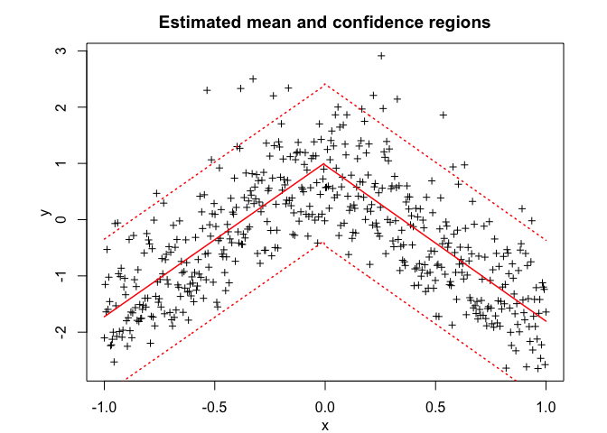
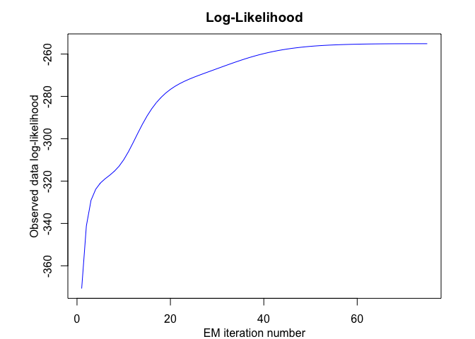

<!-- README.md is generated from README.Rmd. Please edit that file -->

# **MEteorits:** Mixtures-of-ExperTs modEling for cOmplex and non-noRmal dIsTributions

<!-- badges: start -->

[](https://travis-ci.org/fchamroukhi/MEteorits)
<!-- badges: end -->

MEteorits is an open source toolbox (available in R and Matlab)
containing several original and flexible mixtures-of-experts models to
model, cluster and classify heteregenous data in many complex situations
where the data are distributed according to non-normal and possibly
skewed distributions, and when they might be corrupted by atypical
observations. The toolbox also contains sparse mixture-of-experts models
for high-dimensional data.

Our (dis-)covered meteorits are for instance the following ones:

  - NMoE (Normal Mixtures-of-Experts);
  - tMoE (t Mixtures-of-Experts);
  - SNMoE (Skew-Normal Mixtures-of-Experts);
  - StMoE (Skew t Mixtures-of-Experts).

The models and algorithms are developped and written in Matlab by Faicel
Chamroukhi, and translated and designed into R packages by Florian
Lecocq, Marius Bartcus and Faicel Chamroukhi.

# Installation

You can install the development version of MEteorits from
[GitHub](https://github.com/fchamroukhi/MEteorits) with:

``` r
# install.packages("devtools")
devtools::install_github("fchamroukhi/MEteorits")
```

To build *vignettes* for examples of usage, type the command below
instead:

``` r
# install.packages("devtools")
devtools::install_github("fchamroukhi/MEteorits", 
                         build_opts = c("--no-resave-data", "--no-manual"), 
                         build_vignettes = TRUE)
```

Use the following command to display vignettes:

``` r
browseVignettes("meteorits")
```

# Usage

``` r
library(meteorits)
```

<details>

<summary>NMoE</summary>

``` r
# Application to a simulated data set

n <- 500 # Size of the sample
alphak <- matrix(c(0, 8), ncol = 1) # Parameters of the gating network
betak <- matrix(c(0, -2.5, 0, 2.5), ncol = 2) # Regression coefficients of the experts
sigmak <- c(1, 1) # Standard deviations of the experts
x <- seq.int(from = -1, to = 1, length.out = n) # Inputs (predictors)

# Generate sample of size n
sample <- sampleUnivNMoE(alphak = alphak, betak = betak, 
                         sigmak = sigmak, x = x)
y <- sample$y

K <- 2 # Number of regressors/experts
p <- 1 # Order of the polynomial regression (regressors/experts)
q <- 1 # Order of the logistic regression (gating network)

nmoe <- emNMoE(X = x, Y = y, K = K, p = p, q = q, verbose = TRUE)
#> EM NMoE: Iteration: 1 | log-likelihood: -860.102443327928
#> EM NMoE: Iteration: 2 | log-likelihood: -859.206324532254
#> EM NMoE: Iteration: 3 | log-likelihood: -857.763995889009
#> EM NMoE: Iteration: 4 | log-likelihood: -854.516706607357
#> EM NMoE: Iteration: 5 | log-likelihood: -847.383705869603
#> EM NMoE: Iteration: 6 | log-likelihood: -833.654576218865
#> EM NMoE: Iteration: 7 | log-likelihood: -812.266463705637
#> EM NMoE: Iteration: 8 | log-likelihood: -786.870499851187
#> EM NMoE: Iteration: 9 | log-likelihood: -764.385546458002
#> EM NMoE: Iteration: 10 | log-likelihood: -749.005031205089
#> EM NMoE: Iteration: 11 | log-likelihood: -740.282423567076
#> EM NMoE: Iteration: 12 | log-likelihood: -736.029942437869
#> EM NMoE: Iteration: 13 | log-likelihood: -734.146645166132
#> EM NMoE: Iteration: 14 | log-likelihood: -733.301666756211
#> EM NMoE: Iteration: 15 | log-likelihood: -732.889182167162
#> EM NMoE: Iteration: 16 | log-likelihood: -732.668526473641
#> EM NMoE: Iteration: 17 | log-likelihood: -732.540890303342
#> EM NMoE: Iteration: 18 | log-likelihood: -732.461978243164
#> EM NMoE: Iteration: 19 | log-likelihood: -732.410304542057
#> EM NMoE: Iteration: 20 | log-likelihood: -732.374781387036
#> EM NMoE: Iteration: 21 | log-likelihood: -732.349376554992
#> EM NMoE: Iteration: 22 | log-likelihood: -732.330641308339
#> EM NMoE: Iteration: 23 | log-likelihood: -732.31650288774
#> EM NMoE: Iteration: 24 | log-likelihood: -732.30565227384
#> EM NMoE: Iteration: 25 | log-likelihood: -732.297222972319
#> EM NMoE: Iteration: 26 | log-likelihood: -732.290616844693
#> EM NMoE: Iteration: 27 | log-likelihood: -732.285406227514
#> EM NMoE: Iteration: 28 | log-likelihood: -732.281276681825
#> EM NMoE: Iteration: 29 | log-likelihood: -732.277992022666
#> EM NMoE: Iteration: 30 | log-likelihood: -732.27537198734
#> EM NMoE: Iteration: 31 | log-likelihood: -732.273277356418
#> EM NMoE: Iteration: 32 | log-likelihood: -732.271599658418
#> EM NMoE: Iteration: 33 | log-likelihood: -732.270253816762
#> EM NMoE: Iteration: 34 | log-likelihood: -732.269172763402
#> EM NMoE: Iteration: 35 | log-likelihood: -732.268303414829
#> EM NMoE: Iteration: 36 | log-likelihood: -732.267603620527

nmoe$summary()
#> ------------------------------------------
#> Fitted Normal Mixture-of-Experts model
#> ------------------------------------------
#> 
#> NMoE model with K = 2 experts:
#> 
#>  log-likelihood df       AIC      BIC       ICL
#>       -732.2676  8 -740.2676 -757.126 -802.4245
#> 
#> Clustering table (Number of observations in each expert):
#> 
#>   1   2 
#> 278 222 
#> 
#> Regression coefficients:
#> 
#>     Beta(k = 1) Beta(k = 2)
#> 1   0.000871676 -0.04649074
#> X^1 2.792230619 -2.62424711
#> 
#> Variances:
#> 
#>  Sigma2(k = 1) Sigma2(k = 2)
#>       1.087969     0.8918722

nmoe$plot()
```


``` r
# Application to a real data set

data("tempanomalies")
x <- tempanomalies$Year
y <- tempanomalies$AnnualAnomaly

K <- 2 # Number of regressors/experts
p <- 1 # Order of the polynomial regression (regressors/experts)
q <- 1 # Order of the logistic regression (gating network)

nmoe <- emNMoE(X = x, Y = y, K = K, p = p, q = q, verbose = TRUE)
#> EM NMoE: Iteration: 1 | log-likelihood: 48.7246731683539
#> EM NMoE: Iteration: 2 | log-likelihood: 49.2910350811004
#> EM NMoE: Iteration: 3 | log-likelihood: 50.7755712823077
#> EM NMoE: Iteration: 4 | log-likelihood: 54.5491064681395
#> EM NMoE: Iteration: 5 | log-likelihood: 61.7076454238887
#> EM NMoE: Iteration: 6 | log-likelihood: 69.1225531707505
#> EM NMoE: Iteration: 7 | log-likelihood: 73.116011648375
#> EM NMoE: Iteration: 8 | log-likelihood: 75.0275274329599
#> EM NMoE: Iteration: 9 | log-likelihood: 76.4827312139216
#> EM NMoE: Iteration: 10 | log-likelihood: 77.9966449701425
#> EM NMoE: Iteration: 11 | log-likelihood: 79.7576402433594
#> EM NMoE: Iteration: 12 | log-likelihood: 81.9997591957423
#> EM NMoE: Iteration: 13 | log-likelihood: 85.118715105544
#> EM NMoE: Iteration: 14 | log-likelihood: 89.4300117994164
#> EM NMoE: Iteration: 15 | log-likelihood: 93.6142175874705
#> EM NMoE: Iteration: 16 | log-likelihood: 95.5006617123426
#> EM NMoE: Iteration: 17 | log-likelihood: 96.0715862925038
#> EM NMoE: Iteration: 18 | log-likelihood: 96.2780570769132
#> EM NMoE: Iteration: 19 | log-likelihood: 96.3841415951946
#> EM NMoE: Iteration: 20 | log-likelihood: 96.4628426765377
#> EM NMoE: Iteration: 21 | log-likelihood: 96.5368476445466
#> EM NMoE: Iteration: 22 | log-likelihood: 96.6143673583463
#> EM NMoE: Iteration: 23 | log-likelihood: 96.698980885795
#> EM NMoE: Iteration: 24 | log-likelihood: 96.7924127491337
#> EM NMoE: Iteration: 25 | log-likelihood: 96.8952244617233
#> EM NMoE: Iteration: 26 | log-likelihood: 97.0068755878185
#> EM NMoE: Iteration: 27 | log-likelihood: 97.1256764129231
#> EM NMoE: Iteration: 28 | log-likelihood: 97.248887696354
#> EM NMoE: Iteration: 29 | log-likelihood: 97.3730923722728
#> EM NMoE: Iteration: 30 | log-likelihood: 97.494849405262
#> EM NMoE: Iteration: 31 | log-likelihood: 97.6115142646361
#> EM NMoE: Iteration: 32 | log-likelihood: 97.7219802782529
#> EM NMoE: Iteration: 33 | log-likelihood: 97.8270816291474
#> EM NMoE: Iteration: 34 | log-likelihood: 97.9294784625799
#> EM NMoE: Iteration: 35 | log-likelihood: 98.0330073107111
#> EM NMoE: Iteration: 36 | log-likelihood: 98.1417049432868
#> EM NMoE: Iteration: 37 | log-likelihood: 98.258830875545
#> EM NMoE: Iteration: 38 | log-likelihood: 98.3862373707756
#> EM NMoE: Iteration: 39 | log-likelihood: 98.5243387601815
#> EM NMoE: Iteration: 40 | log-likelihood: 98.6726820192531
#> EM NMoE: Iteration: 41 | log-likelihood: 98.8307826617846
#> EM NMoE: Iteration: 42 | log-likelihood: 98.9988697294166
#> EM NMoE: Iteration: 43 | log-likelihood: 99.1782955720817
#> EM NMoE: Iteration: 44 | log-likelihood: 99.3717157992755
#> EM NMoE: Iteration: 45 | log-likelihood: 99.5833126828856
#> EM NMoE: Iteration: 46 | log-likelihood: 99.8193467157684
#> EM NMoE: Iteration: 47 | log-likelihood: 100.089226316619
#> EM NMoE: Iteration: 48 | log-likelihood: 100.407129431406
#> EM NMoE: Iteration: 49 | log-likelihood: 100.793445233804
#> EM NMoE: Iteration: 50 | log-likelihood: 101.27080025905
#> EM NMoE: Iteration: 51 | log-likelihood: 101.831781157917
#> EM NMoE: Iteration: 52 | log-likelihood: 102.352717840711
#> EM NMoE: Iteration: 53 | log-likelihood: 102.640382832163
#> EM NMoE: Iteration: 54 | log-likelihood: 102.720671449977
#> EM NMoE: Iteration: 55 | log-likelihood: 102.720726493594

nmoe$summary()
#> ------------------------------------------
#> Fitted Normal Mixture-of-Experts model
#> ------------------------------------------
#> 
#> NMoE model with K = 2 experts:
#> 
#>  log-likelihood df      AIC      BIC      ICL
#>        102.7207  8 94.72073 83.07011 83.18325
#> 
#> Clustering table (Number of observations in each expert):
#> 
#>  1  2 
#> 52 84 
#> 
#> Regression coefficients:
#> 
#>      Beta(k = 1)   Beta(k = 2)
#> 1   -42.36262495 -12.667344766
#> X^1   0.02149294   0.006474835
#> 
#> Variances:
#> 
#>  Sigma2(k = 1) Sigma2(k = 2)
#>     0.01193082     0.0135232

nmoe$plot()
```


</details>

<details>

<summary>TMoE</summary>

``` r
# Application to a simulated data set

n <- 500 # Size of the sample
alphak <- matrix(c(0, 8), ncol = 1) # Parameters of the gating network
betak <- matrix(c(0, -2.5, 0, 2.5), ncol = 2) # Regression coefficients of the experts
sigmak <- c(0.5, 0.5) # Standard deviations of the experts
nuk <- c(5, 7) # Degrees of freedom of the experts network t densities
x <- seq.int(from = -1, to = 1, length.out = n) # Inputs (predictors)

# Generate sample of size n
sample <- sampleUnivTMoE(alphak = alphak, betak = betak, sigmak = sigmak, 
                         nuk = nuk, x = x)
y <- sample$y

K <- 2 # Number of regressors/experts
p <- 1 # Order of the polynomial regression (regressors/experts)
q <- 1 # Order of the logistic regression (gating network)

tmoe <- emTMoE(X = x, Y = y, K = K, p = p, q = q, verbose = TRUE)
#> EM - tMoE: Iteration: 1 | log-likelihood: -479.5826481378
#> EM - tMoE: Iteration: 2 | log-likelihood: -475.179852337995
#> EM - tMoE: Iteration: 3 | log-likelihood: -474.949017663882
#> EM - tMoE: Iteration: 4 | log-likelihood: -474.794783103753
#> EM - tMoE: Iteration: 5 | log-likelihood: -474.671919998411
#> EM - tMoE: Iteration: 6 | log-likelihood: -474.574922477105
#> EM - tMoE: Iteration: 7 | log-likelihood: -474.499071126185
#> EM - tMoE: Iteration: 8 | log-likelihood: -474.440236556689
#> EM - tMoE: Iteration: 9 | log-likelihood: -474.394914835494
#> EM - tMoE: Iteration: 10 | log-likelihood: -474.360205666224
#> EM - tMoE: Iteration: 11 | log-likelihood: -474.333755030778
#> EM - tMoE: Iteration: 12 | log-likelihood: -474.313682015173
#> EM - tMoE: Iteration: 13 | log-likelihood: -474.298502640915
#> EM - tMoE: Iteration: 14 | log-likelihood: -474.287058122401
#> EM - tMoE: Iteration: 15 | log-likelihood: -474.278451241432
#> EM - tMoE: Iteration: 16 | log-likelihood: -474.271992150236
#> EM - tMoE: Iteration: 17 | log-likelihood: -474.267153515763
#> EM - tMoE: Iteration: 18 | log-likelihood: -474.263534182535
#> EM - tMoE: Iteration: 19 | log-likelihood: -474.26083021626
#> EM - tMoE: Iteration: 20 | log-likelihood: -474.25881212441
#> EM - tMoE: Iteration: 21 | log-likelihood: -474.257307119091
#> EM - tMoE: Iteration: 22 | log-likelihood: -474.256185419956
#> EM - tMoE: Iteration: 23 | log-likelihood: -474.255349748142
#> EM - tMoE: Iteration: 24 | log-likelihood: -474.25472731238
#> EM - tMoE: Iteration: 25 | log-likelihood: -474.254263724131

tmoe$summary()
#> -------------------------------------
#> Fitted t Mixture-of-Experts model
#> -------------------------------------
#> 
#> tMoE model with K = 2 experts:
#> 
#>  log-likelihood df       AIC       BIC       ICL
#>       -474.2543 10 -484.2543 -505.3273 -505.3289
#> 
#> Clustering table (Number of observations in each expert):
#> 
#>   1   2 
#> 249 251 
#> 
#> Regression coefficients:
#> 
#>     Beta(k = 1) Beta(k = 2)
#> 1    0.02917677  0.06582192
#> X^1  2.55733420 -2.49078462
#> 
#> Variances:
#> 
#>  Sigma2(k = 1) Sigma2(k = 2)
#>      0.2302365     0.4286459

tmoe$plot()
```


``` r
# Application to a real data set

library(MASS)
data("mcycle")
x <- mcycle$times
y <- mcycle$accel

K <- 4 # Number of regressors/experts
p <- 2 # Order of the polynomial regression (regressors/experts)
q <- 1 # Order of the logistic regression (gating network)

tmoe <- emTMoE(X = x, Y = y, K = K, p = p, q = q, verbose = TRUE)
#> EM - tMoE: Iteration: 1 | log-likelihood: -585.248413704234
#> EM - tMoE: Iteration: 2 | log-likelihood: -582.991474574389
#> EM - tMoE: Iteration: 3 | log-likelihood: -582.137418304325
#> EM - tMoE: Iteration: 4 | log-likelihood: -579.322117006085
#> EM - tMoE: Iteration: 5 | log-likelihood: -570.131818717602
#> EM - tMoE: Iteration: 6 | log-likelihood: -562.668279548609
#> EM - tMoE: Iteration: 7 | log-likelihood: -559.705985576329
#> EM - tMoE: Iteration: 8 | log-likelihood: -558.973375090175
#> EM - tMoE: Iteration: 9 | log-likelihood: -558.297693702258
#> EM - tMoE: Iteration: 10 | log-likelihood: -557.387786015001
#> EM - tMoE: Iteration: 11 | log-likelihood: -556.351929607935
#> EM - tMoE: Iteration: 12 | log-likelihood: -555.42385343145
#> EM - tMoE: Iteration: 13 | log-likelihood: -554.603106595745
#> EM - tMoE: Iteration: 14 | log-likelihood: -553.813325400748
#> EM - tMoE: Iteration: 15 | log-likelihood: -553.053820053857
#> EM - tMoE: Iteration: 16 | log-likelihood: -552.356644722667
#> EM - tMoE: Iteration: 17 | log-likelihood: -551.759682837792
#> EM - tMoE: Iteration: 18 | log-likelihood: -551.289625311874
#> EM - tMoE: Iteration: 19 | log-likelihood: -550.947692114198
#> EM - tMoE: Iteration: 20 | log-likelihood: -550.713268389276
#> EM - tMoE: Iteration: 21 | log-likelihood: -550.558248684201
#> EM - tMoE: Iteration: 22 | log-likelihood: -550.457560224711
#> EM - tMoE: Iteration: 23 | log-likelihood: -550.39256028992
#> EM - tMoE: Iteration: 24 | log-likelihood: -550.350558911763
#> EM - tMoE: Iteration: 25 | log-likelihood: -550.323278354317
#> EM - tMoE: Iteration: 26 | log-likelihood: -550.305420448357
#> EM - tMoE: Iteration: 27 | log-likelihood: -550.293616199772
#> EM - tMoE: Iteration: 28 | log-likelihood: -550.28572340279
#> EM - tMoE: Iteration: 29 | log-likelihood: -550.280375414531
#> EM - tMoE: Iteration: 30 | log-likelihood: -550.276696051805
#> EM - tMoE: Iteration: 31 | log-likelihood: -550.274120345143
#> EM - tMoE: Iteration: 32 | log-likelihood: -550.272281745723
#> EM - tMoE: Iteration: 33 | log-likelihood: -550.270940883559
#> EM - tMoE: Iteration: 34 | log-likelihood: -550.269940347609
#> EM - tMoE: Iteration: 35 | log-likelihood: -550.269175831444
#> EM - tMoE: Iteration: 36 | log-likelihood: -550.268577626098
#> EM - tMoE: Iteration: 37 | log-likelihood: -550.268098690912

tmoe$summary()
#> -------------------------------------
#> Fitted t Mixture-of-Experts model
#> -------------------------------------
#> 
#> tMoE model with K = 4 experts:
#> 
#>  log-likelihood df       AIC       BIC       ICL
#>       -550.2681 26 -576.2681 -613.8426 -613.8386
#> 
#> Clustering table (Number of observations in each expert):
#> 
#>  1  2  3  4 
#> 28 37 31 37 
#> 
#> Regression coefficients:
#> 
#>      Beta(k = 1) Beta(k = 2)  Beta(k = 3) Beta(k = 4)
#> 1   -1.037509504  993.350950 -1916.806298 322.6145388
#> X^1 -0.111799074 -104.000614   119.277179 -13.4244982
#> X^2 -0.007682953    2.435545    -1.809859   0.1378466
#> 
#> Variances:
#> 
#>  Sigma2(k = 1) Sigma2(k = 2) Sigma2(k = 3) Sigma2(k = 4)
#>       1.584917      451.8821      464.0173      400.2511

tmoe$plot()
```


</details>

<details>

<summary>SNMoE</summary>

``` r
# Application to a simulated data set

n <- 500 # Size of the sample
alphak <- matrix(c(0, 8), ncol = 1) # Parameters of the gating network
betak <- matrix(c(0, -2.5, 0, 2.5), ncol = 2) # Regression coefficients of the experts
lambdak <- c(3, 5) # Skewness parameters of the experts
sigmak <- c(1, 1) # Standard deviations of the experts
x <- seq.int(from = -1, to = 1, length.out = n) # Inputs (predictors)

# Generate sample of size n
sample <- sampleUnivSNMoE(alphak = alphak, betak = betak, 
                          sigmak = sigmak, lambdak = lambdak, 
                          x = x)
y <- sample$y

K <- 2 # Number of regressors/experts
p <- 1 # Order of the polynomial regression (regressors/experts)
q <- 1 # Order of the logistic regression (gating network)

snmoe <- emSNMoE(X = x, Y = y, K = K, p = p, q = q, verbose = TRUE)
#> EM - SNMoE: Iteration: 1 | log-likelihood: -621.728856442526
#> EM - SNMoE: Iteration: 2 | log-likelihood: -558.213360536928
#> EM - SNMoE: Iteration: 3 | log-likelihood: -555.736904966393
#> EM - SNMoE: Iteration: 4 | log-likelihood: -555.278871079312
#> EM - SNMoE: Iteration: 5 | log-likelihood: -555.126274224087
#> EM - SNMoE: Iteration: 6 | log-likelihood: -555.019345792359
#> EM - SNMoE: Iteration: 7 | log-likelihood: -554.918071913792
#> EM - SNMoE: Iteration: 8 | log-likelihood: -554.820215328805
#> EM - SNMoE: Iteration: 9 | log-likelihood: -554.728009137953
#> EM - SNMoE: Iteration: 10 | log-likelihood: -554.64278744341
#> EM - SNMoE: Iteration: 11 | log-likelihood: -554.564843596235
#> EM - SNMoE: Iteration: 12 | log-likelihood: -554.49392474161
#> EM - SNMoE: Iteration: 13 | log-likelihood: -554.429468015711
#> EM - SNMoE: Iteration: 14 | log-likelihood: -554.370893350264
#> EM - SNMoE: Iteration: 15 | log-likelihood: -554.317620653218
#> EM - SNMoE: Iteration: 16 | log-likelihood: -554.269061225442
#> EM - SNMoE: Iteration: 17 | log-likelihood: -554.22471888669
#> EM - SNMoE: Iteration: 18 | log-likelihood: -554.184141392687
#> EM - SNMoE: Iteration: 19 | log-likelihood: -554.146882410224
#> EM - SNMoE: Iteration: 20 | log-likelihood: -554.112539339761
#> EM - SNMoE: Iteration: 21 | log-likelihood: -554.080792161846
#> EM - SNMoE: Iteration: 22 | log-likelihood: -554.051388610781
#> EM - SNMoE: Iteration: 23 | log-likelihood: -554.023990313567
#> EM - SNMoE: Iteration: 24 | log-likelihood: -553.998337785631
#> EM - SNMoE: Iteration: 25 | log-likelihood: -553.974205952563
#> EM - SNMoE: Iteration: 26 | log-likelihood: -553.951399012262
#> EM - SNMoE: Iteration: 27 | log-likelihood: -553.929723593108
#> EM - SNMoE: Iteration: 28 | log-likelihood: -553.908983445577
#> EM - SNMoE: Iteration: 29 | log-likelihood: -553.889023244505
#> EM - SNMoE: Iteration: 30 | log-likelihood: -553.869641175008
#> EM - SNMoE: Iteration: 31 | log-likelihood: -553.850650899131
#> EM - SNMoE: Iteration: 32 | log-likelihood: -553.831912840515
#> EM - SNMoE: Iteration: 33 | log-likelihood: -553.813279068345
#> EM - SNMoE: Iteration: 34 | log-likelihood: -553.794590980494
#> EM - SNMoE: Iteration: 35 | log-likelihood: -553.775675738716
#> EM - SNMoE: Iteration: 36 | log-likelihood: -553.75636256911
#> EM - SNMoE: Iteration: 37 | log-likelihood: -553.736449606636
#> EM - SNMoE: Iteration: 38 | log-likelihood: -553.715747556335
#> EM - SNMoE: Iteration: 39 | log-likelihood: -553.69407548634
#> EM - SNMoE: Iteration: 40 | log-likelihood: -553.671148549865
#> EM - SNMoE: Iteration: 41 | log-likelihood: -553.64672942311
#> EM - SNMoE: Iteration: 42 | log-likelihood: -553.620563854547
#> EM - SNMoE: Iteration: 43 | log-likelihood: -553.592312360374
#> EM - SNMoE: Iteration: 44 | log-likelihood: -553.56164106997
#> EM - SNMoE: Iteration: 45 | log-likelihood: -553.528064604014
#> EM - SNMoE: Iteration: 46 | log-likelihood: -553.491165911478
#> EM - SNMoE: Iteration: 47 | log-likelihood: -553.450407854544
#> EM - SNMoE: Iteration: 48 | log-likelihood: -553.405113669696
#> EM - SNMoE: Iteration: 49 | log-likelihood: -553.354617213691
#> EM - SNMoE: Iteration: 50 | log-likelihood: -553.298129688763
#> EM - SNMoE: Iteration: 51 | log-likelihood: -553.234676016243
#> EM - SNMoE: Iteration: 52 | log-likelihood: -553.163157578903
#> EM - SNMoE: Iteration: 53 | log-likelihood: -553.082323192632
#> EM - SNMoE: Iteration: 54 | log-likelihood: -552.990755945682
#> EM - SNMoE: Iteration: 55 | log-likelihood: -552.886812921294
#> EM - SNMoE: Iteration: 56 | log-likelihood: -552.768654409658
#> EM - SNMoE: Iteration: 57 | log-likelihood: -552.634178054705
#> EM - SNMoE: Iteration: 58 | log-likelihood: -552.481020578896
#> EM - SNMoE: Iteration: 59 | log-likelihood: -552.306553328824
#> EM - SNMoE: Iteration: 60 | log-likelihood: -552.107914181545
#> EM - SNMoE: Iteration: 61 | log-likelihood: -551.882020724453
#> EM - SNMoE: Iteration: 62 | log-likelihood: -551.625635854612
#> EM - SNMoE: Iteration: 63 | log-likelihood: -551.335410553824
#> EM - SNMoE: Iteration: 64 | log-likelihood: -551.007972236228
#> EM - SNMoE: Iteration: 65 | log-likelihood: -550.640085862103
#> EM - SNMoE: Iteration: 66 | log-likelihood: -550.228767376016
#> EM - SNMoE: Iteration: 67 | log-likelihood: -549.771626757119
#> EM - SNMoE: Iteration: 68 | log-likelihood: -549.266786503829
#> EM - SNMoE: Iteration: 69 | log-likelihood: -548.713154409294
#> EM - SNMoE: Iteration: 70 | log-likelihood: -548.110556641433
#> EM - SNMoE: Iteration: 71 | log-likelihood: -547.459686321877
#> EM - SNMoE: Iteration: 72 | log-likelihood: -546.762742122023
#> EM - SNMoE: Iteration: 73 | log-likelihood: -546.022758043637
#> EM - SNMoE: Iteration: 74 | log-likelihood: -545.243489635641
#> EM - SNMoE: Iteration: 75 | log-likelihood: -544.430228269536
#> EM - SNMoE: Iteration: 76 | log-likelihood: -543.588719228421
#> EM - SNMoE: Iteration: 77 | log-likelihood: -542.725725135121
#> EM - SNMoE: Iteration: 78 | log-likelihood: -541.848400019931
#> EM - SNMoE: Iteration: 79 | log-likelihood: -540.964259761912
#> EM - SNMoE: Iteration: 80 | log-likelihood: -540.080829260855
#> EM - SNMoE: Iteration: 81 | log-likelihood: -539.205607540551
#> EM - SNMoE: Iteration: 82 | log-likelihood: -538.345636309891
#> EM - SNMoE: Iteration: 83 | log-likelihood: -537.507334678653
#> EM - SNMoE: Iteration: 84 | log-likelihood: -536.696112956019
#> EM - SNMoE: Iteration: 85 | log-likelihood: -535.916668950777
#> EM - SNMoE: Iteration: 86 | log-likelihood: -535.172638533614
#> EM - SNMoE: Iteration: 87 | log-likelihood: -534.466635384802
#> EM - SNMoE: Iteration: 88 | log-likelihood: -533.800364829745
#> EM - SNMoE: Iteration: 89 | log-likelihood: -533.174594721497
#> EM - SNMoE: Iteration: 90 | log-likelihood: -532.589300233649
#> EM - SNMoE: Iteration: 91 | log-likelihood: -532.043959939387
#> EM - SNMoE: Iteration: 92 | log-likelihood: -531.537259725034
#> EM - SNMoE: Iteration: 93 | log-likelihood: -531.067684360293
#> EM - SNMoE: Iteration: 94 | log-likelihood: -530.63337739162
#> EM - SNMoE: Iteration: 95 | log-likelihood: -530.232312547578
#> EM - SNMoE: Iteration: 96 | log-likelihood: -529.862350390479
#> EM - SNMoE: Iteration: 97 | log-likelihood: -529.521330008296
#> EM - SNMoE: Iteration: 98 | log-likelihood: -529.207110970311
#> EM - SNMoE: Iteration: 99 | log-likelihood: -528.917614943768
#> EM - SNMoE: Iteration: 100 | log-likelihood: -528.650865853561
#> EM - SNMoE: Iteration: 101 | log-likelihood: -528.404988701608
#> EM - SNMoE: Iteration: 102 | log-likelihood: -528.178240670872
#> EM - SNMoE: Iteration: 103 | log-likelihood: -527.969045561096
#> EM - SNMoE: Iteration: 104 | log-likelihood: -527.775801409155
#> EM - SNMoE: Iteration: 105 | log-likelihood: -527.597228475611
#> EM - SNMoE: Iteration: 106 | log-likelihood: -527.432070516003
#> EM - SNMoE: Iteration: 107 | log-likelihood: -527.279184452501
#> EM - SNMoE: Iteration: 108 | log-likelihood: -527.137532052357
#> EM - SNMoE: Iteration: 109 | log-likelihood: -527.006171563407
#> EM - SNMoE: Iteration: 110 | log-likelihood: -526.884248743514
#> EM - SNMoE: Iteration: 111 | log-likelihood: -526.770989565113
#> EM - SNMoE: Iteration: 112 | log-likelihood: -526.665712511246
#> EM - SNMoE: Iteration: 113 | log-likelihood: -526.567720301142
#> EM - SNMoE: Iteration: 114 | log-likelihood: -526.476486173305
#> EM - SNMoE: Iteration: 115 | log-likelihood: -526.391478760632
#> EM - SNMoE: Iteration: 116 | log-likelihood: -526.312216863129
#> EM - SNMoE: Iteration: 117 | log-likelihood: -526.238263974578
#> EM - SNMoE: Iteration: 118 | log-likelihood: -526.169247052748
#> EM - SNMoE: Iteration: 119 | log-likelihood: -526.104761341868
#> EM - SNMoE: Iteration: 120 | log-likelihood: -526.044486762085
#> EM - SNMoE: Iteration: 121 | log-likelihood: -525.988123919022
#> EM - SNMoE: Iteration: 122 | log-likelihood: -525.935394650157
#> EM - SNMoE: Iteration: 123 | log-likelihood: -525.886040847845
#> EM - SNMoE: Iteration: 124 | log-likelihood: -525.839847898829
#> EM - SNMoE: Iteration: 125 | log-likelihood: -525.796572926175
#> EM - SNMoE: Iteration: 126 | log-likelihood: -525.756027839905
#> EM - SNMoE: Iteration: 127 | log-likelihood: -525.718027393607
#> EM - SNMoE: Iteration: 128 | log-likelihood: -525.682399502553
#> EM - SNMoE: Iteration: 129 | log-likelihood: -525.648991282808
#> EM - SNMoE: Iteration: 130 | log-likelihood: -525.617654608724
#> EM - SNMoE: Iteration: 131 | log-likelihood: -525.588255676934
#> EM - SNMoE: Iteration: 132 | log-likelihood: -525.560671175401
#> EM - SNMoE: Iteration: 133 | log-likelihood: -525.534778815521
#> EM - SNMoE: Iteration: 134 | log-likelihood: -525.510473229679
#> EM - SNMoE: Iteration: 135 | log-likelihood: -525.48765446247
#> EM - SNMoE: Iteration: 136 | log-likelihood: -525.466227357151
#> EM - SNMoE: Iteration: 137 | log-likelihood: -525.446102831915
#> EM - SNMoE: Iteration: 138 | log-likelihood: -525.427202723562
#> EM - SNMoE: Iteration: 139 | log-likelihood: -525.409449461722
#> EM - SNMoE: Iteration: 140 | log-likelihood: -525.392751468854
#> EM - SNMoE: Iteration: 141 | log-likelihood: -525.377063768844
#> EM - SNMoE: Iteration: 142 | log-likelihood: -525.362324531153
#> EM - SNMoE: Iteration: 143 | log-likelihood: -525.348472892085
#> EM - SNMoE: Iteration: 144 | log-likelihood: -525.335453454786
#> EM - SNMoE: Iteration: 145 | log-likelihood: -525.323215093896
#> EM - SNMoE: Iteration: 146 | log-likelihood: -525.311709994699
#> EM - SNMoE: Iteration: 147 | log-likelihood: -525.300893375613
#> EM - SNMoE: Iteration: 148 | log-likelihood: -525.290723283207
#> EM - SNMoE: Iteration: 149 | log-likelihood: -525.281160402854
#> EM - SNMoE: Iteration: 150 | log-likelihood: -525.272167882801
#> EM - SNMoE: Iteration: 151 | log-likelihood: -525.263711170525
#> EM - SNMoE: Iteration: 152 | log-likelihood: -525.255757860658
#> EM - SNMoE: Iteration: 153 | log-likelihood: -525.248277553928
#> EM - SNMoE: Iteration: 154 | log-likelihood: -525.241241726476
#> EM - SNMoE: Iteration: 155 | log-likelihood: -525.234623608809
#> EM - SNMoE: Iteration: 156 | log-likelihood: -525.228397565455
#> EM - SNMoE: Iteration: 157 | log-likelihood: -525.222540080956
#> EM - SNMoE: Iteration: 158 | log-likelihood: -525.217030405599
#> EM - SNMoE: Iteration: 159 | log-likelihood: -525.211846986648
#> EM - SNMoE: Iteration: 160 | log-likelihood: -525.20697143723
#> EM - SNMoE: Iteration: 161 | log-likelihood: -525.202383864528
#> EM - SNMoE: Iteration: 162 | log-likelihood: -525.198064572311
#> EM - SNMoE: Iteration: 163 | log-likelihood: -525.194000877408
#> EM - SNMoE: Iteration: 164 | log-likelihood: -525.190177078631
#> EM - SNMoE: Iteration: 165 | log-likelihood: -525.186578621621
#> EM - SNMoE: Iteration: 166 | log-likelihood: -525.183191975844
#> EM - SNMoE: Iteration: 167 | log-likelihood: -525.180004533262
#> EM - SNMoE: Iteration: 168 | log-likelihood: -525.177004485555
#> EM - SNMoE: Iteration: 169 | log-likelihood: -525.174180717199
#> EM - SNMoE: Iteration: 170 | log-likelihood: -525.171522730087
#> EM - SNMoE: Iteration: 171 | log-likelihood: -525.169020583885
#> EM - SNMoE: Iteration: 172 | log-likelihood: -525.166664828542
#> EM - SNMoE: Iteration: 173 | log-likelihood: -525.164446474489
#> EM - SNMoE: Iteration: 174 | log-likelihood: -525.162357021968
#> EM - SNMoE: Iteration: 175 | log-likelihood: -525.160390197532
#> EM - SNMoE: Iteration: 176 | log-likelihood: -525.158540310137
#> EM - SNMoE: Iteration: 177 | log-likelihood: -525.156798646047
#> EM - SNMoE: Iteration: 178 | log-likelihood: -525.15515754785
#> EM - SNMoE: Iteration: 179 | log-likelihood: -525.153611317717
#> EM - SNMoE: Iteration: 180 | log-likelihood: -525.152155125816
#> EM - SNMoE: Iteration: 181 | log-likelihood: -525.15078358669
#> EM - SNMoE: Iteration: 182 | log-likelihood: -525.149492223675
#> EM - SNMoE: Iteration: 183 | log-likelihood: -525.148275387018
#> EM - SNMoE: Iteration: 184 | log-likelihood: -525.147127189924
#> EM - SNMoE: Iteration: 185 | log-likelihood: -525.146046267732
#> EM - SNMoE: Iteration: 186 | log-likelihood: -525.145028246939
#> EM - SNMoE: Iteration: 187 | log-likelihood: -525.144069189364
#> EM - SNMoE: Iteration: 188 | log-likelihood: -525.143165502493
#> EM - SNMoE: Iteration: 189 | log-likelihood: -525.142313896612
#> EM - SNMoE: Iteration: 190 | log-likelihood: -525.141511336999
#> EM - SNMoE: Iteration: 191 | log-likelihood: -525.140754959957
#> EM - SNMoE: Iteration: 192 | log-likelihood: -525.140042050086
#> EM - SNMoE: Iteration: 193 | log-likelihood: -525.139370042782
#> EM - SNMoE: Iteration: 194 | log-likelihood: -525.138736527692
#> EM - SNMoE: Iteration: 195 | log-likelihood: -525.138139246697
#> EM - SNMoE: Iteration: 196 | log-likelihood: -525.137576085423
#> EM - SNMoE: Iteration: 197 | log-likelihood: -525.137045060771
#> EM - SNMoE: Iteration: 198 | log-likelihood: -525.1365443081

snmoe$summary()
#> -----------------------------------------------
#> Fitted Skew-Normal Mixture-of-Experts model
#> -----------------------------------------------
#> 
#> SNMoE model with K = 2 experts:
#> 
#>  log-likelihood df       AIC       BIC       ICL
#>       -525.1365 10 -535.1365 -556.2096 -556.2118
#> 
#> Clustering table (Number of observations in each expert):
#> 
#>   1   2 
#> 249 251 
#> 
#> Regression coefficients:
#> 
#>     Beta(k = 1) Beta(k = 2)
#> 1    0.04334094   0.9909879
#> X^1  2.64258033  -2.6205941
#> 
#> Variances:
#> 
#>  Sigma2(k = 1) Sigma2(k = 2)
#>       1.287492      0.577774

snmoe$plot()
```



``` r
# Application to a real data set

data("tempanomalies")
x <- tempanomalies$Year
y <- tempanomalies$AnnualAnomaly

K <- 2 # Number of regressors/experts
p <- 1 # Order of the polynomial regression (regressors/experts)
q <- 1 # Order of the logistic regression (gating network)

snmoe <- emSNMoE(X = x, Y = y, K = K, p = p, q = q, verbose = TRUE)
#> EM - SNMoE: Iteration: 1 | log-likelihood: 65.7530721603781
#> EM - SNMoE: Iteration: 2 | log-likelihood: 86.3239339322003
#> EM - SNMoE: Iteration: 3 | log-likelihood: 88.4248331917867
#> EM - SNMoE: Iteration: 4 | log-likelihood: 88.8179750633729
#> EM - SNMoE: Iteration: 5 | log-likelihood: 89.0294397977051
#> EM - SNMoE: Iteration: 6 | log-likelihood: 89.2566863074058
#> EM - SNMoE: Iteration: 7 | log-likelihood: 89.4478975182817
#> EM - SNMoE: Iteration: 8 | log-likelihood: 89.5633187024015
#> EM - SNMoE: Iteration: 9 | log-likelihood: 89.6290238055042
#> EM - SNMoE: Iteration: 10 | log-likelihood: 89.6684060944619
#> EM - SNMoE: Iteration: 11 | log-likelihood: 89.6956906428894
#> EM - SNMoE: Iteration: 12 | log-likelihood: 89.7179136332305
#> EM - SNMoE: Iteration: 13 | log-likelihood: 89.7373587510515
#> EM - SNMoE: Iteration: 14 | log-likelihood: 89.7547267319452
#> EM - SNMoE: Iteration: 15 | log-likelihood: 89.7705850471586
#> EM - SNMoE: Iteration: 16 | log-likelihood: 89.7852376109111
#> EM - SNMoE: Iteration: 17 | log-likelihood: 89.7987965783633
#> EM - SNMoE: Iteration: 18 | log-likelihood: 89.8112942709355
#> EM - SNMoE: Iteration: 19 | log-likelihood: 89.8227508716605
#> EM - SNMoE: Iteration: 20 | log-likelihood: 89.8331824538913
#> EM - SNMoE: Iteration: 21 | log-likelihood: 89.8427214993507
#> EM - SNMoE: Iteration: 22 | log-likelihood: 89.8514663304413
#> EM - SNMoE: Iteration: 23 | log-likelihood: 89.8592579973532
#> EM - SNMoE: Iteration: 24 | log-likelihood: 89.8661561455577
#> EM - SNMoE: Iteration: 25 | log-likelihood: 89.8722191648257
#> EM - SNMoE: Iteration: 26 | log-likelihood: 89.8778323703309
#> EM - SNMoE: Iteration: 27 | log-likelihood: 89.8817300305589
#> EM - SNMoE: Iteration: 28 | log-likelihood: 89.8855307845703
#> EM - SNMoE: Iteration: 29 | log-likelihood: 89.8888792977004
#> EM - SNMoE: Iteration: 30 | log-likelihood: 89.8920951647168
#> EM - SNMoE: Iteration: 31 | log-likelihood: 89.8948441053182
#> EM - SNMoE: Iteration: 32 | log-likelihood: 89.8978706974658
#> EM - SNMoE: Iteration: 33 | log-likelihood: 89.9002200429712
#> EM - SNMoE: Iteration: 34 | log-likelihood: 89.902328207686
#> EM - SNMoE: Iteration: 35 | log-likelihood: 89.9045843924366
#> EM - SNMoE: Iteration: 36 | log-likelihood: 89.9065356754061
#> EM - SNMoE: Iteration: 37 | log-likelihood: 89.9084626083348
#> EM - SNMoE: Iteration: 38 | log-likelihood: 89.9102273633366
#> EM - SNMoE: Iteration: 39 | log-likelihood: 89.9118881848843
#> EM - SNMoE: Iteration: 40 | log-likelihood: 89.9135632108637
#> EM - SNMoE: Iteration: 41 | log-likelihood: 89.9151408164437
#> EM - SNMoE: Iteration: 42 | log-likelihood: 89.9166213837794
#> EM - SNMoE: Iteration: 43 | log-likelihood: 89.9180702150441
#> EM - SNMoE: Iteration: 44 | log-likelihood: 89.919458356853
#> EM - SNMoE: Iteration: 45 | log-likelihood: 89.9207875624714
#> EM - SNMoE: Iteration: 46 | log-likelihood: 89.922065236882
#> EM - SNMoE: Iteration: 47 | log-likelihood: 89.9232982774211
#> EM - SNMoE: Iteration: 48 | log-likelihood: 89.924486684481
#> EM - SNMoE: Iteration: 49 | log-likelihood: 89.9256346463225
#> EM - SNMoE: Iteration: 50 | log-likelihood: 89.926746437487
#> EM - SNMoE: Iteration: 51 | log-likelihood: 89.9278174531042
#> EM - SNMoE: Iteration: 52 | log-likelihood: 89.9288523726757
#> EM - SNMoE: Iteration: 53 | log-likelihood: 89.9298540347897
#> EM - SNMoE: Iteration: 54 | log-likelihood: 89.9308239575936
#> EM - SNMoE: Iteration: 55 | log-likelihood: 89.9317595911389
#> EM - SNMoE: Iteration: 56 | log-likelihood: 89.9326660449575
#> EM - SNMoE: Iteration: 57 | log-likelihood: 89.9335417071985
#> EM - SNMoE: Iteration: 58 | log-likelihood: 89.9343885455927
#> EM - SNMoE: Iteration: 59 | log-likelihood: 89.9352095816839
#> EM - SNMoE: Iteration: 60 | log-likelihood: 89.9360090339312
#> EM - SNMoE: Iteration: 61 | log-likelihood: 89.9367842537818
#> EM - SNMoE: Iteration: 62 | log-likelihood: 89.9375317280649
#> EM - SNMoE: Iteration: 63 | log-likelihood: 89.9382559091798
#> EM - SNMoE: Iteration: 64 | log-likelihood: 89.9389601130624
#> EM - SNMoE: Iteration: 65 | log-likelihood: 89.9396392692981
#> EM - SNMoE: Iteration: 66 | log-likelihood: 89.9402972964399
#> EM - SNMoE: Iteration: 67 | log-likelihood: 89.9409362964514
#> EM - SNMoE: Iteration: 68 | log-likelihood: 89.9415558568227
#> EM - SNMoE: Iteration: 69 | log-likelihood: 89.9421569002572
#> EM - SNMoE: Iteration: 70 | log-likelihood: 89.942738858573
#> EM - SNMoE: Iteration: 71 | log-likelihood: 89.9433069004722
#> EM - SNMoE: Iteration: 72 | log-likelihood: 89.9438586518292
#> EM - SNMoE: Iteration: 73 | log-likelihood: 89.9443949687229
#> EM - SNMoE: Iteration: 74 | log-likelihood: 89.9449174910383
#> EM - SNMoE: Iteration: 75 | log-likelihood: 89.9454267780868
#> EM - SNMoE: Iteration: 76 | log-likelihood: 89.9459199095124
#> EM - SNMoE: Iteration: 77 | log-likelihood: 89.9464002008731
#> EM - SNMoE: Iteration: 78 | log-likelihood: 89.9468681114473
#> EM - SNMoE: Iteration: 79 | log-likelihood: 89.9473226826026
#> EM - SNMoE: Iteration: 80 | log-likelihood: 89.9477648006379
#> EM - SNMoE: Iteration: 81 | log-likelihood: 89.9481949202721
#> EM - SNMoE: Iteration: 82 | log-likelihood: 89.9486151309058
#> EM - SNMoE: Iteration: 83 | log-likelihood: 89.9490226300585
#> EM - SNMoE: Iteration: 84 | log-likelihood: 89.949418798074
#> EM - SNMoE: Iteration: 85 | log-likelihood: 89.9498051473077
#> EM - SNMoE: Iteration: 86 | log-likelihood: 89.9501812430267
#> EM - SNMoE: Iteration: 87 | log-likelihood: 89.9505465998675
#> EM - SNMoE: Iteration: 88 | log-likelihood: 89.9509034147882
#> EM - SNMoE: Iteration: 89 | log-likelihood: 89.9512525742312
#> EM - SNMoE: Iteration: 90 | log-likelihood: 89.951592517097
#> EM - SNMoE: Iteration: 91 | log-likelihood: 89.9519241841591
#> EM - SNMoE: Iteration: 92 | log-likelihood: 89.952249154387
#> EM - SNMoE: Iteration: 93 | log-likelihood: 89.9525654352305
#> EM - SNMoE: Iteration: 94 | log-likelihood: 89.9528735994529
#> EM - SNMoE: Iteration: 95 | log-likelihood: 89.9531744743882
#> EM - SNMoE: Iteration: 96 | log-likelihood: 89.9534695273097
#> EM - SNMoE: Iteration: 97 | log-likelihood: 89.9537567464975
#> EM - SNMoE: Iteration: 98 | log-likelihood: 89.9540363419864
#> EM - SNMoE: Iteration: 99 | log-likelihood: 89.9543083372913
#> EM - SNMoE: Iteration: 100 | log-likelihood: 89.9545751620608
#> EM - SNMoE: Iteration: 101 | log-likelihood: 89.9548365212899
#> EM - SNMoE: Iteration: 102 | log-likelihood: 89.9550909074734
#> EM - SNMoE: Iteration: 103 | log-likelihood: 89.9553391946948
#> EM - SNMoE: Iteration: 104 | log-likelihood: 89.9555836915578
#> EM - SNMoE: Iteration: 105 | log-likelihood: 89.9558234566691
#> EM - SNMoE: Iteration: 106 | log-likelihood: 89.9560596156596
#> EM - SNMoE: Iteration: 107 | log-likelihood: 89.9562893904808
#> EM - SNMoE: Iteration: 108 | log-likelihood: 89.9565119848475
#> EM - SNMoE: Iteration: 109 | log-likelihood: 89.9567300017807
#> EM - SNMoE: Iteration: 110 | log-likelihood: 89.9569441436162
#> EM - SNMoE: Iteration: 111 | log-likelihood: 89.9571544490872
#> EM - SNMoE: Iteration: 112 | log-likelihood: 89.9573593485853
#> EM - SNMoE: Iteration: 113 | log-likelihood: 89.9575608027123
#> EM - SNMoE: Iteration: 114 | log-likelihood: 89.9577571721364
#> EM - SNMoE: Iteration: 115 | log-likelihood: 89.9579468621322
#> EM - SNMoE: Iteration: 116 | log-likelihood: 89.9581345041153
#> EM - SNMoE: Iteration: 117 | log-likelihood: 89.9583176433149
#> EM - SNMoE: Iteration: 118 | log-likelihood: 89.9584967012603
#> EM - SNMoE: Iteration: 119 | log-likelihood: 89.9586716174923
#> EM - SNMoE: Iteration: 120 | log-likelihood: 89.9588428957737
#> EM - SNMoE: Iteration: 121 | log-likelihood: 89.9590119427588
#> EM - SNMoE: Iteration: 122 | log-likelihood: 89.9591782261179
#> EM - SNMoE: Iteration: 123 | log-likelihood: 89.9593385306234
#> EM - SNMoE: Iteration: 124 | log-likelihood: 89.9594976460686
#> EM - SNMoE: Iteration: 125 | log-likelihood: 89.9596572851884
#> EM - SNMoE: Iteration: 126 | log-likelihood: 89.9598128689015
#> EM - SNMoE: Iteration: 127 | log-likelihood: 89.959964186622
#> EM - SNMoE: Iteration: 128 | log-likelihood: 89.960112426594
#> EM - SNMoE: Iteration: 129 | log-likelihood: 89.9602583283217
#> EM - SNMoE: Iteration: 130 | log-likelihood: 89.9604015719481
#> EM - SNMoE: Iteration: 131 | log-likelihood: 89.9605416296643
#> EM - SNMoE: Iteration: 132 | log-likelihood: 89.9606805559583
#> EM - SNMoE: Iteration: 133 | log-likelihood: 89.9608161678787
#> EM - SNMoE: Iteration: 134 | log-likelihood: 89.9609486903465
#> EM - SNMoE: Iteration: 135 | log-likelihood: 89.96107870266
#> EM - SNMoE: Iteration: 136 | log-likelihood: 89.9612062875673
#> EM - SNMoE: Iteration: 137 | log-likelihood: 89.961331362754
#> EM - SNMoE: Iteration: 138 | log-likelihood: 89.961454039905
#> EM - SNMoE: Iteration: 139 | log-likelihood: 89.9615744028842
#> EM - SNMoE: Iteration: 140 | log-likelihood: 89.9616927450662
#> EM - SNMoE: Iteration: 141 | log-likelihood: 89.9618089258504
#> EM - SNMoE: Iteration: 142 | log-likelihood: 89.9619234253471
#> EM - SNMoE: Iteration: 143 | log-likelihood: 89.9620358054983
#> EM - SNMoE: Iteration: 144 | log-likelihood: 89.9621459295385
#> EM - SNMoE: Iteration: 145 | log-likelihood: 89.9622542750117
#> EM - SNMoE: Iteration: 146 | log-likelihood: 89.9623609366156
#> EM - SNMoE: Iteration: 147 | log-likelihood: 89.9624661642804
#> EM - SNMoE: Iteration: 148 | log-likelihood: 89.9625689919369
#> EM - SNMoE: Iteration: 149 | log-likelihood: 89.9626699420505
#> EM - SNMoE: Iteration: 150 | log-likelihood: 89.9627691142685
#> EM - SNMoE: Iteration: 151 | log-likelihood: 89.9628666402843
#> EM - SNMoE: Iteration: 152 | log-likelihood: 89.962962493416
#> EM - SNMoE: Iteration: 153 | log-likelihood: 89.9630567769394
#> EM - SNMoE: Iteration: 154 | log-likelihood: 89.9631500933126
#> EM - SNMoE: Iteration: 155 | log-likelihood: 89.9632429339704
#> EM - SNMoE: Iteration: 156 | log-likelihood: 89.9633343775274
#> EM - SNMoE: Iteration: 157 | log-likelihood: 89.9634240800603

snmoe$summary()
#> -----------------------------------------------
#> Fitted Skew-Normal Mixture-of-Experts model
#> -----------------------------------------------
#> 
#> SNMoE model with K = 2 experts:
#> 
#>  log-likelihood df      AIC      BIC      ICL
#>        89.96342 10 79.96342 65.40015 65.30379
#> 
#> Clustering table (Number of observations in each expert):
#> 
#>  1  2 
#> 70 66 
#> 
#> Regression coefficients:
#> 
#>       Beta(k = 1)  Beta(k = 2)
#> 1   -14.029751324 -33.81088200
#> X^1   0.007204144   0.01720045
#> 
#> Variances:
#> 
#>  Sigma2(k = 1) Sigma2(k = 2)
#>     0.01485546    0.01748808

snmoe$plot()
```


</details>

<details>

<summary>StMoE</summary>

``` r
# Applicartion to a simulated data set

n <- 500 # Size of the sample
alphak <- matrix(c(0, 8), ncol = 1) # Parameters of the gating network
betak <- matrix(c(0, -2.5, 0, 2.5), ncol = 2) # Regression coefficients of the experts
sigmak <- c(0.5, 0.5) # Standard deviations of the experts
lambdak <- c(3, 5) # Skewness parameters of the experts
nuk <- c(5, 7) # Degrees of freedom of the experts network t densities
x <- seq.int(from = -1, to = 1, length.out = n) # Inputs (predictors)

# Generate sample of size n
sample <- sampleUnivStMoE(alphak = alphak, betak = betak, 
                          sigmak = sigmak, lambdak = lambdak, 
                          nuk = nuk, x = x)
y <- sample$y

K <- 2 # Number of regressors/experts
p <- 1 # Order of the polynomial regression (regressors/experts)
q <- 1 # Order of the logistic regression (gating network)

stmoe <- emStMoE(X = x, Y = y, K = K, p = p, q = q, verbose = TRUE)
#> EM - StMoE: Iteration: 1 | log-likelihood: -326.041142112052
#> EM - StMoE: Iteration: 2 | log-likelihood: -301.221140200205
#> EM - StMoE: Iteration: 3 | log-likelihood: -295.7529188343
#> EM - StMoE: Iteration: 4 | log-likelihood: -293.125388781005
#> EM - StMoE: Iteration: 5 | log-likelihood: -291.760273658137
#> EM - StMoE: Iteration: 6 | log-likelihood: -291.033293751701
#> EM - StMoE: Iteration: 7 | log-likelihood: -290.608928639799
#> EM - StMoE: Iteration: 8 | log-likelihood: -290.324452917206
#> EM - StMoE: Iteration: 9 | log-likelihood: -290.10408474491
#> EM - StMoE: Iteration: 10 | log-likelihood: -289.912182528244
#> EM - StMoE: Iteration: 11 | log-likelihood: -289.730628198727
#> EM - StMoE: Iteration: 12 | log-likelihood: -289.548688388011
#> EM - StMoE: Iteration: 13 | log-likelihood: -289.35849474325
#> EM - StMoE: Iteration: 14 | log-likelihood: -289.15257733971
#> EM - StMoE: Iteration: 15 | log-likelihood: -288.922292169938
#> EM - StMoE: Iteration: 16 | log-likelihood: -288.656390533393
#> EM - StMoE: Iteration: 17 | log-likelihood: -288.340102386293
#> EM - StMoE: Iteration: 18 | log-likelihood: -287.952849936106
#> EM - StMoE: Iteration: 19 | log-likelihood: -287.466677893043
#> EM - StMoE: Iteration: 20 | log-likelihood: -286.843608204731
#> EM - StMoE: Iteration: 21 | log-likelihood: -286.034973023535
#> EM - StMoE: Iteration: 22 | log-likelihood: -284.989194946671
#> EM - StMoE: Iteration: 23 | log-likelihood: -283.657865054716
#> EM - StMoE: Iteration: 24 | log-likelihood: -282.004825628947
#> EM - StMoE: Iteration: 25 | log-likelihood: -280.037201469535
#> EM - StMoE: Iteration: 26 | log-likelihood: -277.803770099349
#> EM - StMoE: Iteration: 27 | log-likelihood: -275.381313512759
#> EM - StMoE: Iteration: 28 | log-likelihood: -272.85210616757
#> EM - StMoE: Iteration: 29 | log-likelihood: -270.287899066753
#> EM - StMoE: Iteration: 30 | log-likelihood: -267.740668311468
#> EM - StMoE: Iteration: 31 | log-likelihood: -265.239459037183
#> EM - StMoE: Iteration: 32 | log-likelihood: -262.79794764042
#> EM - StMoE: Iteration: 33 | log-likelihood: -260.415013385513
#> EM - StMoE: Iteration: 34 | log-likelihood: -258.095921389171
#> EM - StMoE: Iteration: 35 | log-likelihood: -255.848922951716
#> EM - StMoE: Iteration: 36 | log-likelihood: -253.681391485117
#> EM - StMoE: Iteration: 37 | log-likelihood: -251.606331028378
#> EM - StMoE: Iteration: 38 | log-likelihood: -249.636940683139
#> EM - StMoE: Iteration: 39 | log-likelihood: -247.798534856395
#> EM - StMoE: Iteration: 40 | log-likelihood: -246.114605429326
#> EM - StMoE: Iteration: 41 | log-likelihood: -244.59340130094
#> EM - StMoE: Iteration: 42 | log-likelihood: -243.237564750728
#> EM - StMoE: Iteration: 43 | log-likelihood: -242.03943496353
#> EM - StMoE: Iteration: 44 | log-likelihood: -240.989605663392
#> EM - StMoE: Iteration: 45 | log-likelihood: -240.077636763046
#> EM - StMoE: Iteration: 46 | log-likelihood: -239.290325426541
#> EM - StMoE: Iteration: 47 | log-likelihood: -238.609966751538
#> EM - StMoE: Iteration: 48 | log-likelihood: -238.022678856668
#> EM - StMoE: Iteration: 49 | log-likelihood: -237.522044389653
#> EM - StMoE: Iteration: 50 | log-likelihood: -237.095545025482
#> EM - StMoE: Iteration: 51 | log-likelihood: -236.731947795134
#> EM - StMoE: Iteration: 52 | log-likelihood: -236.420405609026
#> EM - StMoE: Iteration: 53 | log-likelihood: -236.152621017281
#> EM - StMoE: Iteration: 54 | log-likelihood: -235.922093762084
#> EM - StMoE: Iteration: 55 | log-likelihood: -235.722712292573
#> EM - StMoE: Iteration: 56 | log-likelihood: -235.549856088963
#> EM - StMoE: Iteration: 57 | log-likelihood: -235.399500526415
#> EM - StMoE: Iteration: 58 | log-likelihood: -235.268533713439
#> EM - StMoE: Iteration: 59 | log-likelihood: -235.155433143593
#> EM - StMoE: Iteration: 60 | log-likelihood: -235.057208295651
#> EM - StMoE: Iteration: 61 | log-likelihood: -234.972010422809
#> EM - StMoE: Iteration: 62 | log-likelihood: -234.898404261523
#> EM - StMoE: Iteration: 63 | log-likelihood: -234.834322313738
#> EM - StMoE: Iteration: 64 | log-likelihood: -234.778298116737
#> EM - StMoE: Iteration: 65 | log-likelihood: -234.728951071968
#> EM - StMoE: Iteration: 66 | log-likelihood: -234.685449865249
#> EM - StMoE: Iteration: 67 | log-likelihood: -234.647335248107
#> EM - StMoE: Iteration: 68 | log-likelihood: -234.613823569928
#> EM - StMoE: Iteration: 69 | log-likelihood: -234.584502524536
#> EM - StMoE: Iteration: 70 | log-likelihood: -234.559013318302
#> EM - StMoE: Iteration: 71 | log-likelihood: -234.536743482429
#> EM - StMoE: Iteration: 72 | log-likelihood: -234.517025459934
#> EM - StMoE: Iteration: 73 | log-likelihood: -234.499469474243
#> EM - StMoE: Iteration: 74 | log-likelihood: -234.483811017257
#> EM - StMoE: Iteration: 75 | log-likelihood: -234.469721775564
#> EM - StMoE: Iteration: 76 | log-likelihood: -234.456946424485
#> EM - StMoE: Iteration: 77 | log-likelihood: -234.445342951829
#> EM - StMoE: Iteration: 78 | log-likelihood: -234.434853206483
#> EM - StMoE: Iteration: 79 | log-likelihood: -234.425291093861
#> EM - StMoE: Iteration: 80 | log-likelihood: -234.416564209038
#> EM - StMoE: Iteration: 81 | log-likelihood: -234.408500710662
#> EM - StMoE: Iteration: 82 | log-likelihood: -234.401002621645
#> EM - StMoE: Iteration: 83 | log-likelihood: -234.394017189404
#> EM - StMoE: Iteration: 84 | log-likelihood: -234.387486870111
#> EM - StMoE: Iteration: 85 | log-likelihood: -234.381364619696
#> EM - StMoE: Iteration: 86 | log-likelihood: -234.375611596597
#> EM - StMoE: Iteration: 87 | log-likelihood: -234.370195416964
#> EM - StMoE: Iteration: 88 | log-likelihood: -234.365088816776
#> EM - StMoE: Iteration: 89 | log-likelihood: -234.360268616897
#> EM - StMoE: Iteration: 90 | log-likelihood: -234.355714916078
#> EM - StMoE: Iteration: 91 | log-likelihood: -234.351410457207
#> EM - StMoE: Iteration: 92 | log-likelihood: -234.347340126501
#> EM - StMoE: Iteration: 93 | log-likelihood: -234.343490555624
#> EM - StMoE: Iteration: 94 | log-likelihood: -234.339849804179
#> EM - StMoE: Iteration: 95 | log-likelihood: -234.336407105411
#> EM - StMoE: Iteration: 96 | log-likelihood: -234.333152661975
#> EM - StMoE: Iteration: 97 | log-likelihood: -234.330077481577
#> EM - StMoE: Iteration: 98 | log-likelihood: -234.327173244529
#> EM - StMoE: Iteration: 99 | log-likelihood: -234.324432196955
#> EM - StMoE: Iteration: 100 | log-likelihood: -234.321847064669
#> EM - StMoE: Iteration: 101 | log-likelihood: -234.319410983762
#> EM - StMoE: Iteration: 102 | log-likelihood: -234.317117444703
#> EM - StMoE: Iteration: 103 | log-likelihood: -234.314960247383
#> EM - StMoE: Iteration: 104 | log-likelihood: -234.312900748446
#> EM - StMoE: Iteration: 105 | log-likelihood: -234.310970995962
#> EM - StMoE: Iteration: 106 | log-likelihood: -234.309164357136
#> EM - StMoE: Iteration: 107 | log-likelihood: -234.3076130856
#> EM - StMoE: Iteration: 108 | log-likelihood: -234.306324568509
#> EM - StMoE: Iteration: 109 | log-likelihood: -234.305265066313
#> EM - StMoE: Iteration: 110 | log-likelihood: -234.304405818427
#> EM - StMoE: Iteration: 111 | log-likelihood: -234.303720630847
#> EM - StMoE: Iteration: 112 | log-likelihood: -234.303187684752
#> EM - StMoE: Iteration: 113 | log-likelihood: -234.302789201114
#> EM - StMoE: Iteration: 114 | log-likelihood: -234.302509865538
#> EM - StMoE: Iteration: 115 | log-likelihood: -234.302336447045

stmoe$summary()
#> ------------------------------------------
#> Fitted Skew t Mixture-of-Experts model
#> ------------------------------------------
#> 
#> StMoE model with K = 2 experts:
#> 
#>  log-likelihood df       AIC     BIC       ICL
#>       -234.3023 12 -246.3023 -271.59 -271.9832
#> 
#> Clustering table (Number of observations in each expert):
#> 
#>   1   2 
#> 252 248 
#> 
#> Regression coefficients:
#> 
#>     Beta(k = 1)   Beta(k = 2)
#> 1   -0.05219152  0.0006924279
#> X^1  2.52727138 -2.6517796676
#> 
#> Variances:
#> 
#>  Sigma2(k = 1) Sigma2(k = 2)
#>      0.4409196     0.4564337

stmoe$plot()
```



``` r
# Applicartion to a real data set

library(MASS)
data("mcycle")
x <- mcycle$times
y <- mcycle$accel

K <- 4 # Number of regressors/experts
p <- 2 # Order of the polynomial regression (regressors/experts)
q <- 1 # Order of the logistic regression (gating network)

stmoe <- emStMoE(X = x, Y = y, K = K, p = p, q = q, verbose = TRUE)
#> EM - StMoE: Iteration: 1 | log-likelihood: -598.378928473196
#> EM - StMoE: Iteration: 2 | log-likelihood: -591.121360563748
#> EM - StMoE: Iteration: 3 | log-likelihood: -585.891518162115
#> EM - StMoE: Iteration: 4 | log-likelihood: -584.531834586751
#> EM - StMoE: Iteration: 5 | log-likelihood: -583.688326260239
#> EM - StMoE: Iteration: 6 | log-likelihood: -581.748691083224
#> EM - StMoE: Iteration: 7 | log-likelihood: -575.429431222942
#> EM - StMoE: Iteration: 8 | log-likelihood: -568.8654802038
#> EM - StMoE: Iteration: 9 | log-likelihood: -564.310738730918
#> EM - StMoE: Iteration: 10 | log-likelihood: -562.178660539117
#> EM - StMoE: Iteration: 11 | log-likelihood: -561.539530806893
#> EM - StMoE: Iteration: 12 | log-likelihood: -561.212860835964
#> EM - StMoE: Iteration: 13 | log-likelihood: -560.898899810456
#> EM - StMoE: Iteration: 14 | log-likelihood: -560.676612256346
#> EM - StMoE: Iteration: 15 | log-likelihood: -560.583556270606
#> EM - StMoE: Iteration: 16 | log-likelihood: -560.547931934327
#> EM - StMoE: Iteration: 17 | log-likelihood: -560.525984175198
#> EM - StMoE: Iteration: 18 | log-likelihood: -560.506244828604
#> EM - StMoE: Iteration: 19 | log-likelihood: -560.486372766321
#> EM - StMoE: Iteration: 20 | log-likelihood: -560.465809008515
#> EM - StMoE: Iteration: 21 | log-likelihood: -560.444477812037
#> EM - StMoE: Iteration: 22 | log-likelihood: -560.422220017826
#> EM - StMoE: Iteration: 23 | log-likelihood: -560.398890330879
#> EM - StMoE: Iteration: 24 | log-likelihood: -560.374329277717
#> EM - StMoE: Iteration: 25 | log-likelihood: -560.348430250981
#> EM - StMoE: Iteration: 26 | log-likelihood: -560.320992248949
#> EM - StMoE: Iteration: 27 | log-likelihood: -560.291845862702
#> EM - StMoE: Iteration: 28 | log-likelihood: -560.260905931982
#> EM - StMoE: Iteration: 29 | log-likelihood: -560.227991350841
#> EM - StMoE: Iteration: 30 | log-likelihood: -560.192908665065
#> EM - StMoE: Iteration: 31 | log-likelihood: -560.155384905412
#> EM - StMoE: Iteration: 32 | log-likelihood: -560.115051313509
#> EM - StMoE: Iteration: 33 | log-likelihood: -560.071440694395
#> EM - StMoE: Iteration: 34 | log-likelihood: -560.024270530377
#> EM - StMoE: Iteration: 35 | log-likelihood: -559.972756622238
#> EM - StMoE: Iteration: 36 | log-likelihood: -559.916300701573
#> EM - StMoE: Iteration: 37 | log-likelihood: -559.85421210286
#> EM - StMoE: Iteration: 38 | log-likelihood: -559.785766351338
#> EM - StMoE: Iteration: 39 | log-likelihood: -559.710648005553
#> EM - StMoE: Iteration: 40 | log-likelihood: -559.628624806734
#> EM - StMoE: Iteration: 41 | log-likelihood: -559.539539579952
#> EM - StMoE: Iteration: 42 | log-likelihood: -559.444398968932
#> EM - StMoE: Iteration: 43 | log-likelihood: -559.346657172511
#> EM - StMoE: Iteration: 44 | log-likelihood: -559.256309760937
#> EM - StMoE: Iteration: 45 | log-likelihood: -559.190820409936
#> EM - StMoE: Iteration: 46 | log-likelihood: -559.159108009686
#> EM - StMoE: Iteration: 47 | log-likelihood: -559.1488030091
#> EM - StMoE: Iteration: 48 | log-likelihood: -559.145868051976
#> EM - StMoE: Iteration: 49 | log-likelihood: -559.144906757104
#> EM - StMoE: Iteration: 50 | log-likelihood: -559.144513903585

stmoe$summary()
#> ------------------------------------------
#> Fitted Skew t Mixture-of-Experts model
#> ------------------------------------------
#> 
#> StMoE model with K = 4 experts:
#> 
#>  log-likelihood df       AIC       BIC       ICL
#>       -559.1445 30 -589.1445 -632.4998 -632.4958
#> 
#> Clustering table (Number of observations in each expert):
#> 
#>  1  2  3  4 
#> 28 37 31 37 
#> 
#> Regression coefficients:
#> 
#>     Beta(k = 1) Beta(k = 2) Beta(k = 3) Beta(k = 4)
#> 1   -3.60914013 1003.925420 -1838.77561 297.6900938
#> X^1  0.91042683 -105.302431   113.59769 -12.3701681
#> X^2 -0.08390607    2.470887    -1.70843   0.1269379
#> 
#> Variances:
#> 
#>  Sigma2(k = 1) Sigma2(k = 2) Sigma2(k = 3) Sigma2(k = 4)
#>       14.56733      447.4481      538.7592      545.5042

stmoe$plot()
```


</details>

# References

<div id="refs" class="references">

<div id="ref-Chamroukhi-STMoE-2017">

Chamroukhi, F. 2017. Skew-T Mixture of Experts. *Neurocomputing -
Elsevier* 266: 390408. <https://chamroukhi.com/papers/STMoE.pdf>.

</div>

<div id="ref-Chamroukhi-TMoE-2016">

Chamroukhi, F. 2016a. Robust Mixture of Experts Modeling Using the
T-Distribution. *Neural Networks - Elsevier* 79: 2036.
<https://chamroukhi.com/papers/TMoE.pdf>.

</div>

<div id="ref-Chamroukhi-SNMoE-IJCNN-2016">

Chamroukhi, F. 2016b. Skew-Normal Mixture of Experts. In *The
International Joint Conference on Neural Networks (IJCNN)*. Vancouver,
Canada. <https://chamroukhi.com/papers/Chamroukhi-SNMoE-IJCNN2016.pdf>.

</div>

<div id="ref-Chamroukhi-NNMoE-2015">

Chamroukhi, F. 2015a. Non-Normal Mixtures of Experts.
<http://arxiv.org/pdf/1506.06707.pdf>.

</div>

<div id="ref-Chamroukhi-HDR-2015">

Chamroukhi, F. 2015b. Statistical Learning of Latent Data Models for
Complex Data Analysis. Habilitation Thesis (HDR), Universit de Toulon.
<https://chamroukhi.com/FChamroukhi-HDR.pdf>.

</div>

<div id="ref-Chamroukhi_PhD_2010">

Chamroukhi, F. 2010. Hidden Process Regression for Curve Modeling,
Classification and Tracking. Ph.D. Thesis, Universit de Technologie de
Compigne. <https://chamroukhi.com/FChamroukhi-PhD.pdf>.

</div>

<div id="ref-chamroukhi_et_al_NN2009">

Chamroukhi, F., A. Sam, G. Govaert, and P. Aknin. 2009. Time Series
Modeling by a Regression Approach Based on a Latent Process. *Neural
Networks* 22 (5-6): 593602.
<https://chamroukhi.com/papers/Chamroukhi_Neural_Networks_2009.pdf>.

</div>

</div>
