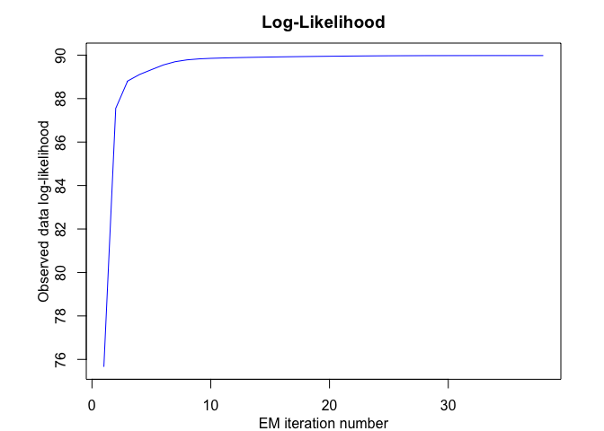

<!-- README.md is generated from README.Rmd. Please edit that file -->

# **MEteorits:** Mixtures-of-ExperTs modEling for cOmplex and non-noRmal dIsTributions

<!-- badges: start -->

[](https://travis-ci.org/fchamroukhi/MEteorits)
<!-- badges: end -->

MEteoritS is an open source toolbox (available in R and Matlab) containg
several original and flexible mixtures-of-experts models to model,
cluster and classify heteregenous data in many complex situations where
the data are distributed according to non-normal and possibly skewed
distributions, and when they might be corrupted by atypical
observations. The toolbox also contains sparse mixture-of-experts models
for high-dimensional data.

Our (dis-)covered meteorits are for instance the following ones:

  - NMoE;
  - tMoE;
  - SNMoE;
  - StMoE.

The models and algorithms are developped and written in Matlab by Faicel
Chamroukhi, and translated and designed into R packages by Florian
Lecocq, Marius Bartcus and Faicel Chamroukhi.

# Installation

You can install the development version of MEteorits from
[GitHub](https://github.com/fchamroukhi/MEteorits) with:

``` r
# install.packages("devtools")
devtools::install_github("fchamroukhi/MEteorits")
```

To build *vignettes* for examples of usage, type the command below
instead:

``` r
# install.packages("devtools")
devtools::install_github("fchamroukhi/MEteorits", 
                         build_opts = c("--no-resave-data", "--no-manual"), 
                         build_vignettes = TRUE)
```

Use the following command to display vignettes:

``` r
browseVignettes("meteorits")
```

# Usage

``` r
library(meteorits)
```

<details>

<summary>NMoE</summary>

``` r
# Application to a simuated data set

n <- 500 # Size of the sample
alphak <- matrix(c(0, 8), ncol = 1) # Parameters of the gating network
betak <- matrix(c(0, -2.5, 0, 2.5), ncol = 2) # Regression coefficients of the experts
sigmak <- c(1, 1) # Standard deviations of the experts
x <- seq.int(from = -1, to = 1, length.out = n) # Inputs (predictors)

# Generate sample of size n
sample <- sampleUnivNMoE(alphak = alphak, betak = betak, sigmak = sigmak, x = x)
y <- sample$y

K <- 2 # Number of regressors/experts
p <- 1 # Order of the polynomial regression (regressors/experts)
q <- 1 # Order of the logistic regression (gating network)

n_tries <- 1
max_iter <- 1500
threshold <- 1e-5
verbose <- TRUE
verbose_IRLS <- FALSE

nmoe <- emNMoE(X = x, Y = y, K, p, q, n_tries, max_iter, 
               threshold, verbose, verbose_IRLS)
#> EM NMoE: Iteration: 1 | log-likelihood: -840.206706561286
#> EM NMoE: Iteration: 2 | log-likelihood: -839.605264559652
#> EM NMoE: Iteration: 3 | log-likelihood: -838.332078307859
#> EM NMoE: Iteration: 4 | log-likelihood: -835.554006239958
#> EM NMoE: Iteration: 5 | log-likelihood: -829.847863300936
#> EM NMoE: Iteration: 6 | log-likelihood: -819.373746146001
#> EM NMoE: Iteration: 7 | log-likelihood: -802.839958947314
#> EM NMoE: Iteration: 8 | log-likelihood: -781.213252556106
#> EM NMoE: Iteration: 9 | log-likelihood: -759.111317735818
#> EM NMoE: Iteration: 10 | log-likelihood: -742.376282925387
#> EM NMoE: Iteration: 11 | log-likelihood: -732.711567243693
#> EM NMoE: Iteration: 12 | log-likelihood: -728.199106601945
#> EM NMoE: Iteration: 13 | log-likelihood: -726.47784368027
#> EM NMoE: Iteration: 14 | log-likelihood: -725.900067898663
#> EM NMoE: Iteration: 15 | log-likelihood: -725.712745482788
#> EM NMoE: Iteration: 16 | log-likelihood: -725.651759213024
#> EM NMoE: Iteration: 17 | log-likelihood: -725.631693097288
#> EM NMoE: Iteration: 18 | log-likelihood: -725.625027915459

nmoe$plot()
```


``` r
# Application to a real data set

data("tempanomalies")
x <- tempanomalies$Year
y <- tempanomalies$AnnualAnomaly

K <- 2 # Number of regressors/experts
p <- 1 # Order of the polynomial regression (regressors/experts)
q <- 1 # Order of the logistic regression (gating network)

n_tries <- 1
max_iter <- 1500
threshold <- 1e-5
verbose <- TRUE
verbose_IRLS <- FALSE

nmoe <- emNMoE(X = x, Y = y, K, p, q, n_tries, max_iter, 
               threshold, verbose, verbose_IRLS)
#> EM NMoE: Iteration: 1 | log-likelihood: 48.7932097634672
#> EM NMoE: Iteration: 2 | log-likelihood: 49.27013655521
#> EM NMoE: Iteration: 3 | log-likelihood: 50.5010307420942
#> EM NMoE: Iteration: 4 | log-likelihood: 53.6451773885935
#> EM NMoE: Iteration: 5 | log-likelihood: 60.0347924831374
#> EM NMoE: Iteration: 6 | log-likelihood: 68.2551599983999
#> EM NMoE: Iteration: 7 | log-likelihood: 74.132477345325
#> EM NMoE: Iteration: 8 | log-likelihood: 77.3321062774091
#> EM NMoE: Iteration: 9 | log-likelihood: 79.7274389567251
#> EM NMoE: Iteration: 10 | log-likelihood: 82.4521816090031
#> EM NMoE: Iteration: 11 | log-likelihood: 86.130587298496
#> EM NMoE: Iteration: 12 | log-likelihood: 90.7713748622612
#> EM NMoE: Iteration: 13 | log-likelihood: 94.3816808133376
#> EM NMoE: Iteration: 14 | log-likelihood: 95.8011216753015
#> EM NMoE: Iteration: 15 | log-likelihood: 96.2881642335008
#> EM NMoE: Iteration: 16 | log-likelihood: 96.5005762349507
#> EM NMoE: Iteration: 17 | log-likelihood: 96.6330163160897
#> EM NMoE: Iteration: 18 | log-likelihood: 96.7444686631634
#> EM NMoE: Iteration: 19 | log-likelihood: 96.8543028287521
#> EM NMoE: Iteration: 20 | log-likelihood: 96.9689386164709
#> EM NMoE: Iteration: 21 | log-likelihood: 97.0896792802666
#> EM NMoE: Iteration: 22 | log-likelihood: 97.2152839319899
#> EM NMoE: Iteration: 23 | log-likelihood: 97.3431316546868
#> EM NMoE: Iteration: 24 | log-likelihood: 97.4701273498317
#> EM NMoE: Iteration: 25 | log-likelihood: 97.5935862116896
#> EM NMoE: Iteration: 26 | log-likelihood: 97.7120283439309
#> EM NMoE: Iteration: 27 | log-likelihood: 97.8256762450511
#> EM NMoE: Iteration: 28 | log-likelihood: 97.9364703361938
#> EM NMoE: Iteration: 29 | log-likelihood: 98.047572974081
#> EM NMoE: Iteration: 30 | log-likelihood: 98.1625086517838
#> EM NMoE: Iteration: 31 | log-likelihood: 98.2842827797312
#> EM NMoE: Iteration: 32 | log-likelihood: 98.4148123422269
#> EM NMoE: Iteration: 33 | log-likelihood: 98.5548753115435
#> EM NMoE: Iteration: 34 | log-likelihood: 98.7045651049908
#> EM NMoE: Iteration: 35 | log-likelihood: 98.8639369592793
#> EM NMoE: Iteration: 36 | log-likelihood: 99.0336345074814
#> EM NMoE: Iteration: 37 | log-likelihood: 99.2152849798423
#> EM NMoE: Iteration: 38 | log-likelihood: 99.4117619587704
#> EM NMoE: Iteration: 39 | log-likelihood: 99.6275306188543
#> EM NMoE: Iteration: 40 | log-likelihood: 99.8693223042761
#> EM NMoE: Iteration: 41 | log-likelihood: 100.147319018987
#> EM NMoE: Iteration: 42 | log-likelihood: 100.476840588187
#> EM NMoE: Iteration: 43 | log-likelihood: 100.879414816891
#> EM NMoE: Iteration: 44 | log-likelihood: 101.375938733523
#> EM NMoE: Iteration: 45 | log-likelihood: 101.944289779386
#> EM NMoE: Iteration: 46 | log-likelihood: 102.436124277112
#> EM NMoE: Iteration: 47 | log-likelihood: 102.652822423117
#> EM NMoE: Iteration: 48 | log-likelihood: 102.71871685087
#> EM NMoE: Iteration: 49 | log-likelihood: 102.71875421595

nmoe$plot()
```


</details>

<details>

<summary>TMoE</summary>

``` r
# Application to a simuated data set

n <- 500 # Size of the sample
alphak <- matrix(c(0, 8), ncol = 1) # Parameters of the gating network
betak <- matrix(c(0, -2.5, 0, 2.5), ncol = 2) # Regression coefficients of the experts
sigmak <- c(0.5, 0.5) # Standard deviations of the experts
nuk <- c(5, 7) # Degrees of freedom of the experts network t densities
x <- seq.int(from = -1, to = 1, length.out = n) # Inputs (predictors)

# Generate sample of size n
sample <- sampleUnivTMoE(alphak = alphak, betak = betak, sigmak = sigmak, 
                         nuk = nuk, x = x)
y <- sample$y

K <- 2 # Number of regressors/experts
p <- 1 # Order of the polynomial regression (regressors/experts)
q <- 1 # Order of the logistic regression (gating network)

n_tries <- 1
max_iter <- 1500
threshold <- 1e-5
verbose <- TRUE
verbose_IRLS <- FALSE

tmoe <- emTMoE(X = x, Y = y, K, p, q, n_tries, max_iter, 
               threshold, verbose, verbose_IRLS)
#> EM - tMoE: Iteration: 1 | log-likelihood: -480.623183349844
#> EM - tMoE: Iteration: 2 | log-likelihood: -476.591992489533
#> EM - tMoE: Iteration: 3 | log-likelihood: -474.929359654195
#> EM - tMoE: Iteration: 4 | log-likelihood: -473.636891784731
#> EM - tMoE: Iteration: 5 | log-likelihood: -472.670149797314
#> EM - tMoE: Iteration: 6 | log-likelihood: -471.973124085409
#> EM - tMoE: Iteration: 7 | log-likelihood: -471.481689021052
#> EM - tMoE: Iteration: 8 | log-likelihood: -471.139613903381
#> EM - tMoE: Iteration: 9 | log-likelihood: -470.902901268161
#> EM - tMoE: Iteration: 10 | log-likelihood: -470.739175655902
#> EM - tMoE: Iteration: 11 | log-likelihood: -470.624954663325
#> EM - tMoE: Iteration: 12 | log-likelihood: -470.543801253808
#> EM - tMoE: Iteration: 13 | log-likelihood: -470.484259109889
#> EM - tMoE: Iteration: 14 | log-likelihood: -470.438475729873
#> EM - tMoE: Iteration: 15 | log-likelihood: -470.4013180047
#> EM - tMoE: Iteration: 16 | log-likelihood: -470.36984207683
#> EM - tMoE: Iteration: 17 | log-likelihood: -470.342825705786
#> EM - tMoE: Iteration: 18 | log-likelihood: -470.320046646142
#> EM - tMoE: Iteration: 19 | log-likelihood: -470.301417269505
#> EM - tMoE: Iteration: 20 | log-likelihood: -470.286503611256
#> EM - tMoE: Iteration: 21 | log-likelihood: -470.274586862081
#> EM - tMoE: Iteration: 22 | log-likelihood: -470.264911417524
#> EM - tMoE: Iteration: 23 | log-likelihood: -470.256840012204
#> EM - tMoE: Iteration: 24 | log-likelihood: -470.249891124312
#> EM - tMoE: Iteration: 25 | log-likelihood: -470.243718768406
#> EM - tMoE: Iteration: 26 | log-likelihood: -470.238077866909
#> EM - tMoE: Iteration: 27 | log-likelihood: -470.23279255565
#> EM - tMoE: Iteration: 28 | log-likelihood: -470.227731456815
#> EM - tMoE: Iteration: 29 | log-likelihood: -470.222789227028
#> EM - tMoE: Iteration: 30 | log-likelihood: -470.217872584184
#> EM - tMoE: Iteration: 31 | log-likelihood: -470.212889088936
#> EM - tMoE: Iteration: 32 | log-likelihood: -470.207737320796
#> EM - tMoE: Iteration: 33 | log-likelihood: -470.202297552013
#> EM - tMoE: Iteration: 34 | log-likelihood: -470.196422736117
#> EM - tMoE: Iteration: 35 | log-likelihood: -470.189931067476
#> EM - tMoE: Iteration: 36 | log-likelihood: -470.182604469078
#> EM - tMoE: Iteration: 37 | log-likelihood: -470.174203457381
#> EM - tMoE: Iteration: 38 | log-likelihood: -470.164517951302
#> EM - tMoE: Iteration: 39 | log-likelihood: -470.153477585878
#> EM - tMoE: Iteration: 40 | log-likelihood: -470.141315333438
#> EM - tMoE: Iteration: 41 | log-likelihood: -470.128682797482
#> EM - tMoE: Iteration: 42 | log-likelihood: -470.116535489331
#> EM - tMoE: Iteration: 43 | log-likelihood: -470.105766967269
#> EM - tMoE: Iteration: 44 | log-likelihood: -470.096879660412
#> EM - tMoE: Iteration: 45 | log-likelihood: -470.089938741089
#> EM - tMoE: Iteration: 46 | log-likelihood: -470.084730658771
#> EM - tMoE: Iteration: 47 | log-likelihood: -470.080889984921

tmoe$plot()
```


``` r
# Application to a real data set

library(MASS)
data("mcycle")
x <- mcycle$times
y <- mcycle$accel

K <- 4 # Number of regressors/experts
p <- 2 # Order of the polynomial regression (regressors/experts)
q <- 1 # Order of the logistic regression (gating network)

n_tries <- 1
max_iter <- 1500
threshold <- 1e-5
verbose <- TRUE
verbose_IRLS <- FALSE

tmoe <- emTMoE(X = x, Y = y, K, p, q, n_tries, max_iter, 
               threshold, verbose, verbose_IRLS)
#> EM - tMoE: Iteration: 1 | log-likelihood: -584.332577130056
#> EM - tMoE: Iteration: 2 | log-likelihood: -582.917079182108
#> EM - tMoE: Iteration: 3 | log-likelihood: -581.994433253527
#> EM - tMoE: Iteration: 4 | log-likelihood: -579.383366519505
#> EM - tMoE: Iteration: 5 | log-likelihood: -571.518149689426
#> EM - tMoE: Iteration: 6 | log-likelihood: -563.726253961219
#> EM - tMoE: Iteration: 7 | log-likelihood: -560.223609162314
#> EM - tMoE: Iteration: 8 | log-likelihood: -559.332087616094
#> EM - tMoE: Iteration: 9 | log-likelihood: -558.687360957838
#> EM - tMoE: Iteration: 10 | log-likelihood: -557.945077354184
#> EM - tMoE: Iteration: 11 | log-likelihood: -557.099301517874
#> EM - tMoE: Iteration: 12 | log-likelihood: -556.148542269071
#> EM - tMoE: Iteration: 13 | log-likelihood: -555.12472288892
#> EM - tMoE: Iteration: 14 | log-likelihood: -554.150838354373
#> EM - tMoE: Iteration: 15 | log-likelihood: -553.357076738834
#> EM - tMoE: Iteration: 16 | log-likelihood: -552.745845826027
#> EM - tMoE: Iteration: 17 | log-likelihood: -552.287012879239
#> EM - tMoE: Iteration: 18 | log-likelihood: -551.959531941419
#> EM - tMoE: Iteration: 19 | log-likelihood: -551.737013364005
#> EM - tMoE: Iteration: 20 | log-likelihood: -551.590368707054
#> EM - tMoE: Iteration: 21 | log-likelihood: -551.495288054204
#> EM - tMoE: Iteration: 22 | log-likelihood: -551.433920479478
#> EM - tMoE: Iteration: 23 | log-likelihood: -551.394247116414
#> EM - tMoE: Iteration: 24 | log-likelihood: -551.368455555903
#> EM - tMoE: Iteration: 25 | log-likelihood: -551.351552466961
#> EM - tMoE: Iteration: 26 | log-likelihood: -551.340363605809
#> EM - tMoE: Iteration: 27 | log-likelihood: -551.332870013429
#> EM - tMoE: Iteration: 28 | log-likelihood: -551.327782926419

tmoe$plot()
```


</details>

<details>

<summary>SNMoE</summary>

``` r
# Application to a simulated data set

n <- 500 # Size of the sample
alphak <- matrix(c(0, 8), ncol = 1) # Parameters of the gating network
betak <- matrix(c(0, -2.5, 0, 2.5), ncol = 2) # Regression coefficients of the experts
lambdak <- c(3, 5) # Skewness parameters of the experts
sigmak <- c(1, 1) # Standard deviations of the experts
x <- seq.int(from = -1, to = 1, length.out = n) # Inputs (predictors)

# Generate sample of size n
sample <- sampleUnivSNMoE(alphak = alphak, betak = betak, sigmak = sigmak, 
                          lambdak = lambdak, x = x)
y <- sample$y

K <- 2 # Number of regressors/experts
p <- 1 # Order of the polynomial regression (regressors/experts)
q <- 1 # Order of the logistic regression (gating network)

n_tries <- 1
max_iter <- 1500
threshold <- 1e-6
verbose <- TRUE
verbose_IRLS <- FALSE

snmoe <- emSNMoE(X = x, Y = y, K, p, q, n_tries, max_iter, 
                 threshold, verbose, verbose_IRLS)
#> EM - SNMoE: Iteration: 1 | log-likelihood: -566.477266823192
#> EM - SNMoE: Iteration: 2 | log-likelihood: -490.206168892954
#> EM - SNMoE: Iteration: 3 | log-likelihood: -487.037716580388
#> EM - SNMoE: Iteration: 4 | log-likelihood: -486.409512372552
#> EM - SNMoE: Iteration: 5 | log-likelihood: -486.247338655216
#> EM - SNMoE: Iteration: 6 | log-likelihood: -486.179944667622
#> EM - SNMoE: Iteration: 7 | log-likelihood: -486.130152266493
#> EM - SNMoE: Iteration: 8 | log-likelihood: -486.083489835369
#> EM - SNMoE: Iteration: 9 | log-likelihood: -486.038330926078
#> EM - SNMoE: Iteration: 10 | log-likelihood: -485.995063952165
#> EM - SNMoE: Iteration: 11 | log-likelihood: -485.954078423648
#> EM - SNMoE: Iteration: 12 | log-likelihood: -485.915490579226
#> EM - SNMoE: Iteration: 13 | log-likelihood: -485.879348754883
#> EM - SNMoE: Iteration: 14 | log-likelihood: -485.84554222973
#> EM - SNMoE: Iteration: 15 | log-likelihood: -485.813894089865
#> EM - SNMoE: Iteration: 16 | log-likelihood: -485.784260439662
#> EM - SNMoE: Iteration: 17 | log-likelihood: -485.756452689173
#> EM - SNMoE: Iteration: 18 | log-likelihood: -485.730331229174
#> EM - SNMoE: Iteration: 19 | log-likelihood: -485.705771137636
#> EM - SNMoE: Iteration: 20 | log-likelihood: -485.682637260149
#> EM - SNMoE: Iteration: 21 | log-likelihood: -485.660840786438
#> EM - SNMoE: Iteration: 22 | log-likelihood: -485.640254477541
#> EM - SNMoE: Iteration: 23 | log-likelihood: -485.620773573168
#> EM - SNMoE: Iteration: 24 | log-likelihood: -485.602368776687
#> EM - SNMoE: Iteration: 25 | log-likelihood: -485.58493203647
#> EM - SNMoE: Iteration: 26 | log-likelihood: -485.568393916596
#> EM - SNMoE: Iteration: 27 | log-likelihood: -485.55267328803
#> EM - SNMoE: Iteration: 28 | log-likelihood: -485.537698346553
#> EM - SNMoE: Iteration: 29 | log-likelihood: -485.523437991927
#> EM - SNMoE: Iteration: 30 | log-likelihood: -485.509855880829
#> EM - SNMoE: Iteration: 31 | log-likelihood: -485.496895085566
#> EM - SNMoE: Iteration: 32 | log-likelihood: -485.484494164118
#> EM - SNMoE: Iteration: 33 | log-likelihood: -485.472609391216
#> EM - SNMoE: Iteration: 34 | log-likelihood: -485.461213314443
#> EM - SNMoE: Iteration: 35 | log-likelihood: -485.450270537457
#> EM - SNMoE: Iteration: 36 | log-likelihood: -485.439761259397
#> EM - SNMoE: Iteration: 37 | log-likelihood: -485.429641613278
#> EM - SNMoE: Iteration: 38 | log-likelihood: -485.419877930423
#> EM - SNMoE: Iteration: 39 | log-likelihood: -485.410469092567
#> EM - SNMoE: Iteration: 40 | log-likelihood: -485.40139549086
#> EM - SNMoE: Iteration: 41 | log-likelihood: -485.392622020951
#> EM - SNMoE: Iteration: 42 | log-likelihood: -485.384127749061
#> EM - SNMoE: Iteration: 43 | log-likelihood: -485.375884048576
#> EM - SNMoE: Iteration: 44 | log-likelihood: -485.367891018035
#> EM - SNMoE: Iteration: 45 | log-likelihood: -485.360129664168
#> EM - SNMoE: Iteration: 46 | log-likelihood: -485.352583406302
#> EM - SNMoE: Iteration: 47 | log-likelihood: -485.345238359118
#> EM - SNMoE: Iteration: 48 | log-likelihood: -485.338076749516
#> EM - SNMoE: Iteration: 49 | log-likelihood: -485.331091879711
#> EM - SNMoE: Iteration: 50 | log-likelihood: -485.32430708289
#> EM - SNMoE: Iteration: 51 | log-likelihood: -485.317688467552
#> EM - SNMoE: Iteration: 52 | log-likelihood: -485.311241435346
#> EM - SNMoE: Iteration: 53 | log-likelihood: -485.30494971961
#> EM - SNMoE: Iteration: 54 | log-likelihood: -485.298797416356
#> EM - SNMoE: Iteration: 55 | log-likelihood: -485.292789794969
#> EM - SNMoE: Iteration: 56 | log-likelihood: -485.286928297943
#> EM - SNMoE: Iteration: 57 | log-likelihood: -485.281218832601
#> EM - SNMoE: Iteration: 58 | log-likelihood: -485.275646711565
#> EM - SNMoE: Iteration: 59 | log-likelihood: -485.270216168632
#> EM - SNMoE: Iteration: 60 | log-likelihood: -485.264925046056
#> EM - SNMoE: Iteration: 61 | log-likelihood: -485.259769767476
#> EM - SNMoE: Iteration: 62 | log-likelihood: -485.2547576884
#> EM - SNMoE: Iteration: 63 | log-likelihood: -485.249882019463
#> EM - SNMoE: Iteration: 64 | log-likelihood: -485.245130811724
#> EM - SNMoE: Iteration: 65 | log-likelihood: -485.240525997178
#> EM - SNMoE: Iteration: 66 | log-likelihood: -485.236052258079
#> EM - SNMoE: Iteration: 67 | log-likelihood: -485.231707323491
#> EM - SNMoE: Iteration: 68 | log-likelihood: -485.22749624356
#> EM - SNMoE: Iteration: 69 | log-likelihood: -485.223418374043
#> EM - SNMoE: Iteration: 70 | log-likelihood: -485.219459954209
#> EM - SNMoE: Iteration: 71 | log-likelihood: -485.215622640284
#> EM - SNMoE: Iteration: 72 | log-likelihood: -485.211907107677
#> EM - SNMoE: Iteration: 73 | log-likelihood: -485.208318822894
#> EM - SNMoE: Iteration: 74 | log-likelihood: -485.204838194089
#> EM - SNMoE: Iteration: 75 | log-likelihood: -485.201464833834
#> EM - SNMoE: Iteration: 76 | log-likelihood: -485.198204790153
#> EM - SNMoE: Iteration: 77 | log-likelihood: -485.195054117136
#> EM - SNMoE: Iteration: 78 | log-likelihood: -485.192006011357
#> EM - SNMoE: Iteration: 79 | log-likelihood: -485.189052258406
#> EM - SNMoE: Iteration: 80 | log-likelihood: -485.186180960353
#> EM - SNMoE: Iteration: 81 | log-likelihood: -485.183405005288
#> EM - SNMoE: Iteration: 82 | log-likelihood: -485.180711133583
#> EM - SNMoE: Iteration: 83 | log-likelihood: -485.178094748273
#> EM - SNMoE: Iteration: 84 | log-likelihood: -485.17555113113
#> EM - SNMoE: Iteration: 85 | log-likelihood: -485.173075044552
#> EM - SNMoE: Iteration: 86 | log-likelihood: -485.170667023627
#> EM - SNMoE: Iteration: 87 | log-likelihood: -485.16832198786
#> EM - SNMoE: Iteration: 88 | log-likelihood: -485.166027075648
#> EM - SNMoE: Iteration: 89 | log-likelihood: -485.16378300718
#> EM - SNMoE: Iteration: 90 | log-likelihood: -485.161583852293
#> EM - SNMoE: Iteration: 91 | log-likelihood: -485.159425361916
#> EM - SNMoE: Iteration: 92 | log-likelihood: -485.157299910685
#> EM - SNMoE: Iteration: 93 | log-likelihood: -485.155204173557
#> EM - SNMoE: Iteration: 94 | log-likelihood: -485.153141552205
#> EM - SNMoE: Iteration: 95 | log-likelihood: -485.151103782782
#> EM - SNMoE: Iteration: 96 | log-likelihood: -485.149086020725
#> EM - SNMoE: Iteration: 97 | log-likelihood: -485.147081027288
#> EM - SNMoE: Iteration: 98 | log-likelihood: -485.145086230744
#> EM - SNMoE: Iteration: 99 | log-likelihood: -485.143101142702
#> EM - SNMoE: Iteration: 100 | log-likelihood: -485.14112086275
#> EM - SNMoE: Iteration: 101 | log-likelihood: -485.139144028331
#> EM - SNMoE: Iteration: 102 | log-likelihood: -485.137169282688
#> EM - SNMoE: Iteration: 103 | log-likelihood: -485.13519228132
#> EM - SNMoE: Iteration: 104 | log-likelihood: -485.133208990774
#> EM - SNMoE: Iteration: 105 | log-likelihood: -485.131215782361
#> EM - SNMoE: Iteration: 106 | log-likelihood: -485.129208975586
#> EM - SNMoE: Iteration: 107 | log-likelihood: -485.127192731981
#> EM - SNMoE: Iteration: 108 | log-likelihood: -485.125167438901
#> EM - SNMoE: Iteration: 109 | log-likelihood: -485.123123902574
#> EM - SNMoE: Iteration: 110 | log-likelihood: -485.121063438295
#> EM - SNMoE: Iteration: 111 | log-likelihood: -485.118986795119
#> EM - SNMoE: Iteration: 112 | log-likelihood: -485.1169003701
#> EM - SNMoE: Iteration: 113 | log-likelihood: -485.114800244575
#> EM - SNMoE: Iteration: 114 | log-likelihood: -485.112694204686
#> EM - SNMoE: Iteration: 115 | log-likelihood: -485.110579122819
#> EM - SNMoE: Iteration: 116 | log-likelihood: -485.108454475797
#> EM - SNMoE: Iteration: 117 | log-likelihood: -485.106319890872
#> EM - SNMoE: Iteration: 118 | log-likelihood: -485.104188911711
#> EM - SNMoE: Iteration: 119 | log-likelihood: -485.102058652572
#> EM - SNMoE: Iteration: 120 | log-likelihood: -485.099931731901
#> EM - SNMoE: Iteration: 121 | log-likelihood: -485.097811504349
#> EM - SNMoE: Iteration: 122 | log-likelihood: -485.095702824759
#> EM - SNMoE: Iteration: 123 | log-likelihood: -485.09360859572
#> EM - SNMoE: Iteration: 124 | log-likelihood: -485.091535501095
#> EM - SNMoE: Iteration: 125 | log-likelihood: -485.089486230541
#> EM - SNMoE: Iteration: 126 | log-likelihood: -485.087457705787
#> EM - SNMoE: Iteration: 127 | log-likelihood: -485.085457877542
#> EM - SNMoE: Iteration: 128 | log-likelihood: -485.083490907095
#> EM - SNMoE: Iteration: 129 | log-likelihood: -485.081551283326
#> EM - SNMoE: Iteration: 130 | log-likelihood: -485.079655502403
#> EM - SNMoE: Iteration: 131 | log-likelihood: -485.077809224877
#> EM - SNMoE: Iteration: 132 | log-likelihood: -485.076002508948
#> EM - SNMoE: Iteration: 133 | log-likelihood: -485.074238315097
#> EM - SNMoE: Iteration: 134 | log-likelihood: -485.072519410675
#> EM - SNMoE: Iteration: 135 | log-likelihood: -485.070851473441
#> EM - SNMoE: Iteration: 136 | log-likelihood: -485.069232776652
#> EM - SNMoE: Iteration: 137 | log-likelihood: -485.067665838119
#> EM - SNMoE: Iteration: 138 | log-likelihood: -485.066153155251
#> EM - SNMoE: Iteration: 139 | log-likelihood: -485.064702064626
#> EM - SNMoE: Iteration: 140 | log-likelihood: -485.063298985571
#> EM - SNMoE: Iteration: 141 | log-likelihood: -485.061949307626
#> EM - SNMoE: Iteration: 142 | log-likelihood: -485.060654046024
#> EM - SNMoE: Iteration: 143 | log-likelihood: -485.059412488353
#> EM - SNMoE: Iteration: 144 | log-likelihood: -485.05822266849
#> EM - SNMoE: Iteration: 145 | log-likelihood: -485.057082954355
#> EM - SNMoE: Iteration: 146 | log-likelihood: -485.055986794697
#> EM - SNMoE: Iteration: 147 | log-likelihood: -485.054932751993
#> EM - SNMoE: Iteration: 148 | log-likelihood: -485.053933913244
#> EM - SNMoE: Iteration: 149 | log-likelihood: -485.052976399371
#> EM - SNMoE: Iteration: 150 | log-likelihood: -485.052055080401
#> EM - SNMoE: Iteration: 151 | log-likelihood: -485.051177757591
#> EM - SNMoE: Iteration: 152 | log-likelihood: -485.050342057516
#> EM - SNMoE: Iteration: 153 | log-likelihood: -485.049545642553
#> EM - SNMoE: Iteration: 154 | log-likelihood: -485.048786373128
#> EM - SNMoE: Iteration: 155 | log-likelihood: -485.048064415509
#> EM - SNMoE: Iteration: 156 | log-likelihood: -485.047377570383
#> EM - SNMoE: Iteration: 157 | log-likelihood: -485.046718024353
#> EM - SNMoE: Iteration: 158 | log-likelihood: -485.04608641529
#> EM - SNMoE: Iteration: 159 | log-likelihood: -485.045482865792
#> EM - SNMoE: Iteration: 160 | log-likelihood: -485.0449077977
#> EM - SNMoE: Iteration: 161 | log-likelihood: -485.044360153226
#> EM - SNMoE: Iteration: 162 | log-likelihood: -485.04383846476
#> EM - SNMoE: Iteration: 163 | log-likelihood: -485.043339395277
#> EM - SNMoE: Iteration: 164 | log-likelihood: -485.042864747525

snmoe$plot()
```


``` r
# Application to a real data set

data("tempanomalies")
x <- tempanomalies$Year
y <- tempanomalies$AnnualAnomaly

K <- 2 # Number of regressors/experts
p <- 1 # Order of the polynomial regression (regressors/experts)
q <- 1 # Order of the logistic regression (gating network)

n_tries <- 1
max_iter <- 1500
threshold <- 1e-6
verbose <- TRUE
verbose_IRLS <- FALSE

snmoe <- emSNMoE(X = x, Y = y, K, p, q, n_tries, max_iter, 
                 threshold, verbose, verbose_IRLS)
#> EM - SNMoE: Iteration: 1 | log-likelihood: 78.1184147434995
#> EM - SNMoE: Iteration: 2 | log-likelihood: 87.2912668448904
#> EM - SNMoE: Iteration: 3 | log-likelihood: 88.7313645680791
#> EM - SNMoE: Iteration: 4 | log-likelihood: 89.0494898752129
#> EM - SNMoE: Iteration: 5 | log-likelihood: 89.2453602118319
#> EM - SNMoE: Iteration: 6 | log-likelihood: 89.457643021221
#> EM - SNMoE: Iteration: 7 | log-likelihood: 89.6247151745416
#> EM - SNMoE: Iteration: 8 | log-likelihood: 89.7240011571694
#> EM - SNMoE: Iteration: 9 | log-likelihood: 89.777834096238
#> EM - SNMoE: Iteration: 10 | log-likelihood: 89.8074095149068
#> EM - SNMoE: Iteration: 11 | log-likelihood: 89.8259999864469
#> EM - SNMoE: Iteration: 12 | log-likelihood: 89.8402025507145
#> EM - SNMoE: Iteration: 13 | log-likelihood: 89.8521528566
#> EM - SNMoE: Iteration: 14 | log-likelihood: 89.8625301334289
#> EM - SNMoE: Iteration: 15 | log-likelihood: 89.8718883933236
#> EM - SNMoE: Iteration: 16 | log-likelihood: 89.8805301038832
#> EM - SNMoE: Iteration: 17 | log-likelihood: 89.8885618612798
#> EM - SNMoE: Iteration: 18 | log-likelihood: 89.8960175876977
#> EM - SNMoE: Iteration: 19 | log-likelihood: 89.9029023611775
#> EM - SNMoE: Iteration: 20 | log-likelihood: 89.9092136177781
#> EM - SNMoE: Iteration: 21 | log-likelihood: 89.9149548730998
#> EM - SNMoE: Iteration: 22 | log-likelihood: 89.9201550381606
#> EM - SNMoE: Iteration: 23 | log-likelihood: 89.9249791564952
#> EM - SNMoE: Iteration: 24 | log-likelihood: 89.929231870658
#> EM - SNMoE: Iteration: 25 | log-likelihood: 89.9329409567959
#> EM - SNMoE: Iteration: 26 | log-likelihood: 89.9361306532294
#> EM - SNMoE: Iteration: 27 | log-likelihood: 89.9390140974238
#> EM - SNMoE: Iteration: 28 | log-likelihood: 89.9405732766235
#> EM - SNMoE: Iteration: 29 | log-likelihood: 89.9423838045449
#> EM - SNMoE: Iteration: 30 | log-likelihood: 89.9437219150633
#> EM - SNMoE: Iteration: 31 | log-likelihood: 89.9448741972788
#> EM - SNMoE: Iteration: 32 | log-likelihood: 89.9458597449716
#> EM - SNMoE: Iteration: 33 | log-likelihood: 89.9466315740427
#> EM - SNMoE: Iteration: 34 | log-likelihood: 89.9476790891818
#> EM - SNMoE: Iteration: 35 | log-likelihood: 89.9483237914788
#> EM - SNMoE: Iteration: 36 | log-likelihood: 89.9487977144762
#> EM - SNMoE: Iteration: 37 | log-likelihood: 89.9493653944025
#> EM - SNMoE: Iteration: 38 | log-likelihood: 89.9498203810748
#> EM - SNMoE: Iteration: 39 | log-likelihood: 89.9501909116605
#> EM - SNMoE: Iteration: 40 | log-likelihood: 89.950598850213
#> EM - SNMoE: Iteration: 41 | log-likelihood: 89.95096425314
#> EM - SNMoE: Iteration: 42 | log-likelihood: 89.9512855339484
#> EM - SNMoE: Iteration: 43 | log-likelihood: 89.9516574760518
#> EM - SNMoE: Iteration: 44 | log-likelihood: 89.9519479957665
#> EM - SNMoE: Iteration: 45 | log-likelihood: 89.9522323740671
#> EM - SNMoE: Iteration: 46 | log-likelihood: 89.9525476669509
#> EM - SNMoE: Iteration: 47 | log-likelihood: 89.9528196285196
#> EM - SNMoE: Iteration: 48 | log-likelihood: 89.9530867588152
#> EM - SNMoE: Iteration: 49 | log-likelihood: 89.9533495510687
#> EM - SNMoE: Iteration: 50 | log-likelihood: 89.9536267047138
#> EM - SNMoE: Iteration: 51 | log-likelihood: 89.9538811063027
#> EM - SNMoE: Iteration: 52 | log-likelihood: 89.9541311767378
#> EM - SNMoE: Iteration: 53 | log-likelihood: 89.9543863741175
#> EM - SNMoE: Iteration: 54 | log-likelihood: 89.9546281220586
#> EM - SNMoE: Iteration: 55 | log-likelihood: 89.9548698659386
#> EM - SNMoE: Iteration: 56 | log-likelihood: 89.9551026293158
#> EM - SNMoE: Iteration: 57 | log-likelihood: 89.9553345520019
#> EM - SNMoE: Iteration: 58 | log-likelihood: 89.955561631917
#> EM - SNMoE: Iteration: 59 | log-likelihood: 89.955783855403
#> EM - SNMoE: Iteration: 60 | log-likelihood: 89.9560031412374
#> EM - SNMoE: Iteration: 61 | log-likelihood: 89.9562181820921
#> EM - SNMoE: Iteration: 62 | log-likelihood: 89.9564286965746
#> EM - SNMoE: Iteration: 63 | log-likelihood: 89.9566354047448
#> EM - SNMoE: Iteration: 64 | log-likelihood: 89.9568405937229
#> EM - SNMoE: Iteration: 65 | log-likelihood: 89.9570430305698
#> EM - SNMoE: Iteration: 66 | log-likelihood: 89.9572403182586
#> EM - SNMoE: Iteration: 67 | log-likelihood: 89.9574338687002
#> EM - SNMoE: Iteration: 68 | log-likelihood: 89.9576255511606
#> EM - SNMoE: Iteration: 69 | log-likelihood: 89.9578142932357
#> EM - SNMoE: Iteration: 70 | log-likelihood: 89.9579996241553
#> EM - SNMoE: Iteration: 71 | log-likelihood: 89.9581820772562
#> EM - SNMoE: Iteration: 72 | log-likelihood: 89.9583622825922
#> EM - SNMoE: Iteration: 73 | log-likelihood: 89.9585394914765
#> EM - SNMoE: Iteration: 74 | log-likelihood: 89.9587152746036
#> EM - SNMoE: Iteration: 75 | log-likelihood: 89.9588879761137
#> EM - SNMoE: Iteration: 76 | log-likelihood: 89.9590575742808
#> EM - SNMoE: Iteration: 77 | log-likelihood: 89.9592245005504
#> EM - SNMoE: Iteration: 78 | log-likelihood: 89.9593899138453
#> EM - SNMoE: Iteration: 79 | log-likelihood: 89.9595544604755
#> EM - SNMoE: Iteration: 80 | log-likelihood: 89.9597163218528
#> EM - SNMoE: Iteration: 81 | log-likelihood: 89.9598746746489
#> EM - SNMoE: Iteration: 82 | log-likelihood: 89.9600311993907
#> EM - SNMoE: Iteration: 83 | log-likelihood: 89.9601846748678
#> EM - SNMoE: Iteration: 84 | log-likelihood: 89.9603360251141
#> EM - SNMoE: Iteration: 85 | log-likelihood: 89.9604850999656
#> EM - SNMoE: Iteration: 86 | log-likelihood: 89.9606319812194
#> EM - SNMoE: Iteration: 87 | log-likelihood: 89.9607775199573
#> EM - SNMoE: Iteration: 88 | log-likelihood: 89.9609217106563
#> EM - SNMoE: Iteration: 89 | log-likelihood: 89.9610628293633
#> EM - SNMoE: Iteration: 90 | log-likelihood: 89.9612018503252
#> EM - SNMoE: Iteration: 91 | log-likelihood: 89.9613386848662
#> EM - SNMoE: Iteration: 92 | log-likelihood: 89.9614735155716
#> EM - SNMoE: Iteration: 93 | log-likelihood: 89.9616069879998
#> EM - SNMoE: Iteration: 94 | log-likelihood: 89.961739131443
#> EM - SNMoE: Iteration: 95 | log-likelihood: 89.9618695613126
#> EM - SNMoE: Iteration: 96 | log-likelihood: 89.9619985299707
#> EM - SNMoE: Iteration: 97 | log-likelihood: 89.9621267047417
#> EM - SNMoE: Iteration: 98 | log-likelihood: 89.9622528588956
#> EM - SNMoE: Iteration: 99 | log-likelihood: 89.9623768586696
#> EM - SNMoE: Iteration: 100 | log-likelihood: 89.9625013317861
#> EM - SNMoE: Iteration: 101 | log-likelihood: 89.9626236140541
#> EM - SNMoE: Iteration: 102 | log-likelihood: 89.9627439949465
#> EM - SNMoE: Iteration: 103 | log-likelihood: 89.9628627650787
#> EM - SNMoE: Iteration: 104 | log-likelihood: 89.962979848901
#> EM - SNMoE: Iteration: 105 | log-likelihood: 89.9630954507905
#> EM - SNMoE: Iteration: 106 | log-likelihood: 89.9632101584278
#> EM - SNMoE: Iteration: 107 | log-likelihood: 89.9633230468844
#> EM - SNMoE: Iteration: 108 | log-likelihood: 89.9634342072067
#> EM - SNMoE: Iteration: 109 | log-likelihood: 89.9635446137015
#> EM - SNMoE: Iteration: 110 | log-likelihood: 89.9636535746721
#> EM - SNMoE: Iteration: 111 | log-likelihood: 89.9637615818989
#> EM - SNMoE: Iteration: 112 | log-likelihood: 89.9638688094792
#> EM - SNMoE: Iteration: 113 | log-likelihood: 89.9639737627337
#> EM - SNMoE: Iteration: 114 | log-likelihood: 89.9640774599033
#> EM - SNMoE: Iteration: 115 | log-likelihood: 89.9641812166857
#> EM - SNMoE: Iteration: 116 | log-likelihood: 89.9642840187218
#> EM - SNMoE: Iteration: 117 | log-likelihood: 89.9643858667885
#> EM - SNMoE: Iteration: 118 | log-likelihood: 89.9644867701394
#> EM - SNMoE: Iteration: 119 | log-likelihood: 89.9645867493022
#> EM - SNMoE: Iteration: 120 | log-likelihood: 89.9646858287465
#> EM - SNMoE: Iteration: 121 | log-likelihood: 89.9647841743092
#> EM - SNMoE: Iteration: 122 | log-likelihood: 89.9648817919064
#> EM - SNMoE: Iteration: 123 | log-likelihood: 89.9649783042901
#> EM - SNMoE: Iteration: 124 | log-likelihood: 89.9650739976076
#> EM - SNMoE: Iteration: 125 | log-likelihood: 89.9651690338309
#> EM - SNMoE: Iteration: 126 | log-likelihood: 89.9652630590355
#> EM - SNMoE: Iteration: 127 | log-likelihood: 89.965356100651
#> EM - SNMoE: Iteration: 128 | log-likelihood: 89.9654484108733
#> EM - SNMoE: Iteration: 129 | log-likelihood: 89.9655402480345
#> EM - SNMoE: Iteration: 130 | log-likelihood: 89.9656314171132
#> EM - SNMoE: Iteration: 131 | log-likelihood: 89.9657220842445
#> EM - SNMoE: Iteration: 132 | log-likelihood: 89.9658128585225
#> EM - SNMoE: Iteration: 133 | log-likelihood: 89.9659028313513
#> EM - SNMoE: Iteration: 134 | log-likelihood: 89.9659906778893

snmoe$plot()
```



</details>

<details>

<summary>StMoE</summary>

``` r
# Applicartion to a simulated data set

n <- 500 # Size of the sample
alphak <- matrix(c(0, 8), ncol = 1) # Parameters of the gating network
betak <- matrix(c(0, -2.5, 0, 2.5), ncol = 2) # Regression coefficients of the experts
sigmak <- c(0.5, 0.5) # Standard deviations of the experts
lambdak <- c(3, 5) # Skewness parameters of the experts
nuk <- c(5, 7) # Degrees of freedom of the experts network t densities
x <- seq.int(from = -1, to = 1, length.out = n) # Inputs (predictors)

# Generate sample of size n
sample <- sampleUnivSTMoE(alphak = alphak, betak = betak, sigmak = sigmak, 
                          lambdak = lambdak, nuk = nuk, x = x)
y <- sample$y

K <- 2 # Number of regressors/experts
p <- 1 # Order of the polynomial regression (regressors/experts)
q <- 1 # Order of the logistic regression (gating network)

n_tries <- 1
max_iter <- 1500
threshold <- 1e-5
verbose <- TRUE
verbose_IRLS <- FALSE

stmoe <- emStMoE(X = x, Y = y, K, p, q, n_tries, max_iter, 
                 threshold, verbose, verbose_IRLS)
#> EM - StMoE: Iteration: 1 | log-likelihood: -403.808969858144
#> EM - StMoE: Iteration: 2 | log-likelihood: -359.886049357619
#> EM - StMoE: Iteration: 3 | log-likelihood: -356.430302968984
#> EM - StMoE: Iteration: 4 | log-likelihood: -353.109459288541
#> EM - StMoE: Iteration: 5 | log-likelihood: -349.867765134392
#> EM - StMoE: Iteration: 6 | log-likelihood: -346.732918472169
#> EM - StMoE: Iteration: 7 | log-likelihood: -343.781145065673
#> EM - StMoE: Iteration: 8 | log-likelihood: -341.080579162691
#> EM - StMoE: Iteration: 9 | log-likelihood: -338.666697311597
#> EM - StMoE: Iteration: 10 | log-likelihood: -336.53959818537
#> EM - StMoE: Iteration: 11 | log-likelihood: -334.673261381572
#> EM - StMoE: Iteration: 12 | log-likelihood: -333.02872825883
#> EM - StMoE: Iteration: 13 | log-likelihood: -331.56690399666
#> EM - StMoE: Iteration: 14 | log-likelihood: -330.245104727265
#> EM - StMoE: Iteration: 15 | log-likelihood: -329.014851147804
#> EM - StMoE: Iteration: 16 | log-likelihood: -327.82597898741
#> EM - StMoE: Iteration: 17 | log-likelihood: -326.628056844179
#> EM - StMoE: Iteration: 18 | log-likelihood: -325.375102794065
#> EM - StMoE: Iteration: 19 | log-likelihood: -324.026912239658
#> EM - StMoE: Iteration: 20 | log-likelihood: -322.553284163153
#> EM - StMoE: Iteration: 21 | log-likelihood: -320.941381021503
#> EM - StMoE: Iteration: 22 | log-likelihood: -319.199765283429
#> EM - StMoE: Iteration: 23 | log-likelihood: -317.361457368234
#> EM - StMoE: Iteration: 24 | log-likelihood: -315.475396345884
#> EM - StMoE: Iteration: 25 | log-likelihood: -313.599274090196
#> EM - StMoE: Iteration: 26 | log-likelihood: -311.791716719624
#> EM - StMoE: Iteration: 27 | log-likelihood: -310.101640221491
#> EM - StMoE: Iteration: 28 | log-likelihood: -308.567662281673
#> EM - StMoE: Iteration: 29 | log-likelihood: -307.201435077493
#> EM - StMoE: Iteration: 30 | log-likelihood: -306.011323142258
#> EM - StMoE: Iteration: 31 | log-likelihood: -304.984954379297
#> EM - StMoE: Iteration: 32 | log-likelihood: -304.112868140365
#> EM - StMoE: Iteration: 33 | log-likelihood: -303.377420600121
#> EM - StMoE: Iteration: 34 | log-likelihood: -302.761490392158
#> EM - StMoE: Iteration: 35 | log-likelihood: -302.252963632553
#> EM - StMoE: Iteration: 36 | log-likelihood: -301.835571426346
#> EM - StMoE: Iteration: 37 | log-likelihood: -301.491888280543
#> EM - StMoE: Iteration: 38 | log-likelihood: -301.208569341448
#> EM - StMoE: Iteration: 39 | log-likelihood: -300.974993960137
#> EM - StMoE: Iteration: 40 | log-likelihood: -300.783920134958
#> EM - StMoE: Iteration: 41 | log-likelihood: -300.629256013439
#> EM - StMoE: Iteration: 42 | log-likelihood: -300.505164699625
#> EM - StMoE: Iteration: 43 | log-likelihood: -300.40640936482
#> EM - StMoE: Iteration: 44 | log-likelihood: -300.328316494617
#> EM - StMoE: Iteration: 45 | log-likelihood: -300.267241265111
#> EM - StMoE: Iteration: 46 | log-likelihood: -300.219567935209
#> EM - StMoE: Iteration: 47 | log-likelihood: -300.183251055891
#> EM - StMoE: Iteration: 48 | log-likelihood: -300.155807621672
#> EM - StMoE: Iteration: 49 | log-likelihood: -300.135355406522
#> EM - StMoE: Iteration: 50 | log-likelihood: -300.120437989982
#> EM - StMoE: Iteration: 51 | log-likelihood: -300.110049980448
#> EM - StMoE: Iteration: 52 | log-likelihood: -300.104159981905
#> EM - StMoE: Iteration: 53 | log-likelihood: -300.10183618804

stmoe$plot()
```


``` r
# Applicartion to a real data set

library(MASS)
data("mcycle")
x <- mcycle$times
y <- mcycle$accel

K <- 4 # Number of regressors/experts
p <- 2 # Order of the polynomial regression (regressors/experts)
q <- 1 # Order of the logistic regression (gating network)

n_tries <- 1
max_iter <- 1500
threshold <- 1e-5
verbose <- TRUE
verbose_IRLS <- FALSE

stmoe <- emStMoE(X = x, Y = y, K, p, q, n_tries, max_iter, 
                 threshold, verbose, verbose_IRLS)
#> EM - StMoE: Iteration: 1 | log-likelihood: -593.818521438443
#> EM - StMoE: Iteration: 2 | log-likelihood: -588.06673459467
#> EM - StMoE: Iteration: 3 | log-likelihood: -584.648626852722
#> EM - StMoE: Iteration: 4 | log-likelihood: -582.685834043969
#> EM - StMoE: Iteration: 5 | log-likelihood: -578.928213402751
#> EM - StMoE: Iteration: 6 | log-likelihood: -571.686522255854
#> EM - StMoE: Iteration: 7 | log-likelihood: -566.047384117877
#> EM - StMoE: Iteration: 8 | log-likelihood: -562.755586016974
#> EM - StMoE: Iteration: 9 | log-likelihood: -561.525042103647
#> EM - StMoE: Iteration: 10 | log-likelihood: -561.103247835929
#> EM - StMoE: Iteration: 11 | log-likelihood: -560.871561431077
#> EM - StMoE: Iteration: 12 | log-likelihood: -560.675626867227
#> EM - StMoE: Iteration: 13 | log-likelihood: -560.465585617664
#> EM - StMoE: Iteration: 14 | log-likelihood: -560.202797434305
#> EM - StMoE: Iteration: 15 | log-likelihood: -559.846921260151
#> EM - StMoE: Iteration: 16 | log-likelihood: -559.415270442018
#> EM - StMoE: Iteration: 17 | log-likelihood: -559.036556739289
#> EM - StMoE: Iteration: 18 | log-likelihood: -558.766448124164
#> EM - StMoE: Iteration: 19 | log-likelihood: -558.540294140101
#> EM - StMoE: Iteration: 20 | log-likelihood: -558.315655132704
#> EM - StMoE: Iteration: 21 | log-likelihood: -558.083609261489
#> EM - StMoE: Iteration: 22 | log-likelihood: -557.85274120138
#> EM - StMoE: Iteration: 23 | log-likelihood: -557.651210689189
#> EM - StMoE: Iteration: 24 | log-likelihood: -557.511045282851
#> EM - StMoE: Iteration: 25 | log-likelihood: -557.424149621133
#> EM - StMoE: Iteration: 26 | log-likelihood: -557.362222386418
#> EM - StMoE: Iteration: 27 | log-likelihood: -557.309951195209
#> EM - StMoE: Iteration: 28 | log-likelihood: -557.262283752843
#> EM - StMoE: Iteration: 29 | log-likelihood: -557.216937970482
#> EM - StMoE: Iteration: 30 | log-likelihood: -557.173463663432
#> EM - StMoE: Iteration: 31 | log-likelihood: -557.131067948894
#> EM - StMoE: Iteration: 32 | log-likelihood: -557.089862785535
#> EM - StMoE: Iteration: 33 | log-likelihood: -557.050055096779
#> EM - StMoE: Iteration: 34 | log-likelihood: -557.011877246052
#> EM - StMoE: Iteration: 35 | log-likelihood: -556.97554659302
#> EM - StMoE: Iteration: 36 | log-likelihood: -556.941051478087
#> EM - StMoE: Iteration: 37 | log-likelihood: -556.908603234088
#> EM - StMoE: Iteration: 38 | log-likelihood: -556.878393027952
#> EM - StMoE: Iteration: 39 | log-likelihood: -556.85036599868
#> EM - StMoE: Iteration: 40 | log-likelihood: -556.824583265531
#> EM - StMoE: Iteration: 41 | log-likelihood: -556.801056034277
#> EM - StMoE: Iteration: 42 | log-likelihood: -556.779565464235
#> EM - StMoE: Iteration: 43 | log-likelihood: -556.760076362526
#> EM - StMoE: Iteration: 44 | log-likelihood: -556.742605888409
#> EM - StMoE: Iteration: 45 | log-likelihood: -556.726943872632
#> EM - StMoE: Iteration: 46 | log-likelihood: -556.712958138268
#> EM - StMoE: Iteration: 47 | log-likelihood: -556.700495077616
#> EM - StMoE: Iteration: 48 | log-likelihood: -556.689398198092
#> EM - StMoE: Iteration: 49 | log-likelihood: -556.680284148737
#> EM - StMoE: Iteration: 50 | log-likelihood: -556.672997773906
#> EM - StMoE: Iteration: 51 | log-likelihood: -556.666772433238
#> EM - StMoE: Iteration: 52 | log-likelihood: -556.661317107281

stmoe$plot()
```


</details>

# References

<div id="refs" class="references">

<div id="ref-Chamroukhi-STMoE-2017">

Chamroukhi, F. 2017. “Skew-T Mixture of Experts.” *Neurocomputing -
Elsevier* 266: 390–408. <https://chamroukhi.com/papers/STMoE.pdf>.

</div>

<div id="ref-Chamroukhi-TMoE-2016">

Chamroukhi, F. 2016a. “Robust Mixture of Experts Modeling Using the
T-Distribution.” *Neural Networks - Elsevier* 79: 20–36.
<https://chamroukhi.com/papers/TMoE.pdf>.

</div>

<div id="ref-Chamroukhi-SNMoE-IJCNN-2016">

Chamroukhi, F. 2016b. “Skew-Normal Mixture of Experts.” In *The
International Joint Conference on Neural Networks (IJCNN)*. Vancouver,
Canada. <https://chamroukhi.com/papers/Chamroukhi-SNMoE-IJCNN2016.pdf>.

</div>

<div id="ref-Chamroukhi-NNMoE-2015">

Chamroukhi, F. 2015a. “Non-Normal Mixtures of Experts.”
<http://arxiv.org/pdf/1506.06707.pdf>.

</div>

<div id="ref-Chamroukhi-HDR-2015">

Chamroukhi, F. 2015b. “Statistical Learning of Latent Data Models for
Complex Data Analysis.” Habilitation Thesis (HDR), Université de Toulon.
<https://chamroukhi.com/FChamroukhi-HDR.pdf>.

</div>

<div id="ref-Chamroukhi_PhD_2010">

Chamroukhi, F. 2010. “Hidden Process Regression for Curve Modeling,
Classification and Tracking.” Ph.D. Thesis, Université de Technologie de
Compiègne. <https://chamroukhi.com/FChamroukhi-PhD.pdf>.

</div>

<div id="ref-chamroukhi_et_al_NN2009">

Chamroukhi, F., A. Samé, G. Govaert, and P. Aknin. 2009. “Time Series
Modeling by a Regression Approach Based on a Latent Process.” *Neural
Networks* 22 (5-6): 593–602.
<https://chamroukhi.com/papers/Chamroukhi_Neural_Networks_2009.pdf>.

</div>

</div>
