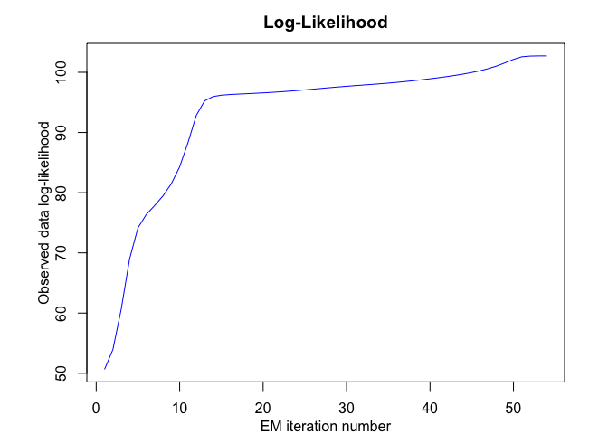
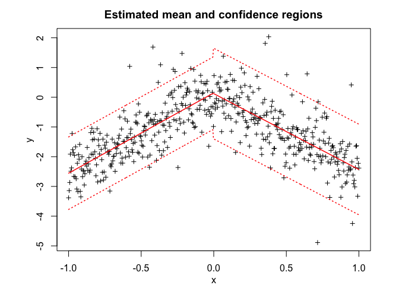
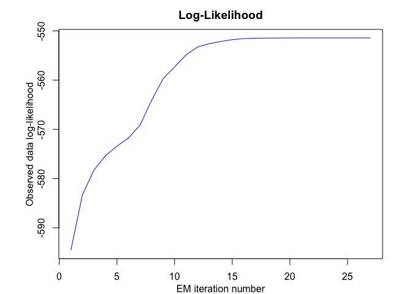

<!-- README.md is generated from README.Rmd. Please edit that file -->

<!-- badges: start -->

[](https://travis-ci.org/fchamroukhi/MEteorits)
<!-- badges: end -->

# **MEteorits:** Mixtures-of-ExperTs modEling for cOmplex and non-noRmal dIsTributions

MEteoritS is an open source toolbox (available in R and Matlab) containg
several original and flexible mixtures-of-experts models to model,
cluster and classify heteregenous data in many complex situations where
the data are distributed according to non-normal and possibly skewed
distributions, and when they might be corrupted by atypical
observations. The toolbox also contains sparse mixture-of-experts models
for high-dimensional data.

Our (dis-)covered meteorits are for instance the following ones:

  - NMoE;
  - tMoE;
  - SNMoE;
  - StMoE.

The models and algorithms are developped and written in Matlab by Faicel
Chamroukhi, and translated and designed into R packages by Florian
Lecocq, Marius Bartcus and Faicel Chamroukhi.

# Installation

You can install the development version of MEteorits from
[GitHub](https://github.com/fchamroukhi/MEteorits) with:

``` r
# install.packages("devtools")
devtools::install_github("fchamroukhi/MEteorits")
```

To build *vignettes* for examples of usage, type the command below
instead:

``` r
# install.packages("devtools")
devtools::install_github("fchamroukhi/MEteorits", 
                         build_opts = c("--no-resave-data", "--no-manual"), 
                         build_vignettes = TRUE)
```

Use the following command to display vignettes:

``` r
browseVignettes("meteorits")
```

# Usage

``` r
library(meteorits)
```

<details>

<summary>NMoE</summary>

``` r
# Application to a simuated data set

n <- 500 # Size of the sample
alphak <- matrix(c(0, 8), ncol = 1) # Parameters of the gating network
betak <- matrix(c(0, -2.5, 0, 2.5), ncol = 2) # Regression coefficients of the experts
sigmak <- c(1, 1) # Standard deviations of the experts
x <- seq.int(from = -1, to = 1, length.out = n) # Inputs (predictors)

# Generate sample of size n
sample <- sampleUnivNMoE(alphak = alphak, betak = betak, sigmak = sigmak, x = x)

K <- 2 # Number of regressors/experts
p <- 1 # Order of the polynomial regression (regressors/experts)
q <- 1 # Order of the logistic regression (gating network)

n_tries <- 1
max_iter <- 1500
threshold <- 1e-5
verbose <- TRUE
verbose_IRLS <- FALSE

nmoe <- emNMoE(x, matrix(sample$y), K, p, q, n_tries, max_iter, 
               threshold, verbose, verbose_IRLS)
#> EM NMoE: Iteration: 1 | log-likelihood: -805.715989879573
#> EM NMoE: Iteration: 2 | log-likelihood: -805.690238778991
#> EM NMoE: Iteration: 3 | log-likelihood: -805.660323663071
#> EM NMoE: Iteration: 4 | log-likelihood: -805.615341012296
#> EM NMoE: Iteration: 5 | log-likelihood: -805.535701894903
#> EM NMoE: Iteration: 6 | log-likelihood: -805.379504037526
#> EM NMoE: Iteration: 7 | log-likelihood: -805.055076879415
#> EM NMoE: Iteration: 8 | log-likelihood: -804.363751961088
#> EM NMoE: Iteration: 9 | log-likelihood: -802.889700931259
#> EM NMoE: Iteration: 10 | log-likelihood: -799.835363408819
#> EM NMoE: Iteration: 11 | log-likelihood: -793.948834713661
#> EM NMoE: Iteration: 12 | log-likelihood: -783.978056446093
#> EM NMoE: Iteration: 13 | log-likelihood: -769.90909388639
#> EM NMoE: Iteration: 14 | log-likelihood: -754.082302083745
#> EM NMoE: Iteration: 15 | log-likelihood: -740.23589963629
#> EM NMoE: Iteration: 16 | log-likelihood: -730.444589279688
#> EM NMoE: Iteration: 17 | log-likelihood: -724.177179200615
#> EM NMoE: Iteration: 18 | log-likelihood: -720.187804847623
#> EM NMoE: Iteration: 19 | log-likelihood: -717.613553097386
#> EM NMoE: Iteration: 20 | log-likelihood: -715.937978778042
#> EM NMoE: Iteration: 21 | log-likelihood: -714.831283738406
#> EM NMoE: Iteration: 22 | log-likelihood: -714.080882573487
#> EM NMoE: Iteration: 23 | log-likelihood: -713.554909937615
#> EM NMoE: Iteration: 24 | log-likelihood: -713.173421742854
#> EM NMoE: Iteration: 25 | log-likelihood: -712.88757620413
#> EM NMoE: Iteration: 26 | log-likelihood: -712.666736078758
#> EM NMoE: Iteration: 27 | log-likelihood: -712.49107938231
#> EM NMoE: Iteration: 28 | log-likelihood: -712.347423324983
#> EM NMoE: Iteration: 29 | log-likelihood: -712.2268060708
#> EM NMoE: Iteration: 30 | log-likelihood: -712.123029578868
#> EM NMoE: Iteration: 31 | log-likelihood: -712.031746255694
#> EM NMoE: Iteration: 32 | log-likelihood: -711.949868338028
#> EM NMoE: Iteration: 33 | log-likelihood: -711.875177632521
#> EM NMoE: Iteration: 34 | log-likelihood: -711.80606395913
#> EM NMoE: Iteration: 35 | log-likelihood: -711.741348103241
#> EM NMoE: Iteration: 36 | log-likelihood: -711.680160941474
#> EM NMoE: Iteration: 37 | log-likelihood: -711.621860127364
#> EM NMoE: Iteration: 38 | log-likelihood: -711.56597194771
#> EM NMoE: Iteration: 39 | log-likelihood: -711.512150056351
#> EM NMoE: Iteration: 40 | log-likelihood: -711.460145530209
#> EM NMoE: Iteration: 41 | log-likelihood: -711.409784539812
#> EM NMoE: Iteration: 42 | log-likelihood: -711.360951180392
#> EM NMoE: Iteration: 43 | log-likelihood: -711.313573863372
#> EM NMoE: Iteration: 44 | log-likelihood: -711.267614247904
#> EM NMoE: Iteration: 45 | log-likelihood: -711.223058080988
#> EM NMoE: Iteration: 46 | log-likelihood: -711.179907567878
#> EM NMoE: Iteration: 47 | log-likelihood: -711.138175049955
#> EM NMoE: Iteration: 48 | log-likelihood: -711.097877853308
#> EM NMoE: Iteration: 49 | log-likelihood: -711.059034209533
#> EM NMoE: Iteration: 50 | log-likelihood: -711.021660158592
#> EM NMoE: Iteration: 51 | log-likelihood: -710.985767336
#> EM NMoE: Iteration: 52 | log-likelihood: -710.95136153377
#> EM NMoE: Iteration: 53 | log-likelihood: -710.918441913696
#> EM NMoE: Iteration: 54 | log-likelihood: -710.887000746706
#> EM NMoE: Iteration: 55 | log-likelihood: -710.857023554554
#> EM NMoE: Iteration: 56 | log-likelihood: -710.828489539392
#> EM NMoE: Iteration: 57 | log-likelihood: -710.801372201199
#> EM NMoE: Iteration: 58 | log-likelihood: -710.77564006026
#> EM NMoE: Iteration: 59 | log-likelihood: -710.751257420016
#> EM NMoE: Iteration: 60 | log-likelihood: -710.728185122763
#> EM NMoE: Iteration: 61 | log-likelihood: -710.706381265889
#> EM NMoE: Iteration: 62 | log-likelihood: -710.685801858911
#> EM NMoE: Iteration: 63 | log-likelihood: -710.666401411292
#> EM NMoE: Iteration: 64 | log-likelihood: -710.648133448229
#> EM NMoE: Iteration: 65 | log-likelihood: -710.630950956378
#> EM NMoE: Iteration: 66 | log-likelihood: -710.614806764489
#> EM NMoE: Iteration: 67 | log-likelihood: -710.599654067843
#> EM NMoE: Iteration: 68 | log-likelihood: -710.585446054137
#> EM NMoE: Iteration: 69 | log-likelihood: -710.57213681644
#> EM NMoE: Iteration: 70 | log-likelihood: -710.559681295893
#> EM NMoE: Iteration: 71 | log-likelihood: -710.548035436835
#> EM NMoE: Iteration: 72 | log-likelihood: -710.537156314087
#> EM NMoE: Iteration: 73 | log-likelihood: -710.527002236391
#> EM NMoE: Iteration: 74 | log-likelihood: -710.517532829264
#> EM NMoE: Iteration: 75 | log-likelihood: -710.508709099957
#> EM NMoE: Iteration: 76 | log-likelihood: -710.500493486685
#> EM NMoE: Iteration: 77 | log-likelihood: -710.492849893938
#> EM NMoE: Iteration: 78 | log-likelihood: -710.485743715376
#> EM NMoE: Iteration: 79 | log-likelihood: -710.479141845604

nmoe$plot()
```


``` r
# Application to a real data set

data("tempanomalies")
x <- tempanomalies$Year
y <- as.matrix(tempanomalies$AnnualAnomaly)

K <- 2 # Number of regressors/experts
p <- 1 # Order of the polynomial regression (regressors/experts)
q <- 1 # Order of the logistic regression (gating network)

n_tries <- 1
max_iter <- 1500
threshold <- 1e-5
verbose <- TRUE
verbose_IRLS <- FALSE

nmoe <- emNMoE(X = x, Y = y, K, p, q, n_tries, max_iter, 
               threshold, verbose, verbose_IRLS)
#> EM NMoE: Iteration: 1 | log-likelihood: 48.6220921014685
#> EM NMoE: Iteration: 2 | log-likelihood: 48.7243754637886
#> EM NMoE: Iteration: 3 | log-likelihood: 48.9811444132371
#> EM NMoE: Iteration: 4 | log-likelihood: 49.7109911946921
#> EM NMoE: Iteration: 5 | log-likelihood: 51.7139669956813
#> EM NMoE: Iteration: 6 | log-likelihood: 56.4801568399898
#> EM NMoE: Iteration: 7 | log-likelihood: 64.7918901091786
#> EM NMoE: Iteration: 8 | log-likelihood: 73.2412085543498
#> EM NMoE: Iteration: 9 | log-likelihood: 77.9839909253413
#> EM NMoE: Iteration: 10 | log-likelihood: 80.6302555965992
#> EM NMoE: Iteration: 11 | log-likelihood: 83.40732191653
#> EM NMoE: Iteration: 12 | log-likelihood: 87.2152457940816
#> EM NMoE: Iteration: 13 | log-likelihood: 91.8090885997242
#> EM NMoE: Iteration: 14 | log-likelihood: 94.854737624687
#> EM NMoE: Iteration: 15 | log-likelihood: 95.894439359944
#> EM NMoE: Iteration: 16 | log-likelihood: 96.2392963022699
#> EM NMoE: Iteration: 17 | log-likelihood: 96.3908641550611
#> EM NMoE: Iteration: 18 | log-likelihood: 96.4875516847516
#> EM NMoE: Iteration: 19 | log-likelihood: 96.5709724711255
#> EM NMoE: Iteration: 20 | log-likelihood: 96.6552490324651
#> EM NMoE: Iteration: 21 | log-likelihood: 96.7458540787823
#> EM NMoE: Iteration: 22 | log-likelihood: 96.844983257205
#> EM NMoE: Iteration: 23 | log-likelihood: 96.9530686552568
#> EM NMoE: Iteration: 24 | log-likelihood: 97.0691630834443
#> EM NMoE: Iteration: 25 | log-likelihood: 97.1911010347467
#> EM NMoE: Iteration: 26 | log-likelihood: 97.3157900043483
#> EM NMoE: Iteration: 27 | log-likelihood: 97.4397597891369
#> EM NMoE: Iteration: 28 | log-likelihood: 97.5599339697635
#> EM NMoE: Iteration: 29 | log-likelihood: 97.6744331752491
#> EM NMoE: Iteration: 30 | log-likelihood: 97.7831589337871
#> EM NMoE: Iteration: 31 | log-likelihood: 97.8879314086625
#> EM NMoE: Iteration: 32 | log-likelihood: 97.9920680327263
#> EM NMoE: Iteration: 33 | log-likelihood: 98.099533378889
#> EM NMoE: Iteration: 34 | log-likelihood: 98.2139351781679
#> EM NMoE: Iteration: 35 | log-likelihood: 98.3377258034347
#> EM NMoE: Iteration: 36 | log-likelihood: 98.4719162064323
#> EM NMoE: Iteration: 37 | log-likelihood: 98.6164030172852
#> EM NMoE: Iteration: 38 | log-likelihood: 98.7707330612905
#> EM NMoE: Iteration: 39 | log-likelihood: 98.9348663221844
#> EM NMoE: Iteration: 40 | log-likelihood: 99.10972967526
#> EM NMoE: Iteration: 41 | log-likelihood: 99.2974687463982
#> EM NMoE: Iteration: 42 | log-likelihood: 99.5016380653403
#> EM NMoE: Iteration: 43 | log-likelihood: 99.7276131749418
#> EM NMoE: Iteration: 44 | log-likelihood: 99.9834545067204
#> EM NMoE: Iteration: 45 | log-likelihood: 100.281336834799
#> EM NMoE: Iteration: 46 | log-likelihood: 100.639273187455
#> EM NMoE: Iteration: 47 | log-likelihood: 101.080467411666
#> EM NMoE: Iteration: 48 | log-likelihood: 101.616093618013
#> EM NMoE: Iteration: 49 | log-likelihood: 102.173411375001
#> EM NMoE: Iteration: 50 | log-likelihood: 102.593947397743
#> EM NMoE: Iteration: 51 | log-likelihood: 102.692730847228
#> EM NMoE: Iteration: 52 | log-likelihood: 102.721880493952
#> EM NMoE: Iteration: 53 | log-likelihood: 102.721887873536

nmoe$plot()
```



</details>

<details>

<summary>TMoE</summary>

``` r
# Application to a simuated data set

n <- 500 # Size of the sample
alphak <- matrix(c(0, 8), ncol = 1) # Parameters of the gating network
betak <- matrix(c(0, -2.5, 0, 2.5), ncol = 2) # Regression coefficients of the experts
sigmak <- c(0.5, 0.5) # Standard deviations of the experts
nuk <- c(5, 7) # Degrees of freedom of the experts network t densities
x <- seq.int(from = -1, to = 1, length.out = n) # Inputs (predictors)

# Generate sample of size n
sample <- sampleUnivTMoE(alphak = alphak, betak = betak, sigmak = sigmak, 
                         nuk = nuk, x = x)

K <- 2 # Number of regressors/experts
p <- 1 # Order of the polynomial regression (regressors/experts)
q <- 1 # Order of the logistic regression (gating network)

n_tries <- 1
max_iter <- 1500
threshold <- 1e-5
verbose <- TRUE
verbose_IRLS <- FALSE

tmoe <- emTMoE(x, matrix(sample$y), K, p, q, n_tries, max_iter, 
               threshold, verbose, verbose_IRLS)
#> EM - tMoE: Iteration: 1 | log-likelihood: -520.746968931331
#> EM - tMoE: Iteration: 2 | log-likelihood: -517.844794532484
#> EM - tMoE: Iteration: 3 | log-likelihood: -517.68088085537
#> EM - tMoE: Iteration: 4 | log-likelihood: -517.59432999579
#> EM - tMoE: Iteration: 5 | log-likelihood: -517.509757455754
#> EM - tMoE: Iteration: 6 | log-likelihood: -517.424785410791
#> EM - tMoE: Iteration: 7 | log-likelihood: -517.339369464521
#> EM - tMoE: Iteration: 8 | log-likelihood: -517.253548565969
#> EM - tMoE: Iteration: 9 | log-likelihood: -517.167367802215
#> EM - tMoE: Iteration: 10 | log-likelihood: -517.080875286904
#> EM - tMoE: Iteration: 11 | log-likelihood: -516.994121777204
#> EM - tMoE: Iteration: 12 | log-likelihood: -516.907160461318
#> EM - tMoE: Iteration: 13 | log-likelihood: -516.820046795228
#> EM - tMoE: Iteration: 14 | log-likelihood: -516.73283836455
#> EM - tMoE: Iteration: 15 | log-likelihood: -516.645594758399
#> EM - tMoE: Iteration: 16 | log-likelihood: -516.558377447433
#> EM - tMoE: Iteration: 17 | log-likelihood: -516.471249661185
#> EM - tMoE: Iteration: 18 | log-likelihood: -516.384276261605
#> EM - tMoE: Iteration: 19 | log-likelihood: -516.297523610745
#> EM - tMoE: Iteration: 20 | log-likelihood: -516.211059431186
#> EM - tMoE: Iteration: 21 | log-likelihood: -516.124952658118
#> EM - tMoE: Iteration: 22 | log-likelihood: -516.039273282343
#> EM - tMoE: Iteration: 23 | log-likelihood: -515.954092183465
#> EM - tMoE: Iteration: 24 | log-likelihood: -515.869480952808
#> EM - tMoE: Iteration: 25 | log-likelihood: -515.785511705509
#> EM - tMoE: Iteration: 26 | log-likelihood: -515.702256881471
#> EM - tMoE: Iteration: 27 | log-likelihood: -515.619789034823
#> EM - tMoE: Iteration: 28 | log-likelihood: -515.538180611724
#> EM - tMoE: Iteration: 29 | log-likelihood: -515.45750371645
#> EM - tMoE: Iteration: 30 | log-likelihood: -515.377829865892
#> EM - tMoE: Iteration: 31 | log-likelihood: -515.299229732775
#> EM - tMoE: Iteration: 32 | log-likelihood: -515.221772878216
#> EM - tMoE: Iteration: 33 | log-likelihood: -515.145527474453
#> EM - tMoE: Iteration: 34 | log-likelihood: -515.070560018965
#> EM - tMoE: Iteration: 35 | log-likelihood: -514.996935041517
#> EM - tMoE: Iteration: 36 | log-likelihood: -514.924714806051
#> EM - tMoE: Iteration: 37 | log-likelihood: -514.853959009691
#> EM - tMoE: Iteration: 38 | log-likelihood: -514.784724481575
#> EM - tMoE: Iteration: 39 | log-likelihood: -514.717064884485
#> EM - tMoE: Iteration: 40 | log-likelihood: -514.651030422655
#> EM - tMoE: Iteration: 41 | log-likelihood: -514.586667559345
#> EM - tMoE: Iteration: 42 | log-likelihood: -514.524018748001
#> EM - tMoE: Iteration: 43 | log-likelihood: -514.463122180939
#> EM - tMoE: Iteration: 44 | log-likelihood: -514.404011559516
#> EM - tMoE: Iteration: 45 | log-likelihood: -514.346715889688
#> EM - tMoE: Iteration: 46 | log-likelihood: -514.291259306671
#> EM - tMoE: Iteration: 47 | log-likelihood: -514.237660932129
#> EM - tMoE: Iteration: 48 | log-likelihood: -514.185934766944
#> EM - tMoE: Iteration: 49 | log-likelihood: -514.136089622099
#> EM - tMoE: Iteration: 50 | log-likelihood: -514.088129089643
#> EM - tMoE: Iteration: 51 | log-likelihood: -514.042051555057
#> EM - tMoE: Iteration: 52 | log-likelihood: -513.997850251617
#> EM - tMoE: Iteration: 53 | log-likelihood: -513.955513356616
#> EM - tMoE: Iteration: 54 | log-likelihood: -513.915024128577
#> EM - tMoE: Iteration: 55 | log-likelihood: -513.876361083799
#> EM - tMoE: Iteration: 56 | log-likelihood: -513.83949820993
#> EM - tMoE: Iteration: 57 | log-likelihood: -513.80440521359
#> EM - tMoE: Iteration: 58 | log-likelihood: -513.771047798473
#> EM - tMoE: Iteration: 59 | log-likelihood: -513.73938796994
#> EM - tMoE: Iteration: 60 | log-likelihood: -513.709384361666
#> EM - tMoE: Iteration: 61 | log-likelihood: -513.680992579703
#> EM - tMoE: Iteration: 62 | log-likelihood: -513.654165559144
#> EM - tMoE: Iteration: 63 | log-likelihood: -513.628853928522
#> EM - tMoE: Iteration: 64 | log-likelihood: -513.605006377215
#> EM - tMoE: Iteration: 65 | log-likelihood: -513.582570021236
#> EM - tMoE: Iteration: 66 | log-likelihood: -513.561490763106
#> EM - tMoE: Iteration: 67 | log-likelihood: -513.54171364184
#> EM - tMoE: Iteration: 68 | log-likelihood: -513.523183169468
#> EM - tMoE: Iteration: 69 | log-likelihood: -513.50584365101
#> EM - tMoE: Iteration: 70 | log-likelihood: -513.489639485261
#> EM - tMoE: Iteration: 71 | log-likelihood: -513.474515444289
#> EM - tMoE: Iteration: 72 | log-likelihood: -513.460416930009
#> EM - tMoE: Iteration: 73 | log-likelihood: -513.447290206724
#> EM - tMoE: Iteration: 74 | log-likelihood: -513.435082608971
#> EM - tMoE: Iteration: 75 | log-likelihood: -513.423742724434
#> EM - tMoE: Iteration: 76 | log-likelihood: -513.413220552114
#> EM - tMoE: Iteration: 77 | log-likelihood: -513.403467636258
#> EM - tMoE: Iteration: 78 | log-likelihood: -513.394437176883
#> EM - tMoE: Iteration: 79 | log-likelihood: -513.386084117945
#> EM - tMoE: Iteration: 80 | log-likelihood: -513.378365214475
#> EM - tMoE: Iteration: 81 | log-likelihood: -513.37123908006
#> EM - tMoE: Iteration: 82 | log-likelihood: -513.364666216261
#> EM - tMoE: Iteration: 83 | log-likelihood: -513.358609025565
#> EM - tMoE: Iteration: 84 | log-likelihood: -513.35303180952
#> EM - tMoE: Iteration: 85 | log-likelihood: -513.347900753706

tmoe$plot()
```



``` r
# Application to a real data set

library(MASS)
data("mcycle")
x <- mcycle$times
y <- as.matrix(mcycle$accel)

K <- 4 # Number of regressors/experts
p <- 2 # Order of the polynomial regression (regressors/experts)
q <- 1 # Order of the logistic regression (gating network)

n_tries <- 1
max_iter <- 1500
threshold <- 1e-5
verbose <- TRUE
verbose_IRLS <- FALSE

tmoe <- emTMoE(X = x, Y = y, K, p, q, n_tries, max_iter, 
               threshold, verbose, verbose_IRLS)
#> EM - tMoE: Iteration: 1 | log-likelihood: -586.724936280907
#> EM - tMoE: Iteration: 2 | log-likelihood: -578.832560548632
#> EM - tMoE: Iteration: 3 | log-likelihood: -576.210978732092
#> EM - tMoE: Iteration: 4 | log-likelihood: -574.754071338775
#> EM - tMoE: Iteration: 5 | log-likelihood: -571.649847347847
#> EM - tMoE: Iteration: 6 | log-likelihood: -564.738245116755
#> EM - tMoE: Iteration: 7 | log-likelihood: -559.051057170285
#> EM - tMoE: Iteration: 8 | log-likelihood: -556.450539186266
#> EM - tMoE: Iteration: 9 | log-likelihood: -555.27871431366
#> EM - tMoE: Iteration: 10 | log-likelihood: -554.470485890903
#> EM - tMoE: Iteration: 11 | log-likelihood: -553.733760447304
#> EM - tMoE: Iteration: 12 | log-likelihood: -553.003497447578
#> EM - tMoE: Iteration: 13 | log-likelihood: -552.352720124877
#> EM - tMoE: Iteration: 14 | log-likelihood: -551.892922033381
#> EM - tMoE: Iteration: 15 | log-likelihood: -551.603400258098
#> EM - tMoE: Iteration: 16 | log-likelihood: -551.411999833038
#> EM - tMoE: Iteration: 17 | log-likelihood: -551.27941753372
#> EM - tMoE: Iteration: 18 | log-likelihood: -551.186021007243
#> EM - tMoE: Iteration: 19 | log-likelihood: -551.119293357749
#> EM - tMoE: Iteration: 20 | log-likelihood: -551.070734291695
#> EM - tMoE: Iteration: 21 | log-likelihood: -551.034368301586
#> EM - tMoE: Iteration: 22 | log-likelihood: -551.006122498544
#> EM - tMoE: Iteration: 23 | log-likelihood: -550.983226858499
#> EM - tMoE: Iteration: 24 | log-likelihood: -550.963836418403
#> EM - tMoE: Iteration: 25 | log-likelihood: -550.946700483879
#> EM - tMoE: Iteration: 26 | log-likelihood: -550.930979190477
#> EM - tMoE: Iteration: 27 | log-likelihood: -550.916106335476
#> EM - tMoE: Iteration: 28 | log-likelihood: -550.901698176274
#> EM - tMoE: Iteration: 29 | log-likelihood: -550.88749300139
#> EM - tMoE: Iteration: 30 | log-likelihood: -550.873311012708
#> EM - tMoE: Iteration: 31 | log-likelihood: -550.859027664805
#> EM - tMoE: Iteration: 32 | log-likelihood: -550.84455593539
#> EM - tMoE: Iteration: 33 | log-likelihood: -550.829834533263
#> EM - tMoE: Iteration: 34 | log-likelihood: -550.814820062841
#> EM - tMoE: Iteration: 35 | log-likelihood: -550.799481832711
#> EM - tMoE: Iteration: 36 | log-likelihood: -550.783798436645
#> EM - tMoE: Iteration: 37 | log-likelihood: -550.767755526851
#> EM - tMoE: Iteration: 38 | log-likelihood: -550.751344391819
#> EM - tMoE: Iteration: 39 | log-likelihood: -550.734561078766
#> EM - tMoE: Iteration: 40 | log-likelihood: -550.717405885167
#> EM - tMoE: Iteration: 41 | log-likelihood: -550.699883099852
#> EM - tMoE: Iteration: 42 | log-likelihood: -550.682000911055
#> EM - tMoE: Iteration: 43 | log-likelihood: -550.663771423032
#> EM - tMoE: Iteration: 44 | log-likelihood: -550.645210738609
#> EM - tMoE: Iteration: 45 | log-likelihood: -550.626339075116
#> EM - tMoE: Iteration: 46 | log-likelihood: -550.607180887518
#> EM - tMoE: Iteration: 47 | log-likelihood: -550.587764976519
#> EM - tMoE: Iteration: 48 | log-likelihood: -550.568124561959
#> EM - tMoE: Iteration: 49 | log-likelihood: -550.548297303516
#> EM - tMoE: Iteration: 50 | log-likelihood: -550.528325252224
#> EM - tMoE: Iteration: 51 | log-likelihood: -550.508254717917
#> EM - tMoE: Iteration: 52 | log-likelihood: -550.488136039709
#> EM - tMoE: Iteration: 53 | log-likelihood: -550.468023249313
#> EM - tMoE: Iteration: 54 | log-likelihood: -550.447973620407
#> EM - tMoE: Iteration: 55 | log-likelihood: -550.428047101526
#> EM - tMoE: Iteration: 56 | log-likelihood: -550.408305634999
#> EM - tMoE: Iteration: 57 | log-likelihood: -550.388812370032
#> EM - tMoE: Iteration: 58 | log-likelihood: -550.369630784077
#> EM - tMoE: Iteration: 59 | log-likelihood: -550.350823732561
#> EM - tMoE: Iteration: 60 | log-likelihood: -550.33245245261
#> EM - tMoE: Iteration: 61 | log-likelihood: -550.314575551026
#> EM - tMoE: Iteration: 62 | log-likelihood: -550.297248010117
#> EM - tMoE: Iteration: 63 | log-likelihood: -550.280520246508
#> EM - tMoE: Iteration: 64 | log-likelihood: -550.264437257645
#> EM - tMoE: Iteration: 65 | log-likelihood: -550.249037888154
#> EM - tMoE: Iteration: 66 | log-likelihood: -550.234354243585
#> EM - tMoE: Iteration: 67 | log-likelihood: -550.220411272708
#> EM - tMoE: Iteration: 68 | log-likelihood: -550.207226531771
#> EM - tMoE: Iteration: 69 | log-likelihood: -550.194810135568
#> EM - tMoE: Iteration: 70 | log-likelihood: -550.183164891536
#> EM - tMoE: Iteration: 71 | log-likelihood: -550.172286604834
#> EM - tMoE: Iteration: 72 | log-likelihood: -550.162164535276
#> EM - tMoE: Iteration: 73 | log-likelihood: -550.152781981331
#> EM - tMoE: Iteration: 74 | log-likelihood: -550.144116962602
#> EM - tMoE: Iteration: 75 | log-likelihood: -550.136142970296
#> EM - tMoE: Iteration: 76 | log-likelihood: -550.128829755164
#> EM - tMoE: Iteration: 77 | log-likelihood: -550.122144124007
#> EM - tMoE: Iteration: 78 | log-likelihood: -550.11605071883
#> EM - tMoE: Iteration: 79 | log-likelihood: -550.110512756644
#> EM - tMoE: Iteration: 80 | log-likelihood: -550.105492712447

tmoe$plot()
```


    #> Warning in sqrt(stat$Vary): production de NaN
    
    #> Warning in sqrt(stat$Vary): production de NaN



</details>

<details>

<summary>SNMoE</summary>

``` r
# Application to a simulated data set

n <- 500 # Size of the sample
alphak <- matrix(c(0, 8), ncol = 1) # Parameters of the gating network
betak <- matrix(c(0, -2.5, 0, 2.5), ncol = 2) # Regression coefficients of the experts
lambdak <- c(3, 5) # Skewness parameters of the experts
sigmak <- c(1, 1) # Standard deviations of the experts
x <- seq.int(from = -1, to = 1, length.out = n) # Inputs (predictors)

# Generate sample of size n
sample <- sampleUnivSNMoE(alphak = alphak, betak = betak, sigmak = sigmak, 
                          lambdak = lambdak, x = x)

K <- 2 # Number of regressors/experts
p <- 1 # Order of the polynomial regression (regressors/experts)
q <- 1 # Order of the logistic regression (gating network)

n_tries <- 1
max_iter <- 1500
threshold <- 1e-6
verbose <- TRUE
verbose_IRLS <- FALSE

snmoe <- emSNMoE(x, matrix(sample$y), K, p, q, n_tries, max_iter, 
                 threshold, verbose, verbose_IRLS)
#> EM - SNMoE: Iteration: 1 | log-likelihood: -501.462918777294
#> EM - SNMoE: Iteration: 2 | log-likelihood: -497.128378862464
#> EM - SNMoE: Iteration: 3 | log-likelihood: -497.098661686169
#> EM - SNMoE: Iteration: 4 | log-likelihood: -497.087874398474
#> EM - SNMoE: Iteration: 5 | log-likelihood: -497.082014888392
#> EM - SNMoE: Iteration: 6 | log-likelihood: -497.077385589341
#> EM - SNMoE: Iteration: 7 | log-likelihood: -497.07294265307
#> EM - SNMoE: Iteration: 8 | log-likelihood: -497.068369527975
#> EM - SNMoE: Iteration: 9 | log-likelihood: -497.063569575839
#> EM - SNMoE: Iteration: 10 | log-likelihood: -497.058492916579
#> EM - SNMoE: Iteration: 11 | log-likelihood: -497.053053081232
#> EM - SNMoE: Iteration: 12 | log-likelihood: -497.047215528862
#> EM - SNMoE: Iteration: 13 | log-likelihood: -497.040948372464
#> EM - SNMoE: Iteration: 14 | log-likelihood: -497.034219364077
#> EM - SNMoE: Iteration: 15 | log-likelihood: -497.026949744813
#> EM - SNMoE: Iteration: 16 | log-likelihood: -497.019076799764
#> EM - SNMoE: Iteration: 17 | log-likelihood: -497.010556284967
#> EM - SNMoE: Iteration: 18 | log-likelihood: -497.001338653008
#> EM - SNMoE: Iteration: 19 | log-likelihood: -496.991335567679
#> EM - SNMoE: Iteration: 20 | log-likelihood: -496.980459957061
#> EM - SNMoE: Iteration: 21 | log-likelihood: -496.968632812856
#> EM - SNMoE: Iteration: 22 | log-likelihood: -496.955753052045
#> EM - SNMoE: Iteration: 23 | log-likelihood: -496.941680534566
#> EM - SNMoE: Iteration: 24 | log-likelihood: -496.926301266733
#> EM - SNMoE: Iteration: 25 | log-likelihood: -496.909465925765
#> EM - SNMoE: Iteration: 26 | log-likelihood: -496.891015747122
#> EM - SNMoE: Iteration: 27 | log-likelihood: -496.870778499835
#> EM - SNMoE: Iteration: 28 | log-likelihood: -496.84854057635
#> EM - SNMoE: Iteration: 29 | log-likelihood: -496.824072457668
#> EM - SNMoE: Iteration: 30 | log-likelihood: -496.797113128937
#> EM - SNMoE: Iteration: 31 | log-likelihood: -496.767401878505
#> EM - SNMoE: Iteration: 32 | log-likelihood: -496.734615055545
#> EM - SNMoE: Iteration: 33 | log-likelihood: -496.698345685107
#> EM - SNMoE: Iteration: 34 | log-likelihood: -496.65819323263
#> EM - SNMoE: Iteration: 35 | log-likelihood: -496.613691325538
#> EM - SNMoE: Iteration: 36 | log-likelihood: -496.564351784423
#> EM - SNMoE: Iteration: 37 | log-likelihood: -496.509670812019
#> EM - SNMoE: Iteration: 38 | log-likelihood: -496.448971112662
#> EM - SNMoE: Iteration: 39 | log-likelihood: -496.381496707742
#> EM - SNMoE: Iteration: 40 | log-likelihood: -496.306542891659
#> EM - SNMoE: Iteration: 41 | log-likelihood: -496.223319241601
#> EM - SNMoE: Iteration: 42 | log-likelihood: -496.130904267289
#> EM - SNMoE: Iteration: 43 | log-likelihood: -496.028333637923
#> EM - SNMoE: Iteration: 44 | log-likelihood: -495.91460052912
#> EM - SNMoE: Iteration: 45 | log-likelihood: -495.788690095837
#> EM - SNMoE: Iteration: 46 | log-likelihood: -495.649476949263
#> EM - SNMoE: Iteration: 47 | log-likelihood: -495.495784423979
#> EM - SNMoE: Iteration: 48 | log-likelihood: -495.326649237044
#> EM - SNMoE: Iteration: 49 | log-likelihood: -495.141080092358
#> EM - SNMoE: Iteration: 50 | log-likelihood: -494.938149417045
#> EM - SNMoE: Iteration: 51 | log-likelihood: -494.717174549736
#> EM - SNMoE: Iteration: 52 | log-likelihood: -494.47752486315
#> EM - SNMoE: Iteration: 53 | log-likelihood: -494.218702413759
#> EM - SNMoE: Iteration: 54 | log-likelihood: -493.940584566069
#> EM - SNMoE: Iteration: 55 | log-likelihood: -493.643361686948
#> EM - SNMoE: Iteration: 56 | log-likelihood: -493.327527767281
#> EM - SNMoE: Iteration: 57 | log-likelihood: -492.993966438022
#> EM - SNMoE: Iteration: 58 | log-likelihood: -492.643855684884
#> EM - SNMoE: Iteration: 59 | log-likelihood: -492.278391328074
#> EM - SNMoE: Iteration: 60 | log-likelihood: -491.899471203335
#> EM - SNMoE: Iteration: 61 | log-likelihood: -491.509044870583
#> EM - SNMoE: Iteration: 62 | log-likelihood: -491.109082191979
#> EM - SNMoE: Iteration: 63 | log-likelihood: -490.70193299213
#> EM - SNMoE: Iteration: 64 | log-likelihood: -490.289714886144
#> EM - SNMoE: Iteration: 65 | log-likelihood: -489.874939235827
#> EM - SNMoE: Iteration: 66 | log-likelihood: -489.459856492471
#> EM - SNMoE: Iteration: 67 | log-likelihood: -489.046644017295
#> EM - SNMoE: Iteration: 68 | log-likelihood: -488.63735789431
#> EM - SNMoE: Iteration: 69 | log-likelihood: -488.233896846211
#> EM - SNMoE: Iteration: 70 | log-likelihood: -487.837992654718
#> EM - SNMoE: Iteration: 71 | log-likelihood: -487.451266939738
#> EM - SNMoE: Iteration: 72 | log-likelihood: -487.07503242266
#> EM - SNMoE: Iteration: 73 | log-likelihood: -486.71032073373
#> EM - SNMoE: Iteration: 74 | log-likelihood: -486.358100253646
#> EM - SNMoE: Iteration: 75 | log-likelihood: -486.019054528058
#> EM - SNMoE: Iteration: 76 | log-likelihood: -485.693760799064
#> EM - SNMoE: Iteration: 77 | log-likelihood: -485.382575518193
#> EM - SNMoE: Iteration: 78 | log-likelihood: -485.085783665371
#> EM - SNMoE: Iteration: 79 | log-likelihood: -484.803299465424
#> EM - SNMoE: Iteration: 80 | log-likelihood: -484.535075499704
#> EM - SNMoE: Iteration: 81 | log-likelihood: -484.280883908598
#> EM - SNMoE: Iteration: 82 | log-likelihood: -484.040454157134
#> EM - SNMoE: Iteration: 83 | log-likelihood: -483.813314561936
#> EM - SNMoE: Iteration: 84 | log-likelihood: -483.598934045086
#> EM - SNMoE: Iteration: 85 | log-likelihood: -483.39682775596
#> EM - SNMoE: Iteration: 86 | log-likelihood: -483.206150883818
#> EM - SNMoE: Iteration: 87 | log-likelihood: -483.026116863679
#> EM - SNMoE: Iteration: 88 | log-likelihood: -482.856032281732
#> EM - SNMoE: Iteration: 89 | log-likelihood: -482.695029720441
#> EM - SNMoE: Iteration: 90 | log-likelihood: -482.542377049116
#> EM - SNMoE: Iteration: 91 | log-likelihood: -482.397330134089
#> EM - SNMoE: Iteration: 92 | log-likelihood: -482.259600320509
#> EM - SNMoE: Iteration: 93 | log-likelihood: -482.12933466887
#> EM - SNMoE: Iteration: 94 | log-likelihood: -482.006649534949
#> EM - SNMoE: Iteration: 95 | log-likelihood: -481.891632687902
#> EM - SNMoE: Iteration: 96 | log-likelihood: -481.783965951807
#> EM - SNMoE: Iteration: 97 | log-likelihood: -481.684275151526
#> EM - SNMoE: Iteration: 98 | log-likelihood: -481.592557012666
#> EM - SNMoE: Iteration: 99 | log-likelihood: -481.508701348115
#> EM - SNMoE: Iteration: 100 | log-likelihood: -481.432409871983
#> EM - SNMoE: Iteration: 101 | log-likelihood: -481.363228294641
#> EM - SNMoE: Iteration: 102 | log-likelihood: -481.300624491414
#> EM - SNMoE: Iteration: 103 | log-likelihood: -481.243993019342
#> EM - SNMoE: Iteration: 104 | log-likelihood: -481.192741685031
#> EM - SNMoE: Iteration: 105 | log-likelihood: -481.146284436711
#> EM - SNMoE: Iteration: 106 | log-likelihood: -481.104241476492
#> EM - SNMoE: Iteration: 107 | log-likelihood: -481.066067343763
#> EM - SNMoE: Iteration: 108 | log-likelihood: -481.031268939096
#> EM - SNMoE: Iteration: 109 | log-likelihood: -480.999507518886
#> EM - SNMoE: Iteration: 110 | log-likelihood: -480.970487936186
#> EM - SNMoE: Iteration: 111 | log-likelihood: -480.943936928129
#> EM - SNMoE: Iteration: 112 | log-likelihood: -480.919608764448
#> EM - SNMoE: Iteration: 113 | log-likelihood: -480.897286521828
#> EM - SNMoE: Iteration: 114 | log-likelihood: -480.876771854488
#> EM - SNMoE: Iteration: 115 | log-likelihood: -480.857887146155
#> EM - SNMoE: Iteration: 116 | log-likelihood: -480.840478423198
#> EM - SNMoE: Iteration: 117 | log-likelihood: -480.824402165871
#> EM - SNMoE: Iteration: 118 | log-likelihood: -480.809533340231
#> EM - SNMoE: Iteration: 119 | log-likelihood: -480.79575522426
#> EM - SNMoE: Iteration: 120 | log-likelihood: -480.782959322916
#> EM - SNMoE: Iteration: 121 | log-likelihood: -480.771050648408
#> EM - SNMoE: Iteration: 122 | log-likelihood: -480.759952032847
#> EM - SNMoE: Iteration: 123 | log-likelihood: -480.749573597036
#> EM - SNMoE: Iteration: 124 | log-likelihood: -480.739841451358
#> EM - SNMoE: Iteration: 125 | log-likelihood: -480.730689501481
#> EM - SNMoE: Iteration: 126 | log-likelihood: -480.722048505659
#> EM - SNMoE: Iteration: 127 | log-likelihood: -480.713856783429
#> EM - SNMoE: Iteration: 128 | log-likelihood: -480.706077018735
#> EM - SNMoE: Iteration: 129 | log-likelihood: -480.698644596618
#> EM - SNMoE: Iteration: 130 | log-likelihood: -480.691516803297
#> EM - SNMoE: Iteration: 131 | log-likelihood: -480.684669961502
#> EM - SNMoE: Iteration: 132 | log-likelihood: -480.678055374107
#> EM - SNMoE: Iteration: 133 | log-likelihood: -480.671636690245
#> EM - SNMoE: Iteration: 134 | log-likelihood: -480.665374610265
#> EM - SNMoE: Iteration: 135 | log-likelihood: -480.659241094022
#> EM - SNMoE: Iteration: 136 | log-likelihood: -480.653218756147
#> EM - SNMoE: Iteration: 137 | log-likelihood: -480.647272197159
#> EM - SNMoE: Iteration: 138 | log-likelihood: -480.641383696607
#> EM - SNMoE: Iteration: 139 | log-likelihood: -480.635537705033
#> EM - SNMoE: Iteration: 140 | log-likelihood: -480.629694883936
#> EM - SNMoE: Iteration: 141 | log-likelihood: -480.623821568366
#> EM - SNMoE: Iteration: 142 | log-likelihood: -480.617902074406
#> EM - SNMoE: Iteration: 143 | log-likelihood: -480.611924937751
#> EM - SNMoE: Iteration: 144 | log-likelihood: -480.605886390043
#> EM - SNMoE: Iteration: 145 | log-likelihood: -480.599758416396
#> EM - SNMoE: Iteration: 146 | log-likelihood: -480.593523856908
#> EM - SNMoE: Iteration: 147 | log-likelihood: -480.587175233016
#> EM - SNMoE: Iteration: 148 | log-likelihood: -480.580698197222
#> EM - SNMoE: Iteration: 149 | log-likelihood: -480.574052887163
#> EM - SNMoE: Iteration: 150 | log-likelihood: -480.567236473321
#> EM - SNMoE: Iteration: 151 | log-likelihood: -480.560238283531
#> EM - SNMoE: Iteration: 152 | log-likelihood: -480.553031862759
#> EM - SNMoE: Iteration: 153 | log-likelihood: -480.545610356234
#> EM - SNMoE: Iteration: 154 | log-likelihood: -480.53795843264
#> EM - SNMoE: Iteration: 155 | log-likelihood: -480.530054451355
#> EM - SNMoE: Iteration: 156 | log-likelihood: -480.521888769711
#> EM - SNMoE: Iteration: 157 | log-likelihood: -480.513443926214
#> EM - SNMoE: Iteration: 158 | log-likelihood: -480.504703626494
#> EM - SNMoE: Iteration: 159 | log-likelihood: -480.495671397037
#> EM - SNMoE: Iteration: 160 | log-likelihood: -480.486316529621
#> EM - SNMoE: Iteration: 161 | log-likelihood: -480.476636367111
#> EM - SNMoE: Iteration: 162 | log-likelihood: -480.466612090532
#> EM - SNMoE: Iteration: 163 | log-likelihood: -480.456212794077
#> EM - SNMoE: Iteration: 164 | log-likelihood: -480.445429465005
#> EM - SNMoE: Iteration: 165 | log-likelihood: -480.434241843303
#> EM - SNMoE: Iteration: 166 | log-likelihood: -480.422635407744
#> EM - SNMoE: Iteration: 167 | log-likelihood: -480.410606603226
#> EM - SNMoE: Iteration: 168 | log-likelihood: -480.398130496442
#> EM - SNMoE: Iteration: 169 | log-likelihood: -480.385189683454
#> EM - SNMoE: Iteration: 170 | log-likelihood: -480.371765630473
#> EM - SNMoE: Iteration: 171 | log-likelihood: -480.35783863779
#> EM - SNMoE: Iteration: 172 | log-likelihood: -480.343387903961
#> EM - SNMoE: Iteration: 173 | log-likelihood: -480.328402104009
#> EM - SNMoE: Iteration: 174 | log-likelihood: -480.3128640858
#> EM - SNMoE: Iteration: 175 | log-likelihood: -480.29675627763
#> EM - SNMoE: Iteration: 176 | log-likelihood: -480.280064926619
#> EM - SNMoE: Iteration: 177 | log-likelihood: -480.262755921441
#> EM - SNMoE: Iteration: 178 | log-likelihood: -480.244815766662
#> EM - SNMoE: Iteration: 179 | log-likelihood: -480.226264846943
#> EM - SNMoE: Iteration: 180 | log-likelihood: -480.207069097885
#> EM - SNMoE: Iteration: 181 | log-likelihood: -480.18718608308
#> EM - SNMoE: Iteration: 182 | log-likelihood: -480.166612235943
#> EM - SNMoE: Iteration: 183 | log-likelihood: -480.145330380432
#> EM - SNMoE: Iteration: 184 | log-likelihood: -480.123331660503
#> EM - SNMoE: Iteration: 185 | log-likelihood: -480.100604001482
#> EM - SNMoE: Iteration: 186 | log-likelihood: -480.077130919285
#> EM - SNMoE: Iteration: 187 | log-likelihood: -480.052890794667
#> EM - SNMoE: Iteration: 188 | log-likelihood: -480.027894222394
#> EM - SNMoE: Iteration: 189 | log-likelihood: -480.002134027032
#> EM - SNMoE: Iteration: 190 | log-likelihood: -479.975586215983
#> EM - SNMoE: Iteration: 191 | log-likelihood: -479.948248364153
#> EM - SNMoE: Iteration: 192 | log-likelihood: -479.920134124385
#> EM - SNMoE: Iteration: 193 | log-likelihood: -479.89122412737
#> EM - SNMoE: Iteration: 194 | log-likelihood: -479.86150329262
#> EM - SNMoE: Iteration: 195 | log-likelihood: -479.830991548715
#> EM - SNMoE: Iteration: 196 | log-likelihood: -479.799662958549
#> EM - SNMoE: Iteration: 197 | log-likelihood: -479.767526305924
#> EM - SNMoE: Iteration: 198 | log-likelihood: -479.734617389898
#> EM - SNMoE: Iteration: 199 | log-likelihood: -479.700941146364
#> EM - SNMoE: Iteration: 200 | log-likelihood: -479.666526929946
#> EM - SNMoE: Iteration: 201 | log-likelihood: -479.631358105201
#> EM - SNMoE: Iteration: 202 | log-likelihood: -479.595474137054
#> EM - SNMoE: Iteration: 203 | log-likelihood: -479.558863727137
#> EM - SNMoE: Iteration: 204 | log-likelihood: -479.521543584943
#> EM - SNMoE: Iteration: 205 | log-likelihood: -479.483553635625
#> EM - SNMoE: Iteration: 206 | log-likelihood: -479.444916800908
#> EM - SNMoE: Iteration: 207 | log-likelihood: -479.405658765668
#> EM - SNMoE: Iteration: 208 | log-likelihood: -479.365814686424
#> EM - SNMoE: Iteration: 209 | log-likelihood: -479.325423963834
#> EM - SNMoE: Iteration: 210 | log-likelihood: -479.28451103172
#> EM - SNMoE: Iteration: 211 | log-likelihood: -479.243102828567
#> EM - SNMoE: Iteration: 212 | log-likelihood: -479.201230060358
#> EM - SNMoE: Iteration: 213 | log-likelihood: -479.158940618289
#> EM - SNMoE: Iteration: 214 | log-likelihood: -479.116298208649
#> EM - SNMoE: Iteration: 215 | log-likelihood: -479.073314373529
#> EM - SNMoE: Iteration: 216 | log-likelihood: -479.030061052965
#> EM - SNMoE: Iteration: 217 | log-likelihood: -478.986583955838
#> EM - SNMoE: Iteration: 218 | log-likelihood: -478.942921015902
#> EM - SNMoE: Iteration: 219 | log-likelihood: -478.899115325589
#> EM - SNMoE: Iteration: 220 | log-likelihood: -478.855210770962
#> EM - SNMoE: Iteration: 221 | log-likelihood: -478.811251221819
#> EM - SNMoE: Iteration: 222 | log-likelihood: -478.767277118907
#> EM - SNMoE: Iteration: 223 | log-likelihood: -478.723340638308
#> EM - SNMoE: Iteration: 224 | log-likelihood: -478.679487004646
#> EM - SNMoE: Iteration: 225 | log-likelihood: -478.635759167015
#> EM - SNMoE: Iteration: 226 | log-likelihood: -478.592200430522
#> EM - SNMoE: Iteration: 227 | log-likelihood: -478.548863640058
#> EM - SNMoE: Iteration: 228 | log-likelihood: -478.505770408154
#> EM - SNMoE: Iteration: 229 | log-likelihood: -478.462968341751
#> EM - SNMoE: Iteration: 230 | log-likelihood: -478.420494409561
#> EM - SNMoE: Iteration: 231 | log-likelihood: -478.378387035843
#> EM - SNMoE: Iteration: 232 | log-likelihood: -478.336684867734
#> EM - SNMoE: Iteration: 233 | log-likelihood: -478.295401318537
#> EM - SNMoE: Iteration: 234 | log-likelihood: -478.254598200388
#> EM - SNMoE: Iteration: 235 | log-likelihood: -478.214300737962
#> EM - SNMoE: Iteration: 236 | log-likelihood: -478.174534802918
#> EM - SNMoE: Iteration: 237 | log-likelihood: -478.135343767838
#> EM - SNMoE: Iteration: 238 | log-likelihood: -478.096725422705
#> EM - SNMoE: Iteration: 239 | log-likelihood: -478.058706781344
#> EM - SNMoE: Iteration: 240 | log-likelihood: -478.021308807193
#> EM - SNMoE: Iteration: 241 | log-likelihood: -477.984552130904
#> EM - SNMoE: Iteration: 242 | log-likelihood: -477.948430100423
#> EM - SNMoE: Iteration: 243 | log-likelihood: -477.912996522885
#> EM - SNMoE: Iteration: 244 | log-likelihood: -477.878254070712
#> EM - SNMoE: Iteration: 245 | log-likelihood: -477.844215326464
#> EM - SNMoE: Iteration: 246 | log-likelihood: -477.810885468138
#> EM - SNMoE: Iteration: 247 | log-likelihood: -477.778272624602
#> EM - SNMoE: Iteration: 248 | log-likelihood: -477.74638381377
#> EM - SNMoE: Iteration: 249 | log-likelihood: -477.71522449784
#> EM - SNMoE: Iteration: 250 | log-likelihood: -477.684790763462
#> EM - SNMoE: Iteration: 251 | log-likelihood: -477.655089607802
#> EM - SNMoE: Iteration: 252 | log-likelihood: -477.626123729392
#> EM - SNMoE: Iteration: 253 | log-likelihood: -477.597893542592
#> EM - SNMoE: Iteration: 254 | log-likelihood: -477.570397067525
#> EM - SNMoE: Iteration: 255 | log-likelihood: -477.543629925757
#> EM - SNMoE: Iteration: 256 | log-likelihood: -477.517602731061
#> EM - SNMoE: Iteration: 257 | log-likelihood: -477.492286555722
#> EM - SNMoE: Iteration: 258 | log-likelihood: -477.467676920233
#> EM - SNMoE: Iteration: 259 | log-likelihood: -477.443768229488
#> EM - SNMoE: Iteration: 260 | log-likelihood: -477.420552771834
#> EM - SNMoE: Iteration: 261 | log-likelihood: -477.39804159147
#> EM - SNMoE: Iteration: 262 | log-likelihood: -477.376184828838
#> EM - SNMoE: Iteration: 263 | log-likelihood: -477.35499425411
#> EM - SNMoE: Iteration: 264 | log-likelihood: -477.33445898676
#> EM - SNMoE: Iteration: 265 | log-likelihood: -477.314567397626
#> EM - SNMoE: Iteration: 266 | log-likelihood: -477.295315539245
#> EM - SNMoE: Iteration: 267 | log-likelihood: -477.276678903416
#> EM - SNMoE: Iteration: 268 | log-likelihood: -477.258647530611
#> EM - SNMoE: Iteration: 269 | log-likelihood: -477.241223757262
#> EM - SNMoE: Iteration: 270 | log-likelihood: -477.224383758992
#> EM - SNMoE: Iteration: 271 | log-likelihood: -477.208102474258
#> EM - SNMoE: Iteration: 272 | log-likelihood: -477.192357235423
#> EM - SNMoE: Iteration: 273 | log-likelihood: -477.177160514377
#> EM - SNMoE: Iteration: 274 | log-likelihood: -477.162489689111
#> EM - SNMoE: Iteration: 275 | log-likelihood: -477.14832789993
#> EM - SNMoE: Iteration: 276 | log-likelihood: -477.134656453523
#> EM - SNMoE: Iteration: 277 | log-likelihood: -477.121487461777
#> EM - SNMoE: Iteration: 278 | log-likelihood: -477.108792836792
#> EM - SNMoE: Iteration: 279 | log-likelihood: -477.096559724797
#> EM - SNMoE: Iteration: 280 | log-likelihood: -477.084774251568
#> EM - SNMoE: Iteration: 281 | log-likelihood: -477.073422810676
#> EM - SNMoE: Iteration: 282 | log-likelihood: -477.062492004548
#> EM - SNMoE: Iteration: 283 | log-likelihood: -477.051968606505
#> EM - SNMoE: Iteration: 284 | log-likelihood: -477.041839539773
#> EM - SNMoE: Iteration: 285 | log-likelihood: -477.032091874027
#> EM - SNMoE: Iteration: 286 | log-likelihood: -477.022714345962
#> EM - SNMoE: Iteration: 287 | log-likelihood: -477.013695236431
#> EM - SNMoE: Iteration: 288 | log-likelihood: -477.005022965441
#> EM - SNMoE: Iteration: 289 | log-likelihood: -476.996686127613
#> EM - SNMoE: Iteration: 290 | log-likelihood: -476.98867350724
#> EM - SNMoE: Iteration: 291 | log-likelihood: -476.980974091382
#> EM - SNMoE: Iteration: 292 | log-likelihood: -476.973577081985
#> EM - SNMoE: Iteration: 293 | log-likelihood: -476.966471907221
#> EM - SNMoE: Iteration: 294 | log-likelihood: -476.959648231783
#> EM - SNMoE: Iteration: 295 | log-likelihood: -476.95309568866
#> EM - SNMoE: Iteration: 296 | log-likelihood: -476.946804790424
#> EM - SNMoE: Iteration: 297 | log-likelihood: -476.940765969207
#> EM - SNMoE: Iteration: 298 | log-likelihood: -476.934969898118
#> EM - SNMoE: Iteration: 299 | log-likelihood: -476.929407505807
#> EM - SNMoE: Iteration: 300 | log-likelihood: -476.924069983499
#> EM - SNMoE: Iteration: 301 | log-likelihood: -476.918948787089
#> EM - SNMoE: Iteration: 302 | log-likelihood: -476.914035636102
#> EM - SNMoE: Iteration: 303 | log-likelihood: -476.909322510698
#> EM - SNMoE: Iteration: 304 | log-likelihood: -476.904801647494
#> EM - SNMoE: Iteration: 305 | log-likelihood: -476.900463933583
#> EM - SNMoE: Iteration: 306 | log-likelihood: -476.896300640466
#> EM - SNMoE: Iteration: 307 | log-likelihood: -476.892304894522
#> EM - SNMoE: Iteration: 308 | log-likelihood: -476.888470281185
#> EM - SNMoE: Iteration: 309 | log-likelihood: -476.884807019895
#> EM - SNMoE: Iteration: 310 | log-likelihood: -476.881296048896
#> EM - SNMoE: Iteration: 311 | log-likelihood: -476.877930103153
#> EM - SNMoE: Iteration: 312 | log-likelihood: -476.87470263938
#> EM - SNMoE: Iteration: 313 | log-likelihood: -476.87160763754
#> EM - SNMoE: Iteration: 314 | log-likelihood: -476.86863947011
#> EM - SNMoE: Iteration: 315 | log-likelihood: -476.865792816817
#> EM - SNMoE: Iteration: 316 | log-likelihood: -476.863062609156
#> EM - SNMoE: Iteration: 317 | log-likelihood: -476.860443994181
#> EM - SNMoE: Iteration: 318 | log-likelihood: -476.857932310631
#> EM - SNMoE: Iteration: 319 | log-likelihood: -476.855523072927
#> EM - SNMoE: Iteration: 320 | log-likelihood: -476.853211960083
#> EM - SNMoE: Iteration: 321 | log-likelihood: -476.850994807703
#> EM - SNMoE: Iteration: 322 | log-likelihood: -476.848867601831
#> EM - SNMoE: Iteration: 323 | log-likelihood: -476.846826473912
#> EM - SNMoE: Iteration: 324 | log-likelihood: -476.844867696404
#> EM - SNMoE: Iteration: 325 | log-likelihood: -476.842987678724
#> EM - SNMoE: Iteration: 326 | log-likelihood: -476.841182963392
#> EM - SNMoE: Iteration: 327 | log-likelihood: -476.839450222248
#> EM - SNMoE: Iteration: 328 | log-likelihood: -476.837785759124
#> EM - SNMoE: Iteration: 329 | log-likelihood: -476.836187251471
#> EM - SNMoE: Iteration: 330 | log-likelihood: -476.834651390741
#> EM - SNMoE: Iteration: 331 | log-likelihood: -476.833174653142
#> EM - SNMoE: Iteration: 332 | log-likelihood: -476.83175363522
#> EM - SNMoE: Iteration: 333 | log-likelihood: -476.83038513785
#> EM - SNMoE: Iteration: 334 | log-likelihood: -476.829075371501
#> EM - SNMoE: Iteration: 335 | log-likelihood: -476.827814007989
#> EM - SNMoE: Iteration: 336 | log-likelihood: -476.826599089224
#> EM - SNMoE: Iteration: 337 | log-likelihood: -476.825429112846
#> EM - SNMoE: Iteration: 338 | log-likelihood: -476.824301946088
#> EM - SNMoE: Iteration: 339 | log-likelihood: -476.823215537867
#> EM - SNMoE: Iteration: 340 | log-likelihood: -476.822167917035
#> EM - SNMoE: Iteration: 341 | log-likelihood: -476.82115719037
#> EM - SNMoE: Iteration: 342 | log-likelihood: -476.820181540335
#> EM - SNMoE: Iteration: 343 | log-likelihood: -476.819239222689
#> EM - SNMoE: Iteration: 344 | log-likelihood: -476.81832856402
#> EM - SNMoE: Iteration: 345 | log-likelihood: -476.817447959245
#> EM - SNMoE: Iteration: 346 | log-likelihood: -476.816595869128
#> EM - SNMoE: Iteration: 347 | log-likelihood: -476.815769829522
#> EM - SNMoE: Iteration: 348 | log-likelihood: -476.814969384933
#> EM - SNMoE: Iteration: 349 | log-likelihood: -476.814193262324
#> EM - SNMoE: Iteration: 350 | log-likelihood: -476.813440205673
#> EM - SNMoE: Iteration: 351 | log-likelihood: -476.81270898841
#> EM - SNMoE: Iteration: 352 | log-likelihood: -476.811998421005
#> EM - SNMoE: Iteration: 353 | log-likelihood: -476.811307355234
#> EM - SNMoE: Iteration: 354 | log-likelihood: -476.810634686232
#> EM - SNMoE: Iteration: 355 | log-likelihood: -476.8099793531
#> EM - SNMoE: Iteration: 356 | log-likelihood: -476.809340338584
#> EM - SNMoE: Iteration: 357 | log-likelihood: -476.80871666816
#> EM - SNMoE: Iteration: 358 | log-likelihood: -476.808107408762
#> EM - SNMoE: Iteration: 359 | log-likelihood: -476.807511667301
#> EM - SNMoE: Iteration: 360 | log-likelihood: -476.806928589062
#> EM - SNMoE: Iteration: 361 | log-likelihood: -476.806357356055
#> EM - SNMoE: Iteration: 362 | log-likelihood: -476.805797185339
#> EM - SNMoE: Iteration: 363 | log-likelihood: -476.805247327343
#> EM - SNMoE: Iteration: 364 | log-likelihood: -476.804707064197
#> EM - SNMoE: Iteration: 365 | log-likelihood: -476.804175708078
#> EM - SNMoE: Iteration: 366 | log-likelihood: -476.803652599548
#> EM - SNMoE: Iteration: 367 | log-likelihood: -476.803137105901
#> EM - SNMoE: Iteration: 368 | log-likelihood: -476.802628619491
#> EM - SNMoE: Iteration: 369 | log-likelihood: -476.802126556041
#> EM - SNMoE: Iteration: 370 | log-likelihood: -476.801630352902
#> EM - SNMoE: Iteration: 371 | log-likelihood: -476.801139467267
#> EM - SNMoE: Iteration: 372 | log-likelihood: -476.800653374298
#> EM - SNMoE: Iteration: 373 | log-likelihood: -476.800171565163
#> EM - SNMoE: Iteration: 374 | log-likelihood: -476.799693544946
#> EM - SNMoE: Iteration: 375 | log-likelihood: -476.799218830405

snmoe$plot()
```


``` r
# Application to a real data set

data("tempanomalies")
x <- tempanomalies$Year
y <- as.matrix(tempanomalies$AnnualAnomaly)

K <- 2 # Number of regressors/experts
p <- 1 # Order of the polynomial regression (regressors/experts)
q <- 1 # Order of the logistic regression (gating network)

n_tries <- 1
max_iter <- 1500
threshold <- 1e-6
verbose <- TRUE
verbose_IRLS <- FALSE

snmoe <- emSNMoE(X = x, Y = y, K, p, q, n_tries, max_iter, 
                 threshold, verbose, verbose_IRLS)
#> EM - SNMoE: Iteration: 1 | log-likelihood: 73.7927170025131
#> EM - SNMoE: Iteration: 2 | log-likelihood: 86.8801127591747
#> EM - SNMoE: Iteration: 3 | log-likelihood: 88.6110234271672
#> EM - SNMoE: Iteration: 4 | log-likelihood: 88.9642347229297
#> EM - SNMoE: Iteration: 5 | log-likelihood: 89.1568892989733
#> EM - SNMoE: Iteration: 6 | log-likelihood: 89.3685014179568
#> EM - SNMoE: Iteration: 7 | log-likelihood: 89.5546658144198
#> EM - SNMoE: Iteration: 8 | log-likelihood: 89.6670678096621
#> EM - SNMoE: Iteration: 9 | log-likelihood: 89.7291249982907
#> EM - SNMoE: Iteration: 10 | log-likelihood: 89.7635588495723
#> EM - SNMoE: Iteration: 11 | log-likelihood: 89.7850890384446
#> EM - SNMoE: Iteration: 12 | log-likelihood: 89.8013930452934
#> EM - SNMoE: Iteration: 13 | log-likelihood: 89.8151734234496
#> EM - SNMoE: Iteration: 14 | log-likelihood: 89.8271999021465
#> EM - SNMoE: Iteration: 15 | log-likelihood: 89.838043782435
#> EM - SNMoE: Iteration: 16 | log-likelihood: 89.848060997918
#> EM - SNMoE: Iteration: 17 | log-likelihood: 89.8573771675299
#> EM - SNMoE: Iteration: 18 | log-likelihood: 89.8660279541048
#> EM - SNMoE: Iteration: 19 | log-likelihood: 89.8740236334571
#> EM - SNMoE: Iteration: 20 | log-likelihood: 89.881364886095
#> EM - SNMoE: Iteration: 21 | log-likelihood: 89.8880545495646
#> EM - SNMoE: Iteration: 22 | log-likelihood: 89.8941554253027
#> EM - SNMoE: Iteration: 23 | log-likelihood: 89.8997879725503
#> EM - SNMoE: Iteration: 24 | log-likelihood: 89.9047832298883
#> EM - SNMoE: Iteration: 25 | log-likelihood: 89.9091696853024
#> EM - SNMoE: Iteration: 26 | log-likelihood: 89.9129762514955
#> EM - SNMoE: Iteration: 27 | log-likelihood: 89.9164796937344
#> EM - SNMoE: Iteration: 28 | log-likelihood: 89.9184743616154
#> EM - SNMoE: Iteration: 29 | log-likelihood: 89.9208307610115
#> EM - SNMoE: Iteration: 30 | log-likelihood: 89.9226091541735
#> EM - SNMoE: Iteration: 31 | log-likelihood: 89.9242421804292
#> EM - SNMoE: Iteration: 32 | log-likelihood: 89.9256300964343
#> EM - SNMoE: Iteration: 33 | log-likelihood: 89.9272714731053
#> EM - SNMoE: Iteration: 34 | log-likelihood: 89.9283799473664
#> EM - SNMoE: Iteration: 35 | log-likelihood: 89.929369083403
#> EM - SNMoE: Iteration: 36 | log-likelihood: 89.930218228691
#> EM - SNMoE: Iteration: 37 | log-likelihood: 89.9312691787766
#> EM - SNMoE: Iteration: 38 | log-likelihood: 89.9320540312407
#> EM - SNMoE: Iteration: 39 | log-likelihood: 89.9328126210906
#> EM - SNMoE: Iteration: 40 | log-likelihood: 89.9336327415799
#> EM - SNMoE: Iteration: 41 | log-likelihood: 89.9343367303862
#> EM - SNMoE: Iteration: 42 | log-likelihood: 89.9350047455908
#> EM - SNMoE: Iteration: 43 | log-likelihood: 89.9357216483147
#> EM - SNMoE: Iteration: 44 | log-likelihood: 89.9363470251493
#> EM - SNMoE: Iteration: 45 | log-likelihood: 89.9369585826382
#> EM - SNMoE: Iteration: 46 | log-likelihood: 89.9375907781544
#> EM - SNMoE: Iteration: 47 | log-likelihood: 89.9381702268428
#> EM - SNMoE: Iteration: 48 | log-likelihood: 89.9387567431992
#> EM - SNMoE: Iteration: 49 | log-likelihood: 89.9393205540642
#> EM - SNMoE: Iteration: 50 | log-likelihood: 89.9398590386905
#> EM - SNMoE: Iteration: 51 | log-likelihood: 89.9403894042692
#> EM - SNMoE: Iteration: 52 | log-likelihood: 89.9409077052254
#> EM - SNMoE: Iteration: 53 | log-likelihood: 89.9414087074398
#> EM - SNMoE: Iteration: 54 | log-likelihood: 89.941897771067
#> EM - SNMoE: Iteration: 55 | log-likelihood: 89.942377518736
#> EM - SNMoE: Iteration: 56 | log-likelihood: 89.9428472357117
#> EM - SNMoE: Iteration: 57 | log-likelihood: 89.9433053926864
#> EM - SNMoE: Iteration: 58 | log-likelihood: 89.9437526447011
#> EM - SNMoE: Iteration: 59 | log-likelihood: 89.944190770607
#> EM - SNMoE: Iteration: 60 | log-likelihood: 89.9446192574543
#> EM - SNMoE: Iteration: 61 | log-likelihood: 89.9450385670508
#> EM - SNMoE: Iteration: 62 | log-likelihood: 89.945450004706
#> EM - SNMoE: Iteration: 63 | log-likelihood: 89.9458518644757
#> EM - SNMoE: Iteration: 64 | log-likelihood: 89.9462454176988
#> EM - SNMoE: Iteration: 65 | log-likelihood: 89.946631768766
#> EM - SNMoE: Iteration: 66 | log-likelihood: 89.9470073646829
#> EM - SNMoE: Iteration: 67 | log-likelihood: 89.9473762730488
#> EM - SNMoE: Iteration: 68 | log-likelihood: 89.9477391276961
#> EM - SNMoE: Iteration: 69 | log-likelihood: 89.9480952259009
#> EM - SNMoE: Iteration: 70 | log-likelihood: 89.948442793921
#> EM - SNMoE: Iteration: 71 | log-likelihood: 89.9487833536632
#> EM - SNMoE: Iteration: 72 | log-likelihood: 89.9491177883292
#> EM - SNMoE: Iteration: 73 | log-likelihood: 89.9494453431151
#> EM - SNMoE: Iteration: 74 | log-likelihood: 89.9497655081875
#> EM - SNMoE: Iteration: 75 | log-likelihood: 89.9500794170909
#> EM - SNMoE: Iteration: 76 | log-likelihood: 89.9503860205392
#> EM - SNMoE: Iteration: 77 | log-likelihood: 89.9506852493583
#> EM - SNMoE: Iteration: 78 | log-likelihood: 89.9509786120174
#> EM - SNMoE: Iteration: 79 | log-likelihood: 89.9512674260934
#> EM - SNMoE: Iteration: 80 | log-likelihood: 89.9515514284842
#> EM - SNMoE: Iteration: 81 | log-likelihood: 89.9518280781637
#> EM - SNMoE: Iteration: 82 | log-likelihood: 89.9521000454344
#> EM - SNMoE: Iteration: 83 | log-likelihood: 89.9523672845241
#> EM - SNMoE: Iteration: 84 | log-likelihood: 89.952630362322
#> EM - SNMoE: Iteration: 85 | log-likelihood: 89.9528893320449
#> EM - SNMoE: Iteration: 86 | log-likelihood: 89.9531421515554
#> EM - SNMoE: Iteration: 87 | log-likelihood: 89.9533898562534
#> EM - SNMoE: Iteration: 88 | log-likelihood: 89.9536328506731
#> EM - SNMoE: Iteration: 89 | log-likelihood: 89.9538727881464
#> EM - SNMoE: Iteration: 90 | log-likelihood: 89.954110212129
#> EM - SNMoE: Iteration: 91 | log-likelihood: 89.9543426844878
#> EM - SNMoE: Iteration: 92 | log-likelihood: 89.9545691603203
#> EM - SNMoE: Iteration: 93 | log-likelihood: 89.9547904050879
#> EM - SNMoE: Iteration: 94 | log-likelihood: 89.9550069868956
#> EM - SNMoE: Iteration: 95 | log-likelihood: 89.9552200322957
#> EM - SNMoE: Iteration: 96 | log-likelihood: 89.9554291821936
#> EM - SNMoE: Iteration: 97 | log-likelihood: 89.9556347668898
#> EM - SNMoE: Iteration: 98 | log-likelihood: 89.9558367005099
#> EM - SNMoE: Iteration: 99 | log-likelihood: 89.9560355929502
#> EM - SNMoE: Iteration: 100 | log-likelihood: 89.9562310212568
#> EM - SNMoE: Iteration: 101 | log-likelihood: 89.9564223263247
#> EM - SNMoE: Iteration: 102 | log-likelihood: 89.9566095821163
#> EM - SNMoE: Iteration: 103 | log-likelihood: 89.9567947000166
#> EM - SNMoE: Iteration: 104 | log-likelihood: 89.9569764750253
#> EM - SNMoE: Iteration: 105 | log-likelihood: 89.9571547761845
#> EM - SNMoE: Iteration: 106 | log-likelihood: 89.9573308719154
#> EM - SNMoE: Iteration: 107 | log-likelihood: 89.9575035870669
#> EM - SNMoE: Iteration: 108 | log-likelihood: 89.9576722680486
#> EM - SNMoE: Iteration: 109 | log-likelihood: 89.9578372451573
#> EM - SNMoE: Iteration: 110 | log-likelihood: 89.9580007289656
#> EM - SNMoE: Iteration: 111 | log-likelihood: 89.9581633451803
#> EM - SNMoE: Iteration: 112 | log-likelihood: 89.9583227302823
#> EM - SNMoE: Iteration: 113 | log-likelihood: 89.9584796554637
#> EM - SNMoE: Iteration: 114 | log-likelihood: 89.9586348287636
#> EM - SNMoE: Iteration: 115 | log-likelihood: 89.9587874884053
#> EM - SNMoE: Iteration: 116 | log-likelihood: 89.9589375156075
#> EM - SNMoE: Iteration: 117 | log-likelihood: 89.9590847116368
#> EM - SNMoE: Iteration: 118 | log-likelihood: 89.9592288419666
#> EM - SNMoE: Iteration: 119 | log-likelihood: 89.9593707051101
#> EM - SNMoE: Iteration: 120 | log-likelihood: 89.9595101900367
#> EM - SNMoE: Iteration: 121 | log-likelihood: 89.95964747168
#> EM - SNMoE: Iteration: 122 | log-likelihood: 89.9597825102084
#> EM - SNMoE: Iteration: 123 | log-likelihood: 89.9599149370135
#> EM - SNMoE: Iteration: 124 | log-likelihood: 89.9600452865765
#> EM - SNMoE: Iteration: 125 | log-likelihood: 89.9601747574177
#> EM - SNMoE: Iteration: 126 | log-likelihood: 89.9603021679971
#> EM - SNMoE: Iteration: 127 | log-likelihood: 89.960426890239
#> EM - SNMoE: Iteration: 128 | log-likelihood: 89.9605496457031
#> EM - SNMoE: Iteration: 129 | log-likelihood: 89.960670484664
#> EM - SNMoE: Iteration: 130 | log-likelihood: 89.9607894562979
#> EM - SNMoE: Iteration: 131 | log-likelihood: 89.9609066066781
#> EM - SNMoE: Iteration: 132 | log-likelihood: 89.9610225222956
#> EM - SNMoE: Iteration: 133 | log-likelihood: 89.9611380342898
#> EM - SNMoE: Iteration: 134 | log-likelihood: 89.9612510104582
#> EM - SNMoE: Iteration: 135 | log-likelihood: 89.9613600359679
#> EM - SNMoE: Iteration: 136 | log-likelihood: 89.9614677892187
#> EM - SNMoE: Iteration: 137 | log-likelihood: 89.9615740392716
#> EM - SNMoE: Iteration: 138 | log-likelihood: 89.9616787640002
#> EM - SNMoE: Iteration: 139 | log-likelihood: 89.9617827213256
#> EM - SNMoE: Iteration: 140 | log-likelihood: 89.9618860124004
#> EM - SNMoE: Iteration: 141 | log-likelihood: 89.9619872482509
#> EM - SNMoE: Iteration: 142 | log-likelihood: 89.9620870428364
#> EM - SNMoE: Iteration: 143 | log-likelihood: 89.9621864721015
#> EM - SNMoE: Iteration: 144 | log-likelihood: 89.9622844103433
#> EM - SNMoE: Iteration: 145 | log-likelihood: 89.9623802430985
#> EM - SNMoE: Iteration: 146 | log-likelihood: 89.9624743812659
#> EM - SNMoE: Iteration: 147 | log-likelihood: 89.9625670483155
#> EM - SNMoE: Iteration: 148 | log-likelihood: 89.9626579198131
#> EM - SNMoE: Iteration: 149 | log-likelihood: 89.9627471029453

snmoe$plot()
```


</details>

<details>

<summary>StMoE</summary>

``` r
# Applicartion to a simulated data set

n <- 500 # Size of the sample
alphak <- matrix(c(0, 8), ncol = 1) # Parameters of the gating network
betak <- matrix(c(0, -2.5, 0, 2.5), ncol = 2) # Regression coefficients of the experts
sigmak <- c(0.5, 0.5) # Standard deviations of the experts
lambdak <- c(3, 5) # Skewness parameters of the experts
nuk <- c(5, 7) # Degrees of freedom of the experts network t densities
x <- seq.int(from = -1, to = 1, length.out = n) # Inputs (predictors)

# Generate sample of size n
sample <- sampleUnivSTMoE(alphak = alphak, betak = betak, sigmak = sigmak, 
                          lambdak = lambdak, nuk = nuk, x = x)

K <- 2 # Number of regressors/experts
p <- 1 # Order of the polynomial regression (regressors/experts)
q <- 1 # Order of the logistic regression (gating network)

n_tries <- 1
max_iter <- 1500
threshold <- 1e-5
verbose <- TRUE
verbose_IRLS <- FALSE

stmoe <- emStMoE(x, matrix(sample$y), K, p, q, n_tries, max_iter, 
                 threshold, verbose, verbose_IRLS)
#> EM - StMoE: Iteration: 1 | log-likelihood: -454.012005249893
#> EM - StMoE: Iteration: 2 | log-likelihood: -377.877601318327
#> EM - StMoE: Iteration: 3 | log-likelihood: -373.280834424612
#> EM - StMoE: Iteration: 4 | log-likelihood: -368.087771538173
#> EM - StMoE: Iteration: 5 | log-likelihood: -362.517006931735
#> EM - StMoE: Iteration: 6 | log-likelihood: -356.831345775369
#> EM - StMoE: Iteration: 7 | log-likelihood: -351.286305027397
#> EM - StMoE: Iteration: 8 | log-likelihood: -346.080716030547
#> EM - StMoE: Iteration: 9 | log-likelihood: -341.340905261376
#> EM - StMoE: Iteration: 10 | log-likelihood: -337.115660819497
#> EM - StMoE: Iteration: 11 | log-likelihood: -333.408241804223
#> EM - StMoE: Iteration: 12 | log-likelihood: -330.18415874721
#> EM - StMoE: Iteration: 13 | log-likelihood: -327.39693148901
#> EM - StMoE: Iteration: 14 | log-likelihood: -324.996133367988
#> EM - StMoE: Iteration: 15 | log-likelihood: -322.936790062881
#> EM - StMoE: Iteration: 16 | log-likelihood: -321.176375092417
#> EM - StMoE: Iteration: 17 | log-likelihood: -319.67092040515
#> EM - StMoE: Iteration: 18 | log-likelihood: -318.382372905973
#> EM - StMoE: Iteration: 19 | log-likelihood: -317.281007963898
#> EM - StMoE: Iteration: 20 | log-likelihood: -316.338407875274
#> EM - StMoE: Iteration: 21 | log-likelihood: -315.530816642921
#> EM - StMoE: Iteration: 22 | log-likelihood: -314.839730342955
#> EM - StMoE: Iteration: 23 | log-likelihood: -314.248487426391
#> EM - StMoE: Iteration: 24 | log-likelihood: -313.742323795217
#> EM - StMoE: Iteration: 25 | log-likelihood: -313.309825907695
#> EM - StMoE: Iteration: 26 | log-likelihood: -312.939763933097
#> EM - StMoE: Iteration: 27 | log-likelihood: -312.623274158883
#> EM - StMoE: Iteration: 28 | log-likelihood: -312.352713008333
#> EM - StMoE: Iteration: 29 | log-likelihood: -312.122460381266
#> EM - StMoE: Iteration: 30 | log-likelihood: -311.926210093171
#> EM - StMoE: Iteration: 31 | log-likelihood: -311.758827195196
#> EM - StMoE: Iteration: 32 | log-likelihood: -311.615931117154
#> EM - StMoE: Iteration: 33 | log-likelihood: -311.493957541721
#> EM - StMoE: Iteration: 34 | log-likelihood: -311.38983160716
#> EM - StMoE: Iteration: 35 | log-likelihood: -311.301084610563
#> EM - StMoE: Iteration: 36 | log-likelihood: -311.225399939337
#> EM - StMoE: Iteration: 37 | log-likelihood: -311.161033141107
#> EM - StMoE: Iteration: 38 | log-likelihood: -311.10637837944
#> EM - StMoE: Iteration: 39 | log-likelihood: -311.060070440813
#> EM - StMoE: Iteration: 40 | log-likelihood: -311.020949781475
#> EM - StMoE: Iteration: 41 | log-likelihood: -310.988068795522
#> EM - StMoE: Iteration: 42 | log-likelihood: -310.96092138456
#> EM - StMoE: Iteration: 43 | log-likelihood: -310.938664539567
#> EM - StMoE: Iteration: 44 | log-likelihood: -310.920545828209
#> EM - StMoE: Iteration: 45 | log-likelihood: -310.906289035419
#> EM - StMoE: Iteration: 46 | log-likelihood: -310.895292384772
#> EM - StMoE: Iteration: 47 | log-likelihood: -310.887046102994
#> EM - StMoE: Iteration: 48 | log-likelihood: -310.881125424485
#> EM - StMoE: Iteration: 49 | log-likelihood: -310.877168181369
#> EM - StMoE: Iteration: 50 | log-likelihood: -310.874864855692

stmoe$plot()
```


``` r
# Applicartion to a real data set

library(MASS)
data("mcycle")
x <- mcycle$times
y <- as.matrix(mcycle$accel)

K <- 4 # Number of regressors/experts
p <- 2 # Order of the polynomial regression (regressors/experts)
q <- 1 # Order of the logistic regression (gating network)

n_tries <- 1
max_iter <- 1500
threshold <- 1e-5
verbose <- TRUE
verbose_IRLS <- FALSE

stmoe <- emStMoE(X = x, Y = y, K, p, q, n_tries, max_iter, 
                 threshold, verbose, verbose_IRLS)
#> EM - StMoE: Iteration: 1 | log-likelihood: -598.318784745536
#> EM - StMoE: Iteration: 2 | log-likelihood: -587.649440842675
#> EM - StMoE: Iteration: 3 | log-likelihood: -583.230470119532
#> EM - StMoE: Iteration: 4 | log-likelihood: -581.33692614368
#> EM - StMoE: Iteration: 5 | log-likelihood: -578.289499217837
#> EM - StMoE: Iteration: 6 | log-likelihood: -572.174772282646
#> EM - StMoE: Iteration: 7 | log-likelihood: -566.641267088987
#> EM - StMoE: Iteration: 8 | log-likelihood: -562.898333175762
#> EM - StMoE: Iteration: 9 | log-likelihood: -560.913910672281
#> EM - StMoE: Iteration: 10 | log-likelihood: -559.773858201664
#> EM - StMoE: Iteration: 11 | log-likelihood: -558.898342911651
#> EM - StMoE: Iteration: 12 | log-likelihood: -558.063591883798
#> EM - StMoE: Iteration: 13 | log-likelihood: -557.214259796408
#> EM - StMoE: Iteration: 14 | log-likelihood: -556.471644060121
#> EM - StMoE: Iteration: 15 | log-likelihood: -555.980543036623
#> EM - StMoE: Iteration: 16 | log-likelihood: -555.6837237874
#> EM - StMoE: Iteration: 17 | log-likelihood: -555.473178209042
#> EM - StMoE: Iteration: 18 | log-likelihood: -555.300763194815
#> EM - StMoE: Iteration: 19 | log-likelihood: -555.153299434719
#> EM - StMoE: Iteration: 20 | log-likelihood: -555.031597826006
#> EM - StMoE: Iteration: 21 | log-likelihood: -554.939367551606
#> EM - StMoE: Iteration: 22 | log-likelihood: -554.875468863281
#> EM - StMoE: Iteration: 23 | log-likelihood: -554.833060441062
#> EM - StMoE: Iteration: 24 | log-likelihood: -554.803888886159
#> EM - StMoE: Iteration: 25 | log-likelihood: -554.781693604572
#> EM - StMoE: Iteration: 26 | log-likelihood: -554.76251310016
#> EM - StMoE: Iteration: 27 | log-likelihood: -554.743882631451
#> EM - StMoE: Iteration: 28 | log-likelihood: -554.724283808447
#> EM - StMoE: Iteration: 29 | log-likelihood: -554.702333823576
#> EM - StMoE: Iteration: 30 | log-likelihood: -554.676950400135
#> EM - StMoE: Iteration: 31 | log-likelihood: -554.646897826874
#> EM - StMoE: Iteration: 32 | log-likelihood: -554.610835763339
#> EM - StMoE: Iteration: 33 | log-likelihood: -554.567457789919
#> EM - StMoE: Iteration: 34 | log-likelihood: -554.515872434929
#> EM - StMoE: Iteration: 35 | log-likelihood: -554.455700805058
#> EM - StMoE: Iteration: 36 | log-likelihood: -554.387255487749
#> EM - StMoE: Iteration: 37 | log-likelihood: -554.310538586254
#> EM - StMoE: Iteration: 38 | log-likelihood: -554.225305332792
#> EM - StMoE: Iteration: 39 | log-likelihood: -554.131181450579
#> EM - StMoE: Iteration: 40 | log-likelihood: -554.028071094805
#> EM - StMoE: Iteration: 41 | log-likelihood: -553.917219750158
#> EM - StMoE: Iteration: 42 | log-likelihood: -553.801444952573
#> EM - StMoE: Iteration: 43 | log-likelihood: -553.683178213215
#> EM - StMoE: Iteration: 44 | log-likelihood: -553.56325329921
#> EM - StMoE: Iteration: 45 | log-likelihood: -553.441918021151
#> EM - StMoE: Iteration: 46 | log-likelihood: -553.321055453886
#> EM - StMoE: Iteration: 47 | log-likelihood: -553.203008110809
#> EM - StMoE: Iteration: 48 | log-likelihood: -553.090489270241
#> EM - StMoE: Iteration: 49 | log-likelihood: -552.985622074104
#> EM - StMoE: Iteration: 50 | log-likelihood: -552.890117126361
#> EM - StMoE: Iteration: 51 | log-likelihood: -552.804543605432
#> EM - StMoE: Iteration: 52 | log-likelihood: -552.729065512642
#> EM - StMoE: Iteration: 53 | log-likelihood: -552.664965490912
#> EM - StMoE: Iteration: 54 | log-likelihood: -552.611046894847
#> EM - StMoE: Iteration: 55 | log-likelihood: -552.566922694835
#> EM - StMoE: Iteration: 56 | log-likelihood: -552.530079158195
#> EM - StMoE: Iteration: 57 | log-likelihood: -552.499127082446
#> EM - StMoE: Iteration: 58 | log-likelihood: -552.473124013936
#> EM - StMoE: Iteration: 59 | log-likelihood: -552.451414339845
#> EM - StMoE: Iteration: 60 | log-likelihood: -552.433347044504
#> EM - StMoE: Iteration: 61 | log-likelihood: -552.418436960532
#> EM - StMoE: Iteration: 62 | log-likelihood: -552.406191069662
#> EM - StMoE: Iteration: 63 | log-likelihood: -552.396216280784
#> EM - StMoE: Iteration: 64 | log-likelihood: -552.388210167468
#> EM - StMoE: Iteration: 65 | log-likelihood: -552.38183861037
#> EM - StMoE: Iteration: 66 | log-likelihood: -552.376838172877

stmoe$plot()
```


</details>

# References

<div id="refs" class="references">

<div id="ref-item9">

Huynh, Tuyen, and Faicel Chamroukhi. 2019. Estimation and Feature
Selection in Mixtures of Generalized Linear Experts Models.
*Submitted*. <https://chamroukhi.com/papers/prEMME.pdf>.

</div>

<div id="ref-item1">

Chamroukhi, F, and Bao T Huynh. 2019. Regularized Maximum Likelihood
Estimation and Feature Selection in Mixtures-of-Experts Models.
*Journal de La Societe Francaise de Statistique* 160(1): 5785.

</div>

<div id="ref-item2">

Nguyen, Hien D., and F. Chamroukhi. 2018. Practical and Theoretical
Aspects of Mixture-of-Experts Modeling: An Overview. *Wiley
Interdisciplinary Reviews: Data Mining and Knowledge Discovery*,
e1246n/a. <https://doi.org/10.1002/widm.1246>.

</div>

<div id="ref-item3">

Chamroukhi", F. 2017. Skew T Mixture of Experts. *Neurocomputing -
Elsevier* 266: 390408. <https://chamroukhi.com/papers/STMoE.pdf>.

</div>

<div id="ref-item8">

Chamroukhi, F. 2016. Robust Mixture of Experts Modeling Using the
\(t\)-Distribution. *Neural Networks - Elsevier* 79: 2036.
<https://chamroukhi.com/papers/TMoE.pdf>.

</div>

<div id="ref-item4">

Chamroukhi", F. 2016. Skew-Normal Mixture of Experts. In *The
International Joint Conference on Neural Networks (Ijcnn)*.
<https://chamroukhi.com/papers/Chamroukhi-SNMoE-IJCNN2016.pdf>.

</div>

<div id="ref-item6">

Chamroukhi, F. 2015. Statistical Learning of Latent Data Models for
Complex Data Analysis. Habilitation Thesis (HDR), Universit de Toulon.
<https://chamroukhi.com/Dossier/FChamroukhi-Habilitation.pdf>.

</div>

<div id="ref-item5">

Chamroukhi, F. 2010. Hidden Process Regression for Curve Modeling,
Classification and Tracking. Ph.D. Thesis, Universit de Technologie de
Compigne. <https://chamroukhi.com/papers/FChamroukhi-Thesis.pdf>.

</div>

<div id="ref-item7">

Chamroukhi, F., A. Sam, G. Govaert, and P. Aknin. 2009. Time Series
Modeling by a Regression Approach Based on a Latent Process. *Neural
Networks* 22 (5-6): 593602.
<https://chamroukhi.com/papers/Chamroukhi_Neural_Networks_2009.pdf>.

</div>

</div>
