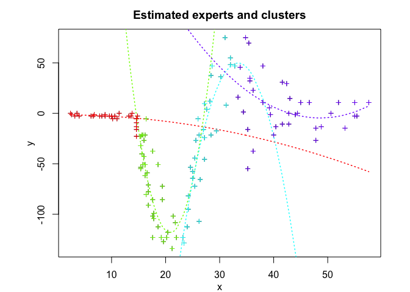
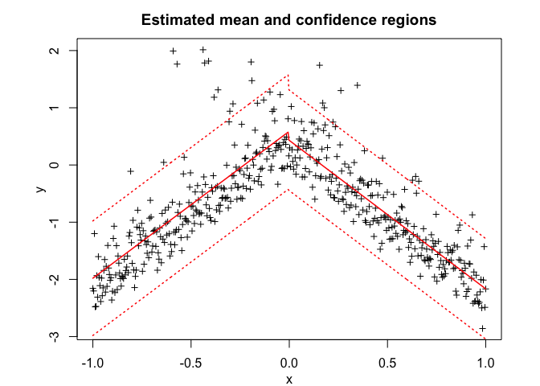

<!-- README.md is generated from README.Rmd. Please edit that file -->

# **MEteorits:** Mixtures-of-ExperTs modEling for cOmplex and non-noRmal dIsTributions

<!-- badges: start -->

[](https://travis-ci.org/fchamroukhi/MEteorits)
<!-- badges: end -->

MEteorits is an open source toolbox (available in R and Matlab)
containing several original and flexible mixtures-of-experts models to
model, cluster and classify heteregenous data in many complex situations
where the data are distributed according to non-normal and possibly
skewed distributions, and when they might be corrupted by atypical
observations. The toolbox also contains sparse mixture-of-experts models
for high-dimensional data.

Our (dis-)covered meteorits are for instance the following ones:

  - NMoE;
  - tMoE;
  - SNMoE;
  - StMoE.

The models and algorithms are developped and written in Matlab by Faicel
Chamroukhi, and translated and designed into R packages by Florian
Lecocq, Marius Bartcus and Faicel Chamroukhi.

# Installation

You can install the development version of MEteorits from
[GitHub](https://github.com/fchamroukhi/MEteorits) with:

``` r
# install.packages("devtools")
devtools::install_github("fchamroukhi/MEteorits")
```

To build *vignettes* for examples of usage, type the command below
instead:

``` r
# install.packages("devtools")
devtools::install_github("fchamroukhi/MEteorits", 
                         build_opts = c("--no-resave-data", "--no-manual"), 
                         build_vignettes = TRUE)
```

Use the following command to display vignettes:

``` r
browseVignettes("meteorits")
```

# Usage

``` r
library(meteorits)
```

<details>

<summary>NMoE</summary>

``` r
# Application to a simuated data set

n <- 500 # Size of the sample
alphak <- matrix(c(0, 8), ncol = 1) # Parameters of the gating network
betak <- matrix(c(0, -2.5, 0, 2.5), ncol = 2) # Regression coefficients of the experts
sigmak <- c(1, 1) # Standard deviations of the experts
x <- seq.int(from = -1, to = 1, length.out = n) # Inputs (predictors)

# Generate sample of size n
sample <- sampleUnivNMoE(alphak = alphak, betak = betak, sigmak = sigmak, x = x)
y <- sample$y

K <- 2 # Number of regressors/experts
p <- 1 # Order of the polynomial regression (regressors/experts)
q <- 1 # Order of the logistic regression (gating network)

n_tries <- 1
max_iter <- 1500
threshold <- 1e-5
verbose <- TRUE
verbose_IRLS <- FALSE

nmoe <- emNMoE(X = x, Y = y, K, p, q, n_tries, max_iter, 
               threshold, verbose, verbose_IRLS)
#> EM NMoE: Iteration: 1 | log-likelihood: -846.2408679117
#> EM NMoE: Iteration: 2 | log-likelihood: -846.0580429511
#> EM NMoE: Iteration: 3 | log-likelihood: -845.850869519108
#> EM NMoE: Iteration: 4 | log-likelihood: -845.402503511155
#> EM NMoE: Iteration: 5 | log-likelihood: -844.318379081497
#> EM NMoE: Iteration: 6 | log-likelihood: -841.749905444356
#> EM NMoE: Iteration: 7 | log-likelihood: -836.097457073013
#> EM NMoE: Iteration: 8 | log-likelihood: -825.21528038541
#> EM NMoE: Iteration: 9 | log-likelihood: -807.91185874157
#> EM NMoE: Iteration: 10 | log-likelihood: -785.900549764824
#> EM NMoE: Iteration: 11 | log-likelihood: -763.758121461945
#> EM NMoE: Iteration: 12 | log-likelihood: -746.819710752385
#> EM NMoE: Iteration: 13 | log-likelihood: -737.368817474287
#> EM NMoE: Iteration: 14 | log-likelihood: -733.056140752597
#> EM NMoE: Iteration: 15 | log-likelihood: -731.064904632692
#> EM NMoE: Iteration: 16 | log-likelihood: -730.038240066865
#> EM NMoE: Iteration: 17 | log-likelihood: -729.454056304505
#> EM NMoE: Iteration: 18 | log-likelihood: -729.10040455936
#> EM NMoE: Iteration: 19 | log-likelihood: -728.878190932999
#> EM NMoE: Iteration: 20 | log-likelihood: -728.734937170804
#> EM NMoE: Iteration: 21 | log-likelihood: -728.640631146229
#> EM NMoE: Iteration: 22 | log-likelihood: -728.577359649717
#> EM NMoE: Iteration: 23 | log-likelihood: -728.534145948424
#> EM NMoE: Iteration: 24 | log-likelihood: -728.504129418441
#> EM NMoE: Iteration: 25 | log-likelihood: -728.482945207955
#> EM NMoE: Iteration: 26 | log-likelihood: -728.467770068864
#> EM NMoE: Iteration: 27 | log-likelihood: -728.456747410086
#> EM NMoE: Iteration: 28 | log-likelihood: -728.448636827676
#> EM NMoE: Iteration: 29 | log-likelihood: -728.442596917531

nmoe$plot()
```


``` r
# Application to a real data set

data("tempanomalies")
x <- tempanomalies$Year
y <- tempanomalies$AnnualAnomaly

K <- 2 # Number of regressors/experts
p <- 1 # Order of the polynomial regression (regressors/experts)
q <- 1 # Order of the logistic regression (gating network)

n_tries <- 1
max_iter <- 1500
threshold <- 1e-5
verbose <- TRUE
verbose_IRLS <- FALSE

nmoe <- emNMoE(X = x, Y = y, K, p, q, n_tries, max_iter, 
               threshold, verbose, verbose_IRLS)
#> EM NMoE: Iteration: 1 | log-likelihood: 49.0630293154596
#> EM NMoE: Iteration: 2 | log-likelihood: 49.8859972059857
#> EM NMoE: Iteration: 3 | log-likelihood: 51.8661076852942
#> EM NMoE: Iteration: 4 | log-likelihood: 56.2852146055766
#> EM NMoE: Iteration: 5 | log-likelihood: 63.2954524331353
#> EM NMoE: Iteration: 6 | log-likelihood: 69.8335604419206
#> EM NMoE: Iteration: 7 | log-likelihood: 74.0660974494216
#> EM NMoE: Iteration: 8 | log-likelihood: 77.0911289123799
#> EM NMoE: Iteration: 9 | log-likelihood: 79.8921748831909
#> EM NMoE: Iteration: 10 | log-likelihood: 83.2226649288249
#> EM NMoE: Iteration: 11 | log-likelihood: 87.6357862857968
#> EM NMoE: Iteration: 12 | log-likelihood: 92.4173882014576
#> EM NMoE: Iteration: 13 | log-likelihood: 95.2207265443062
#> EM NMoE: Iteration: 14 | log-likelihood: 96.2685966846177
#> EM NMoE: Iteration: 15 | log-likelihood: 96.6909350227241
#> EM NMoE: Iteration: 16 | log-likelihood: 96.9219029026381
#> EM NMoE: Iteration: 17 | log-likelihood: 97.0953432189881
#> EM NMoE: Iteration: 18 | log-likelihood: 97.2506947768351
#> EM NMoE: Iteration: 19 | log-likelihood: 97.3989687529799
#> EM NMoE: Iteration: 20 | log-likelihood: 97.542403486114
#> EM NMoE: Iteration: 21 | log-likelihood: 97.6808634017027
#> EM NMoE: Iteration: 22 | log-likelihood: 97.8142523995007
#> EM NMoE: Iteration: 23 | log-likelihood: 97.9434383159194
#> EM NMoE: Iteration: 24 | log-likelihood: 98.0703830229131
#> EM NMoE: Iteration: 25 | log-likelihood: 98.1977713078091
#> EM NMoE: Iteration: 26 | log-likelihood: 98.3284151907328
#> EM NMoE: Iteration: 27 | log-likelihood: 98.4647250706784
#> EM NMoE: Iteration: 28 | log-likelihood: 98.6084620986378
#> EM NMoE: Iteration: 29 | log-likelihood: 98.7608362493497
#> EM NMoE: Iteration: 30 | log-likelihood: 98.9228718009139
#> EM NMoE: Iteration: 31 | log-likelihood: 99.0958880428057
#> EM NMoE: Iteration: 32 | log-likelihood: 99.2819669634466
#> EM NMoE: Iteration: 33 | log-likelihood: 99.4843991719234
#> EM NMoE: Iteration: 34 | log-likelihood: 99.7082440529067
#> EM NMoE: Iteration: 35 | log-likelihood: 99.9612122966997
#> EM NMoE: Iteration: 36 | log-likelihood: 100.255043234762
#> EM NMoE: Iteration: 37 | log-likelihood: 100.607219953111
#> EM NMoE: Iteration: 38 | log-likelihood: 101.040763270218
#> EM NMoE: Iteration: 39 | log-likelihood: 101.569518979235
#> EM NMoE: Iteration: 40 | log-likelihood: 102.132107944171
#> EM NMoE: Iteration: 41 | log-likelihood: 102.56234759294
#> EM NMoE: Iteration: 42 | log-likelihood: 102.693850422719
#> EM NMoE: Iteration: 43 | log-likelihood: 102.721209355015
#> EM NMoE: Iteration: 44 | log-likelihood: 102.721216372578

nmoe$plot()
```


</details>

<details>

<summary>TMoE</summary>

``` r
# Application to a simuated data set

n <- 500 # Size of the sample
alphak <- matrix(c(0, 8), ncol = 1) # Parameters of the gating network
betak <- matrix(c(0, -2.5, 0, 2.5), ncol = 2) # Regression coefficients of the experts
sigmak <- c(0.5, 0.5) # Standard deviations of the experts
nuk <- c(5, 7) # Degrees of freedom of the experts network t densities
x <- seq.int(from = -1, to = 1, length.out = n) # Inputs (predictors)

# Generate sample of size n
sample <- sampleUnivTMoE(alphak = alphak, betak = betak, sigmak = sigmak, 
                         nuk = nuk, x = x)
y <- sample$y

K <- 2 # Number of regressors/experts
p <- 1 # Order of the polynomial regression (regressors/experts)
q <- 1 # Order of the logistic regression (gating network)

n_tries <- 1
max_iter <- 1500
threshold <- 1e-5
verbose <- TRUE
verbose_IRLS <- FALSE

tmoe <- emTMoE(X = x, Y = y, K, p, q, n_tries, max_iter, 
               threshold, verbose, verbose_IRLS)
#> EM - tMoE: Iteration: 1 | log-likelihood: -501.442226390342
#> EM - tMoE: Iteration: 2 | log-likelihood: -485.938240159397
#> EM - tMoE: Iteration: 3 | log-likelihood: -484.744756232688
#> EM - tMoE: Iteration: 4 | log-likelihood: -484.151945984403
#> EM - tMoE: Iteration: 5 | log-likelihood: -483.752847689575
#> EM - tMoE: Iteration: 6 | log-likelihood: -483.474874918989
#> EM - tMoE: Iteration: 7 | log-likelihood: -483.270522119759
#> EM - tMoE: Iteration: 8 | log-likelihood: -483.106604038067
#> EM - tMoE: Iteration: 9 | log-likelihood: -482.961471238919
#> EM - tMoE: Iteration: 10 | log-likelihood: -482.826452436443
#> EM - tMoE: Iteration: 11 | log-likelihood: -482.704128495062
#> EM - tMoE: Iteration: 12 | log-likelihood: -482.603321814467
#> EM - tMoE: Iteration: 13 | log-likelihood: -482.530497820587
#> EM - tMoE: Iteration: 14 | log-likelihood: -482.484146158885
#> EM - tMoE: Iteration: 15 | log-likelihood: -482.457595799095
#> EM - tMoE: Iteration: 16 | log-likelihood: -482.443266666469
#> EM - tMoE: Iteration: 17 | log-likelihood: -482.435738864791
#> EM - tMoE: Iteration: 18 | log-likelihood: -482.431754130335

tmoe$plot()
```


``` r
# Application to a real data set

library(MASS)
data("mcycle")
x <- mcycle$times
y <- mcycle$accel

K <- 4 # Number of regressors/experts
p <- 2 # Order of the polynomial regression (regressors/experts)
q <- 1 # Order of the logistic regression (gating network)

n_tries <- 1
max_iter <- 1500
threshold <- 1e-5
verbose <- TRUE
verbose_IRLS <- FALSE

tmoe <- emTMoE(X = x, Y = y, K, p, q, n_tries, max_iter, 
               threshold, verbose, verbose_IRLS)
#> EM - tMoE: Iteration: 1 | log-likelihood: -588.402398316914
#> EM - tMoE: Iteration: 2 | log-likelihood: -586.011586798668
#> EM - tMoE: Iteration: 3 | log-likelihood: -584.62961086596
#> EM - tMoE: Iteration: 4 | log-likelihood: -581.354410060619
#> EM - tMoE: Iteration: 5 | log-likelihood: -572.510716587011
#> EM - tMoE: Iteration: 6 | log-likelihood: -564.681527802675
#> EM - tMoE: Iteration: 7 | log-likelihood: -560.649290155573
#> EM - tMoE: Iteration: 8 | log-likelihood: -559.376491477871
#> EM - tMoE: Iteration: 9 | log-likelihood: -558.652263968648
#> EM - tMoE: Iteration: 10 | log-likelihood: -557.937223039051
#> EM - tMoE: Iteration: 11 | log-likelihood: -557.182765856288
#> EM - tMoE: Iteration: 12 | log-likelihood: -556.401454378386
#> EM - tMoE: Iteration: 13 | log-likelihood: -555.618606931903
#> EM - tMoE: Iteration: 14 | log-likelihood: -554.866411523089
#> EM - tMoE: Iteration: 15 | log-likelihood: -554.182378388625
#> EM - tMoE: Iteration: 16 | log-likelihood: -553.604230076466
#> EM - tMoE: Iteration: 17 | log-likelihood: -553.155114181843
#> EM - tMoE: Iteration: 18 | log-likelihood: -552.832008335024
#> EM - tMoE: Iteration: 19 | log-likelihood: -552.612097960992
#> EM - tMoE: Iteration: 20 | log-likelihood: -552.467245143004
#> EM - tMoE: Iteration: 21 | log-likelihood: -552.373313460135
#> EM - tMoE: Iteration: 22 | log-likelihood: -552.312689956053
#> EM - tMoE: Iteration: 23 | log-likelihood: -552.273493829534
#> EM - tMoE: Iteration: 24 | log-likelihood: -552.248007708785
#> EM - tMoE: Iteration: 25 | log-likelihood: -552.231300651612
#> EM - tMoE: Iteration: 26 | log-likelihood: -552.220238263212
#> EM - tMoE: Iteration: 27 | log-likelihood: -552.212826646834
#> EM - tMoE: Iteration: 28 | log-likelihood: -552.207793482402

tmoe$plot()
```



</details>

<details>

<summary>SNMoE</summary>

``` r
# Application to a simulated data set

n <- 500 # Size of the sample
alphak <- matrix(c(0, 8), ncol = 1) # Parameters of the gating network
betak <- matrix(c(0, -2.5, 0, 2.5), ncol = 2) # Regression coefficients of the experts
lambdak <- c(3, 5) # Skewness parameters of the experts
sigmak <- c(1, 1) # Standard deviations of the experts
x <- seq.int(from = -1, to = 1, length.out = n) # Inputs (predictors)

# Generate sample of size n
sample <- sampleUnivSNMoE(alphak = alphak, betak = betak, sigmak = sigmak, 
                          lambdak = lambdak, x = x)
y <- sample$y

K <- 2 # Number of regressors/experts
p <- 1 # Order of the polynomial regression (regressors/experts)
q <- 1 # Order of the logistic regression (gating network)

n_tries <- 1
max_iter <- 1500
threshold <- 1e-6
verbose <- TRUE
verbose_IRLS <- FALSE

snmoe <- emSNMoE(X = x, Y = y, K, p, q, n_tries, max_iter, 
                 threshold, verbose, verbose_IRLS)
#> EM - SNMoE: Iteration: 1 | log-likelihood: -559.108337517679
#> EM - SNMoE: Iteration: 2 | log-likelihood: -540.809732255689
#> EM - SNMoE: Iteration: 3 | log-likelihood: -540.123709453347
#> EM - SNMoE: Iteration: 4 | log-likelihood: -539.85179948476
#> EM - SNMoE: Iteration: 5 | log-likelihood: -539.688290844757
#> EM - SNMoE: Iteration: 6 | log-likelihood: -539.550497703622
#> EM - SNMoE: Iteration: 7 | log-likelihood: -539.413540647268
#> EM - SNMoE: Iteration: 8 | log-likelihood: -539.268318617796
#> EM - SNMoE: Iteration: 9 | log-likelihood: -539.1105810891
#> EM - SNMoE: Iteration: 10 | log-likelihood: -538.937845246364
#> EM - SNMoE: Iteration: 11 | log-likelihood: -538.748397594839
#> EM - SNMoE: Iteration: 12 | log-likelihood: -538.54096388786
#> EM - SNMoE: Iteration: 13 | log-likelihood: -538.314690087132
#> EM - SNMoE: Iteration: 14 | log-likelihood: -538.068946895172
#> EM - SNMoE: Iteration: 15 | log-likelihood: -537.803496429415
#> EM - SNMoE: Iteration: 16 | log-likelihood: -537.518516896377
#> EM - SNMoE: Iteration: 17 | log-likelihood: -537.21446907353
#> EM - SNMoE: Iteration: 18 | log-likelihood: -536.892297143272
#> EM - SNMoE: Iteration: 19 | log-likelihood: -536.553318866436
#> EM - SNMoE: Iteration: 20 | log-likelihood: -536.199311997444
#> EM - SNMoE: Iteration: 21 | log-likelihood: -535.83256060864
#> EM - SNMoE: Iteration: 22 | log-likelihood: -535.455533651573
#> EM - SNMoE: Iteration: 23 | log-likelihood: -535.070986282062
#> EM - SNMoE: Iteration: 24 | log-likelihood: -534.681651491531
#> EM - SNMoE: Iteration: 25 | log-likelihood: -534.291358889841
#> EM - SNMoE: Iteration: 26 | log-likelihood: -533.903534098456
#> EM - SNMoE: Iteration: 27 | log-likelihood: -533.520869237779
#> EM - SNMoE: Iteration: 28 | log-likelihood: -533.146068761575
#> EM - SNMoE: Iteration: 29 | log-likelihood: -532.781979448949
#> EM - SNMoE: Iteration: 30 | log-likelihood: -532.430757115784
#> EM - SNMoE: Iteration: 31 | log-likelihood: -532.093976912869
#> EM - SNMoE: Iteration: 32 | log-likelihood: -531.772671309618
#> EM - SNMoE: Iteration: 33 | log-likelihood: -531.467516900833
#> EM - SNMoE: Iteration: 34 | log-likelihood: -531.178616257947
#> EM - SNMoE: Iteration: 35 | log-likelihood: -530.905949886554
#> EM - SNMoE: Iteration: 36 | log-likelihood: -530.64930070832
#> EM - SNMoE: Iteration: 37 | log-likelihood: -530.408234125616
#> EM - SNMoE: Iteration: 38 | log-likelihood: -530.18233710684
#> EM - SNMoE: Iteration: 39 | log-likelihood: -529.970945432903
#> EM - SNMoE: Iteration: 40 | log-likelihood: -529.773409703438
#> EM - SNMoE: Iteration: 41 | log-likelihood: -529.589050261928
#> EM - SNMoE: Iteration: 42 | log-likelihood: -529.417082162929
#> EM - SNMoE: Iteration: 43 | log-likelihood: -529.257098949084
#> EM - SNMoE: Iteration: 44 | log-likelihood: -529.108348369933
#> EM - SNMoE: Iteration: 45 | log-likelihood: -528.970016228286
#> EM - SNMoE: Iteration: 46 | log-likelihood: -528.841621613961
#> EM - SNMoE: Iteration: 47 | log-likelihood: -528.72247173165
#> EM - SNMoE: Iteration: 48 | log-likelihood: -528.611971964149
#> EM - SNMoE: Iteration: 49 | log-likelihood: -528.509553845825
#> EM - SNMoE: Iteration: 50 | log-likelihood: -528.414653051029
#> EM - SNMoE: Iteration: 51 | log-likelihood: -528.32676527407
#> EM - SNMoE: Iteration: 52 | log-likelihood: -528.2453940011
#> EM - SNMoE: Iteration: 53 | log-likelihood: -528.170044550814
#> EM - SNMoE: Iteration: 54 | log-likelihood: -528.100331585108
#> EM - SNMoE: Iteration: 55 | log-likelihood: -528.035834717126
#> EM - SNMoE: Iteration: 56 | log-likelihood: -527.976157301926
#> EM - SNMoE: Iteration: 57 | log-likelihood: -527.920977243021
#> EM - SNMoE: Iteration: 58 | log-likelihood: -527.869932503203
#> EM - SNMoE: Iteration: 59 | log-likelihood: -527.822718410495
#> EM - SNMoE: Iteration: 60 | log-likelihood: -527.779049008992
#> EM - SNMoE: Iteration: 61 | log-likelihood: -527.738639783397
#> EM - SNMoE: Iteration: 62 | log-likelihood: -527.701281685819
#> EM - SNMoE: Iteration: 63 | log-likelihood: -527.666731753383
#> EM - SNMoE: Iteration: 64 | log-likelihood: -527.634784081495
#> EM - SNMoE: Iteration: 65 | log-likelihood: -527.605220106907
#> EM - SNMoE: Iteration: 66 | log-likelihood: -527.577876958006
#> EM - SNMoE: Iteration: 67 | log-likelihood: -527.552580522833
#> EM - SNMoE: Iteration: 68 | log-likelihood: -527.529173971484
#> EM - SNMoE: Iteration: 69 | log-likelihood: -527.507511698678
#> EM - SNMoE: Iteration: 70 | log-likelihood: -527.487458559854
#> EM - SNMoE: Iteration: 71 | log-likelihood: -527.468921820512
#> EM - SNMoE: Iteration: 72 | log-likelihood: -527.451759020414
#> EM - SNMoE: Iteration: 73 | log-likelihood: -527.435871754064
#> EM - SNMoE: Iteration: 74 | log-likelihood: -527.421162877277
#> EM - SNMoE: Iteration: 75 | log-likelihood: -527.407542854603
#> EM - SNMoE: Iteration: 76 | log-likelihood: -527.394928891593
#> EM - SNMoE: Iteration: 77 | log-likelihood: -527.38324449021
#> EM - SNMoE: Iteration: 78 | log-likelihood: -527.372419200427
#> EM - SNMoE: Iteration: 79 | log-likelihood: -527.362386692478
#> EM - SNMoE: Iteration: 80 | log-likelihood: -527.353087407382
#> EM - SNMoE: Iteration: 81 | log-likelihood: -527.344468075537
#> EM - SNMoE: Iteration: 82 | log-likelihood: -527.336472217864
#> EM - SNMoE: Iteration: 83 | log-likelihood: -527.329056047565
#> EM - SNMoE: Iteration: 84 | log-likelihood: -527.322175560059
#> EM - SNMoE: Iteration: 85 | log-likelihood: -527.315786757392
#> EM - SNMoE: Iteration: 86 | log-likelihood: -527.309857572389
#> EM - SNMoE: Iteration: 87 | log-likelihood: -527.304350352047
#> EM - SNMoE: Iteration: 88 | log-likelihood: -527.299228767465
#> EM - SNMoE: Iteration: 89 | log-likelihood: -527.29446529488
#> EM - SNMoE: Iteration: 90 | log-likelihood: -527.290029954788
#> EM - SNMoE: Iteration: 91 | log-likelihood: -527.285905326813
#> EM - SNMoE: Iteration: 92 | log-likelihood: -527.282062671924
#> EM - SNMoE: Iteration: 93 | log-likelihood: -527.278480184303
#> EM - SNMoE: Iteration: 94 | log-likelihood: -527.275138555043
#> EM - SNMoE: Iteration: 95 | log-likelihood: -527.27201921122
#> EM - SNMoE: Iteration: 96 | log-likelihood: -527.269104099756
#> EM - SNMoE: Iteration: 97 | log-likelihood: -527.266377832606
#> EM - SNMoE: Iteration: 98 | log-likelihood: -527.263824266612
#> EM - SNMoE: Iteration: 99 | log-likelihood: -527.261431078528
#> EM - SNMoE: Iteration: 100 | log-likelihood: -527.259182016971
#> EM - SNMoE: Iteration: 101 | log-likelihood: -527.257065670923
#> EM - SNMoE: Iteration: 102 | log-likelihood: -527.255071646274
#> EM - SNMoE: Iteration: 103 | log-likelihood: -527.253198699865
#> EM - SNMoE: Iteration: 104 | log-likelihood: -527.251427645741
#> EM - SNMoE: Iteration: 105 | log-likelihood: -527.249750608149
#> EM - SNMoE: Iteration: 106 | log-likelihood: -527.248158665311
#> EM - SNMoE: Iteration: 107 | log-likelihood: -527.246644575188
#> EM - SNMoE: Iteration: 108 | log-likelihood: -527.245200940967
#> EM - SNMoE: Iteration: 109 | log-likelihood: -527.243811980031
#> EM - SNMoE: Iteration: 110 | log-likelihood: -527.242476936789
#> EM - SNMoE: Iteration: 111 | log-likelihood: -527.241193586702
#> EM - SNMoE: Iteration: 112 | log-likelihood: -527.239950160003
#> EM - SNMoE: Iteration: 113 | log-likelihood: -527.238743024397
#> EM - SNMoE: Iteration: 114 | log-likelihood: -527.237565840808
#> EM - SNMoE: Iteration: 115 | log-likelihood: -527.236411922746
#> EM - SNMoE: Iteration: 116 | log-likelihood: -527.235274528949
#> EM - SNMoE: Iteration: 117 | log-likelihood: -527.234151836378
#> EM - SNMoE: Iteration: 118 | log-likelihood: -527.233038541943
#> EM - SNMoE: Iteration: 119 | log-likelihood: -527.231930008198
#> EM - SNMoE: Iteration: 120 | log-likelihood: -527.230827816866
#> EM - SNMoE: Iteration: 121 | log-likelihood: -527.229721402268
#> EM - SNMoE: Iteration: 122 | log-likelihood: -527.228606310168
#> EM - SNMoE: Iteration: 123 | log-likelihood: -527.227478148774
#> EM - SNMoE: Iteration: 124 | log-likelihood: -527.226333263792
#> EM - SNMoE: Iteration: 125 | log-likelihood: -527.225166412672
#> EM - SNMoE: Iteration: 126 | log-likelihood: -527.223972581148
#> EM - SNMoE: Iteration: 127 | log-likelihood: -527.22274658922
#> EM - SNMoE: Iteration: 128 | log-likelihood: -527.22148763042
#> EM - SNMoE: Iteration: 129 | log-likelihood: -527.220188607543
#> EM - SNMoE: Iteration: 130 | log-likelihood: -527.218831230514
#> EM - SNMoE: Iteration: 131 | log-likelihood: -527.217413580634
#> EM - SNMoE: Iteration: 132 | log-likelihood: -527.215932385643
#> EM - SNMoE: Iteration: 133 | log-likelihood: -527.21439306722
#> EM - SNMoE: Iteration: 134 | log-likelihood: -527.212772738878
#> EM - SNMoE: Iteration: 135 | log-likelihood: -527.211065619809
#> EM - SNMoE: Iteration: 136 | log-likelihood: -527.20927789093
#> EM - SNMoE: Iteration: 137 | log-likelihood: -527.20739669719
#> EM - SNMoE: Iteration: 138 | log-likelihood: -527.205409924403
#> EM - SNMoE: Iteration: 139 | log-likelihood: -527.203291666435
#> EM - SNMoE: Iteration: 140 | log-likelihood: -527.201043662135
#> EM - SNMoE: Iteration: 141 | log-likelihood: -527.198652133666
#> EM - SNMoE: Iteration: 142 | log-likelihood: -527.196102645445
#> EM - SNMoE: Iteration: 143 | log-likelihood: -527.193384896555
#> EM - SNMoE: Iteration: 144 | log-likelihood: -527.190478812889
#> EM - SNMoE: Iteration: 145 | log-likelihood: -527.187372173148
#> EM - SNMoE: Iteration: 146 | log-likelihood: -527.184043085039
#> EM - SNMoE: Iteration: 147 | log-likelihood: -527.180465979169
#> EM - SNMoE: Iteration: 148 | log-likelihood: -527.176630878056
#> EM - SNMoE: Iteration: 149 | log-likelihood: -527.172486516421
#> EM - SNMoE: Iteration: 150 | log-likelihood: -527.167993881761
#> EM - SNMoE: Iteration: 151 | log-likelihood: -527.163156710382
#> EM - SNMoE: Iteration: 152 | log-likelihood: -527.157922534482
#> EM - SNMoE: Iteration: 153 | log-likelihood: -527.152224966626
#> EM - SNMoE: Iteration: 154 | log-likelihood: -527.146026829517
#> EM - SNMoE: Iteration: 155 | log-likelihood: -527.139302298743
#> EM - SNMoE: Iteration: 156 | log-likelihood: -527.131984311004
#> EM - SNMoE: Iteration: 157 | log-likelihood: -527.123995825194
#> EM - SNMoE: Iteration: 158 | log-likelihood: -527.115276294844
#> EM - SNMoE: Iteration: 159 | log-likelihood: -527.105732196322
#> EM - SNMoE: Iteration: 160 | log-likelihood: -527.095260181681
#> EM - SNMoE: Iteration: 161 | log-likelihood: -527.08375428803
#> EM - SNMoE: Iteration: 162 | log-likelihood: -527.071104063484
#> EM - SNMoE: Iteration: 163 | log-likelihood: -527.057159432014
#> EM - SNMoE: Iteration: 164 | log-likelihood: -527.041763294158
#> EM - SNMoE: Iteration: 165 | log-likelihood: -527.024728461649
#> EM - SNMoE: Iteration: 166 | log-likelihood: -527.005866677979
#> EM - SNMoE: Iteration: 167 | log-likelihood: -526.984928524659
#> EM - SNMoE: Iteration: 168 | log-likelihood: -526.96160545843
#> EM - SNMoE: Iteration: 169 | log-likelihood: -526.935628119303
#> EM - SNMoE: Iteration: 170 | log-likelihood: -526.906653493433
#> EM - SNMoE: Iteration: 171 | log-likelihood: -526.874207435095
#> EM - SNMoE: Iteration: 172 | log-likelihood: -526.83778640281
#> EM - SNMoE: Iteration: 173 | log-likelihood: -526.796855437024
#> EM - SNMoE: Iteration: 174 | log-likelihood: -526.750778024099
#> EM - SNMoE: Iteration: 175 | log-likelihood: -526.698814945505
#> EM - SNMoE: Iteration: 176 | log-likelihood: -526.640095298062
#> EM - SNMoE: Iteration: 177 | log-likelihood: -526.573627831419
#> EM - SNMoE: Iteration: 178 | log-likelihood: -526.498283626578
#> EM - SNMoE: Iteration: 179 | log-likelihood: -526.412709139445
#> EM - SNMoE: Iteration: 180 | log-likelihood: -526.315452635759
#> EM - SNMoE: Iteration: 181 | log-likelihood: -526.204819645591
#> EM - SNMoE: Iteration: 182 | log-likelihood: -526.078706704207
#> EM - SNMoE: Iteration: 183 | log-likelihood: -525.934865281639
#> EM - SNMoE: Iteration: 184 | log-likelihood: -525.770870559306
#> EM - SNMoE: Iteration: 185 | log-likelihood: -525.583816899346
#> EM - SNMoE: Iteration: 186 | log-likelihood: -525.37047976235
#> EM - SNMoE: Iteration: 187 | log-likelihood: -525.127577717174
#> EM - SNMoE: Iteration: 188 | log-likelihood: -524.851518303123
#> EM - SNMoE: Iteration: 189 | log-likelihood: -524.538483059602
#> EM - SNMoE: Iteration: 190 | log-likelihood: -524.184586169252
#> EM - SNMoE: Iteration: 191 | log-likelihood: -523.786084312852
#> EM - SNMoE: Iteration: 192 | log-likelihood: -523.339633499236
#> EM - SNMoE: Iteration: 193 | log-likelihood: -522.842090984994
#> EM - SNMoE: Iteration: 194 | log-likelihood: -522.291219321831
#> EM - SNMoE: Iteration: 195 | log-likelihood: -521.685882043021
#> EM - SNMoE: Iteration: 196 | log-likelihood: -521.026046470231
#> EM - SNMoE: Iteration: 197 | log-likelihood: -520.313409238053
#> EM - SNMoE: Iteration: 198 | log-likelihood: -519.551088399631
#> EM - SNMoE: Iteration: 199 | log-likelihood: -518.743352762443
#> EM - SNMoE: Iteration: 200 | log-likelihood: -517.896791152922
#> EM - SNMoE: Iteration: 201 | log-likelihood: -517.01884171535
#> EM - SNMoE: Iteration: 202 | log-likelihood: -516.118053523867
#> EM - SNMoE: Iteration: 203 | log-likelihood: -515.203542583902
#> EM - SNMoE: Iteration: 204 | log-likelihood: -514.284684772284
#> EM - SNMoE: Iteration: 205 | log-likelihood: -513.370570194037
#> EM - SNMoE: Iteration: 206 | log-likelihood: -512.469668092226
#> EM - SNMoE: Iteration: 207 | log-likelihood: -511.589706598908
#> EM - SNMoE: Iteration: 208 | log-likelihood: -510.737222343838
#> EM - SNMoE: Iteration: 209 | log-likelihood: -509.917476540342
#> EM - SNMoE: Iteration: 210 | log-likelihood: -509.134699889293
#> EM - SNMoE: Iteration: 211 | log-likelihood: -508.391618698338
#> EM - SNMoE: Iteration: 212 | log-likelihood: -507.689964768487
#> EM - SNMoE: Iteration: 213 | log-likelihood: -507.03056682399
#> EM - SNMoE: Iteration: 214 | log-likelihood: -506.413334238135
#> EM - SNMoE: Iteration: 215 | log-likelihood: -505.837331249717
#> EM - SNMoE: Iteration: 216 | log-likelihood: -505.301201024752
#> EM - SNMoE: Iteration: 217 | log-likelihood: -504.802240369757
#> EM - SNMoE: Iteration: 218 | log-likelihood: -504.336965331264
#> EM - SNMoE: Iteration: 219 | log-likelihood: -503.900441520042
#> EM - SNMoE: Iteration: 220 | log-likelihood: -503.485584726667
#> EM - SNMoE: Iteration: 221 | log-likelihood: -503.082422003138
#> EM - SNMoE: Iteration: 222 | log-likelihood: -502.67839300375
#> EM - SNMoE: Iteration: 223 | log-likelihood: -502.263641144839
#> EM - SNMoE: Iteration: 224 | log-likelihood: -501.841652318059
#> EM - SNMoE: Iteration: 225 | log-likelihood: -501.435698670403
#> EM - SNMoE: Iteration: 226 | log-likelihood: -501.074772480517
#> EM - SNMoE: Iteration: 227 | log-likelihood: -500.770116613261
#> EM - SNMoE: Iteration: 228 | log-likelihood: -500.512841355847
#> EM - SNMoE: Iteration: 229 | log-likelihood: -500.288515281969
#> EM - SNMoE: Iteration: 230 | log-likelihood: -500.087792065461
#> EM - SNMoE: Iteration: 231 | log-likelihood: -499.904882364941
#> EM - SNMoE: Iteration: 232 | log-likelihood: -499.737774229174
#> EM - SNMoE: Iteration: 233 | log-likelihood: -499.584435140419
#> EM - SNMoE: Iteration: 234 | log-likelihood: -499.443606962663
#> EM - SNMoE: Iteration: 235 | log-likelihood: -499.314233657087
#> EM - SNMoE: Iteration: 236 | log-likelihood: -499.195333963767
#> EM - SNMoE: Iteration: 237 | log-likelihood: -499.086070067261
#> EM - SNMoE: Iteration: 238 | log-likelihood: -498.985654790978
#> EM - SNMoE: Iteration: 239 | log-likelihood: -498.893292558812
#> EM - SNMoE: Iteration: 240 | log-likelihood: -498.808365759387
#> EM - SNMoE: Iteration: 241 | log-likelihood: -498.730245582417
#> EM - SNMoE: Iteration: 242 | log-likelihood: -498.65834797819
#> EM - SNMoE: Iteration: 243 | log-likelihood: -498.5921831559
#> EM - SNMoE: Iteration: 244 | log-likelihood: -498.531269043542
#> EM - SNMoE: Iteration: 245 | log-likelihood: -498.475069719983
#> EM - SNMoE: Iteration: 246 | log-likelihood: -498.423127391148
#> EM - SNMoE: Iteration: 247 | log-likelihood: -498.375290413474
#> EM - SNMoE: Iteration: 248 | log-likelihood: -498.33116617036
#> EM - SNMoE: Iteration: 249 | log-likelihood: -498.29044147591
#> EM - SNMoE: Iteration: 250 | log-likelihood: -498.252837054717
#> EM - SNMoE: Iteration: 251 | log-likelihood: -498.218097984362
#> EM - SNMoE: Iteration: 252 | log-likelihood: -498.185991376476
#> EM - SNMoE: Iteration: 253 | log-likelihood: -498.156304419196
#> EM - SNMoE: Iteration: 254 | log-likelihood: -498.128842586979
#> EM - SNMoE: Iteration: 255 | log-likelihood: -498.103428005112
#> EM - SNMoE: Iteration: 256 | log-likelihood: -498.079897957954
#> EM - SNMoE: Iteration: 257 | log-likelihood: -498.05810353006
#> EM - SNMoE: Iteration: 258 | log-likelihood: -498.037908369737
#> EM - SNMoE: Iteration: 259 | log-likelihood: -498.019187565005
#> EM - SNMoE: Iteration: 260 | log-likelihood: -498.001826622536
#> EM - SNMoE: Iteration: 261 | log-likelihood: -497.985701041173
#> EM - SNMoE: Iteration: 262 | log-likelihood: -497.970735181743
#> EM - SNMoE: Iteration: 263 | log-likelihood: -497.956840868541
#> EM - SNMoE: Iteration: 264 | log-likelihood: -497.943935117723
#> EM - SNMoE: Iteration: 265 | log-likelihood: -497.931941707609
#> EM - SNMoE: Iteration: 266 | log-likelihood: -497.92079185517
#> EM - SNMoE: Iteration: 267 | log-likelihood: -497.910422350403
#> EM - SNMoE: Iteration: 268 | log-likelihood: -497.900775026746
#> EM - SNMoE: Iteration: 269 | log-likelihood: -497.891796327359
#> EM - SNMoE: Iteration: 270 | log-likelihood: -497.883436912971
#> EM - SNMoE: Iteration: 271 | log-likelihood: -497.875651306047
#> EM - SNMoE: Iteration: 272 | log-likelihood: -497.868397567278
#> EM - SNMoE: Iteration: 273 | log-likelihood: -497.86163700109
#> EM - SNMoE: Iteration: 274 | log-likelihood: -497.855333887343
#> EM - SNMoE: Iteration: 275 | log-likelihood: -497.849455236718
#> EM - SNMoE: Iteration: 276 | log-likelihood: -497.843970567566
#> EM - SNMoE: Iteration: 277 | log-likelihood: -497.838851702214
#> EM - SNMoE: Iteration: 278 | log-likelihood: -497.834072580934
#> EM - SNMoE: Iteration: 279 | log-likelihood: -497.829609091944
#> EM - SNMoE: Iteration: 280 | log-likelihood: -497.825438915968
#> EM - SNMoE: Iteration: 281 | log-likelihood: -497.821541384045
#> EM - SNMoE: Iteration: 282 | log-likelihood: -497.817897347361
#> EM - SNMoE: Iteration: 283 | log-likelihood: -497.81448905805
#> EM - SNMoE: Iteration: 284 | log-likelihood: -497.811300059951
#> EM - SNMoE: Iteration: 285 | log-likelihood: -497.808315088456
#> EM - SNMoE: Iteration: 286 | log-likelihood: -497.805519978633
#> EM - SNMoE: Iteration: 287 | log-likelihood: -497.802901580892
#> EM - SNMoE: Iteration: 288 | log-likelihood: -497.800447683542
#> EM - SNMoE: Iteration: 289 | log-likelihood: -497.798146941631
#> EM - SNMoE: Iteration: 290 | log-likelihood: -497.79598881153
#> EM - SNMoE: Iteration: 291 | log-likelihood: -497.79396349076
#> EM - SNMoE: Iteration: 292 | log-likelihood: -497.792061862623
#> EM - SNMoE: Iteration: 293 | log-likelihood: -497.790275445221
#> EM - SNMoE: Iteration: 294 | log-likelihood: -497.788596344493
#> EM - SNMoE: Iteration: 295 | log-likelihood: -497.787017210941
#> EM - SNMoE: Iteration: 296 | log-likelihood: -497.785531199719
#> EM - SNMoE: Iteration: 297 | log-likelihood: -497.784131933832
#> EM - SNMoE: Iteration: 298 | log-likelihood: -497.782813470158
#> EM - SNMoE: Iteration: 299 | log-likelihood: -497.781570268096
#> EM - SNMoE: Iteration: 300 | log-likelihood: -497.780397160588
#> EM - SNMoE: Iteration: 301 | log-likelihood: -497.779289327363
#> EM - SNMoE: Iteration: 302 | log-likelihood: -497.778242270188
#> EM - SNMoE: Iteration: 303 | log-likelihood: -497.777251789994
#> EM - SNMoE: Iteration: 304 | log-likelihood: -497.776313965709
#> EM - SNMoE: Iteration: 305 | log-likelihood: -497.775425134673
#> EM - SNMoE: Iteration: 306 | log-likelihood: -497.774581874509
#> EM - SNMoE: Iteration: 307 | log-likelihood: -497.773780986337
#> EM - SNMoE: Iteration: 308 | log-likelihood: -497.773019479224
#> EM - SNMoE: Iteration: 309 | log-likelihood: -497.772294555774
#> EM - SNMoE: Iteration: 310 | log-likelihood: -497.771603598787
#> EM - SNMoE: Iteration: 311 | log-likelihood: -497.770944158875
#> EM - SNMoE: Iteration: 312 | log-likelihood: -497.770313942994
#> EM - SNMoE: Iteration: 313 | log-likelihood: -497.769710803805
#> EM - SNMoE: Iteration: 314 | log-likelihood: -497.769132729806
#> EM - SNMoE: Iteration: 315 | log-likelihood: -497.768577836184
#> EM - SNMoE: Iteration: 316 | log-likelihood: -497.768044356323
#> EM - SNMoE: Iteration: 317 | log-likelihood: -497.767530633932
#> EM - SNMoE: Iteration: 318 | log-likelihood: -497.767035115741

snmoe$plot()
```


``` r
# Application to a real data set

data("tempanomalies")
x <- tempanomalies$Year
y <- tempanomalies$AnnualAnomaly

K <- 2 # Number of regressors/experts
p <- 1 # Order of the polynomial regression (regressors/experts)
q <- 1 # Order of the logistic regression (gating network)

n_tries <- 1
max_iter <- 1500
threshold <- 1e-6
verbose <- TRUE
verbose_IRLS <- FALSE

snmoe <- emSNMoE(X = x, Y = y, K, p, q, n_tries, max_iter, 
                 threshold, verbose, verbose_IRLS)
#> EM - SNMoE: Iteration: 1 | log-likelihood: 57.7003140359546
#> EM - SNMoE: Iteration: 2 | log-likelihood: 85.6366937556306
#> EM - SNMoE: Iteration: 3 | log-likelihood: 88.2296735309463
#> EM - SNMoE: Iteration: 4 | log-likelihood: 88.7279467519819
#> EM - SNMoE: Iteration: 5 | log-likelihood: 88.9644931804695
#> EM - SNMoE: Iteration: 6 | log-likelihood: 89.1978749260013
#> EM - SNMoE: Iteration: 7 | log-likelihood: 89.3890268939702
#> EM - SNMoE: Iteration: 8 | log-likelihood: 89.5047748757236
#> EM - SNMoE: Iteration: 9 | log-likelihood: 89.5715430498975
#> EM - SNMoE: Iteration: 10 | log-likelihood: 89.6128065120814
#> EM - SNMoE: Iteration: 11 | log-likelihood: 89.6423372164371
#> EM - SNMoE: Iteration: 12 | log-likelihood: 89.6668625738355
#> EM - SNMoE: Iteration: 13 | log-likelihood: 89.6885059662803
#> EM - SNMoE: Iteration: 14 | log-likelihood: 89.707957600445
#> EM - SNMoE: Iteration: 15 | log-likelihood: 89.7257802943325
#> EM - SNMoE: Iteration: 16 | log-likelihood: 89.7422733398146
#> EM - SNMoE: Iteration: 17 | log-likelihood: 89.7575420791599
#> EM - SNMoE: Iteration: 18 | log-likelihood: 89.7716266005579
#> EM - SNMoE: Iteration: 19 | log-likelihood: 89.784559047029
#> EM - SNMoE: Iteration: 20 | log-likelihood: 89.7963731685673
#> EM - SNMoE: Iteration: 21 | log-likelihood: 89.8072364669669
#> EM - SNMoE: Iteration: 22 | log-likelihood: 89.8171858804958
#> EM - SNMoE: Iteration: 23 | log-likelihood: 89.8261071638529
#> EM - SNMoE: Iteration: 24 | log-likelihood: 89.8340636419091
#> EM - SNMoE: Iteration: 25 | log-likelihood: 89.8411221254611
#> EM - SNMoE: Iteration: 26 | log-likelihood: 89.8476794974568
#> EM - SNMoE: Iteration: 27 | log-likelihood: 89.8525570700122
#> EM - SNMoE: Iteration: 28 | log-likelihood: 89.857163517319
#> EM - SNMoE: Iteration: 29 | log-likelihood: 89.861449269321
#> EM - SNMoE: Iteration: 30 | log-likelihood: 89.8653266272302
#> EM - SNMoE: Iteration: 31 | log-likelihood: 89.8693044248493
#> EM - SNMoE: Iteration: 32 | log-likelihood: 89.872626131155
#> EM - SNMoE: Iteration: 33 | log-likelihood: 89.8757158999146
#> EM - SNMoE: Iteration: 34 | log-likelihood: 89.8785419025354
#> EM - SNMoE: Iteration: 35 | log-likelihood: 89.8814901538857
#> EM - SNMoE: Iteration: 36 | log-likelihood: 89.8841039011155
#> EM - SNMoE: Iteration: 37 | log-likelihood: 89.8866284038562
#> EM - SNMoE: Iteration: 38 | log-likelihood: 89.8890399774886
#> EM - SNMoE: Iteration: 39 | log-likelihood: 89.8913663983649
#> EM - SNMoE: Iteration: 40 | log-likelihood: 89.8935270199199
#> EM - SNMoE: Iteration: 41 | log-likelihood: 89.8956053103477
#> EM - SNMoE: Iteration: 42 | log-likelihood: 89.8976433669243
#> EM - SNMoE: Iteration: 43 | log-likelihood: 89.8995921335376
#> EM - SNMoE: Iteration: 44 | log-likelihood: 89.9014674521761
#> EM - SNMoE: Iteration: 45 | log-likelihood: 89.9032679896406
#> EM - SNMoE: Iteration: 46 | log-likelihood: 89.9049983599569
#> EM - SNMoE: Iteration: 47 | log-likelihood: 89.9066677056514
#> EM - SNMoE: Iteration: 48 | log-likelihood: 89.9082819622841
#> EM - SNMoE: Iteration: 49 | log-likelihood: 89.909837524873
#> EM - SNMoE: Iteration: 50 | log-likelihood: 89.9113397565621
#> EM - SNMoE: Iteration: 51 | log-likelihood: 89.9127900135686
#> EM - SNMoE: Iteration: 52 | log-likelihood: 89.9141896533059
#> EM - SNMoE: Iteration: 53 | log-likelihood: 89.9155450539958
#> EM - SNMoE: Iteration: 54 | log-likelihood: 89.916858872021
#> EM - SNMoE: Iteration: 55 | log-likelihood: 89.918126747764
#> EM - SNMoE: Iteration: 56 | log-likelihood: 89.9193523089096
#> EM - SNMoE: Iteration: 57 | log-likelihood: 89.9205392203964
#> EM - SNMoE: Iteration: 58 | log-likelihood: 89.9216869328446
#> EM - SNMoE: Iteration: 59 | log-likelihood: 89.9227973616702
#> EM - SNMoE: Iteration: 60 | log-likelihood: 89.9238748766633
#> EM - SNMoE: Iteration: 61 | log-likelihood: 89.924920243507
#> EM - SNMoE: Iteration: 62 | log-likelihood: 89.9259347384612
#> EM - SNMoE: Iteration: 63 | log-likelihood: 89.9269155932861
#> EM - SNMoE: Iteration: 64 | log-likelihood: 89.9278653323611
#> EM - SNMoE: Iteration: 65 | log-likelihood: 89.9287878793633
#> EM - SNMoE: Iteration: 66 | log-likelihood: 89.9296828772445
#> EM - SNMoE: Iteration: 67 | log-likelihood: 89.9305502529114
#> EM - SNMoE: Iteration: 68 | log-likelihood: 89.9313920755652
#> EM - SNMoE: Iteration: 69 | log-likelihood: 89.9322115593343
#> EM - SNMoE: Iteration: 70 | log-likelihood: 89.9330048775946
#> EM - SNMoE: Iteration: 71 | log-likelihood: 89.9337757547194
#> EM - SNMoE: Iteration: 72 | log-likelihood: 89.9345255458712
#> EM - SNMoE: Iteration: 73 | log-likelihood: 89.935254706132
#> EM - SNMoE: Iteration: 74 | log-likelihood: 89.9359646733731
#> EM - SNMoE: Iteration: 75 | log-likelihood: 89.9366555886973
#> EM - SNMoE: Iteration: 76 | log-likelihood: 89.9373254318325
#> EM - SNMoE: Iteration: 77 | log-likelihood: 89.9379763982743
#> EM - SNMoE: Iteration: 78 | log-likelihood: 89.9386097737641
#> EM - SNMoE: Iteration: 79 | log-likelihood: 89.9392274595673
#> EM - SNMoE: Iteration: 80 | log-likelihood: 89.9398292491379
#> EM - SNMoE: Iteration: 81 | log-likelihood: 89.9404137788842
#> EM - SNMoE: Iteration: 82 | log-likelihood: 89.9409834260148
#> EM - SNMoE: Iteration: 83 | log-likelihood: 89.9415385425889
#> EM - SNMoE: Iteration: 84 | log-likelihood: 89.9420795617142
#> EM - SNMoE: Iteration: 85 | log-likelihood: 89.9426076852312
#> EM - SNMoE: Iteration: 86 | log-likelihood: 89.9431204075592
#> EM - SNMoE: Iteration: 87 | log-likelihood: 89.9436187188762
#> EM - SNMoE: Iteration: 88 | log-likelihood: 89.9441056667691
#> EM - SNMoE: Iteration: 89 | log-likelihood: 89.9445812627271
#> EM - SNMoE: Iteration: 90 | log-likelihood: 89.9450448689898
#> EM - SNMoE: Iteration: 91 | log-likelihood: 89.9454980085052
#> EM - SNMoE: Iteration: 92 | log-likelihood: 89.9459375752979
#> EM - SNMoE: Iteration: 93 | log-likelihood: 89.9463655994871
#> EM - SNMoE: Iteration: 94 | log-likelihood: 89.9467867053307
#> EM - SNMoE: Iteration: 95 | log-likelihood: 89.9471969818909
#> EM - SNMoE: Iteration: 96 | log-likelihood: 89.9475983633729
#> EM - SNMoE: Iteration: 97 | log-likelihood: 89.9479906486291
#> EM - SNMoE: Iteration: 98 | log-likelihood: 89.9483718469741
#> EM - SNMoE: Iteration: 99 | log-likelihood: 89.9487436955119
#> EM - SNMoE: Iteration: 100 | log-likelihood: 89.9491067115661
#> EM - SNMoE: Iteration: 101 | log-likelihood: 89.949462980164
#> EM - SNMoE: Iteration: 102 | log-likelihood: 89.9498121797306
#> EM - SNMoE: Iteration: 103 | log-likelihood: 89.9501528061175
#> EM - SNMoE: Iteration: 104 | log-likelihood: 89.9504863829168
#> EM - SNMoE: Iteration: 105 | log-likelihood: 89.9508118023629
#> EM - SNMoE: Iteration: 106 | log-likelihood: 89.9511301237729
#> EM - SNMoE: Iteration: 107 | log-likelihood: 89.9514420886464
#> EM - SNMoE: Iteration: 108 | log-likelihood: 89.9517485576539
#> EM - SNMoE: Iteration: 109 | log-likelihood: 89.9520461348247
#> EM - SNMoE: Iteration: 110 | log-likelihood: 89.952338499147
#> EM - SNMoE: Iteration: 111 | log-likelihood: 89.952625584332
#> EM - SNMoE: Iteration: 112 | log-likelihood: 89.9529048149915
#> EM - SNMoE: Iteration: 113 | log-likelihood: 89.9531756415962
#> EM - SNMoE: Iteration: 114 | log-likelihood: 89.9534416462277
#> EM - SNMoE: Iteration: 115 | log-likelihood: 89.9537028234914
#> EM - SNMoE: Iteration: 116 | log-likelihood: 89.953959554345
#> EM - SNMoE: Iteration: 117 | log-likelihood: 89.9542104480299
#> EM - SNMoE: Iteration: 118 | log-likelihood: 89.9544562836169
#> EM - SNMoE: Iteration: 119 | log-likelihood: 89.9546977220631
#> EM - SNMoE: Iteration: 120 | log-likelihood: 89.9549338650462
#> EM - SNMoE: Iteration: 121 | log-likelihood: 89.9551641329667
#> EM - SNMoE: Iteration: 122 | log-likelihood: 89.9553910152678
#> EM - SNMoE: Iteration: 123 | log-likelihood: 89.9556119655277
#> EM - SNMoE: Iteration: 124 | log-likelihood: 89.9558276255161
#> EM - SNMoE: Iteration: 125 | log-likelihood: 89.9560389317075
#> EM - SNMoE: Iteration: 126 | log-likelihood: 89.9562460832038
#> EM - SNMoE: Iteration: 127 | log-likelihood: 89.9564488530709
#> EM - SNMoE: Iteration: 128 | log-likelihood: 89.9566496990355
#> EM - SNMoE: Iteration: 129 | log-likelihood: 89.9568493938279
#> EM - SNMoE: Iteration: 130 | log-likelihood: 89.9570449174673
#> EM - SNMoE: Iteration: 131 | log-likelihood: 89.9572353373557
#> EM - SNMoE: Iteration: 132 | log-likelihood: 89.9574219068116
#> EM - SNMoE: Iteration: 133 | log-likelihood: 89.9576050436408
#> EM - SNMoE: Iteration: 134 | log-likelihood: 89.9577848186902
#> EM - SNMoE: Iteration: 135 | log-likelihood: 89.957961754808
#> EM - SNMoE: Iteration: 136 | log-likelihood: 89.9581364864761
#> EM - SNMoE: Iteration: 137 | log-likelihood: 89.9583074165571
#> EM - SNMoE: Iteration: 138 | log-likelihood: 89.9584746839761
#> EM - SNMoE: Iteration: 139 | log-likelihood: 89.9586383463692
#> EM - SNMoE: Iteration: 140 | log-likelihood: 89.9587989863224
#> EM - SNMoE: Iteration: 141 | log-likelihood: 89.9589567478915
#> EM - SNMoE: Iteration: 142 | log-likelihood: 89.9591115371785
#> EM - SNMoE: Iteration: 143 | log-likelihood: 89.959263516425
#> EM - SNMoE: Iteration: 144 | log-likelihood: 89.9594128884193
#> EM - SNMoE: Iteration: 145 | log-likelihood: 89.959559305894
#> EM - SNMoE: Iteration: 146 | log-likelihood: 89.9597029170558
#> EM - SNMoE: Iteration: 147 | log-likelihood: 89.9598445647387
#> EM - SNMoE: Iteration: 148 | log-likelihood: 89.9599841318267
#> EM - SNMoE: Iteration: 149 | log-likelihood: 89.9601217987656
#> EM - SNMoE: Iteration: 150 | log-likelihood: 89.9602559116097
#> EM - SNMoE: Iteration: 151 | log-likelihood: 89.9603877932341
#> EM - SNMoE: Iteration: 152 | log-likelihood: 89.9605178527686
#> EM - SNMoE: Iteration: 153 | log-likelihood: 89.9606460171887
#> EM - SNMoE: Iteration: 154 | log-likelihood: 89.9607724962237
#> EM - SNMoE: Iteration: 155 | log-likelihood: 89.9608963999053
#> EM - SNMoE: Iteration: 156 | log-likelihood: 89.9610171636721
#> EM - SNMoE: Iteration: 157 | log-likelihood: 89.961135573964
#> EM - SNMoE: Iteration: 158 | log-likelihood: 89.9612528547278
#> EM - SNMoE: Iteration: 159 | log-likelihood: 89.9613687579374
#> EM - SNMoE: Iteration: 160 | log-likelihood: 89.9614836040392
#> EM - SNMoE: Iteration: 161 | log-likelihood: 89.9615962633598
#> EM - SNMoE: Iteration: 162 | log-likelihood: 89.9617066601922
#> EM - SNMoE: Iteration: 163 | log-likelihood: 89.9618155739111
#> EM - SNMoE: Iteration: 164 | log-likelihood: 89.9619236516946
#> EM - SNMoE: Iteration: 165 | log-likelihood: 89.9620297892979
#> EM - SNMoE: Iteration: 166 | log-likelihood: 89.962133004286
#> EM - SNMoE: Iteration: 167 | log-likelihood: 89.9622340554607
#> EM - SNMoE: Iteration: 168 | log-likelihood: 89.9623337643448
#> EM - SNMoE: Iteration: 169 | log-likelihood: 89.9624315616151
#> EM - SNMoE: Iteration: 170 | log-likelihood: 89.9625282810926
#> EM - SNMoE: Iteration: 171 | log-likelihood: 89.9626228500413
#> EM - SNMoE: Iteration: 172 | log-likelihood: 89.9627162924433
#> EM - SNMoE: Iteration: 173 | log-likelihood: 89.9628092145051
#> EM - SNMoE: Iteration: 174 | log-likelihood: 89.9629005981579
#> EM - SNMoE: Iteration: 175 | log-likelihood: 89.9629905935987
#> EM - SNMoE: Iteration: 176 | log-likelihood: 89.9630787589211

snmoe$plot()
```


</details>

<details>

<summary>StMoE</summary>

``` r
# Applicartion to a simulated data set

n <- 500 # Size of the sample
alphak <- matrix(c(0, 8), ncol = 1) # Parameters of the gating network
betak <- matrix(c(0, -2.5, 0, 2.5), ncol = 2) # Regression coefficients of the experts
sigmak <- c(0.5, 0.5) # Standard deviations of the experts
lambdak <- c(3, 5) # Skewness parameters of the experts
nuk <- c(5, 7) # Degrees of freedom of the experts network t densities
x <- seq.int(from = -1, to = 1, length.out = n) # Inputs (predictors)

# Generate sample of size n
sample <- sampleUnivSTMoE(alphak = alphak, betak = betak, sigmak = sigmak, 
                          lambdak = lambdak, nuk = nuk, x = x)
y <- sample$y

K <- 2 # Number of regressors/experts
p <- 1 # Order of the polynomial regression (regressors/experts)
q <- 1 # Order of the logistic regression (gating network)

n_tries <- 1
max_iter <- 1500
threshold <- 1e-5
verbose <- TRUE
verbose_IRLS <- FALSE

stmoe <- emStMoE(X = x, Y = y, K, p, q, n_tries, max_iter, 
                 threshold, verbose, verbose_IRLS)
#> EM - StMoE: Iteration: 1 | log-likelihood: -370.459726393986
#> EM - StMoE: Iteration: 2 | log-likelihood: -340.432591206602
#> EM - StMoE: Iteration: 3 | log-likelihood: -333.095799156316
#> EM - StMoE: Iteration: 4 | log-likelihood: -328.472556751855
#> EM - StMoE: Iteration: 5 | log-likelihood: -324.969924472515
#> EM - StMoE: Iteration: 6 | log-likelihood: -321.839420266053
#> EM - StMoE: Iteration: 7 | log-likelihood: -318.801310735
#> EM - StMoE: Iteration: 8 | log-likelihood: -315.80010178045
#> EM - StMoE: Iteration: 9 | log-likelihood: -312.853109423558
#> EM - StMoE: Iteration: 10 | log-likelihood: -309.989205922244
#> EM - StMoE: Iteration: 11 | log-likelihood: -307.241809385102
#> EM - StMoE: Iteration: 12 | log-likelihood: -304.643020741092
#> EM - StMoE: Iteration: 13 | log-likelihood: -302.216221998285
#> EM - StMoE: Iteration: 14 | log-likelihood: -299.978466885438
#> EM - StMoE: Iteration: 15 | log-likelihood: -297.93195832115
#> EM - StMoE: Iteration: 16 | log-likelihood: -296.07160495987
#> EM - StMoE: Iteration: 17 | log-likelihood: -294.387208048355
#> EM - StMoE: Iteration: 18 | log-likelihood: -292.864925595944
#> EM - StMoE: Iteration: 19 | log-likelihood: -291.49324933482
#> EM - StMoE: Iteration: 20 | log-likelihood: -290.260019446289
#> EM - StMoE: Iteration: 21 | log-likelihood: -289.150485611281
#> EM - StMoE: Iteration: 22 | log-likelihood: -288.158074277413
#> EM - StMoE: Iteration: 23 | log-likelihood: -287.272525550133
#> EM - StMoE: Iteration: 24 | log-likelihood: -286.480251720624
#> EM - StMoE: Iteration: 25 | log-likelihood: -285.769954263115
#> EM - StMoE: Iteration: 26 | log-likelihood: -285.134036528683
#> EM - StMoE: Iteration: 27 | log-likelihood: -284.568013962677
#> EM - StMoE: Iteration: 28 | log-likelihood: -284.064942490493
#> EM - StMoE: Iteration: 29 | log-likelihood: -283.621380582578
#> EM - StMoE: Iteration: 30 | log-likelihood: -283.229885869179
#> EM - StMoE: Iteration: 31 | log-likelihood: -282.883443893515
#> EM - StMoE: Iteration: 32 | log-likelihood: -282.576142856887
#> EM - StMoE: Iteration: 33 | log-likelihood: -282.302522491718
#> EM - StMoE: Iteration: 34 | log-likelihood: -282.058317069832
#> EM - StMoE: Iteration: 35 | log-likelihood: -281.839309596581
#> EM - StMoE: Iteration: 36 | log-likelihood: -281.643282533348
#> EM - StMoE: Iteration: 37 | log-likelihood: -281.467378699663
#> EM - StMoE: Iteration: 38 | log-likelihood: -281.309112358595
#> EM - StMoE: Iteration: 39 | log-likelihood: -281.166178736027
#> EM - StMoE: Iteration: 40 | log-likelihood: -281.037164401665
#> EM - StMoE: Iteration: 41 | log-likelihood: -280.921271161235
#> EM - StMoE: Iteration: 42 | log-likelihood: -280.816730389712
#> EM - StMoE: Iteration: 43 | log-likelihood: -280.721852333169
#> EM - StMoE: Iteration: 44 | log-likelihood: -280.635678472423
#> EM - StMoE: Iteration: 45 | log-likelihood: -280.557191839358
#> EM - StMoE: Iteration: 46 | log-likelihood: -280.48553667044
#> EM - StMoE: Iteration: 47 | log-likelihood: -280.419983718004
#> EM - StMoE: Iteration: 48 | log-likelihood: -280.359904924031
#> EM - StMoE: Iteration: 49 | log-likelihood: -280.30475284315
#> EM - StMoE: Iteration: 50 | log-likelihood: -280.254054955207
#> EM - StMoE: Iteration: 51 | log-likelihood: -280.20738403193
#> EM - StMoE: Iteration: 52 | log-likelihood: -280.164372752051
#> EM - StMoE: Iteration: 53 | log-likelihood: -280.124689561498
#> EM - StMoE: Iteration: 54 | log-likelihood: -280.088031090727
#> EM - StMoE: Iteration: 55 | log-likelihood: -280.054478079207
#> EM - StMoE: Iteration: 56 | log-likelihood: -280.023695322506
#> EM - StMoE: Iteration: 57 | log-likelihood: -279.995363020783
#> EM - StMoE: Iteration: 58 | log-likelihood: -279.969215605869
#> EM - StMoE: Iteration: 59 | log-likelihood: -279.945048167308
#> EM - StMoE: Iteration: 60 | log-likelihood: -279.923081000308
#> EM - StMoE: Iteration: 61 | log-likelihood: -279.902611094864
#> EM - StMoE: Iteration: 62 | log-likelihood: -279.883366039
#> EM - StMoE: Iteration: 63 | log-likelihood: -279.865431052462
#> EM - StMoE: Iteration: 64 | log-likelihood: -279.848701798297
#> EM - StMoE: Iteration: 65 | log-likelihood: -279.833088251374
#> EM - StMoE: Iteration: 66 | log-likelihood: -279.818670180316
#> EM - StMoE: Iteration: 67 | log-likelihood: -279.805584923206
#> EM - StMoE: Iteration: 68 | log-likelihood: -279.793638286844
#> EM - StMoE: Iteration: 69 | log-likelihood: -279.782673103839
#> EM - StMoE: Iteration: 70 | log-likelihood: -279.772562454066
#> EM - StMoE: Iteration: 71 | log-likelihood: -279.763201925122
#> EM - StMoE: Iteration: 72 | log-likelihood: -279.754505388711
#> EM - StMoE: Iteration: 73 | log-likelihood: -279.746401011883
#> EM - StMoE: Iteration: 74 | log-likelihood: -279.738828813616
#> EM - StMoE: Iteration: 75 | log-likelihood: -279.731737892439
#> EM - StMoE: Iteration: 76 | log-likelihood: -279.725084837885
#> EM - StMoE: Iteration: 77 | log-likelihood: -279.718832294659
#> EM - StMoE: Iteration: 78 | log-likelihood: -279.712947835711
#> EM - StMoE: Iteration: 79 | log-likelihood: -279.70740307649
#> EM - StMoE: Iteration: 80 | log-likelihood: -279.702172971424
#> EM - StMoE: Iteration: 81 | log-likelihood: -279.697235253144
#> EM - StMoE: Iteration: 82 | log-likelihood: -279.692569983737
#> EM - StMoE: Iteration: 83 | log-likelihood: -279.688159194131
#> EM - StMoE: Iteration: 84 | log-likelihood: -279.683986592919
#> EM - StMoE: Iteration: 85 | log-likelihood: -279.680037330055
#> EM - StMoE: Iteration: 86 | log-likelihood: -279.676297803994
#> EM - StMoE: Iteration: 87 | log-likelihood: -279.672755503339
#> EM - StMoE: Iteration: 88 | log-likelihood: -279.669398875949
#> EM - StMoE: Iteration: 89 | log-likelihood: -279.666217220021
#> EM - StMoE: Iteration: 90 | log-likelihood: -279.663194630167
#> EM - StMoE: Iteration: 91 | log-likelihood: -279.660319092645
#> EM - StMoE: Iteration: 92 | log-likelihood: -279.657584497012

stmoe$plot()
```



``` r
# Applicartion to a real data set

library(MASS)
data("mcycle")
x <- mcycle$times
y <- mcycle$accel

K <- 4 # Number of regressors/experts
p <- 2 # Order of the polynomial regression (regressors/experts)
q <- 1 # Order of the logistic regression (gating network)

n_tries <- 1
max_iter <- 1500
threshold <- 1e-5
verbose <- TRUE
verbose_IRLS <- FALSE

stmoe <- emStMoE(X = x, Y = y, K, p, q, n_tries, max_iter, 
                 threshold, verbose, verbose_IRLS)
#> EM - StMoE: Iteration: 1 | log-likelihood: -594.935462275523
#> EM - StMoE: Iteration: 2 | log-likelihood: -585.047491228001
#> EM - StMoE: Iteration: 3 | log-likelihood: -581.523451267282
#> EM - StMoE: Iteration: 4 | log-likelihood: -579.546965662082
#> EM - StMoE: Iteration: 5 | log-likelihood: -577.748233718831
#> EM - StMoE: Iteration: 6 | log-likelihood: -574.765777752562
#> EM - StMoE: Iteration: 7 | log-likelihood: -570.198046884753
#> EM - StMoE: Iteration: 8 | log-likelihood: -565.187953005057
#> EM - StMoE: Iteration: 9 | log-likelihood: -561.66609409635
#> EM - StMoE: Iteration: 10 | log-likelihood: -559.646044248196
#> EM - StMoE: Iteration: 11 | log-likelihood: -558.237618781917
#> EM - StMoE: Iteration: 12 | log-likelihood: -556.979863086609
#> EM - StMoE: Iteration: 13 | log-likelihood: -555.733456553395
#> EM - StMoE: Iteration: 14 | log-likelihood: -554.500438513149
#> EM - StMoE: Iteration: 15 | log-likelihood: -553.339723697242
#> EM - StMoE: Iteration: 16 | log-likelihood: -552.381752165686
#> EM - StMoE: Iteration: 17 | log-likelihood: -551.708747897608
#> EM - StMoE: Iteration: 18 | log-likelihood: -551.261869445582
#> EM - StMoE: Iteration: 19 | log-likelihood: -550.964537560101
#> EM - StMoE: Iteration: 20 | log-likelihood: -550.765263615295
#> EM - StMoE: Iteration: 21 | log-likelihood: -550.632277261307
#> EM - StMoE: Iteration: 22 | log-likelihood: -550.54581644319
#> EM - StMoE: Iteration: 23 | log-likelihood: -550.492605222922
#> EM - StMoE: Iteration: 24 | log-likelihood: -550.463321945252
#> EM - StMoE: Iteration: 25 | log-likelihood: -550.451343295793
#> EM - StMoE: Iteration: 26 | log-likelihood: -550.451753876495

stmoe$plot()
```


</details>

# References

<div id="refs" class="references">

<div id="ref-Chamroukhi-STMoE-2017">

Chamroukhi, F. 2017. Skew-T Mixture of Experts. *Neurocomputing -
Elsevier* 266: 390408. <https://chamroukhi.com/papers/STMoE.pdf>.

</div>

<div id="ref-Chamroukhi-TMoE-2016">

Chamroukhi, F. 2016a. Robust Mixture of Experts Modeling Using the
T-Distribution. *Neural Networks - Elsevier* 79: 2036.
<https://chamroukhi.com/papers/TMoE.pdf>.

</div>

<div id="ref-Chamroukhi-SNMoE-IJCNN-2016">

Chamroukhi, F. 2016b. Skew-Normal Mixture of Experts. In *The
International Joint Conference on Neural Networks (IJCNN)*. Vancouver,
Canada. <https://chamroukhi.com/papers/Chamroukhi-SNMoE-IJCNN2016.pdf>.

</div>

<div id="ref-Chamroukhi-NNMoE-2015">

Chamroukhi, F. 2015a. Non-Normal Mixtures of Experts.
<http://arxiv.org/pdf/1506.06707.pdf>.

</div>

<div id="ref-Chamroukhi-HDR-2015">

Chamroukhi, F. 2015b. Statistical Learning of Latent Data Models for
Complex Data Analysis. Habilitation Thesis (HDR), Universit de Toulon.
<https://chamroukhi.com/FChamroukhi-HDR.pdf>.

</div>

<div id="ref-Chamroukhi_PhD_2010">

Chamroukhi, F. 2010. Hidden Process Regression for Curve Modeling,
Classification and Tracking. Ph.D. Thesis, Universit de Technologie de
Compigne. <https://chamroukhi.com/FChamroukhi-PhD.pdf>.

</div>

<div id="ref-chamroukhi_et_al_NN2009">

Chamroukhi, F., A. Sam, G. Govaert, and P. Aknin. 2009. Time Series
Modeling by a Regression Approach Based on a Latent Process. *Neural
Networks* 22 (5-6): 593602.
<https://chamroukhi.com/papers/Chamroukhi_Neural_Networks_2009.pdf>.

</div>

</div>
