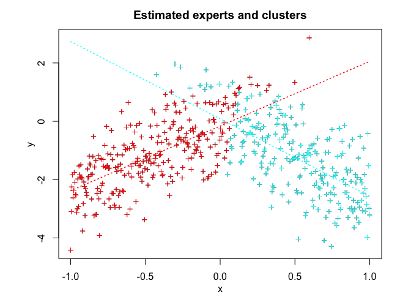
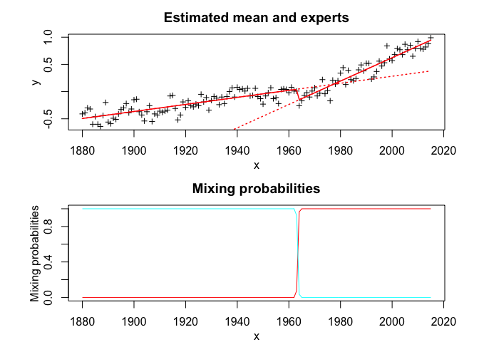
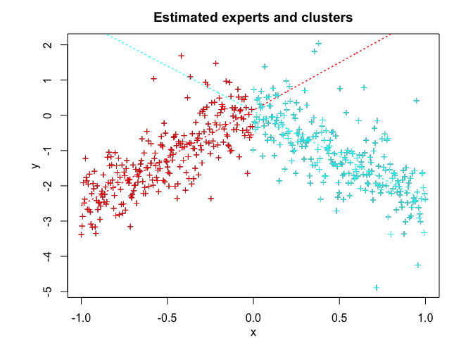
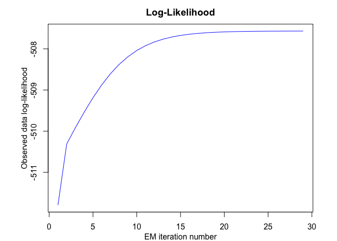

<!-- README.md is generated from README.Rmd. Please edit that file -->

# **MEteorits:** Mixtures-of-ExperTs modEling for cOmplex and non-noRmal dIsTributions

<!-- badges: start -->

[](https://travis-ci.org/fchamroukhi/MEteorits)
[](https://cran.r-project.org/web/packages/meteorits/index.html)
<!-- badges: end -->

MEteorits is an open source toolbox (available in R and Matlab)
containing several original and flexible mixtures-of-experts models to
model, cluster and classify heteregenous data in many complex situations
where the data are distributed according to non-normal and possibly
skewed distributions, and when they might be corrupted by atypical
observations. The toolbox also contains sparse mixture-of-experts models
for high-dimensional data.

Our (dis-)covered meteorits are for instance the following ones:

  - NMoE (Normal Mixtures-of-Experts);
  - tMoE (t Mixtures-of-Experts);
  - SNMoE (Skew-Normal Mixtures-of-Experts);
  - StMoE (Skew t Mixtures-of-Experts).

The models and algorithms are developped and written in Matlab by Faicel
Chamroukhi, and translated and designed into R packages by Florian
Lecocq, Marius Bartcus and Faicel Chamroukhi.

# Installation

You can install the development version of MEteorits from
[GitHub](https://github.com/fchamroukhi/MEteorits) with:

``` r
# install.packages("devtools")
devtools::install_github("fchamroukhi/MEteorits")
```

To build *vignettes* for examples of usage, type the command below
instead:

``` r
# install.packages("devtools")
devtools::install_github("fchamroukhi/MEteorits", 
                         build_opts = c("--no-resave-data", "--no-manual"), 
                         build_vignettes = TRUE)
```

Use the following command to display vignettes:

``` r
browseVignettes("meteorits")
```

# Usage

``` r
library(meteorits)
```

<details>

<summary>NMoE</summary>

``` r
# Application to a simulated data set

n <- 500 # Size of the sample
alphak <- matrix(c(0, 8), ncol = 1) # Parameters of the gating network
betak <- matrix(c(0, -2.5, 0, 2.5), ncol = 2) # Regression coefficients of the experts
sigmak <- c(1, 1) # Standard deviations of the experts
x <- seq.int(from = -1, to = 1, length.out = n) # Inputs (predictors)

# Generate sample of size n
sample <- sampleUnivNMoE(alphak = alphak, betak = betak, 
                         sigmak = sigmak, x = x)
y <- sample$y

K <- 2 # Number of regressors/experts
p <- 1 # Order of the polynomial regression (regressors/experts)
q <- 1 # Order of the logistic regression (gating network)

nmoe <- emNMoE(X = x, Y = y, K = K, p = p, q = q, verbose = TRUE)
#> EM NMoE: Iteration: 1 | log-likelihood: -838.447445867875
#> EM NMoE: Iteration: 2 | log-likelihood: -837.37508383732
#> EM NMoE: Iteration: 3 | log-likelihood: -835.008915590507
#> EM NMoE: Iteration: 4 | log-likelihood: -829.943909664411
#> EM NMoE: Iteration: 5 | log-likelihood: -819.958468854358
#> EM NMoE: Iteration: 6 | log-likelihood: -802.818824558949
#> EM NMoE: Iteration: 7 | log-likelihood: -779.021919164906
#> EM NMoE: Iteration: 8 | log-likelihood: -754.538237668832
#> EM NMoE: Iteration: 9 | log-likelihood: -736.534509726297
#> EM NMoE: Iteration: 10 | log-likelihood: -726.212790007082
#> EM NMoE: Iteration: 11 | log-likelihood: -720.943485298157
#> EM NMoE: Iteration: 12 | log-likelihood: -718.420540639761
#> EM NMoE: Iteration: 13 | log-likelihood: -717.284851785052
#> EM NMoE: Iteration: 14 | log-likelihood: -716.787481789878
#> EM NMoE: Iteration: 15 | log-likelihood: -716.568613503038
#> EM NMoE: Iteration: 16 | log-likelihood: -716.469812658632
#> EM NMoE: Iteration: 17 | log-likelihood: -716.423289855584
#> EM NMoE: Iteration: 18 | log-likelihood: -716.400062499913
#> EM NMoE: Iteration: 19 | log-likelihood: -716.387586176496
#> EM NMoE: Iteration: 20 | log-likelihood: -716.380317685929
#> EM NMoE: Iteration: 21 | log-likelihood: -716.375734832227
#> EM NMoE: Iteration: 22 | log-likelihood: -716.372643683173
#> EM NMoE: Iteration: 23 | log-likelihood: -716.370448852322
#> EM NMoE: Iteration: 24 | log-likelihood: -716.368833541125
#> EM NMoE: Iteration: 25 | log-likelihood: -716.367616262241
#> EM NMoE: Iteration: 26 | log-likelihood: -716.366684945501
#> EM NMoE: Iteration: 27 | log-likelihood: -716.365965564047
#> EM NMoE: Iteration: 28 | log-likelihood: -716.365406507273

nmoe$summary()
#> ------------------------------------------
#> Fitted Normal Mixture-of-Experts model
#> ------------------------------------------
#> 
#> NMoE model with K = 2 experts:
#> 
#>  log-likelihood df       AIC       BIC       ICL
#>       -716.3654  8 -724.3654 -741.2238 -791.7005
#> 
#> Clustering table (Number of observations in each expert):
#> 
#>   1   2 
#> 246 254 
#> 
#> Regression coefficients:
#> 
#>     Beta(k = 1) Beta(k = 2)
#> 1    -0.1606128   0.2682631
#> X^1   2.1096154  -3.0300456
#> 
#> Variances:
#> 
#>  Sigma2(k = 1) Sigma2(k = 2)
#>      0.8940933     0.9745745

nmoe$plot()
```



``` r
# Application to a real data set

data("tempanomalies")
x <- tempanomalies$Year
y <- tempanomalies$AnnualAnomaly

K <- 2 # Number of regressors/experts
p <- 1 # Order of the polynomial regression (regressors/experts)
q <- 1 # Order of the logistic regression (gating network)

nmoe <- emNMoE(X = x, Y = y, K = K, p = p, q = q, verbose = TRUE)
#> EM NMoE: Iteration: 1 | log-likelihood: 48.5243125778593
#> EM NMoE: Iteration: 2 | log-likelihood: 48.6364284693695
#> EM NMoE: Iteration: 3 | log-likelihood: 48.6616321314588
#> EM NMoE: Iteration: 4 | log-likelihood: 48.6773675575729
#> EM NMoE: Iteration: 5 | log-likelihood: 48.7053927789753
#> EM NMoE: Iteration: 6 | log-likelihood: 48.7766445918878
#> EM NMoE: Iteration: 7 | log-likelihood: 48.979273648811
#> EM NMoE: Iteration: 8 | log-likelihood: 49.5734534492088
#> EM NMoE: Iteration: 9 | log-likelihood: 51.2630597928685
#> EM NMoE: Iteration: 10 | log-likelihood: 55.4549828103761
#> EM NMoE: Iteration: 11 | log-likelihood: 62.7516702581651
#> EM NMoE: Iteration: 12 | log-likelihood: 69.5411819493645
#> EM NMoE: Iteration: 13 | log-likelihood: 73.0749147960322
#> EM NMoE: Iteration: 14 | log-likelihood: 74.837792021492
#> EM NMoE: Iteration: 15 | log-likelihood: 76.2129545969553
#> EM NMoE: Iteration: 16 | log-likelihood: 77.6343116555625
#> EM NMoE: Iteration: 17 | log-likelihood: 79.2632002850807
#> EM NMoE: Iteration: 18 | log-likelihood: 81.2952991145554
#> EM NMoE: Iteration: 19 | log-likelihood: 84.0745195970881
#> EM NMoE: Iteration: 20 | log-likelihood: 88.0339783350761
#> EM NMoE: Iteration: 21 | log-likelihood: 92.5687702928963
#> EM NMoE: Iteration: 22 | log-likelihood: 95.1575440541629
#> EM NMoE: Iteration: 23 | log-likelihood: 95.9544677788821
#> EM NMoE: Iteration: 24 | log-likelihood: 96.2167807441089
#> EM NMoE: Iteration: 25 | log-likelihood: 96.3362330013093
#> EM NMoE: Iteration: 26 | log-likelihood: 96.4162095777963
#> EM NMoE: Iteration: 27 | log-likelihood: 96.487298270972
#> EM NMoE: Iteration: 28 | log-likelihood: 96.5599476764925
#> EM NMoE: Iteration: 29 | log-likelihood: 96.6385230689988
#> EM NMoE: Iteration: 30 | log-likelihood: 96.7252408349824
#> EM NMoE: Iteration: 31 | log-likelihood: 96.8212095715313
#> EM NMoE: Iteration: 32 | log-likelihood: 96.9265765099347
#> EM NMoE: Iteration: 33 | log-likelihood: 97.0404258022096
#> EM NMoE: Iteration: 34 | log-likelihood: 97.1607190162368
#> EM NMoE: Iteration: 35 | log-likelihood: 97.284450499809
#> EM NMoE: Iteration: 36 | log-likelihood: 97.4081040246956
#> EM NMoE: Iteration: 37 | log-likelihood: 97.5283679903711
#> EM NMoE: Iteration: 38 | log-likelihood: 97.6429650181185
#> EM NMoE: Iteration: 39 | log-likelihood: 97.7513229032921
#> EM NMoE: Iteration: 40 | log-likelihood: 97.8548491584134
#> EM NMoE: Iteration: 41 | log-likelihood: 97.9566464084193
#> EM NMoE: Iteration: 42 | log-likelihood: 98.0607458023894
#> EM NMoE: Iteration: 43 | log-likelihood: 98.1710900362685
#> EM NMoE: Iteration: 44 | log-likelihood: 98.290611490955
#> EM NMoE: Iteration: 45 | log-likelihood: 98.4207438657233
#> EM NMoE: Iteration: 46 | log-likelihood: 98.5615661926316
#> EM NMoE: Iteration: 47 | log-likelihood: 98.7125004516639
#> EM NMoE: Iteration: 48 | log-likelihood: 98.8731603656299
#> EM NMoE: Iteration: 49 | log-likelihood: 99.0440269125487
#> EM NMoE: Iteration: 50 | log-likelihood: 99.2267748343605
#> EM NMoE: Iteration: 51 | log-likelihood: 99.424428011894
#> EM NMoE: Iteration: 52 | log-likelihood: 99.6416387004919
#> EM NMoE: Iteration: 53 | log-likelihood: 99.8853574869513
#> EM NMoE: Iteration: 54 | log-likelihood: 100.166052835318
#> EM NMoE: Iteration: 55 | log-likelihood: 100.499426246299
#> EM NMoE: Iteration: 56 | log-likelihood: 100.907332702804
#> EM NMoE: Iteration: 57 | log-likelihood: 101.40983714996
#> EM NMoE: Iteration: 58 | log-likelihood: 101.979036782566
#> EM NMoE: Iteration: 59 | log-likelihood: 102.45723924927
#> EM NMoE: Iteration: 60 | log-likelihood: 102.68727086043
#> EM NMoE: Iteration: 61 | log-likelihood: 102.715880882474
#> EM NMoE: Iteration: 62 | log-likelihood: 102.721454317169
#> EM NMoE: Iteration: 63 | log-likelihood: 102.721454641665

nmoe$summary()
#> ------------------------------------------
#> Fitted Normal Mixture-of-Experts model
#> ------------------------------------------
#> 
#> NMoE model with K = 2 experts:
#> 
#>  log-likelihood df      AIC      BIC      ICL
#>        102.7215  8 94.72145 83.07084 83.17754
#> 
#> Clustering table (Number of observations in each expert):
#> 
#>  1  2 
#> 84 52 
#> 
#> Regression coefficients:
#> 
#>       Beta(k = 1)  Beta(k = 2)
#> 1   -12.667329479 -42.36183259
#> X^1   0.006474827   0.02149254
#> 
#> Variances:
#> 
#>  Sigma2(k = 1) Sigma2(k = 2)
#>     0.01352345    0.01193119

nmoe$plot()
```



</details>

<details>

<summary>TMoE</summary>

``` r
# Application to a simulated data set

n <- 500 # Size of the sample
alphak <- matrix(c(0, 8), ncol = 1) # Parameters of the gating network
betak <- matrix(c(0, -2.5, 0, 2.5), ncol = 2) # Regression coefficients of the experts
sigmak <- c(0.5, 0.5) # Standard deviations of the experts
nuk <- c(5, 7) # Degrees of freedom of the experts network t densities
x <- seq.int(from = -1, to = 1, length.out = n) # Inputs (predictors)

# Generate sample of size n
sample <- sampleUnivTMoE(alphak = alphak, betak = betak, sigmak = sigmak, 
                         nuk = nuk, x = x)
y <- sample$y

K <- 2 # Number of regressors/experts
p <- 1 # Order of the polynomial regression (regressors/experts)
q <- 1 # Order of the logistic regression (gating network)

tmoe <- emTMoE(X = x, Y = y, K = K, p = p, q = q, verbose = TRUE)
#> EM - tMoE: Iteration: 1 | log-likelihood: -716.644178973591
#> EM - tMoE: Iteration: 2 | log-likelihood: -697.818351225002
#> EM - tMoE: Iteration: 3 | log-likelihood: -687.824933585738
#> EM - tMoE: Iteration: 4 | log-likelihood: -681.4257226434
#> EM - tMoE: Iteration: 5 | log-likelihood: -677.118395646965
#> EM - tMoE: Iteration: 6 | log-likelihood: -674.120244375149
#> EM - tMoE: Iteration: 7 | log-likelihood: -671.980986801128
#> EM - tMoE: Iteration: 8 | log-likelihood: -670.42469452345
#> EM - tMoE: Iteration: 9 | log-likelihood: -669.274679785116
#> EM - tMoE: Iteration: 10 | log-likelihood: -668.413720185928
#> EM - tMoE: Iteration: 11 | log-likelihood: -667.762090603242
#> EM - tMoE: Iteration: 12 | log-likelihood: -667.264312597848
#> EM - tMoE: Iteration: 13 | log-likelihood: -666.88104924334
#> EM - tMoE: Iteration: 14 | log-likelihood: -666.583952172541
#> EM - tMoE: Iteration: 15 | log-likelihood: -666.352300872008
#> EM - tMoE: Iteration: 16 | log-likelihood: -666.170761347961
#> EM - tMoE: Iteration: 17 | log-likelihood: -666.027761772033
#> EM - tMoE: Iteration: 18 | log-likelihood: -665.914885646052
#> EM - tMoE: Iteration: 19 | log-likelihood: -665.825372738855
#> EM - tMoE: Iteration: 20 | log-likelihood: -665.75415676862
#> EM - tMoE: Iteration: 21 | log-likelihood: -665.697332523945
#> EM - tMoE: Iteration: 22 | log-likelihood: -665.651819830029
#> EM - tMoE: Iteration: 23 | log-likelihood: -665.615383512261
#> EM - tMoE: Iteration: 24 | log-likelihood: -665.5861081626
#> EM - tMoE: Iteration: 25 | log-likelihood: -665.562514318331
#> EM - tMoE: Iteration: 26 | log-likelihood: -665.543514176513
#> EM - tMoE: Iteration: 27 | log-likelihood: -665.528156065136
#> EM - tMoE: Iteration: 28 | log-likelihood: -665.515748043735
#> EM - tMoE: Iteration: 29 | log-likelihood: -665.505701334283
#> EM - tMoE: Iteration: 30 | log-likelihood: -665.497557314352
#> EM - tMoE: Iteration: 31 | log-likelihood: -665.490941463575
#> EM - tMoE: Iteration: 32 | log-likelihood: -665.485574162205
#> EM - tMoE: Iteration: 33 | log-likelihood: -665.481211208667
#> EM - tMoE: Iteration: 34 | log-likelihood: -665.477661961738
#> EM - tMoE: Iteration: 35 | log-likelihood: -665.47477266997
#> EM - tMoE: Iteration: 36 | log-likelihood: -665.472419151465
#> EM - tMoE: Iteration: 37 | log-likelihood: -665.470497127234
#> EM - tMoE: Iteration: 38 | log-likelihood: -665.468932993849
#> EM - tMoE: Iteration: 39 | log-likelihood: -665.467656958995
#> EM - tMoE: Iteration: 40 | log-likelihood: -665.466615520844
#> EM - tMoE: Iteration: 41 | log-likelihood: -665.465765226306
#> EM - tMoE: Iteration: 42 | log-likelihood: -665.465070754519
#> EM - tMoE: Iteration: 43 | log-likelihood: -665.464503373372

tmoe$summary()
#> -------------------------------------
#> Fitted t Mixture-of-Experts model
#> -------------------------------------
#> 
#> tMoE model with K = 2 experts:
#> 
#>  log-likelihood df       AIC       BIC       ICL
#>       -665.4645 10 -675.4645 -696.5375 -696.5316
#> 
#> Clustering table (Number of observations in each expert):
#> 
#>   1   2 
#> 249 251 
#> 
#> Regression coefficients:
#> 
#>     Beta(k = 1) Beta(k = 2)
#> 1    0.08405958  0.03574341
#> X^1  2.56854853 -2.46216566
#> 
#> Variances:
#> 
#>  Sigma2(k = 1) Sigma2(k = 2)
#>      0.3172393    0.04147353

tmoe$plot()
```



``` r
# Application to a real data set

library(MASS)
data("mcycle")
x <- mcycle$times
y <- mcycle$accel

K <- 4 # Number of regressors/experts
p <- 2 # Order of the polynomial regression (regressors/experts)
q <- 1 # Order of the logistic regression (gating network)

tmoe <- emTMoE(X = x, Y = y, K = K, p = p, q = q, verbose = TRUE)
#> EM - tMoE: Iteration: 1 | log-likelihood: -585.222191741282
#> EM - tMoE: Iteration: 2 | log-likelihood: -580.714594960129
#> EM - tMoE: Iteration: 3 | log-likelihood: -578.941952744992
#> EM - tMoE: Iteration: 4 | log-likelihood: -576.278694880256
#> EM - tMoE: Iteration: 5 | log-likelihood: -569.71678286666
#> EM - tMoE: Iteration: 6 | log-likelihood: -562.247850043825
#> EM - tMoE: Iteration: 7 | log-likelihood: -558.350949524939
#> EM - tMoE: Iteration: 8 | log-likelihood: -557.202669120524
#> EM - tMoE: Iteration: 9 | log-likelihood: -556.418031795557
#> EM - tMoE: Iteration: 10 | log-likelihood: -555.57930505681
#> EM - tMoE: Iteration: 11 | log-likelihood: -554.66788465451
#> EM - tMoE: Iteration: 12 | log-likelihood: -553.688789078615
#> EM - tMoE: Iteration: 13 | log-likelihood: -552.708369658539
#> EM - tMoE: Iteration: 14 | log-likelihood: -551.889328179308
#> EM - tMoE: Iteration: 15 | log-likelihood: -551.313179959412
#> EM - tMoE: Iteration: 16 | log-likelihood: -550.923396387858
#> EM - tMoE: Iteration: 17 | log-likelihood: -550.661283189432
#> EM - tMoE: Iteration: 18 | log-likelihood: -550.488241921989
#> EM - tMoE: Iteration: 19 | log-likelihood: -550.375736326336
#> EM - tMoE: Iteration: 20 | log-likelihood: -550.303080492558
#> EM - tMoE: Iteration: 21 | log-likelihood: -550.256179815335
#> EM - tMoE: Iteration: 22 | log-likelihood: -550.225765799227
#> EM - tMoE: Iteration: 23 | log-likelihood: -550.205900021734
#> EM - tMoE: Iteration: 24 | log-likelihood: -550.192803094992
#> EM - tMoE: Iteration: 25 | log-likelihood: -550.184072825929
#> EM - tMoE: Iteration: 26 | log-likelihood: -550.178178304445
#> EM - tMoE: Iteration: 27 | log-likelihood: -550.174139357111
#> EM - tMoE: Iteration: 28 | log-likelihood: -550.171324909373
#> EM - tMoE: Iteration: 29 | log-likelihood: -550.16932617621
#> EM - tMoE: Iteration: 30 | log-likelihood: -550.167876656148
#> EM - tMoE: Iteration: 31 | log-likelihood: -550.166801414743
#> EM - tMoE: Iteration: 32 | log-likelihood: -550.165984766164
#> EM - tMoE: Iteration: 33 | log-likelihood: -550.165349570913
#> EM - tMoE: Iteration: 34 | log-likelihood: -550.1648439081

tmoe$summary()
#> -------------------------------------
#> Fitted t Mixture-of-Experts model
#> -------------------------------------
#> 
#> tMoE model with K = 4 experts:
#> 
#>  log-likelihood df       AIC       BIC       ICL
#>       -550.1648 26 -576.1648 -613.7394 -613.7359
#> 
#> Clustering table (Number of observations in each expert):
#> 
#>  1  2  3  4 
#> 28 37 31 37 
#> 
#> Regression coefficients:
#> 
#>      Beta(k = 1) Beta(k = 2)  Beta(k = 3) Beta(k = 4)
#> 1   -1.038103332  1097.88043 -1816.583171 335.9625237
#> X^1 -0.111460165  -115.59851   111.938322 -14.0024442
#> X^2 -0.007713605     2.74875    -1.678539   0.1439691
#> 
#> Variances:
#> 
#>  Sigma2(k = 1) Sigma2(k = 2) Sigma2(k = 3) Sigma2(k = 4)
#>       1.586136      379.9208      560.9809      331.5414

tmoe$plot()
```


</details>

<details>

<summary>SNMoE</summary>

``` r
# Application to a simulated data set

n <- 500 # Size of the sample
alphak <- matrix(c(0, 8), ncol = 1) # Parameters of the gating network
betak <- matrix(c(0, -2.5, 0, 2.5), ncol = 2) # Regression coefficients of the experts
lambdak <- c(3, 5) # Skewness parameters of the experts
sigmak <- c(1, 1) # Standard deviations of the experts
x <- seq.int(from = -1, to = 1, length.out = n) # Inputs (predictors)

# Generate sample of size n
sample <- sampleUnivSNMoE(alphak = alphak, betak = betak, 
                          sigmak = sigmak, lambdak = lambdak, 
                          x = x)
y <- sample$y

K <- 2 # Number of regressors/experts
p <- 1 # Order of the polynomial regression (regressors/experts)
q <- 1 # Order of the logistic regression (gating network)

snmoe <- emSNMoE(X = x, Y = y, K = K, p = p, q = q, verbose = TRUE)
#> EM - SNMoE: Iteration: 1 | log-likelihood: -496.091531688357
#> EM - SNMoE: Iteration: 2 | log-likelihood: -492.042904737495
#> EM - SNMoE: Iteration: 3 | log-likelihood: -492.000411302195
#> EM - SNMoE: Iteration: 4 | log-likelihood: -491.988908917768
#> EM - SNMoE: Iteration: 5 | log-likelihood: -491.984073920568
#> EM - SNMoE: Iteration: 6 | log-likelihood: -491.980747916387
#> EM - SNMoE: Iteration: 7 | log-likelihood: -491.977808459843
#> EM - SNMoE: Iteration: 8 | log-likelihood: -491.975048213171
#> EM - SNMoE: Iteration: 9 | log-likelihood: -491.97241849584
#> EM - SNMoE: Iteration: 10 | log-likelihood: -491.969912463406
#> EM - SNMoE: Iteration: 11 | log-likelihood: -491.9675333639
#> EM - SNMoE: Iteration: 12 | log-likelihood: -491.965270559466
#> EM - SNMoE: Iteration: 13 | log-likelihood: -491.963107973331
#> EM - SNMoE: Iteration: 14 | log-likelihood: -491.961040157006
#> EM - SNMoE: Iteration: 15 | log-likelihood: -491.959066081795
#> EM - SNMoE: Iteration: 16 | log-likelihood: -491.957175204774
#> EM - SNMoE: Iteration: 17 | log-likelihood: -491.955354446886
#> EM - SNMoE: Iteration: 18 | log-likelihood: -491.953587316706
#> EM - SNMoE: Iteration: 19 | log-likelihood: -491.951878310094
#> EM - SNMoE: Iteration: 20 | log-likelihood: -491.950225391248
#> EM - SNMoE: Iteration: 21 | log-likelihood: -491.948630793558
#> EM - SNMoE: Iteration: 22 | log-likelihood: -491.947078457867
#> EM - SNMoE: Iteration: 23 | log-likelihood: -491.945556473792
#> EM - SNMoE: Iteration: 24 | log-likelihood: -491.944059202704
#> EM - SNMoE: Iteration: 25 | log-likelihood: -491.942586570455
#> EM - SNMoE: Iteration: 26 | log-likelihood: -491.941145612824
#> EM - SNMoE: Iteration: 27 | log-likelihood: -491.939711770964
#> EM - SNMoE: Iteration: 28 | log-likelihood: -491.938285845065
#> EM - SNMoE: Iteration: 29 | log-likelihood: -491.936860963434
#> EM - SNMoE: Iteration: 30 | log-likelihood: -491.93543818584
#> EM - SNMoE: Iteration: 31 | log-likelihood: -491.93401434269
#> EM - SNMoE: Iteration: 32 | log-likelihood: -491.9325869148
#> EM - SNMoE: Iteration: 33 | log-likelihood: -491.931152291809
#> EM - SNMoE: Iteration: 34 | log-likelihood: -491.929702129278
#> EM - SNMoE: Iteration: 35 | log-likelihood: -491.92823525641
#> EM - SNMoE: Iteration: 36 | log-likelihood: -491.926748574992
#> EM - SNMoE: Iteration: 37 | log-likelihood: -491.925238905515
#> EM - SNMoE: Iteration: 38 | log-likelihood: -491.923703333804
#> EM - SNMoE: Iteration: 39 | log-likelihood: -491.922139475429
#> EM - SNMoE: Iteration: 40 | log-likelihood: -491.920548017432
#> EM - SNMoE: Iteration: 41 | log-likelihood: -491.918927012202
#> EM - SNMoE: Iteration: 42 | log-likelihood: -491.917270819817
#> EM - SNMoE: Iteration: 43 | log-likelihood: -491.915583607749
#> EM - SNMoE: Iteration: 44 | log-likelihood: -491.913861934882
#> EM - SNMoE: Iteration: 45 | log-likelihood: -491.912104847709
#> EM - SNMoE: Iteration: 46 | log-likelihood: -491.910311318132
#> EM - SNMoE: Iteration: 47 | log-likelihood: -491.908484587495
#> EM - SNMoE: Iteration: 48 | log-likelihood: -491.906626407912
#> EM - SNMoE: Iteration: 49 | log-likelihood: -491.904738981818
#> EM - SNMoE: Iteration: 50 | log-likelihood: -491.902824663617
#> EM - SNMoE: Iteration: 51 | log-likelihood: -491.900890544641
#> EM - SNMoE: Iteration: 52 | log-likelihood: -491.898937953066
#> EM - SNMoE: Iteration: 53 | log-likelihood: -491.896963351549
#> EM - SNMoE: Iteration: 54 | log-likelihood: -491.894974307139
#> EM - SNMoE: Iteration: 55 | log-likelihood: -491.892980941736
#> EM - SNMoE: Iteration: 56 | log-likelihood: -491.890983618403
#> EM - SNMoE: Iteration: 57 | log-likelihood: -491.88898766088
#> EM - SNMoE: Iteration: 58 | log-likelihood: -491.886998533457
#> EM - SNMoE: Iteration: 59 | log-likelihood: -491.885018687904
#> EM - SNMoE: Iteration: 60 | log-likelihood: -491.883052713316
#> EM - SNMoE: Iteration: 61 | log-likelihood: -491.881104445461
#> EM - SNMoE: Iteration: 62 | log-likelihood: -491.879177697797
#> EM - SNMoE: Iteration: 63 | log-likelihood: -491.877276191135
#> EM - SNMoE: Iteration: 64 | log-likelihood: -491.875404341474
#> EM - SNMoE: Iteration: 65 | log-likelihood: -491.873564686965
#> EM - SNMoE: Iteration: 66 | log-likelihood: -491.871756985169
#> EM - SNMoE: Iteration: 67 | log-likelihood: -491.869984645917
#> EM - SNMoE: Iteration: 68 | log-likelihood: -491.868249011459
#> EM - SNMoE: Iteration: 69 | log-likelihood: -491.866551065356
#> EM - SNMoE: Iteration: 70 | log-likelihood: -491.864890600701
#> EM - SNMoE: Iteration: 71 | log-likelihood: -491.863267020389
#> EM - SNMoE: Iteration: 72 | log-likelihood: -491.861678279262
#> EM - SNMoE: Iteration: 73 | log-likelihood: -491.860122112421
#> EM - SNMoE: Iteration: 74 | log-likelihood: -491.858598247612
#> EM - SNMoE: Iteration: 75 | log-likelihood: -491.857103296648
#> EM - SNMoE: Iteration: 76 | log-likelihood: -491.855634126947
#> EM - SNMoE: Iteration: 77 | log-likelihood: -491.854187605208
#> EM - SNMoE: Iteration: 78 | log-likelihood: -491.852758306017
#> EM - SNMoE: Iteration: 79 | log-likelihood: -491.851340297138
#> EM - SNMoE: Iteration: 80 | log-likelihood: -491.849933195695
#> EM - SNMoE: Iteration: 81 | log-likelihood: -491.848529314245
#> EM - SNMoE: Iteration: 82 | log-likelihood: -491.847124076069
#> EM - SNMoE: Iteration: 83 | log-likelihood: -491.845713920399
#> EM - SNMoE: Iteration: 84 | log-likelihood: -491.844287775653
#> EM - SNMoE: Iteration: 85 | log-likelihood: -491.842842529893
#> EM - SNMoE: Iteration: 86 | log-likelihood: -491.841373340705
#> EM - SNMoE: Iteration: 87 | log-likelihood: -491.839873646609
#> EM - SNMoE: Iteration: 88 | log-likelihood: -491.838334435787
#> EM - SNMoE: Iteration: 89 | log-likelihood: -491.836754674392
#> EM - SNMoE: Iteration: 90 | log-likelihood: -491.835125406384
#> EM - SNMoE: Iteration: 91 | log-likelihood: -491.83344069229
#> EM - SNMoE: Iteration: 92 | log-likelihood: -491.831694912672
#> EM - SNMoE: Iteration: 93 | log-likelihood: -491.829882858375
#> EM - SNMoE: Iteration: 94 | log-likelihood: -491.82799984289
#> EM - SNMoE: Iteration: 95 | log-likelihood: -491.826041824191
#> EM - SNMoE: Iteration: 96 | log-likelihood: -491.824005532251
#> EM - SNMoE: Iteration: 97 | log-likelihood: -491.821888596753
#> EM - SNMoE: Iteration: 98 | log-likelihood: -491.819689668832
#> EM - SNMoE: Iteration: 99 | log-likelihood: -491.817408180203
#> EM - SNMoE: Iteration: 100 | log-likelihood: -491.815040336375
#> EM - SNMoE: Iteration: 101 | log-likelihood: -491.81259305653
#> EM - SNMoE: Iteration: 102 | log-likelihood: -491.810065839237
#> EM - SNMoE: Iteration: 103 | log-likelihood: -491.807468487259
#> EM - SNMoE: Iteration: 104 | log-likelihood: -491.804807632887
#> EM - SNMoE: Iteration: 105 | log-likelihood: -491.802091056174
#> EM - SNMoE: Iteration: 106 | log-likelihood: -491.79932740302
#> EM - SNMoE: Iteration: 107 | log-likelihood: -491.796526322957
#> EM - SNMoE: Iteration: 108 | log-likelihood: -491.793699524449
#> EM - SNMoE: Iteration: 109 | log-likelihood: -491.790857591589
#> EM - SNMoE: Iteration: 110 | log-likelihood: -491.788011395372
#> EM - SNMoE: Iteration: 111 | log-likelihood: -491.785170807649
#> EM - SNMoE: Iteration: 112 | log-likelihood: -491.782350757545
#> EM - SNMoE: Iteration: 113 | log-likelihood: -491.779561380341
#> EM - SNMoE: Iteration: 114 | log-likelihood: -491.776812504579
#> EM - SNMoE: Iteration: 115 | log-likelihood: -491.774113325336
#> EM - SNMoE: Iteration: 116 | log-likelihood: -491.771472171354
#> EM - SNMoE: Iteration: 117 | log-likelihood: -491.768896483484
#> EM - SNMoE: Iteration: 118 | log-likelihood: -491.766390093625
#> EM - SNMoE: Iteration: 119 | log-likelihood: -491.763957765258
#> EM - SNMoE: Iteration: 120 | log-likelihood: -491.761600069042
#> EM - SNMoE: Iteration: 121 | log-likelihood: -491.759324119187
#> EM - SNMoE: Iteration: 122 | log-likelihood: -491.757130586158
#> EM - SNMoE: Iteration: 123 | log-likelihood: -491.755020252444
#> EM - SNMoE: Iteration: 124 | log-likelihood: -491.752982149009
#> EM - SNMoE: Iteration: 125 | log-likelihood: -491.751025312755
#> EM - SNMoE: Iteration: 126 | log-likelihood: -491.749142405688
#> EM - SNMoE: Iteration: 127 | log-likelihood: -491.747339567515
#> EM - SNMoE: Iteration: 128 | log-likelihood: -491.745602180488
#> EM - SNMoE: Iteration: 129 | log-likelihood: -491.743924643245
#> EM - SNMoE: Iteration: 130 | log-likelihood: -491.742300921634
#> EM - SNMoE: Iteration: 131 | log-likelihood: -491.740724990443
#> EM - SNMoE: Iteration: 132 | log-likelihood: -491.739189443877
#> EM - SNMoE: Iteration: 133 | log-likelihood: -491.73768777495
#> EM - SNMoE: Iteration: 134 | log-likelihood: -491.736213360653
#> EM - SNMoE: Iteration: 135 | log-likelihood: -491.73475952607
#> EM - SNMoE: Iteration: 136 | log-likelihood: -491.73331883761
#> EM - SNMoE: Iteration: 137 | log-likelihood: -491.731884342085
#> EM - SNMoE: Iteration: 138 | log-likelihood: -491.730449746471
#> EM - SNMoE: Iteration: 139 | log-likelihood: -491.729009221381
#> EM - SNMoE: Iteration: 140 | log-likelihood: -491.72755724767
#> EM - SNMoE: Iteration: 141 | log-likelihood: -491.726088653902
#> EM - SNMoE: Iteration: 142 | log-likelihood: -491.724598672526
#> EM - SNMoE: Iteration: 143 | log-likelihood: -491.723082992821
#> EM - SNMoE: Iteration: 144 | log-likelihood: -491.721537804577
#> EM - SNMoE: Iteration: 145 | log-likelihood: -491.719959832312
#> EM - SNMoE: Iteration: 146 | log-likelihood: -491.718346362976
#> EM - SNMoE: Iteration: 147 | log-likelihood: -491.71669527024
#> EM - SNMoE: Iteration: 148 | log-likelihood: -491.715005475544
#> EM - SNMoE: Iteration: 149 | log-likelihood: -491.713276509009
#> EM - SNMoE: Iteration: 150 | log-likelihood: -491.711506352371
#> EM - SNMoE: Iteration: 151 | log-likelihood: -491.709696283399
#> EM - SNMoE: Iteration: 152 | log-likelihood: -491.707847672259
#> EM - SNMoE: Iteration: 153 | log-likelihood: -491.705959880239
#> EM - SNMoE: Iteration: 154 | log-likelihood: -491.704037848956
#> EM - SNMoE: Iteration: 155 | log-likelihood: -491.702082870407
#> EM - SNMoE: Iteration: 156 | log-likelihood: -491.70009959682
#> EM - SNMoE: Iteration: 157 | log-likelihood: -491.69809050819
#> EM - SNMoE: Iteration: 158 | log-likelihood: -491.696059211532
#> EM - SNMoE: Iteration: 159 | log-likelihood: -491.69400994978
#> EM - SNMoE: Iteration: 160 | log-likelihood: -491.69194811258
#> EM - SNMoE: Iteration: 161 | log-likelihood: -491.689875196874
#> EM - SNMoE: Iteration: 162 | log-likelihood: -491.687796689007
#> EM - SNMoE: Iteration: 163 | log-likelihood: -491.685715833784
#> EM - SNMoE: Iteration: 164 | log-likelihood: -491.683634404647
#> EM - SNMoE: Iteration: 165 | log-likelihood: -491.681554579261
#> EM - SNMoE: Iteration: 166 | log-likelihood: -491.679477834305
#> EM - SNMoE: Iteration: 167 | log-likelihood: -491.677404857193
#> EM - SNMoE: Iteration: 168 | log-likelihood: -491.675335475696
#> EM - SNMoE: Iteration: 169 | log-likelihood: -491.673268825481
#> EM - SNMoE: Iteration: 170 | log-likelihood: -491.671203019896
#> EM - SNMoE: Iteration: 171 | log-likelihood: -491.669134496085
#> EM - SNMoE: Iteration: 172 | log-likelihood: -491.667062152135
#> EM - SNMoE: Iteration: 173 | log-likelihood: -491.664981414359
#> EM - SNMoE: Iteration: 174 | log-likelihood: -491.662888629061
#> EM - SNMoE: Iteration: 175 | log-likelihood: -491.660776309498
#> EM - SNMoE: Iteration: 176 | log-likelihood: -491.658638931927
#> EM - SNMoE: Iteration: 177 | log-likelihood: -491.656469433404
#> EM - SNMoE: Iteration: 178 | log-likelihood: -491.654260384286
#> EM - SNMoE: Iteration: 179 | log-likelihood: -491.652004166647
#> EM - SNMoE: Iteration: 180 | log-likelihood: -491.649694995403
#> EM - SNMoE: Iteration: 181 | log-likelihood: -491.647339364294
#> EM - SNMoE: Iteration: 182 | log-likelihood: -491.644919422825
#> EM - SNMoE: Iteration: 183 | log-likelihood: -491.642428625977
#> EM - SNMoE: Iteration: 184 | log-likelihood: -491.639861208471
#> EM - SNMoE: Iteration: 185 | log-likelihood: -491.637212402234
#> EM - SNMoE: Iteration: 186 | log-likelihood: -491.634478630129
#> EM - SNMoE: Iteration: 187 | log-likelihood: -491.631657705474
#> EM - SNMoE: Iteration: 188 | log-likelihood: -491.628747256546
#> EM - SNMoE: Iteration: 189 | log-likelihood: -491.62573056927
#> EM - SNMoE: Iteration: 190 | log-likelihood: -491.622629913569
#> EM - SNMoE: Iteration: 191 | log-likelihood: -491.619450767723
#> EM - SNMoE: Iteration: 192 | log-likelihood: -491.616200207158
#> EM - SNMoE: Iteration: 193 | log-likelihood: -491.612886739657
#> EM - SNMoE: Iteration: 194 | log-likelihood: -491.609519207877
#> EM - SNMoE: Iteration: 195 | log-likelihood: -491.60610927896
#> EM - SNMoE: Iteration: 196 | log-likelihood: -491.602670698573
#> EM - SNMoE: Iteration: 197 | log-likelihood: -491.599218803312
#> EM - SNMoE: Iteration: 198 | log-likelihood: -491.595767710194
#> EM - SNMoE: Iteration: 199 | log-likelihood: -491.592331996584
#> EM - SNMoE: Iteration: 200 | log-likelihood: -491.588925362419
#> EM - SNMoE: Iteration: 201 | log-likelihood: -491.585561901289
#> EM - SNMoE: Iteration: 202 | log-likelihood: -491.58225662163
#> EM - SNMoE: Iteration: 203 | log-likelihood: -491.579022603267
#> EM - SNMoE: Iteration: 204 | log-likelihood: -491.575874646867
#> EM - SNMoE: Iteration: 205 | log-likelihood: -491.572824960161
#> EM - SNMoE: Iteration: 206 | log-likelihood: -491.569881477545
#> EM - SNMoE: Iteration: 207 | log-likelihood: -491.567066803544
#> EM - SNMoE: Iteration: 208 | log-likelihood: -491.564392518022
#> EM - SNMoE: Iteration: 209 | log-likelihood: -491.561845292724
#> EM - SNMoE: Iteration: 210 | log-likelihood: -491.559453073494
#> EM - SNMoE: Iteration: 211 | log-likelihood: -491.55721940936
#> EM - SNMoE: Iteration: 212 | log-likelihood: -491.555145339945
#> EM - SNMoE: Iteration: 213 | log-likelihood: -491.553229618519
#> EM - SNMoE: Iteration: 214 | log-likelihood: -491.55146901194
#> EM - SNMoE: Iteration: 215 | log-likelihood: -491.549858638498
#> EM - SNMoE: Iteration: 216 | log-likelihood: -491.54839231333
#> EM - SNMoE: Iteration: 217 | log-likelihood: -491.547061936451
#> EM - SNMoE: Iteration: 218 | log-likelihood: -491.545874294888
#> EM - SNMoE: Iteration: 219 | log-likelihood: -491.544804749165
#> EM - SNMoE: Iteration: 220 | log-likelihood: -491.54385062846
#> EM - SNMoE: Iteration: 221 | log-likelihood: -491.543001276213
#> EM - SNMoE: Iteration: 222 | log-likelihood: -491.542245358874
#> EM - SNMoE: Iteration: 223 | log-likelihood: -491.5415738258
#> EM - SNMoE: Iteration: 224 | log-likelihood: -491.540979400491
#> EM - SNMoE: Iteration: 225 | log-likelihood: -491.540455178609
#> EM - SNMoE: Iteration: 226 | log-likelihood: -491.539994656114

snmoe$summary()
#> -----------------------------------------------
#> Fitted Skew-Normal Mixture-of-Experts model
#> -----------------------------------------------
#> 
#> SNMoE model with K = 2 experts:
#> 
#>  log-likelihood df     AIC      BIC       ICL
#>         -491.54 10 -501.54 -522.613 -522.6593
#> 
#> Clustering table (Number of observations in each expert):
#> 
#>   1   2 
#> 253 247 
#> 
#> Regression coefficients:
#> 
#>     Beta(k = 1) Beta(k = 2)
#> 1     0.8362846   0.8901115
#> X^1   2.5401126  -2.6757700
#> 
#> Variances:
#> 
#>  Sigma2(k = 1) Sigma2(k = 2)
#>      0.3704868     0.4742813

snmoe$plot()
```


``` r
# Application to a real data set

data("tempanomalies")
x <- tempanomalies$Year
y <- tempanomalies$AnnualAnomaly

K <- 2 # Number of regressors/experts
p <- 1 # Order of the polynomial regression (regressors/experts)
q <- 1 # Order of the logistic regression (gating network)

snmoe <- emSNMoE(X = x, Y = y, K = K, p = p, q = q, verbose = TRUE)
#> EM - SNMoE: Iteration: 1 | log-likelihood: 84.8852795716429
#> EM - SNMoE: Iteration: 2 | log-likelihood: 87.6706260438353
#> EM - SNMoE: Iteration: 3 | log-likelihood: 88.8261862757622
#> EM - SNMoE: Iteration: 4 | log-likelihood: 89.0813178034325
#> EM - SNMoE: Iteration: 5 | log-likelihood: 89.2609971919367
#> EM - SNMoE: Iteration: 6 | log-likelihood: 89.4710679745537
#> EM - SNMoE: Iteration: 7 | log-likelihood: 89.6444748263671
#> EM - SNMoE: Iteration: 8 | log-likelihood: 89.7478247884252
#> EM - SNMoE: Iteration: 9 | log-likelihood: 89.8037013656777
#> EM - SNMoE: Iteration: 10 | log-likelihood: 89.8340678249831
#> EM - SNMoE: Iteration: 11 | log-likelihood: 89.8528179479544
#> EM - SNMoE: Iteration: 12 | log-likelihood: 89.8669502619546
#> EM - SNMoE: Iteration: 13 | log-likelihood: 89.8787757744423
#> EM - SNMoE: Iteration: 14 | log-likelihood: 89.8889962392373
#> EM - SNMoE: Iteration: 15 | log-likelihood: 89.8981761941588
#> EM - SNMoE: Iteration: 16 | log-likelihood: 89.9066227356698
#> EM - SNMoE: Iteration: 17 | log-likelihood: 89.9144480095847
#> EM - SNMoE: Iteration: 18 | log-likelihood: 89.9216766587536
#> EM - SNMoE: Iteration: 19 | log-likelihood: 89.9283124078217
#> EM - SNMoE: Iteration: 20 | log-likelihood: 89.9343536079388
#> EM - SNMoE: Iteration: 21 | log-likelihood: 89.9398017993007
#> EM - SNMoE: Iteration: 22 | log-likelihood: 89.9447241955403
#> EM - SNMoE: Iteration: 23 | log-likelihood: 89.9492166095405
#> EM - SNMoE: Iteration: 24 | log-likelihood: 89.9531170231374
#> EM - SNMoE: Iteration: 25 | log-likelihood: 89.95645298215
#> EM - SNMoE: Iteration: 26 | log-likelihood: 89.9592503538537
#> EM - SNMoE: Iteration: 27 | log-likelihood: 89.9617784157552
#> EM - SNMoE: Iteration: 28 | log-likelihood: 89.9628461603334
#> EM - SNMoE: Iteration: 29 | log-likelihood: 89.9642920662606
#> EM - SNMoE: Iteration: 30 | log-likelihood: 89.9651898206347
#> EM - SNMoE: Iteration: 31 | log-likelihood: 89.9659610613131
#> EM - SNMoE: Iteration: 32 | log-likelihood: 89.9665396978098
#> EM - SNMoE: Iteration: 33 | log-likelihood: 89.9673764454659
#> EM - SNMoE: Iteration: 34 | log-likelihood: 89.9677027693961
#> EM - SNMoE: Iteration: 35 | log-likelihood: 89.9679170290871
#> EM - SNMoE: Iteration: 36 | log-likelihood: 89.9680406395064
#> EM - SNMoE: Iteration: 37 | log-likelihood: 89.9683656028113
#> EM - SNMoE: Iteration: 38 | log-likelihood: 89.9684430193028

snmoe$summary()
#> -----------------------------------------------
#> Fitted Skew-Normal Mixture-of-Experts model
#> -----------------------------------------------
#> 
#> SNMoE model with K = 2 experts:
#> 
#>  log-likelihood df      AIC      BIC    ICL
#>        89.96844 10 79.96844 65.40517 65.289
#> 
#> Clustering table (Number of observations in each expert):
#> 
#>  1  2 
#> 70 66 
#> 
#> Regression coefficients:
#> 
#>       Beta(k = 1)  Beta(k = 2)
#> 1   -14.041895089 -33.78757649
#> X^1   0.007207881   0.01719685
#> 
#> Variances:
#> 
#>  Sigma2(k = 1) Sigma2(k = 2)
#>     0.01461443    0.01719955

snmoe$plot()
```


</details>

<details>

<summary>StMoE</summary>

``` r
# Applicartion to a simulated data set

n <- 500 # Size of the sample
alphak <- matrix(c(0, 8), ncol = 1) # Parameters of the gating network
betak <- matrix(c(0, -2.5, 0, 2.5), ncol = 2) # Regression coefficients of the experts
sigmak <- c(0.5, 0.5) # Standard deviations of the experts
lambdak <- c(3, 5) # Skewness parameters of the experts
nuk <- c(5, 7) # Degrees of freedom of the experts network t densities
x <- seq.int(from = -1, to = 1, length.out = n) # Inputs (predictors)

# Generate sample of size n
sample <- sampleUnivStMoE(alphak = alphak, betak = betak, 
                          sigmak = sigmak, lambdak = lambdak, 
                          nuk = nuk, x = x)
y <- sample$y

K <- 2 # Number of regressors/experts
p <- 1 # Order of the polynomial regression (regressors/experts)
q <- 1 # Order of the logistic regression (gating network)

stmoe <- emStMoE(X = x, Y = y, K = K, p = p, q = q, verbose = TRUE)
#> EM - StMoE: Iteration: 1 | log-likelihood: -394.559227946017
#> EM - StMoE: Iteration: 2 | log-likelihood: -375.361815343331
#> EM - StMoE: Iteration: 3 | log-likelihood: -372.84273063518
#> EM - StMoE: Iteration: 4 | log-likelihood: -371.294656889484
#> EM - StMoE: Iteration: 5 | log-likelihood: -370.449213171171
#> EM - StMoE: Iteration: 6 | log-likelihood: -369.950500551431
#> EM - StMoE: Iteration: 7 | log-likelihood: -369.613415336064
#> EM - StMoE: Iteration: 8 | log-likelihood: -369.347845726139
#> EM - StMoE: Iteration: 9 | log-likelihood: -369.108986134373
#> EM - StMoE: Iteration: 10 | log-likelihood: -368.872147920985
#> EM - StMoE: Iteration: 11 | log-likelihood: -368.620211927461
#> EM - StMoE: Iteration: 12 | log-likelihood: -368.33726259375
#> EM - StMoE: Iteration: 13 | log-likelihood: -368.004388971402
#> EM - StMoE: Iteration: 14 | log-likelihood: -367.596593150509
#> EM - StMoE: Iteration: 15 | log-likelihood: -367.079662297346
#> EM - StMoE: Iteration: 16 | log-likelihood: -366.406168580998
#> EM - StMoE: Iteration: 17 | log-likelihood: -365.514270808866
#> EM - StMoE: Iteration: 18 | log-likelihood: -364.330172179708
#> EM - StMoE: Iteration: 19 | log-likelihood: -362.777211269346
#> EM - StMoE: Iteration: 20 | log-likelihood: -360.793486350227
#> EM - StMoE: Iteration: 21 | log-likelihood: -358.382719149729
#> EM - StMoE: Iteration: 22 | log-likelihood: -355.611662378758
#> EM - StMoE: Iteration: 23 | log-likelihood: -352.604959032688
#> EM - StMoE: Iteration: 24 | log-likelihood: -349.507627119384
#> EM - StMoE: Iteration: 25 | log-likelihood: -346.460047997293
#> EM - StMoE: Iteration: 26 | log-likelihood: -343.569763443948
#> EM - StMoE: Iteration: 27 | log-likelihood: -340.900776441992
#> EM - StMoE: Iteration: 28 | log-likelihood: -338.470450132453
#> EM - StMoE: Iteration: 29 | log-likelihood: -336.26667021458
#> EM - StMoE: Iteration: 30 | log-likelihood: -334.254811667277
#> EM - StMoE: Iteration: 31 | log-likelihood: -332.384288280463
#> EM - StMoE: Iteration: 32 | log-likelihood: -330.584207465535
#> EM - StMoE: Iteration: 33 | log-likelihood: -328.778932327112
#> EM - StMoE: Iteration: 34 | log-likelihood: -326.893228482796
#> EM - StMoE: Iteration: 35 | log-likelihood: -324.864795487033
#> EM - StMoE: Iteration: 36 | log-likelihood: -322.653731122193
#> EM - StMoE: Iteration: 37 | log-likelihood: -320.251458167232
#> EM - StMoE: Iteration: 38 | log-likelihood: -317.696544397748
#> EM - StMoE: Iteration: 39 | log-likelihood: -315.067042370427
#> EM - StMoE: Iteration: 40 | log-likelihood: -312.453774386763
#> EM - StMoE: Iteration: 41 | log-likelihood: -309.942771662216
#> EM - StMoE: Iteration: 42 | log-likelihood: -307.611107012673
#> EM - StMoE: Iteration: 43 | log-likelihood: -305.511002728926
#> EM - StMoE: Iteration: 44 | log-likelihood: -303.671191654019
#> EM - StMoE: Iteration: 45 | log-likelihood: -302.091232683677
#> EM - StMoE: Iteration: 46 | log-likelihood: -300.76058313458
#> EM - StMoE: Iteration: 47 | log-likelihood: -299.656232795912
#> EM - StMoE: Iteration: 48 | log-likelihood: -298.755308724788
#> EM - StMoE: Iteration: 49 | log-likelihood: -298.035796330745
#> EM - StMoE: Iteration: 50 | log-likelihood: -297.466195822116
#> EM - StMoE: Iteration: 51 | log-likelihood: -297.017937792101
#> EM - StMoE: Iteration: 52 | log-likelihood: -296.668077017464
#> EM - StMoE: Iteration: 53 | log-likelihood: -296.397733034125
#> EM - StMoE: Iteration: 54 | log-likelihood: -296.189826109197
#> EM - StMoE: Iteration: 55 | log-likelihood: -296.032333539325
#> EM - StMoE: Iteration: 56 | log-likelihood: -295.914284235073
#> EM - StMoE: Iteration: 57 | log-likelihood: -295.827889034969
#> EM - StMoE: Iteration: 58 | log-likelihood: -295.766366393552
#> EM - StMoE: Iteration: 59 | log-likelihood: -295.724380290596
#> EM - StMoE: Iteration: 60 | log-likelihood: -295.697257746716
#> EM - StMoE: Iteration: 61 | log-likelihood: -295.681354649387
#> EM - StMoE: Iteration: 62 | log-likelihood: -295.673670225011
#> EM - StMoE: Iteration: 63 | log-likelihood: -295.672284391163
#> EM - StMoE: Iteration: 64 | log-likelihood: -295.67551102712
#> EM - StMoE: Iteration: 65 | log-likelihood: -295.682048631205
#> EM - StMoE: Iteration: 66 | log-likelihood: -295.690894295709
#> EM - StMoE: Iteration: 67 | log-likelihood: -295.701342860299
#> EM - StMoE: Iteration: 68 | log-likelihood: -295.712846748979
#> EM - StMoE: Iteration: 69 | log-likelihood: -295.724979237037
#> EM - StMoE: Iteration: 70 | log-likelihood: -295.737440629674
#> EM - StMoE: Iteration: 71 | log-likelihood: -295.749939586731
#> EM - StMoE: Iteration: 72 | log-likelihood: -295.762260041905
#> EM - StMoE: Iteration: 73 | log-likelihood: -295.77424496486
#> EM - StMoE: Iteration: 74 | log-likelihood: -295.785783465662
#> EM - StMoE: Iteration: 75 | log-likelihood: -295.796800557988
#> EM - StMoE: Iteration: 76 | log-likelihood: -295.807249036539
#> EM - StMoE: Iteration: 77 | log-likelihood: -295.817103489199
#> EM - StMoE: Iteration: 78 | log-likelihood: -295.826353662752
#> EM - StMoE: Iteration: 79 | log-likelihood: -295.835002184304
#> EM - StMoE: Iteration: 80 | log-likelihood: -295.84306068021
#> EM - StMoE: Iteration: 81 | log-likelihood: -295.850547272128
#> EM - StMoE: Iteration: 82 | log-likelihood: -295.857484563158
#> EM - StMoE: Iteration: 83 | log-likelihood: -295.863961116684
#> EM - StMoE: Iteration: 84 | log-likelihood: -295.870037693627
#> EM - StMoE: Iteration: 85 | log-likelihood: -295.875630680523
#> EM - StMoE: Iteration: 86 | log-likelihood: -295.880841779858
#> EM - StMoE: Iteration: 87 | log-likelihood: -295.885678369414
#> EM - StMoE: Iteration: 88 | log-likelihood: -295.89015286272
#> EM - StMoE: Iteration: 89 | log-likelihood: -295.894280828444
#> EM - StMoE: Iteration: 90 | log-likelihood: -295.898079668806
#> EM - StMoE: Iteration: 91 | log-likelihood: -295.901567683472
#> EM - StMoE: Iteration: 92 | log-likelihood: -295.904763404876
#> EM - StMoE: Iteration: 93 | log-likelihood: -295.907685127711
#> EM - StMoE: Iteration: 94 | log-likelihood: -295.910350578744
#> EM - StMoE: Iteration: 95 | log-likelihood: -295.912776688677
#> EM - StMoE: Iteration: 96 | log-likelihood: -295.914979438258
#> EM - StMoE: Iteration: 97 | log-likelihood: -295.916973758236
#> EM - StMoE: Iteration: 98 | log-likelihood: -295.918773468026
#> EM - StMoE: Iteration: 99 | log-likelihood: -295.920391241771
#> EM - StMoE: Iteration: 100 | log-likelihood: -295.921838593337
#> EM - StMoE: Iteration: 101 | log-likelihood: -295.923125873907
#> EM - StMoE: Iteration: 102 | log-likelihood: -295.924262277497
#> EM - StMoE: Iteration: 103 | log-likelihood: -295.92525585096
#> EM - StMoE: Iteration: 104 | log-likelihood: -295.92611350608
#> EM - StMoE: Iteration: 105 | log-likelihood: -295.926841032193
#> EM - StMoE: Iteration: 106 | log-likelihood: -295.927443108503
#> EM - StMoE: Iteration: 107 | log-likelihood: -295.927923315895
#> EM - StMoE: Iteration: 108 | log-likelihood: -295.928284148703
#> EM - StMoE: Iteration: 109 | log-likelihood: -295.928527027466

stmoe$summary()
#> ------------------------------------------
#> Fitted Skew t Mixture-of-Experts model
#> ------------------------------------------
#> 
#> StMoE model with K = 2 experts:
#> 
#>  log-likelihood df       AIC       BIC       ICL
#>       -295.9285 12 -307.9285 -333.2162 -333.6106
#> 
#> Clustering table (Number of observations in each expert):
#> 
#>   1   2 
#> 250 250 
#> 
#> Regression coefficients:
#> 
#>     Beta(k = 1) Beta(k = 2)
#> 1   0.004172274  -0.1101857
#> X^1 2.628202793  -2.5297250
#> 
#> Variances:
#> 
#>  Sigma2(k = 1) Sigma2(k = 2)
#>      0.5303111     0.6466242

stmoe$plot()
```


``` r
# Applicartion to a real data set

library(MASS)
data("mcycle")
x <- mcycle$times
y <- mcycle$accel

K <- 4 # Number of regressors/experts
p <- 2 # Order of the polynomial regression (regressors/experts)
q <- 1 # Order of the logistic regression (gating network)

stmoe <- emStMoE(X = x, Y = y, K = K, p = p, q = q, verbose = TRUE)
#> EM - StMoE: Iteration: 1 | log-likelihood: -596.437715374398
#> EM - StMoE: Iteration: 2 | log-likelihood: -584.33102169765
#> EM - StMoE: Iteration: 3 | log-likelihood: -584.272117037533
#> EM - StMoE: Iteration: 4 | log-likelihood: -582.419529508737
#> EM - StMoE: Iteration: 5 | log-likelihood: -577.297713042123
#> EM - StMoE: Iteration: 6 | log-likelihood: -569.630947666291
#> EM - StMoE: Iteration: 7 | log-likelihood: -565.159627283255
#> EM - StMoE: Iteration: 8 | log-likelihood: -562.714071372189
#> EM - StMoE: Iteration: 9 | log-likelihood: -561.741270986392
#> EM - StMoE: Iteration: 10 | log-likelihood: -561.264453844157
#> EM - StMoE: Iteration: 11 | log-likelihood: -560.853653903939
#> EM - StMoE: Iteration: 12 | log-likelihood: -560.416434152859
#> EM - StMoE: Iteration: 13 | log-likelihood: -559.981925254891
#> EM - StMoE: Iteration: 14 | log-likelihood: -559.601355272617
#> EM - StMoE: Iteration: 15 | log-likelihood: -559.284822567346
#> EM - StMoE: Iteration: 16 | log-likelihood: -559.012071091698
#> EM - StMoE: Iteration: 17 | log-likelihood: -558.771319956507
#> EM - StMoE: Iteration: 18 | log-likelihood: -558.570777236796
#> EM - StMoE: Iteration: 19 | log-likelihood: -558.423477752458
#> EM - StMoE: Iteration: 20 | log-likelihood: -558.322681541431
#> EM - StMoE: Iteration: 21 | log-likelihood: -558.25454520404
#> EM - StMoE: Iteration: 22 | log-likelihood: -558.212565531337
#> EM - StMoE: Iteration: 23 | log-likelihood: -558.191208612326
#> EM - StMoE: Iteration: 24 | log-likelihood: -558.183620953069
#> EM - StMoE: Iteration: 25 | log-likelihood: -558.184087942808

stmoe$summary()
#> ------------------------------------------
#> Fitted Skew t Mixture-of-Experts model
#> ------------------------------------------
#> 
#> StMoE model with K = 4 experts:
#> 
#>  log-likelihood df       AIC       BIC       ICL
#>       -558.1841 30 -588.1841 -631.5393 -631.5358
#> 
#> Clustering table (Number of observations in each expert):
#> 
#>  1  2  3  4 
#> 28 37 31 37 
#> 
#> Regression coefficients:
#> 
#>     Beta(k = 1) Beta(k = 2) Beta(k = 3) Beta(k = 4)
#> 1   -3.56982092 1254.435645 -1593.34768 302.0990820
#> X^1  0.89734058 -135.908885    94.30706 -12.5548183
#> X^2 -0.08296406    3.309847    -1.36735   0.1288317
#> 
#> Variances:
#> 
#>  Sigma2(k = 1) Sigma2(k = 2) Sigma2(k = 3) Sigma2(k = 4)
#>        14.3463      1075.172      1173.423      520.9005

stmoe$plot()
```


</details>

# References

<div id="refs" class="references">

<div id="ref-Chamroukhi-STMoE-2017">

Chamroukhi, F. 2017. Skew-T Mixture of Experts. *Neurocomputing -
Elsevier* 266: 390408. <https://chamroukhi.com/papers/STMoE.pdf>.

</div>

<div id="ref-Chamroukhi-TMoE-2016">

Chamroukhi, F. 2016a. Robust Mixture of Experts Modeling Using the
T-Distribution. *Neural Networks - Elsevier* 79: 2036.
<https://chamroukhi.com/papers/TMoE.pdf>.

</div>

<div id="ref-Chamroukhi-SNMoE-IJCNN-2016">

Chamroukhi, F. 2016b. Skew-Normal Mixture of Experts. In *The
International Joint Conference on Neural Networks (IJCNN)*. Vancouver,
Canada. <https://chamroukhi.com/papers/Chamroukhi-SNMoE-IJCNN2016.pdf>.

</div>

<div id="ref-Chamroukhi-NNMoE-2015">

Chamroukhi, F. 2015a. Non-Normal Mixtures of Experts.
<http://arxiv.org/pdf/1506.06707.pdf>.

</div>

<div id="ref-Chamroukhi-HDR-2015">

Chamroukhi, F. 2015b. Statistical Learning of Latent Data Models for
Complex Data Analysis. Habilitation Thesis (HDR), Universit de Toulon.
<https://chamroukhi.com/FChamroukhi-HDR.pdf>.

</div>

<div id="ref-Chamroukhi_PhD_2010">

Chamroukhi, F. 2010. Hidden Process Regression for Curve Modeling,
Classification and Tracking. Ph.D. Thesis, Universit de Technologie de
Compigne. <https://chamroukhi.com/FChamroukhi-PhD.pdf>.

</div>

<div id="ref-chamroukhi_et_al_NN2009">

Chamroukhi, F., A. Sam, G. Govaert, and P. Aknin. 2009. Time Series
Modeling by a Regression Approach Based on a Latent Process. *Neural
Networks* 22 (5-6): 593602.
<https://chamroukhi.com/papers/Chamroukhi_Neural_Networks_2009.pdf>.

</div>

</div>
