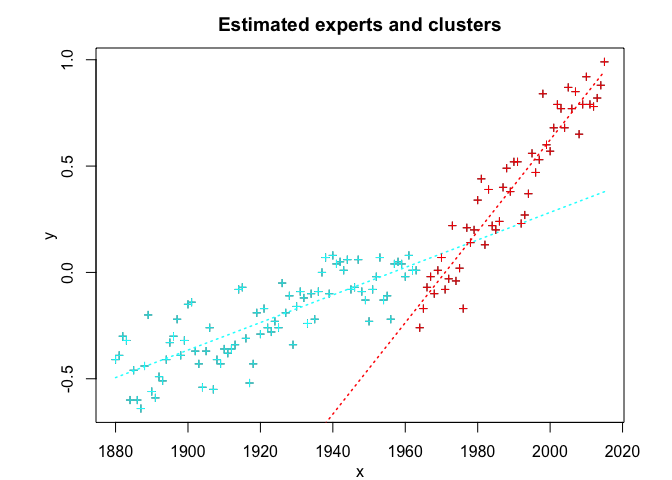
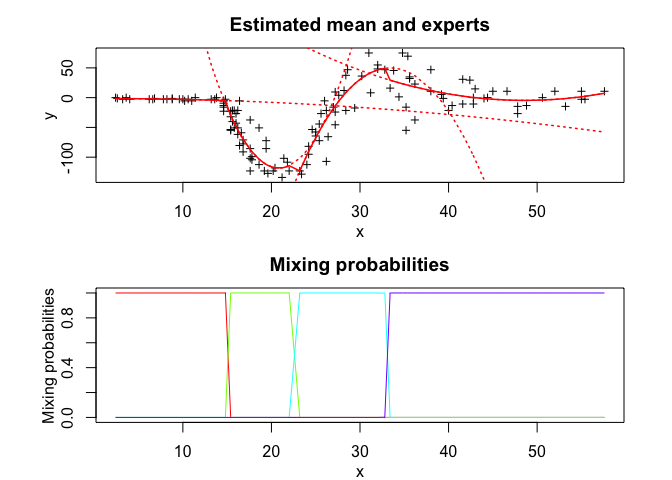
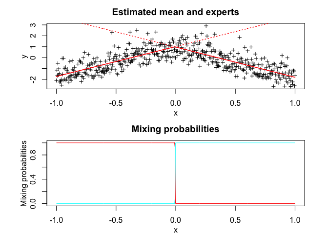
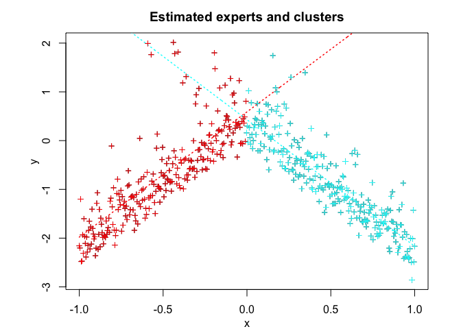
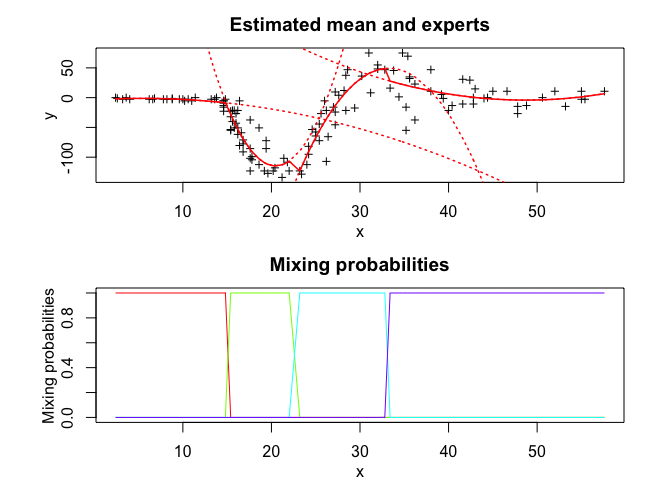

<!-- README.md is generated from README.Rmd. Please edit that file -->
**MEteorits:** Mixtures-of-ExperTs modEling for cOmplex and non-noRmal dIsTributions
====================================================================================

<!-- badges: start -->
[](https://travis-ci.org/fchamroukhi/MEteorits) <!-- badges: end -->

MEteorits is an open source toolbox (available in R and Matlab) containing several original and flexible mixtures-of-experts models to model, cluster and classify heteregenous data in many complex situations where the data are distributed according to non-normal and possibly skewed distributions, and when they might be corrupted by atypical observations. The toolbox also contains sparse mixture-of-experts models for high-dimensional data.

Our (dis-)covered meteorits are for instance the following ones:

-   NMoE (Normal Mixtures-of-Experts);
-   tMoE (t Mixtures-of-Experts);
-   SNMoE (Skew-Normal Mixtures-of-Experts);
-   StMoE (Skew t Mixtures-of-Experts).

The models and algorithms are developped and written in Matlab by Faicel Chamroukhi, and translated and designed into R packages by Florian Lecocq, Marius Bartcus and Faicel Chamroukhi.

Installation
============

You can install the development version of MEteorits from [GitHub](https://github.com/fchamroukhi/MEteorits) with:

``` r
# install.packages("devtools")
devtools::install_github("fchamroukhi/MEteorits")
```

To build *vignettes* for examples of usage, type the command below instead:

``` r
# install.packages("devtools")
devtools::install_github("fchamroukhi/MEteorits", 
                         build_opts = c("--no-resave-data", "--no-manual"), 
                         build_vignettes = TRUE)
```

Use the following command to display vignettes:

``` r
browseVignettes("meteorits")
```

Usage
=====

``` r
library(meteorits)
```

<details> <summary>NMoE</summary>

``` r
# Application to a simulated data set

n <- 500 # Size of the sample
alphak <- matrix(c(0, 8), ncol = 1) # Parameters of the gating network
betak <- matrix(c(0, -2.5, 0, 2.5), ncol = 2) # Regression coefficients of the experts
sigmak <- c(1, 1) # Standard deviations of the experts
x <- seq.int(from = -1, to = 1, length.out = n) # Inputs (predictors)

# Generate sample of size n
sample <- sampleUnivNMoE(alphak = alphak, betak = betak, sigmak = sigmak, x = x)
y <- sample$y

K <- 2 # Number of regressors/experts
p <- 1 # Order of the polynomial regression (regressors/experts)
q <- 1 # Order of the logistic regression (gating network)

n_tries <- 1
max_iter <- 1500
threshold <- 1e-5
verbose <- TRUE
verbose_IRLS <- FALSE

nmoe <- emNMoE(X = x, Y = y, K, p, q, n_tries, max_iter, 
               threshold, verbose, verbose_IRLS)
#> EM NMoE: Iteration: 1 | log-likelihood: -841.649503556059
#> EM NMoE: Iteration: 2 | log-likelihood: -841.335730688976
#> EM NMoE: Iteration: 3 | log-likelihood: -840.608331888268
#> EM NMoE: Iteration: 4 | log-likelihood: -838.918931393052
#> EM NMoE: Iteration: 5 | log-likelihood: -835.124742204294
#> EM NMoE: Iteration: 6 | log-likelihood: -827.22077669083
#> EM NMoE: Iteration: 7 | log-likelihood: -812.812055037953
#> EM NMoE: Iteration: 8 | log-likelihood: -791.41573448808
#> EM NMoE: Iteration: 9 | log-likelihood: -767.526046849759
#> EM NMoE: Iteration: 10 | log-likelihood: -748.713509465116
#> EM NMoE: Iteration: 11 | log-likelihood: -737.696398707972
#> EM NMoE: Iteration: 12 | log-likelihood: -731.708943578761
#> EM NMoE: Iteration: 13 | log-likelihood: -728.319880553337
#> EM NMoE: Iteration: 14 | log-likelihood: -726.400598373909
#> EM NMoE: Iteration: 15 | log-likelihood: -725.324861752582
#> EM NMoE: Iteration: 16 | log-likelihood: -724.717237437292
#> EM NMoE: Iteration: 17 | log-likelihood: -724.365707425859
#> EM NMoE: Iteration: 18 | log-likelihood: -724.155744739827
#> EM NMoE: Iteration: 19 | log-likelihood: -724.026058365359
#> EM NMoE: Iteration: 20 | log-likelihood: -723.943370902116
#> EM NMoE: Iteration: 21 | log-likelihood: -723.889120854349
#> EM NMoE: Iteration: 22 | log-likelihood: -723.852617778712
#> EM NMoE: Iteration: 23 | log-likelihood: -723.82750112219
#> EM NMoE: Iteration: 24 | log-likelihood: -723.809868821439
#> EM NMoE: Iteration: 25 | log-likelihood: -723.797261383082
#> EM NMoE: Iteration: 26 | log-likelihood: -723.788090715871
#> EM NMoE: Iteration: 27 | log-likelihood: -723.781309767289

nmoe$plot()
```


``` r
# Application to a real data set

data("tempanomalies")
x <- tempanomalies$Year
y <- tempanomalies$AnnualAnomaly

K <- 2 # Number of regressors/experts
p <- 1 # Order of the polynomial regression (regressors/experts)
q <- 1 # Order of the logistic regression (gating network)

n_tries <- 1
max_iter <- 1500
threshold <- 1e-5
verbose <- TRUE
verbose_IRLS <- FALSE

nmoe <- emNMoE(X = x, Y = y, K, p, q, n_tries, max_iter, 
               threshold, verbose, verbose_IRLS)
#> EM NMoE: Iteration: 1 | log-likelihood: 48.9946531881901
#> EM NMoE: Iteration: 2 | log-likelihood: 49.9640368300173
#> EM NMoE: Iteration: 3 | log-likelihood: 52.3837851321119
#> EM NMoE: Iteration: 4 | log-likelihood: 57.6661543983187
#> EM NMoE: Iteration: 5 | log-likelihood: 65.9164679073113
#> EM NMoE: Iteration: 6 | log-likelihood: 73.6140091290034
#> EM NMoE: Iteration: 7 | log-likelihood: 78.2936932352431
#> EM NMoE: Iteration: 8 | log-likelihood: 81.5036986245614
#> EM NMoE: Iteration: 9 | log-likelihood: 85.0781070001941
#> EM NMoE: Iteration: 10 | log-likelihood: 89.6662997476794
#> EM NMoE: Iteration: 11 | log-likelihood: 93.7836614360607
#> EM NMoE: Iteration: 12 | log-likelihood: 95.6308638796068
#> EM NMoE: Iteration: 13 | log-likelihood: 96.2684053623776
#> EM NMoE: Iteration: 14 | log-likelihood: 96.5353589744769
#> EM NMoE: Iteration: 15 | log-likelihood: 96.6934590387216
#> EM NMoE: Iteration: 16 | log-likelihood: 96.8213068269691
#> EM NMoE: Iteration: 17 | log-likelihood: 96.943796505614
#> EM NMoE: Iteration: 18 | log-likelihood: 97.0686452468796
#> EM NMoE: Iteration: 19 | log-likelihood: 97.1971417762568
#> EM NMoE: Iteration: 20 | log-likelihood: 97.32778307521
#> EM NMoE: Iteration: 21 | log-likelihood: 97.4579729272162
#> EM NMoE: Iteration: 22 | log-likelihood: 97.5851771662161
#> EM NMoE: Iteration: 23 | log-likelihood: 97.7078273754904
#> EM NMoE: Iteration: 24 | log-likelihood: 97.825892570968
#> EM NMoE: Iteration: 25 | log-likelihood: 97.9409771614818
#> EM NMoE: Iteration: 26 | log-likelihood: 98.055908574265
#> EM NMoE: Iteration: 27 | log-likelihood: 98.1739655395689
#> EM NMoE: Iteration: 28 | log-likelihood: 98.2980531794899
#> EM NMoE: Iteration: 29 | log-likelihood: 98.4301549997637
#> EM NMoE: Iteration: 30 | log-likelihood: 98.5712577427408
#> EM NMoE: Iteration: 31 | log-likelihood: 98.7217307039157
#> EM NMoE: Iteration: 32 | log-likelihood: 98.881884523177
#> EM NMoE: Iteration: 33 | log-likelihood: 99.0525561518425
#> EM NMoE: Iteration: 34 | log-likelihood: 99.2355089118082
#> EM NMoE: Iteration: 35 | log-likelihood: 99.4337401358928
#> EM NMoE: Iteration: 36 | log-likelihood: 99.6518866262329
#> EM NMoE: Iteration: 37 | log-likelihood: 99.8969613333979
#> EM NMoE: Iteration: 38 | log-likelihood: 100.179598028491
#> EM NMoE: Iteration: 39 | log-likelihood: 100.515762154687
#> EM NMoE: Iteration: 40 | log-likelihood: 100.927529782769
#> EM NMoE: Iteration: 41 | log-likelihood: 101.434271029937
#> EM NMoE: Iteration: 42 | log-likelihood: 102.003576578357
#> EM NMoE: Iteration: 43 | log-likelihood: 102.472104259926
#> EM NMoE: Iteration: 44 | log-likelihood: 102.690033049484
#> EM NMoE: Iteration: 45 | log-likelihood: 102.719926978458
#> EM NMoE: Iteration: 46 | log-likelihood: 102.721210414972
#> EM NMoE: Iteration: 47 | log-likelihood: 102.721210436711

nmoe$plot()
```

 </details>

<details>

<summary>TMoE</summary>

``` r
# Application to a simulated data set

n <- 500 # Size of the sample
alphak <- matrix(c(0, 8), ncol = 1) # Parameters of the gating network
betak <- matrix(c(0, -2.5, 0, 2.5), ncol = 2) # Regression coefficients of the experts
sigmak <- c(0.5, 0.5) # Standard deviations of the experts
nuk <- c(5, 7) # Degrees of freedom of the experts network t densities
x <- seq.int(from = -1, to = 1, length.out = n) # Inputs (predictors)

# Generate sample of size n
sample <- sampleUnivTMoE(alphak = alphak, betak = betak, sigmak = sigmak, 
                         nuk = nuk, x = x)
y <- sample$y

K <- 2 # Number of regressors/experts
p <- 1 # Order of the polynomial regression (regressors/experts)
q <- 1 # Order of the logistic regression (gating network)

n_tries <- 1
max_iter <- 1500
threshold <- 1e-5
verbose <- TRUE
verbose_IRLS <- FALSE

tmoe <- emTMoE(X = x, Y = y, K, p, q, n_tries, max_iter, 
               threshold, verbose, verbose_IRLS)
#> EM - tMoE: Iteration: 1 | log-likelihood: -482.794300061594
#> EM - tMoE: Iteration: 2 | log-likelihood: -480.771978547388
#> EM - tMoE: Iteration: 3 | log-likelihood: -480.090509914565
#> EM - tMoE: Iteration: 4 | log-likelihood: -479.493518803505
#> EM - tMoE: Iteration: 5 | log-likelihood: -478.982890511569
#> EM - tMoE: Iteration: 6 | log-likelihood: -478.559115982577
#> EM - tMoE: Iteration: 7 | log-likelihood: -478.215852795436
#> EM - tMoE: Iteration: 8 | log-likelihood: -477.943100152294
#> EM - tMoE: Iteration: 9 | log-likelihood: -477.729629228701
#> EM - tMoE: Iteration: 10 | log-likelihood: -477.564512671216
#> EM - tMoE: Iteration: 11 | log-likelihood: -477.437939058446
#> EM - tMoE: Iteration: 12 | log-likelihood: -477.341540708455
#> EM - tMoE: Iteration: 13 | log-likelihood: -477.268427734561
#> EM - tMoE: Iteration: 14 | log-likelihood: -477.213066590591
#> EM - tMoE: Iteration: 15 | log-likelihood: -477.171097310616
#> EM - tMoE: Iteration: 16 | log-likelihood: -477.13915445182
#> EM - tMoE: Iteration: 17 | log-likelihood: -477.114629600264
#> EM - tMoE: Iteration: 18 | log-likelihood: -477.095486712564
#> EM - tMoE: Iteration: 19 | log-likelihood: -477.08020187114
#> EM - tMoE: Iteration: 20 | log-likelihood: -477.067727045148
#> EM - tMoE: Iteration: 21 | log-likelihood: -477.057082927915
#> EM - tMoE: Iteration: 22 | log-likelihood: -477.047596352328
#> EM - tMoE: Iteration: 23 | log-likelihood: -477.038761013925
#> EM - tMoE: Iteration: 24 | log-likelihood: -477.03020154887
#> EM - tMoE: Iteration: 25 | log-likelihood: -477.02164943687
#> EM - tMoE: Iteration: 26 | log-likelihood: -477.012927001671
#> EM - tMoE: Iteration: 27 | log-likelihood: -477.003925852155
#> EM - tMoE: Iteration: 28 | log-likelihood: -476.994464234588
#> EM - tMoE: Iteration: 29 | log-likelihood: -476.984661123016
#> EM - tMoE: Iteration: 30 | log-likelihood: -476.974712412079
#> EM - tMoE: Iteration: 31 | log-likelihood: -476.964787647211
#> EM - tMoE: Iteration: 32 | log-likelihood: -476.955038259654
#> EM - tMoE: Iteration: 33 | log-likelihood: -476.945611636444
#> EM - tMoE: Iteration: 34 | log-likelihood: -476.936638899634
#> EM - tMoE: Iteration: 35 | log-likelihood: -476.92822449693
#> EM - tMoE: Iteration: 36 | log-likelihood: -476.920329418423
#> EM - tMoE: Iteration: 37 | log-likelihood: -476.912969732931
#> EM - tMoE: Iteration: 38 | log-likelihood: -476.906324818216
#> EM - tMoE: Iteration: 39 | log-likelihood: -476.900405848904
#> EM - tMoE: Iteration: 40 | log-likelihood: -476.895198033076
#> EM - tMoE: Iteration: 41 | log-likelihood: -476.890666624366

tmoe$plot()
```


``` r
# Application to a real data set

library(MASS)
data("mcycle")
x <- mcycle$times
y <- mcycle$accel

K <- 4 # Number of regressors/experts
p <- 2 # Order of the polynomial regression (regressors/experts)
q <- 1 # Order of the logistic regression (gating network)

n_tries <- 1
max_iter <- 1500
threshold <- 1e-5
verbose <- TRUE
verbose_IRLS <- FALSE

tmoe <- emTMoE(X = x, Y = y, K, p, q, n_tries, max_iter, 
               threshold, verbose, verbose_IRLS)
#> EM - tMoE: Iteration: 1 | log-likelihood: -584.507530669826
#> EM - tMoE: Iteration: 2 | log-likelihood: -583.321069124476
#> EM - tMoE: Iteration: 3 | log-likelihood: -582.641767311575
#> EM - tMoE: Iteration: 4 | log-likelihood: -580.00514114585
#> EM - tMoE: Iteration: 5 | log-likelihood: -571.144671702626
#> EM - tMoE: Iteration: 6 | log-likelihood: -563.469561405744
#> EM - tMoE: Iteration: 7 | log-likelihood: -560.348550342694
#> EM - tMoE: Iteration: 8 | log-likelihood: -559.611531116773
#> EM - tMoE: Iteration: 9 | log-likelihood: -559.015919532841
#> EM - tMoE: Iteration: 10 | log-likelihood: -558.241177644933
#> EM - tMoE: Iteration: 11 | log-likelihood: -557.276602161594
#> EM - tMoE: Iteration: 12 | log-likelihood: -556.23141942907
#> EM - tMoE: Iteration: 13 | log-likelihood: -555.292162729026
#> EM - tMoE: Iteration: 14 | log-likelihood: -554.466899239084
#> EM - tMoE: Iteration: 15 | log-likelihood: -553.705005715485
#> EM - tMoE: Iteration: 16 | log-likelihood: -553.014822254748
#> EM - tMoE: Iteration: 17 | log-likelihood: -552.429260744695
#> EM - tMoE: Iteration: 18 | log-likelihood: -551.9719464826
#> EM - tMoE: Iteration: 19 | log-likelihood: -551.641567660259
#> EM - tMoE: Iteration: 20 | log-likelihood: -551.416074908638
#> EM - tMoE: Iteration: 21 | log-likelihood: -551.267322441253
#> EM - tMoE: Iteration: 22 | log-likelihood: -551.170803142824
#> EM - tMoE: Iteration: 23 | log-likelihood: -551.108504466059
#> EM - tMoE: Iteration: 24 | log-likelihood: -551.068234505673
#> EM - tMoE: Iteration: 25 | log-likelihood: -551.042061346075
#> EM - tMoE: Iteration: 26 | log-likelihood: -551.024913507297
#> EM - tMoE: Iteration: 27 | log-likelihood: -551.013566856374
#> EM - tMoE: Iteration: 28 | log-likelihood: -551.005970869103
#> EM - tMoE: Iteration: 29 | log-likelihood: -551.000816835078

tmoe$plot()
```

 </details>

<details> <summary>SNMoE</summary>

``` r
# Application to a simulated data set

n <- 500 # Size of the sample
alphak <- matrix(c(0, 8), ncol = 1) # Parameters of the gating network
betak <- matrix(c(0, -2.5, 0, 2.5), ncol = 2) # Regression coefficients of the experts
lambdak <- c(3, 5) # Skewness parameters of the experts
sigmak <- c(1, 1) # Standard deviations of the experts
x <- seq.int(from = -1, to = 1, length.out = n) # Inputs (predictors)

# Generate sample of size n
sample <- sampleUnivSNMoE(alphak = alphak, betak = betak, sigmak = sigmak, 
                          lambdak = lambdak, x = x)
y <- sample$y

K <- 2 # Number of regressors/experts
p <- 1 # Order of the polynomial regression (regressors/experts)
q <- 1 # Order of the logistic regression (gating network)

n_tries <- 1
max_iter <- 1500
threshold <- 1e-6
verbose <- TRUE
verbose_IRLS <- FALSE

snmoe <- emSNMoE(X = x, Y = y, K, p, q, n_tries, max_iter, 
                 threshold, verbose, verbose_IRLS)
#> EM - SNMoE: Iteration: 1 | log-likelihood: -603.462263238426
#> EM - SNMoE: Iteration: 2 | log-likelihood: -527.806981362588
#> EM - SNMoE: Iteration: 3 | log-likelihood: -525.07684979154
#> EM - SNMoE: Iteration: 4 | log-likelihood: -524.500052155355
#> EM - SNMoE: Iteration: 5 | log-likelihood: -524.248434841236
#> EM - SNMoE: Iteration: 6 | log-likelihood: -524.042466623769
#> EM - SNMoE: Iteration: 7 | log-likelihood: -523.836460117098
#> EM - SNMoE: Iteration: 8 | log-likelihood: -523.625239005641
#> EM - SNMoE: Iteration: 9 | log-likelihood: -523.407944054366
#> EM - SNMoE: Iteration: 10 | log-likelihood: -523.182970493703
#> EM - SNMoE: Iteration: 11 | log-likelihood: -522.947413592343
#> EM - SNMoE: Iteration: 12 | log-likelihood: -522.697613814738
#> EM - SNMoE: Iteration: 13 | log-likelihood: -522.429419724596
#> EM - SNMoE: Iteration: 14 | log-likelihood: -522.138457957396
#> EM - SNMoE: Iteration: 15 | log-likelihood: -521.820281276072
#> EM - SNMoE: Iteration: 16 | log-likelihood: -521.470639275055
#> EM - SNMoE: Iteration: 17 | log-likelihood: -521.085717203057
#> EM - SNMoE: Iteration: 18 | log-likelihood: -520.662239631546
#> EM - SNMoE: Iteration: 19 | log-likelihood: -520.197327324708
#> EM - SNMoE: Iteration: 20 | log-likelihood: -519.690836751799
#> EM - SNMoE: Iteration: 21 | log-likelihood: -519.141610052679
#> EM - SNMoE: Iteration: 22 | log-likelihood: -518.54896682867
#> EM - SNMoE: Iteration: 23 | log-likelihood: -517.914344483643
#> EM - SNMoE: Iteration: 24 | log-likelihood: -517.239285393665
#> EM - SNMoE: Iteration: 25 | log-likelihood: -516.526049708189
#> EM - SNMoE: Iteration: 26 | log-likelihood: -515.777775868288
#> EM - SNMoE: Iteration: 27 | log-likelihood: -514.998380554006
#> EM - SNMoE: Iteration: 28 | log-likelihood: -514.192487247704
#> EM - SNMoE: Iteration: 29 | log-likelihood: -513.365259413336
#> EM - SNMoE: Iteration: 30 | log-likelihood: -512.522417961881
#> EM - SNMoE: Iteration: 31 | log-likelihood: -511.669612024623
#> EM - SNMoE: Iteration: 32 | log-likelihood: -510.812573269786
#> EM - SNMoE: Iteration: 33 | log-likelihood: -509.956494934408
#> EM - SNMoE: Iteration: 34 | log-likelihood: -509.106968046697
#> EM - SNMoE: Iteration: 35 | log-likelihood: -508.269768429326
#> EM - SNMoE: Iteration: 36 | log-likelihood: -507.45126787066
#> EM - SNMoE: Iteration: 37 | log-likelihood: -506.658004244846
#> EM - SNMoE: Iteration: 38 | log-likelihood: -505.897214693859
#> EM - SNMoE: Iteration: 39 | log-likelihood: -505.173674633917
#> EM - SNMoE: Iteration: 40 | log-likelihood: -504.490307905358
#> EM - SNMoE: Iteration: 41 | log-likelihood: -503.847512331404
#> EM - SNMoE: Iteration: 42 | log-likelihood: -503.243329663108
#> EM - SNMoE: Iteration: 43 | log-likelihood: -502.673894196449
#> EM - SNMoE: Iteration: 44 | log-likelihood: -502.133815812787
#> EM - SNMoE: Iteration: 45 | log-likelihood: -501.616148909459
#> EM - SNMoE: Iteration: 46 | log-likelihood: -501.114870573069
#> EM - SNMoE: Iteration: 47 | log-likelihood: -500.629223918002
#> EM - SNMoE: Iteration: 48 | log-likelihood: -500.165771435066
#> EM - SNMoE: Iteration: 49 | log-likelihood: -499.735703425285
#> EM - SNMoE: Iteration: 50 | log-likelihood: -499.347849990883
#> EM - SNMoE: Iteration: 51 | log-likelihood: -499.003548508664
#> EM - SNMoE: Iteration: 52 | log-likelihood: -498.697805013173
#> EM - SNMoE: Iteration: 53 | log-likelihood: -498.423407188775
#> EM - SNMoE: Iteration: 54 | log-likelihood: -498.173591317414
#> EM - SNMoE: Iteration: 55 | log-likelihood: -497.942935134066
#> EM - SNMoE: Iteration: 56 | log-likelihood: -497.727415793355
#> EM - SNMoE: Iteration: 57 | log-likelihood: -497.524394179984
#> EM - SNMoE: Iteration: 58 | log-likelihood: -497.332660918716
#> EM - SNMoE: Iteration: 59 | log-likelihood: -497.152340555584
#> EM - SNMoE: Iteration: 60 | log-likelihood: -496.984053887691
#> EM - SNMoE: Iteration: 61 | log-likelihood: -496.831299757509
#> EM - SNMoE: Iteration: 62 | log-likelihood: -496.692861411355
#> EM - SNMoE: Iteration: 63 | log-likelihood: -496.569591574022
#> EM - SNMoE: Iteration: 64 | log-likelihood: -496.460645574687
#> EM - SNMoE: Iteration: 65 | log-likelihood: -496.364589907645
#> EM - SNMoE: Iteration: 66 | log-likelihood: -496.279784759271
#> EM - SNMoE: Iteration: 67 | log-likelihood: -496.204613314475
#> EM - SNMoE: Iteration: 68 | log-likelihood: -496.137657332663
#> EM - SNMoE: Iteration: 69 | log-likelihood: -496.077732306236
#> EM - SNMoE: Iteration: 70 | log-likelihood: -496.023814589733
#> EM - SNMoE: Iteration: 71 | log-likelihood: -495.975222367758
#> EM - SNMoE: Iteration: 72 | log-likelihood: -495.931218742195
#> EM - SNMoE: Iteration: 73 | log-likelihood: -495.891169523964
#> EM - SNMoE: Iteration: 74 | log-likelihood: -495.854630057934
#> EM - SNMoE: Iteration: 75 | log-likelihood: -495.821271550628
#> EM - SNMoE: Iteration: 76 | log-likelihood: -495.790687171852
#> EM - SNMoE: Iteration: 77 | log-likelihood: -495.762824639921
#> EM - SNMoE: Iteration: 78 | log-likelihood: -495.7372413753
#> EM - SNMoE: Iteration: 79 | log-likelihood: -495.713801099022
#> EM - SNMoE: Iteration: 80 | log-likelihood: -495.692294856096
#> EM - SNMoE: Iteration: 81 | log-likelihood: -495.672559013092
#> EM - SNMoE: Iteration: 82 | log-likelihood: -495.654437976374
#> EM - SNMoE: Iteration: 83 | log-likelihood: -495.63778687564
#> EM - SNMoE: Iteration: 84 | log-likelihood: -495.622477584721
#> EM - SNMoE: Iteration: 85 | log-likelihood: -495.608426348693
#> EM - SNMoE: Iteration: 86 | log-likelihood: -495.59550385279
#> EM - SNMoE: Iteration: 87 | log-likelihood: -495.583614721115
#> EM - SNMoE: Iteration: 88 | log-likelihood: -495.572672650937
#> EM - SNMoE: Iteration: 89 | log-likelihood: -495.562600419973
#> EM - SNMoE: Iteration: 90 | log-likelihood: -495.553327888018
#> EM - SNMoE: Iteration: 91 | log-likelihood: -495.544786039455
#> EM - SNMoE: Iteration: 92 | log-likelihood: -495.536917297616
#> EM - SNMoE: Iteration: 93 | log-likelihood: -495.529664644397
#> EM - SNMoE: Iteration: 94 | log-likelihood: -495.522979162366
#> EM - SNMoE: Iteration: 95 | log-likelihood: -495.51681657525
#> EM - SNMoE: Iteration: 96 | log-likelihood: -495.511134816459
#> EM - SNMoE: Iteration: 97 | log-likelihood: -495.505891425494
#> EM - SNMoE: Iteration: 98 | log-likelihood: -495.501052603367
#> EM - SNMoE: Iteration: 99 | log-likelihood: -495.496585759433
#> EM - SNMoE: Iteration: 100 | log-likelihood: -495.492460892848
#> EM - SNMoE: Iteration: 101 | log-likelihood: -495.488650322771
#> EM - SNMoE: Iteration: 102 | log-likelihood: -495.485137782579
#> EM - SNMoE: Iteration: 103 | log-likelihood: -495.481889916372
#> EM - SNMoE: Iteration: 104 | log-likelihood: -495.478885845773
#> EM - SNMoE: Iteration: 105 | log-likelihood: -495.476107793935
#> EM - SNMoE: Iteration: 106 | log-likelihood: -495.473538180068
#> EM - SNMoE: Iteration: 107 | log-likelihood: -495.471160873884
#> EM - SNMoE: Iteration: 108 | log-likelihood: -495.468960953177
#> EM - SNMoE: Iteration: 109 | log-likelihood: -495.46692459799
#> EM - SNMoE: Iteration: 110 | log-likelihood: -495.465038987999
#> EM - SNMoE: Iteration: 111 | log-likelihood: -495.463292677192
#> EM - SNMoE: Iteration: 112 | log-likelihood: -495.461675416583
#> EM - SNMoE: Iteration: 113 | log-likelihood: -495.460176950733
#> EM - SNMoE: Iteration: 114 | log-likelihood: -495.458787959687
#> EM - SNMoE: Iteration: 115 | log-likelihood: -495.457499507253
#> EM - SNMoE: Iteration: 116 | log-likelihood: -495.456303696057
#> EM - SNMoE: Iteration: 117 | log-likelihood: -495.455195221897
#> EM - SNMoE: Iteration: 118 | log-likelihood: -495.454167242514
#> EM - SNMoE: Iteration: 119 | log-likelihood: -495.453210417128
#> EM - SNMoE: Iteration: 120 | log-likelihood: -495.452322520758
#> EM - SNMoE: Iteration: 121 | log-likelihood: -495.451497166328
#> EM - SNMoE: Iteration: 122 | log-likelihood: -495.45072716506
#> EM - SNMoE: Iteration: 123 | log-likelihood: -495.450012600399
#> EM - SNMoE: Iteration: 124 | log-likelihood: -495.449347861831
#> EM - SNMoE: Iteration: 125 | log-likelihood: -495.448729311129
#> EM - SNMoE: Iteration: 126 | log-likelihood: -495.448154084826
#> EM - SNMoE: Iteration: 127 | log-likelihood: -495.447617516148
#> EM - SNMoE: Iteration: 128 | log-likelihood: -495.44711770884
#> EM - SNMoE: Iteration: 129 | log-likelihood: -495.446653195499

snmoe$plot()
```



``` r
# Application to a real data set

data("tempanomalies")
x <- tempanomalies$Year
y <- tempanomalies$AnnualAnomaly

K <- 2 # Number of regressors/experts
p <- 1 # Order of the polynomial regression (regressors/experts)
q <- 1 # Order of the logistic regression (gating network)

n_tries <- 1
max_iter <- 1500
threshold <- 1e-6
verbose <- TRUE
verbose_IRLS <- FALSE

snmoe <- emSNMoE(X = x, Y = y, K, p, q, n_tries, max_iter, 
                 threshold, verbose, verbose_IRLS)
#> EM - SNMoE: Iteration: 1 | log-likelihood: 75.2938116958253
#> EM - SNMoE: Iteration: 2 | log-likelihood: 88.6218393847045
#> EM - SNMoE: Iteration: 3 | log-likelihood: 89.160269459601
#> EM - SNMoE: Iteration: 4 | log-likelihood: 89.4100822947821
#> EM - SNMoE: Iteration: 5 | log-likelihood: 89.642108882235
#> EM - SNMoE: Iteration: 6 | log-likelihood: 89.8236993479931
#> EM - SNMoE: Iteration: 7 | log-likelihood: 89.9310224033352
#> EM - SNMoE: Iteration: 8 | log-likelihood: 89.990753082683
#> EM - SNMoE: Iteration: 9 | log-likelihood: 90.0251699975744
#> EM - SNMoE: Iteration: 10 | log-likelihood: 90.04810676452
#> EM - SNMoE: Iteration: 11 | log-likelihood: 90.0664925925431
#> EM - SNMoE: Iteration: 12 | log-likelihood: 90.0826079717528
#> EM - SNMoE: Iteration: 13 | log-likelihood: 90.097150810608
#> EM - SNMoE: Iteration: 14 | log-likelihood: 90.1106868565252
#> EM - SNMoE: Iteration: 15 | log-likelihood: 90.1235553050577
#> EM - SNMoE: Iteration: 16 | log-likelihood: 90.1358920168071
#> EM - SNMoE: Iteration: 17 | log-likelihood: 90.1477525479965
#> EM - SNMoE: Iteration: 18 | log-likelihood: 90.1591740082316
#> EM - SNMoE: Iteration: 19 | log-likelihood: 90.170174280551
#> EM - SNMoE: Iteration: 20 | log-likelihood: 90.1807659519007
#> EM - SNMoE: Iteration: 21 | log-likelihood: 90.190970842907
#> EM - SNMoE: Iteration: 22 | log-likelihood: 90.200805634507
#> EM - SNMoE: Iteration: 23 | log-likelihood: 90.210313077499
#> EM - SNMoE: Iteration: 24 | log-likelihood: 90.2195904017464
#> EM - SNMoE: Iteration: 25 | log-likelihood: 90.2285509471943
#> EM - SNMoE: Iteration: 26 | log-likelihood: 90.2372216525439
#> EM - SNMoE: Iteration: 27 | log-likelihood: 90.2456269113536
#> EM - SNMoE: Iteration: 28 | log-likelihood: 90.253897067101
#> EM - SNMoE: Iteration: 29 | log-likelihood: 90.2615035254977
#> EM - SNMoE: Iteration: 30 | log-likelihood: 90.2692918937156
#> EM - SNMoE: Iteration: 31 | log-likelihood: 90.2768900511085
#> EM - SNMoE: Iteration: 32 | log-likelihood: 90.2844219119889
#> EM - SNMoE: Iteration: 33 | log-likelihood: 90.2918956323005
#> EM - SNMoE: Iteration: 34 | log-likelihood: 90.2995236825632
#> EM - SNMoE: Iteration: 35 | log-likelihood: 90.3069543401247
#> EM - SNMoE: Iteration: 36 | log-likelihood: 90.3143659027924
#> EM - SNMoE: Iteration: 37 | log-likelihood: 90.3218233557562
#> EM - SNMoE: Iteration: 38 | log-likelihood: 90.329268712762
#> EM - SNMoE: Iteration: 39 | log-likelihood: 90.3367444476347
#> EM - SNMoE: Iteration: 40 | log-likelihood: 90.3442003089079
#> EM - SNMoE: Iteration: 41 | log-likelihood: 90.3516741199911
#> EM - SNMoE: Iteration: 42 | log-likelihood: 90.3591350661709
#> EM - SNMoE: Iteration: 43 | log-likelihood: 90.3666118923607
#> EM - SNMoE: Iteration: 44 | log-likelihood: 90.3740982840068
#> EM - SNMoE: Iteration: 45 | log-likelihood: 90.3815903943244
#> EM - SNMoE: Iteration: 46 | log-likelihood: 90.3890807548224
#> EM - SNMoE: Iteration: 47 | log-likelihood: 90.396565216695
#> EM - SNMoE: Iteration: 48 | log-likelihood: 90.4040389753714
#> EM - SNMoE: Iteration: 49 | log-likelihood: 90.4114963928484
#> EM - SNMoE: Iteration: 50 | log-likelihood: 90.4189328492819
#> EM - SNMoE: Iteration: 51 | log-likelihood: 90.4263436017205
#> EM - SNMoE: Iteration: 52 | log-likelihood: 90.4337265664462
#> EM - SNMoE: Iteration: 53 | log-likelihood: 90.4410703873906
#> EM - SNMoE: Iteration: 54 | log-likelihood: 90.4483730946426
#> EM - SNMoE: Iteration: 55 | log-likelihood: 90.4556307241484
#> EM - SNMoE: Iteration: 56 | log-likelihood: 90.4628326316243
#> EM - SNMoE: Iteration: 57 | log-likelihood: 90.4699548590556
#> EM - SNMoE: Iteration: 58 | log-likelihood: 90.4770789018386
#> EM - SNMoE: Iteration: 59 | log-likelihood: 90.4841029155308
#> EM - SNMoE: Iteration: 60 | log-likelihood: 90.4910887765555
#> EM - SNMoE: Iteration: 61 | log-likelihood: 90.4979663336835
#> EM - SNMoE: Iteration: 62 | log-likelihood: 90.5047726083897
#> EM - SNMoE: Iteration: 63 | log-likelihood: 90.5115483049956
#> EM - SNMoE: Iteration: 64 | log-likelihood: 90.5182696887925
#> EM - SNMoE: Iteration: 65 | log-likelihood: 90.5249384075939
#> EM - SNMoE: Iteration: 66 | log-likelihood: 90.5315460099988
#> EM - SNMoE: Iteration: 67 | log-likelihood: 90.538094848742
#> EM - SNMoE: Iteration: 68 | log-likelihood: 90.5445846925399
#> EM - SNMoE: Iteration: 69 | log-likelihood: 90.5510165687421
#> EM - SNMoE: Iteration: 70 | log-likelihood: 90.5573819315083
#> EM - SNMoE: Iteration: 71 | log-likelihood: 90.5636841646697
#> EM - SNMoE: Iteration: 72 | log-likelihood: 90.5699294201801
#> EM - SNMoE: Iteration: 73 | log-likelihood: 90.5761162246963
#> EM - SNMoE: Iteration: 74 | log-likelihood: 90.5822397887858
#> EM - SNMoE: Iteration: 75 | log-likelihood: 90.5883026429903
#> EM - SNMoE: Iteration: 76 | log-likelihood: 90.5943001461035
#> EM - SNMoE: Iteration: 77 | log-likelihood: 90.6002329154789
#> EM - SNMoE: Iteration: 78 | log-likelihood: 90.6061006485515
#> EM - SNMoE: Iteration: 79 | log-likelihood: 90.6119028122154
#> EM - SNMoE: Iteration: 80 | log-likelihood: 90.6176388461157
#> EM - SNMoE: Iteration: 81 | log-likelihood: 90.6233095802863
#> EM - SNMoE: Iteration: 82 | log-likelihood: 90.6289134823106
#> EM - SNMoE: Iteration: 83 | log-likelihood: 90.6344505898707
#> EM - SNMoE: Iteration: 84 | log-likelihood: 90.6399196886006
#> EM - SNMoE: Iteration: 85 | log-likelihood: 90.645319407891
#> EM - SNMoE: Iteration: 86 | log-likelihood: 90.6506493696812
#> EM - SNMoE: Iteration: 87 | log-likelihood: 90.6559088194124
#> EM - SNMoE: Iteration: 88 | log-likelihood: 90.6610971054471
#> EM - SNMoE: Iteration: 89 | log-likelihood: 90.666217399438
#> EM - SNMoE: Iteration: 90 | log-likelihood: 90.6712603740475
#> EM - SNMoE: Iteration: 91 | log-likelihood: 90.6762294309565
#> EM - SNMoE: Iteration: 92 | log-likelihood: 90.6811236986367
#> EM - SNMoE: Iteration: 93 | log-likelihood: 90.6859417144189
#> EM - SNMoE: Iteration: 94 | log-likelihood: 90.6906792817506
#> EM - SNMoE: Iteration: 95 | log-likelihood: 90.6953396273735
#> EM - SNMoE: Iteration: 96 | log-likelihood: 90.6999231982798
#> EM - SNMoE: Iteration: 97 | log-likelihood: 90.7044233764707
#> EM - SNMoE: Iteration: 98 | log-likelihood: 90.7088377557556
#> EM - SNMoE: Iteration: 99 | log-likelihood: 90.7131646129303
#> EM - SNMoE: Iteration: 100 | log-likelihood: 90.7174022206837
#> EM - SNMoE: Iteration: 101 | log-likelihood: 90.7215596771883
#> EM - SNMoE: Iteration: 102 | log-likelihood: 90.7256307961518
#> EM - SNMoE: Iteration: 103 | log-likelihood: 90.7296066861901
#> EM - SNMoE: Iteration: 104 | log-likelihood: 90.733486037971
#> EM - SNMoE: Iteration: 105 | log-likelihood: 90.7372670804828
#> EM - SNMoE: Iteration: 106 | log-likelihood: 90.7409487251678
#> EM - SNMoE: Iteration: 107 | log-likelihood: 90.7445995318172
#> EM - SNMoE: Iteration: 108 | log-likelihood: 90.7478948381202
#> EM - SNMoE: Iteration: 109 | log-likelihood: 90.7513993294037
#> EM - SNMoE: Iteration: 110 | log-likelihood: 90.7545225460909
#> EM - SNMoE: Iteration: 111 | log-likelihood: 90.7576052055324
#> EM - SNMoE: Iteration: 112 | log-likelihood: 90.7605962163717
#> EM - SNMoE: Iteration: 113 | log-likelihood: 90.7635314274267
#> EM - SNMoE: Iteration: 114 | log-likelihood: 90.7663208224846
#> EM - SNMoE: Iteration: 115 | log-likelihood: 90.7690408776676
#> EM - SNMoE: Iteration: 116 | log-likelihood: 90.7716473171262
#> EM - SNMoE: Iteration: 117 | log-likelihood: 90.7741849680539
#> EM - SNMoE: Iteration: 118 | log-likelihood: 90.7766133063692
#> EM - SNMoE: Iteration: 119 | log-likelihood: 90.7789554884015
#> EM - SNMoE: Iteration: 120 | log-likelihood: 90.7812141504572
#> EM - SNMoE: Iteration: 121 | log-likelihood: 90.7833905029345
#> EM - SNMoE: Iteration: 122 | log-likelihood: 90.7856763581795
#> EM - SNMoE: Iteration: 123 | log-likelihood: 90.787669224731
#> EM - SNMoE: Iteration: 124 | log-likelihood: 90.7895869771918
#> EM - SNMoE: Iteration: 125 | log-likelihood: 90.7914528924766
#> EM - SNMoE: Iteration: 126 | log-likelihood: 90.7932221991869
#> EM - SNMoE: Iteration: 127 | log-likelihood: 90.7949375779121
#> EM - SNMoE: Iteration: 128 | log-likelihood: 90.7965713432034
#> EM - SNMoE: Iteration: 129 | log-likelihood: 90.7981326401412
#> EM - SNMoE: Iteration: 130 | log-likelihood: 90.7996301972319
#> EM - SNMoE: Iteration: 131 | log-likelihood: 90.8010652750163
#> EM - SNMoE: Iteration: 132 | log-likelihood: 90.802439754461
#> EM - SNMoE: Iteration: 133 | log-likelihood: 90.8037555185894
#> EM - SNMoE: Iteration: 134 | log-likelihood: 90.8050144418584
#> EM - SNMoE: Iteration: 135 | log-likelihood: 90.8063308335464
#> EM - SNMoE: Iteration: 136 | log-likelihood: 90.8074756286165
#> EM - SNMoE: Iteration: 137 | log-likelihood: 90.8085697757353
#> EM - SNMoE: Iteration: 138 | log-likelihood: 90.809614898016
#> EM - SNMoE: Iteration: 139 | log-likelihood: 90.8106128105508
#> EM - SNMoE: Iteration: 140 | log-likelihood: 90.8115812784679
#> EM - SNMoE: Iteration: 141 | log-likelihood: 90.8124889655621
#> EM - SNMoE: Iteration: 142 | log-likelihood: 90.8133547548366
#> EM - SNMoE: Iteration: 143 | log-likelihood: 90.8141885010632
#> EM - SNMoE: Iteration: 144 | log-likelihood: 90.8149790053385
#> EM - SNMoE: Iteration: 145 | log-likelihood: 90.8157321643618
#> EM - SNMoE: Iteration: 146 | log-likelihood: 90.8164453907025
#> EM - SNMoE: Iteration: 147 | log-likelihood: 90.8171250316646
#> EM - SNMoE: Iteration: 148 | log-likelihood: 90.8177720166422
#> EM - SNMoE: Iteration: 149 | log-likelihood: 90.8183877913853
#> EM - SNMoE: Iteration: 150 | log-likelihood: 90.8189739164355
#> EM - SNMoE: Iteration: 151 | log-likelihood: 90.8195319084016
#> EM - SNMoE: Iteration: 152 | log-likelihood: 90.820126263713
#> EM - SNMoE: Iteration: 153 | log-likelihood: 90.8205662916022
#> EM - SNMoE: Iteration: 154 | log-likelihood: 90.8211209341644
#> EM - SNMoE: Iteration: 155 | log-likelihood: 90.8215636387642
#> EM - SNMoE: Iteration: 156 | log-likelihood: 90.8219933767696
#> EM - SNMoE: Iteration: 157 | log-likelihood: 90.8224013700898
#> EM - SNMoE: Iteration: 158 | log-likelihood: 90.8227887964858
#> EM - SNMoE: Iteration: 159 | log-likelihood: 90.8231666439721
#> EM - SNMoE: Iteration: 160 | log-likelihood: 90.8235158506243
#> EM - SNMoE: Iteration: 161 | log-likelihood: 90.8238475135661
#> EM - SNMoE: Iteration: 162 | log-likelihood: 90.8241724252618
#> EM - SNMoE: Iteration: 163 | log-likelihood: 90.8244710985188
#> EM - SNMoE: Iteration: 164 | log-likelihood: 90.8247546140625
#> EM - SNMoE: Iteration: 165 | log-likelihood: 90.8250237720708
#> EM - SNMoE: Iteration: 166 | log-likelihood: 90.8252792708092
#> EM - SNMoE: Iteration: 167 | log-likelihood: 90.8255214626966
#> EM - SNMoE: Iteration: 168 | log-likelihood: 90.8257512590742
#> EM - SNMoE: Iteration: 169 | log-likelihood: 90.8259693059018
#> EM - SNMoE: Iteration: 170 | log-likelihood: 90.8261762562891
#> EM - SNMoE: Iteration: 171 | log-likelihood: 90.826372339404
#> EM - SNMoE: Iteration: 172 | log-likelihood: 90.8265581817804
#> EM - SNMoE: Iteration: 173 | log-likelihood: 90.82677898909
#> EM - SNMoE: Iteration: 174 | log-likelihood: 90.8269005827326
#> EM - SNMoE: Iteration: 175 | log-likelihood: 90.8271038364308
#> EM - SNMoE: Iteration: 176 | log-likelihood: 90.8272532843053
#> EM - SNMoE: Iteration: 177 | log-likelihood: 90.8273498580654
#> EM - SNMoE: Iteration: 178 | log-likelihood: 90.8275299120353
#> EM - SNMoE: Iteration: 179 | log-likelihood: 90.8276570416301
#> EM - SNMoE: Iteration: 180 | log-likelihood: 90.8277775065347
#> EM - SNMoE: Iteration: 181 | log-likelihood: 90.8278915709377
#> EM - SNMoE: Iteration: 182 | log-likelihood: 90.8279995532489
#> EM - SNMoE: Iteration: 183 | log-likelihood: 90.8281018454245
#> EM - SNMoE: Iteration: 184 | log-likelihood: 90.8281989990298
#> EM - SNMoE: Iteration: 185 | log-likelihood: 90.8282913171643
#> EM - SNMoE: Iteration: 186 | log-likelihood: 90.8283785427379

snmoe$plot()
```

 </details>

<details> <summary>StMoE</summary>

``` r
# Applicartion to a simulated data set

n <- 500 # Size of the sample
alphak <- matrix(c(0, 8), ncol = 1) # Parameters of the gating network
betak <- matrix(c(0, -2.5, 0, 2.5), ncol = 2) # Regression coefficients of the experts
sigmak <- c(0.5, 0.5) # Standard deviations of the experts
lambdak <- c(3, 5) # Skewness parameters of the experts
nuk <- c(5, 7) # Degrees of freedom of the experts network t densities
x <- seq.int(from = -1, to = 1, length.out = n) # Inputs (predictors)

# Generate sample of size n
sample <- sampleUnivSTMoE(alphak = alphak, betak = betak, sigmak = sigmak, 
                          lambdak = lambdak, nuk = nuk, x = x)
y <- sample$y

K <- 2 # Number of regressors/experts
p <- 1 # Order of the polynomial regression (regressors/experts)
q <- 1 # Order of the logistic regression (gating network)

n_tries <- 1
max_iter <- 1500
threshold <- 1e-5
verbose <- TRUE
verbose_IRLS <- FALSE

stmoe <- emStMoE(X = x, Y = y, K, p, q, n_tries, max_iter, 
                 threshold, verbose, verbose_IRLS)
#> EM - StMoE: Iteration: 1 | log-likelihood: -344.763861084694
#> EM - StMoE: Iteration: 2 | log-likelihood: -326.411764410423
#> EM - StMoE: Iteration: 3 | log-likelihood: -307.369584107737
#> EM - StMoE: Iteration: 4 | log-likelihood: -296.403609440137
#> EM - StMoE: Iteration: 5 | log-likelihood: -289.333472048371
#> EM - StMoE: Iteration: 6 | log-likelihood: -284.649704794768
#> EM - StMoE: Iteration: 7 | log-likelihood: -281.402193546021
#> EM - StMoE: Iteration: 8 | log-likelihood: -279.012160752096
#> EM - StMoE: Iteration: 9 | log-likelihood: -277.13381254838
#> EM - StMoE: Iteration: 10 | log-likelihood: -275.560586919618
#> EM - StMoE: Iteration: 11 | log-likelihood: -274.167117258449
#> EM - StMoE: Iteration: 12 | log-likelihood: -272.879416332941
#> EM - StMoE: Iteration: 13 | log-likelihood: -271.657668566282
#> EM - StMoE: Iteration: 14 | log-likelihood: -270.473863741227
#> EM - StMoE: Iteration: 15 | log-likelihood: -269.299544455997
#> EM - StMoE: Iteration: 16 | log-likelihood: -268.106880000096
#> EM - StMoE: Iteration: 17 | log-likelihood: -266.859295429609
#> EM - StMoE: Iteration: 18 | log-likelihood: -265.50836022558
#> EM - StMoE: Iteration: 19 | log-likelihood: -264.007082772169
#> EM - StMoE: Iteration: 20 | log-likelihood: -262.320871500082
#> EM - StMoE: Iteration: 21 | log-likelihood: -260.439656968048
#> EM - StMoE: Iteration: 22 | log-likelihood: -258.383032619285
#> EM - StMoE: Iteration: 23 | log-likelihood: -256.185555900372
#> EM - StMoE: Iteration: 24 | log-likelihood: -253.905744675378
#> EM - StMoE: Iteration: 25 | log-likelihood: -251.620370033582
#> EM - StMoE: Iteration: 26 | log-likelihood: -249.405281652834
#> EM - StMoE: Iteration: 27 | log-likelihood: -247.322205597673
#> EM - StMoE: Iteration: 28 | log-likelihood: -245.415711358717
#> EM - StMoE: Iteration: 29 | log-likelihood: -243.703725021579
#> EM - StMoE: Iteration: 30 | log-likelihood: -242.183943763235
#> EM - StMoE: Iteration: 31 | log-likelihood: -240.852310991992
#> EM - StMoE: Iteration: 32 | log-likelihood: -239.697109602196
#> EM - StMoE: Iteration: 33 | log-likelihood: -238.699988783305
#> EM - StMoE: Iteration: 34 | log-likelihood: -237.842353991664
#> EM - StMoE: Iteration: 35 | log-likelihood: -237.105971358869
#> EM - StMoE: Iteration: 36 | log-likelihood: -236.47357400626
#> EM - StMoE: Iteration: 37 | log-likelihood: -235.930985269395
#> EM - StMoE: Iteration: 38 | log-likelihood: -235.46511136698
#> EM - StMoE: Iteration: 39 | log-likelihood: -235.06376961372
#> EM - StMoE: Iteration: 40 | log-likelihood: -234.716804919477
#> EM - StMoE: Iteration: 41 | log-likelihood: -234.416428660845
#> EM - StMoE: Iteration: 42 | log-likelihood: -234.15446284676
#> EM - StMoE: Iteration: 43 | log-likelihood: -233.927513571457
#> EM - StMoE: Iteration: 44 | log-likelihood: -233.731488752331
#> EM - StMoE: Iteration: 45 | log-likelihood: -233.562615024615
#> EM - StMoE: Iteration: 46 | log-likelihood: -233.415980018711
#> EM - StMoE: Iteration: 47 | log-likelihood: -233.287607514836
#> EM - StMoE: Iteration: 48 | log-likelihood: -233.174956209606
#> EM - StMoE: Iteration: 49 | log-likelihood: -233.075916752193
#> EM - StMoE: Iteration: 50 | log-likelihood: -232.988264472233
#> EM - StMoE: Iteration: 51 | log-likelihood: -232.911081165064
#> EM - StMoE: Iteration: 52 | log-likelihood: -232.842520290348
#> EM - StMoE: Iteration: 53 | log-likelihood: -232.781309269419
#> EM - StMoE: Iteration: 54 | log-likelihood: -232.726742775922
#> EM - StMoE: Iteration: 55 | log-likelihood: -232.677831593627
#> EM - StMoE: Iteration: 56 | log-likelihood: -232.633830534052
#> EM - StMoE: Iteration: 57 | log-likelihood: -232.593980854984
#> EM - StMoE: Iteration: 58 | log-likelihood: -232.558427122985
#> EM - StMoE: Iteration: 59 | log-likelihood: -232.526631903265
#> EM - StMoE: Iteration: 60 | log-likelihood: -232.498681950289
#> EM - StMoE: Iteration: 61 | log-likelihood: -232.474640020792
#> EM - StMoE: Iteration: 62 | log-likelihood: -232.45386094661
#> EM - StMoE: Iteration: 63 | log-likelihood: -232.435549049212
#> EM - StMoE: Iteration: 64 | log-likelihood: -232.419095244514
#> EM - StMoE: Iteration: 65 | log-likelihood: -232.404474329208
#> EM - StMoE: Iteration: 66 | log-likelihood: -232.391072692269
#> EM - StMoE: Iteration: 67 | log-likelihood: -232.378863895699
#> EM - StMoE: Iteration: 68 | log-likelihood: -232.367734062584
#> EM - StMoE: Iteration: 69 | log-likelihood: -232.357618705257
#> EM - StMoE: Iteration: 70 | log-likelihood: -232.348099055588
#> EM - StMoE: Iteration: 71 | log-likelihood: -232.339338699406
#> EM - StMoE: Iteration: 72 | log-likelihood: -232.331251661959
#> EM - StMoE: Iteration: 73 | log-likelihood: -232.323781229737
#> EM - StMoE: Iteration: 74 | log-likelihood: -232.316857248629
#> EM - StMoE: Iteration: 75 | log-likelihood: -232.310418315288
#> EM - StMoE: Iteration: 76 | log-likelihood: -232.304411242644
#> EM - StMoE: Iteration: 77 | log-likelihood: -232.298668657771
#> EM - StMoE: Iteration: 78 | log-likelihood: -232.293302890011
#> EM - StMoE: Iteration: 79 | log-likelihood: -232.288741875551
#> EM - StMoE: Iteration: 80 | log-likelihood: -232.284585458971
#> EM - StMoE: Iteration: 81 | log-likelihood: -232.280757782007
#> EM - StMoE: Iteration: 82 | log-likelihood: -232.277237074047
#> EM - StMoE: Iteration: 83 | log-likelihood: -232.273963598952
#> EM - StMoE: Iteration: 84 | log-likelihood: -232.270895955432
#> EM - StMoE: Iteration: 85 | log-likelihood: -232.268007448052
#> EM - StMoE: Iteration: 86 | log-likelihood: -232.26527728311
#> EM - StMoE: Iteration: 87 | log-likelihood: -232.262689409835
#> EM - StMoE: Iteration: 88 | log-likelihood: -232.260254709509
#> EM - StMoE: Iteration: 89 | log-likelihood: -232.258007272235

stmoe$plot()
```



``` r
# Applicartion to a real data set

library(MASS)
data("mcycle")
x <- mcycle$times
y <- mcycle$accel

K <- 4 # Number of regressors/experts
p <- 2 # Order of the polynomial regression (regressors/experts)
q <- 1 # Order of the logistic regression (gating network)

n_tries <- 1
max_iter <- 1500
threshold <- 1e-5
verbose <- TRUE
verbose_IRLS <- FALSE

stmoe <- emStMoE(X = x, Y = y, K, p, q, n_tries, max_iter, 
                 threshold, verbose, verbose_IRLS)
#> EM - StMoE: Iteration: 1 | log-likelihood: -592.607538730169
#> EM - StMoE: Iteration: 2 | log-likelihood: -583.997670089052
#> EM - StMoE: Iteration: 3 | log-likelihood: -583.60612875071
#> EM - StMoE: Iteration: 4 | log-likelihood: -582.258787744231
#> EM - StMoE: Iteration: 5 | log-likelihood: -577.998304126326
#> EM - StMoE: Iteration: 6 | log-likelihood: -571.440895547628
#> EM - StMoE: Iteration: 7 | log-likelihood: -566.833520542416
#> EM - StMoE: Iteration: 8 | log-likelihood: -564.367159387159
#> EM - StMoE: Iteration: 9 | log-likelihood: -563.218952752425
#> EM - StMoE: Iteration: 10 | log-likelihood: -562.67954503241
#> EM - StMoE: Iteration: 11 | log-likelihood: -562.335737178055
#> EM - StMoE: Iteration: 12 | log-likelihood: -562.03160799574
#> EM - StMoE: Iteration: 13 | log-likelihood: -561.727141640997
#> EM - StMoE: Iteration: 14 | log-likelihood: -561.444625709599
#> EM - StMoE: Iteration: 15 | log-likelihood: -561.235869782091
#> EM - StMoE: Iteration: 16 | log-likelihood: -561.109847585764
#> EM - StMoE: Iteration: 17 | log-likelihood: -561.03307308632
#> EM - StMoE: Iteration: 18 | log-likelihood: -560.979033988241
#> EM - StMoE: Iteration: 19 | log-likelihood: -560.934271222202
#> EM - StMoE: Iteration: 20 | log-likelihood: -560.89284616373
#> EM - StMoE: Iteration: 21 | log-likelihood: -560.851840281603
#> EM - StMoE: Iteration: 22 | log-likelihood: -560.809480398806
#> EM - StMoE: Iteration: 23 | log-likelihood: -560.764298537846
#> EM - StMoE: Iteration: 24 | log-likelihood: -560.71501691491
#> EM - StMoE: Iteration: 25 | log-likelihood: -560.660014233086
#> EM - StMoE: Iteration: 26 | log-likelihood: -560.598114753079
#> EM - StMoE: Iteration: 27 | log-likelihood: -560.527773049931
#> EM - StMoE: Iteration: 28 | log-likelihood: -560.447930382949
#> EM - StMoE: Iteration: 29 | log-likelihood: -560.356892205472
#> EM - StMoE: Iteration: 30 | log-likelihood: -560.252784496916
#> EM - StMoE: Iteration: 31 | log-likelihood: -560.132826716219
#> EM - StMoE: Iteration: 32 | log-likelihood: -559.994124520091
#> EM - StMoE: Iteration: 33 | log-likelihood: -559.832891756517
#> EM - StMoE: Iteration: 34 | log-likelihood: -559.645585950547
#> EM - StMoE: Iteration: 35 | log-likelihood: -559.428096699669
#> EM - StMoE: Iteration: 36 | log-likelihood: -559.1766533866
#> EM - StMoE: Iteration: 37 | log-likelihood: -558.891172711747
#> EM - StMoE: Iteration: 38 | log-likelihood: -558.584607822654
#> EM - StMoE: Iteration: 39 | log-likelihood: -558.312316779777
#> EM - StMoE: Iteration: 40 | log-likelihood: -558.134748012378
#> EM - StMoE: Iteration: 41 | log-likelihood: -558.033116023313
#> EM - StMoE: Iteration: 42 | log-likelihood: -557.960679073708
#> EM - StMoE: Iteration: 43 | log-likelihood: -557.89553737686
#> EM - StMoE: Iteration: 44 | log-likelihood: -557.828281467383
#> EM - StMoE: Iteration: 45 | log-likelihood: -557.754127703407
#> EM - StMoE: Iteration: 46 | log-likelihood: -557.670741181384
#> EM - StMoE: Iteration: 47 | log-likelihood: -557.576672896696
#> EM - StMoE: Iteration: 48 | log-likelihood: -557.471356708969
#> EM - StMoE: Iteration: 49 | log-likelihood: -557.356080906335
#> EM - StMoE: Iteration: 50 | log-likelihood: -557.23414764482
#> EM - StMoE: Iteration: 51 | log-likelihood: -557.107880897327
#> EM - StMoE: Iteration: 52 | log-likelihood: -556.977955645537
#> EM - StMoE: Iteration: 53 | log-likelihood: -556.846407845412
#> EM - StMoE: Iteration: 54 | log-likelihood: -556.715866705419
#> EM - StMoE: Iteration: 55 | log-likelihood: -556.590080907154
#> EM - StMoE: Iteration: 56 | log-likelihood: -556.472598238848
#> EM - StMoE: Iteration: 57 | log-likelihood: -556.365273842603
#> EM - StMoE: Iteration: 58 | log-likelihood: -556.269501423816
#> EM - StMoE: Iteration: 59 | log-likelihood: -556.186105880901
#> EM - StMoE: Iteration: 60 | log-likelihood: -556.11601938091
#> EM - StMoE: Iteration: 61 | log-likelihood: -556.058755532108
#> EM - StMoE: Iteration: 62 | log-likelihood: -556.011571673971
#> EM - StMoE: Iteration: 63 | log-likelihood: -555.97249413186
#> EM - StMoE: Iteration: 64 | log-likelihood: -555.940189104132
#> EM - StMoE: Iteration: 65 | log-likelihood: -555.913611557568
#> EM - StMoE: Iteration: 66 | log-likelihood: -555.891908498937
#> EM - StMoE: Iteration: 67 | log-likelihood: -555.87437345252
#> EM - StMoE: Iteration: 68 | log-likelihood: -555.860294002415
#> EM - StMoE: Iteration: 69 | log-likelihood: -555.849146674642
#> EM - StMoE: Iteration: 70 | log-likelihood: -555.840441511248
#> EM - StMoE: Iteration: 71 | log-likelihood: -555.833757726419
#> EM - StMoE: Iteration: 72 | log-likelihood: -555.828737430085

stmoe$plot()
```

 </details>

References
==========

Chamroukhi, F. 2017. Skew-T Mixture of Experts. *Neurocomputing - Elsevier* 266 (November): 390408. <https://chamroukhi.com/papers/STMoE.pdf>.

Chamroukhi, F. 2016a. Skew-Normal Mixture of Experts. In *The International Joint Conference on Neural Networks (IJCNN)*. Vancouver, Canada. <https://chamroukhi.com/papers/Chamroukhi-SNMoE-IJCNN2016.pdf>.

Chamroukhi, F. 2016b. Robust Mixture of Experts Modeling Using the T-Distribution. *Neural Networks - Elsevier* 79: 2036. <https://chamroukhi.com/papers/TMoE.pdf>.

Chamroukhi, F. 2015a. Non-Normal Mixtures of Experts, July. <http://arxiv.org/pdf/1506.06707.pdf>.

Chamroukhi, F. 2015b. Statistical Learning of Latent Data Models for Complex Data Analysis. Habilitation Thesis (HDR), Universit de Toulon. <https://chamroukhi.com/FChamroukhi-HDR.pdf>.

Chamroukhi, F. 2010. Hidden Process Regression for Curve Modeling, Classification and Tracking. Ph.D. Thesis, Universit de Technologie de Compigne. <https://chamroukhi.com/FChamroukhi-PhD.pdf>.

Chamroukhi, F., A. Sam, G. Govaert, and P. Aknin. 2009. Time Series Modeling by a Regression Approach Based on a Latent Process. *Neural Networks* 22 (5-6): 593602. <https://chamroukhi.com/papers/Chamroukhi_Neural_Networks_2009.pdf>.
