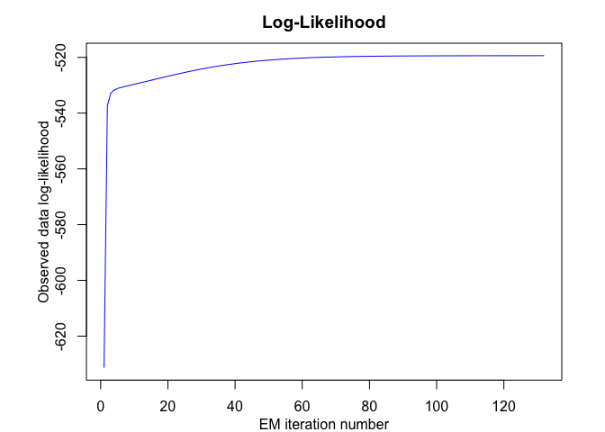
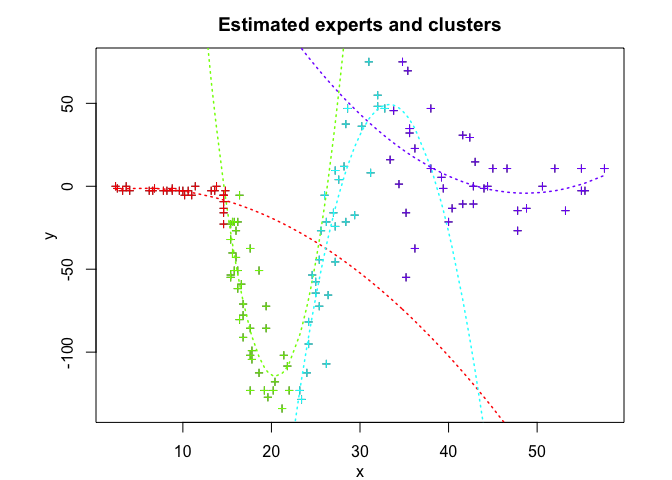

<!-- README.md is generated from README.Rmd. Please edit that file -->

# **MEteorits:** Mixtures-of-ExperTs modEling for cOmplex and non-noRmal dIsTributions

<!-- badges: start -->

[](https://travis-ci.org/fchamroukhi/MEteorits)
<!-- badges: end -->

MEteoritS is an open source toolbox (available in R and Matlab) containg
several original and flexible mixtures-of-experts models to model,
cluster and classify heteregenous data in many complex situations where
the data are distributed according to non-normal and possibly skewed
distributions, and when they might be corrupted by atypical
observations. The toolbox also contains sparse mixture-of-experts models
for high-dimensional data.

Our (dis-)covered meteorits are for instance the following ones:

  - NMoE;
  - tMoE;
  - SNMoE;
  - StMoE.

The models and algorithms are developped and written in Matlab by Faicel
Chamroukhi, and translated and designed into R packages by Florian
Lecocq, Marius Bartcus and Faicel Chamroukhi.

# Installation

You can install the development version of MEteorits from
[GitHub](https://github.com/fchamroukhi/MEteorits) with:

``` r
# install.packages("devtools")
devtools::install_github("fchamroukhi/MEteorits")
```

To build *vignettes* for examples of usage, type the command below
instead:

``` r
# install.packages("devtools")
devtools::install_github("fchamroukhi/MEteorits", 
                         build_opts = c("--no-resave-data", "--no-manual"), 
                         build_vignettes = TRUE)
```

Use the following command to display vignettes:

``` r
browseVignettes("meteorits")
```

# Usage

``` r
library(meteorits)
```

<details>

<summary>NMoE</summary>

``` r
# Application to a simuated data set

n <- 500 # Size of the sample
alphak <- matrix(c(0, 8), ncol = 1) # Parameters of the gating network
betak <- matrix(c(0, -2.5, 0, 2.5), ncol = 2) # Regression coefficients of the experts
sigmak <- c(1, 1) # Standard deviations of the experts
x <- seq.int(from = -1, to = 1, length.out = n) # Inputs (predictors)

# Generate sample of size n
sample <- sampleUnivNMoE(alphak = alphak, betak = betak, sigmak = sigmak, x = x)
y <- matrix(sample$y)

K <- 2 # Number of regressors/experts
p <- 1 # Order of the polynomial regression (regressors/experts)
q <- 1 # Order of the logistic regression (gating network)

n_tries <- 1
max_iter <- 1500
threshold <- 1e-5
verbose <- TRUE
verbose_IRLS <- FALSE

nmoe <- emNMoE(X = x, Y = y, K, p, q, n_tries, max_iter, 
               threshold, verbose, verbose_IRLS)
#> EM NMoE: Iteration: 1 | log-likelihood: -830.872510612952
#> EM NMoE: Iteration: 2 | log-likelihood: -829.223475685179
#> EM NMoE: Iteration: 3 | log-likelihood: -825.4280965344
#> EM NMoE: Iteration: 4 | log-likelihood: -817.341708140065
#> EM NMoE: Iteration: 5 | log-likelihood: -802.696477626415
#> EM NMoE: Iteration: 6 | log-likelihood: -781.687869022722
#> EM NMoE: Iteration: 7 | log-likelihood: -758.584666818905
#> EM NMoE: Iteration: 8 | log-likelihood: -739.256376512991
#> EM NMoE: Iteration: 9 | log-likelihood: -726.640550910818
#> EM NMoE: Iteration: 10 | log-likelihood: -719.534974471608
#> EM NMoE: Iteration: 11 | log-likelihood: -715.631782888111
#> EM NMoE: Iteration: 12 | log-likelihood: -713.463177571652
#> EM NMoE: Iteration: 13 | log-likelihood: -712.253648036845
#> EM NMoE: Iteration: 14 | log-likelihood: -711.574269488998
#> EM NMoE: Iteration: 15 | log-likelihood: -711.186204256396
#> EM NMoE: Iteration: 16 | log-likelihood: -710.959095163739
#> EM NMoE: Iteration: 17 | log-likelihood: -710.822268700014
#> EM NMoE: Iteration: 18 | log-likelihood: -710.737139691853
#> EM NMoE: Iteration: 19 | log-likelihood: -710.682346551357
#> EM NMoE: Iteration: 20 | log-likelihood: -710.645851234145
#> EM NMoE: Iteration: 21 | log-likelihood: -710.620724902382
#> EM NMoE: Iteration: 22 | log-likelihood: -710.602884205058
#> EM NMoE: Iteration: 23 | log-likelihood: -710.589858237877
#> EM NMoE: Iteration: 24 | log-likelihood: -710.580109893027
#> EM NMoE: Iteration: 25 | log-likelihood: -710.572655767695
#> EM NMoE: Iteration: 26 | log-likelihood: -710.566849146543

nmoe$plot()
```


``` r
# Application to a real data set

data("tempanomalies")
x <- tempanomalies$Year
y <- as.matrix(tempanomalies$AnnualAnomaly)

K <- 2 # Number of regressors/experts
p <- 1 # Order of the polynomial regression (regressors/experts)
q <- 1 # Order of the logistic regression (gating network)

n_tries <- 1
max_iter <- 1500
threshold <- 1e-5
verbose <- TRUE
verbose_IRLS <- FALSE

nmoe <- emNMoE(X = x, Y = y, K, p, q, n_tries, max_iter, 
               threshold, verbose, verbose_IRLS)
#> EM NMoE: Iteration: 1 | log-likelihood: 48.8499187333667
#> EM NMoE: Iteration: 2 | log-likelihood: 49.3719261176798
#> EM NMoE: Iteration: 3 | log-likelihood: 50.6552550027397
#> EM NMoE: Iteration: 4 | log-likelihood: 53.9955283610854
#> EM NMoE: Iteration: 5 | log-likelihood: 60.6054873541437
#> EM NMoE: Iteration: 6 | log-likelihood: 67.9814933315342
#> EM NMoE: Iteration: 7 | log-likelihood: 72.2838218355487
#> EM NMoE: Iteration: 8 | log-likelihood: 74.30211749208
#> EM NMoE: Iteration: 9 | log-likelihood: 75.6749687417477
#> EM NMoE: Iteration: 10 | log-likelihood: 77.0116492208569
#> EM NMoE: Iteration: 11 | log-likelihood: 78.4946810391416
#> EM NMoE: Iteration: 12 | log-likelihood: 80.2786298222391
#> EM NMoE: Iteration: 13 | log-likelihood: 82.6252363962455
#> EM NMoE: Iteration: 14 | log-likelihood: 85.9663538254142
#> EM NMoE: Iteration: 15 | log-likelihood: 90.4661069317473
#> EM NMoE: Iteration: 16 | log-likelihood: 94.2544597589554
#> EM NMoE: Iteration: 17 | log-likelihood: 95.6876964880277
#> EM NMoE: Iteration: 18 | log-likelihood: 96.1130406565078
#> EM NMoE: Iteration: 19 | log-likelihood: 96.2752446768704
#> EM NMoE: Iteration: 20 | log-likelihood: 96.365648170449
#> EM NMoE: Iteration: 21 | log-likelihood: 96.4371507067769
#> EM NMoE: Iteration: 22 | log-likelihood: 96.5063882162415
#> EM NMoE: Iteration: 23 | log-likelihood: 96.579629773394
#> EM NMoE: Iteration: 24 | log-likelihood: 96.6598596252524
#> EM NMoE: Iteration: 25 | log-likelihood: 96.748742012039
#> EM NMoE: Iteration: 26 | log-likelihood: 96.8470586308368
#> EM NMoE: Iteration: 27 | log-likelihood: 96.9546632374332
#> EM NMoE: Iteration: 28 | log-likelihood: 97.0703374624918
#> EM NMoE: Iteration: 29 | log-likelihood: 97.1917610456451
#> EM NMoE: Iteration: 30 | log-likelihood: 97.3157366317562
#> EM NMoE: Iteration: 31 | log-likelihood: 97.4387126279269
#> EM NMoE: Iteration: 32 | log-likelihood: 97.5575568647979
#> EM NMoE: Iteration: 33 | log-likelihood: 97.6703679071691
#> EM NMoE: Iteration: 34 | log-likelihood: 97.7770687563252
#> EM NMoE: Iteration: 35 | log-likelihood: 97.8795499830897
#> EM NMoE: Iteration: 36 | log-likelihood: 97.9812497312916
#> EM NMoE: Iteration: 37 | log-likelihood: 98.086293420644
#> EM NMoE: Iteration: 38 | log-likelihood: 98.1984654035597
#> EM NMoE: Iteration: 39 | log-likelihood: 98.320360751994
#> EM NMoE: Iteration: 40 | log-likelihood: 98.4530401592792
#> EM NMoE: Iteration: 41 | log-likelihood: 98.5963277585369
#> EM NMoE: Iteration: 42 | log-likelihood: 98.7495992656634
#> EM NMoE: Iteration: 43 | log-likelihood: 98.9126123346736
#> EM NMoE: Iteration: 44 | log-likelihood: 99.0861067058887
#> EM NMoE: Iteration: 45 | log-likelihood: 99.2720634551993
#> EM NMoE: Iteration: 46 | log-likelihood: 99.4738582434825
#> EM NMoE: Iteration: 47 | log-likelihood: 99.6966103177974
#> EM NMoE: Iteration: 48 | log-likelihood: 99.947971981791
#> EM NMoE: Iteration: 49 | log-likelihood: 100.239485809575
#> EM NMoE: Iteration: 50 | log-likelihood: 100.588330179166
#> EM NMoE: Iteration: 51 | log-likelihood: 101.017374801633
#> EM NMoE: Iteration: 52 | log-likelihood: 101.541853140013
#> EM NMoE: Iteration: 53 | log-likelihood: 102.106850772209
#> EM NMoE: Iteration: 54 | log-likelihood: 102.54984722123
#> EM NMoE: Iteration: 55 | log-likelihood: 102.691438281251
#> EM NMoE: Iteration: 56 | log-likelihood: 102.721646484716
#> EM NMoE: Iteration: 57 | log-likelihood: 102.721654724128

nmoe$plot()
```


</details>

<details>

<summary>TMoE</summary>

``` r
# Application to a simuated data set

n <- 500 # Size of the sample
alphak <- matrix(c(0, 8), ncol = 1) # Parameters of the gating network
betak <- matrix(c(0, -2.5, 0, 2.5), ncol = 2) # Regression coefficients of the experts
sigmak <- c(0.5, 0.5) # Standard deviations of the experts
nuk <- c(5, 7) # Degrees of freedom of the experts network t densities
x <- seq.int(from = -1, to = 1, length.out = n) # Inputs (predictors)

# Generate sample of size n
sample <- sampleUnivTMoE(alphak = alphak, betak = betak, sigmak = sigmak, 
                         nuk = nuk, x = x)
y <- matrix(sample$y)

K <- 2 # Number of regressors/experts
p <- 1 # Order of the polynomial regression (regressors/experts)
q <- 1 # Order of the logistic regression (gating network)

n_tries <- 1
max_iter <- 1500
threshold <- 1e-5
verbose <- TRUE
verbose_IRLS <- FALSE

tmoe <- emTMoE(X = x, Y = y, K, p, q, n_tries, max_iter, 
               threshold, verbose, verbose_IRLS)
#> EM - tMoE: Iteration: 1 | log-likelihood: -462.416507758599
#> EM - tMoE: Iteration: 2 | log-likelihood: -459.645701145621
#> EM - tMoE: Iteration: 3 | log-likelihood: -459.049463852857
#> EM - tMoE: Iteration: 4 | log-likelihood: -458.532474524008
#> EM - tMoE: Iteration: 5 | log-likelihood: -458.088893695128
#> EM - tMoE: Iteration: 6 | log-likelihood: -457.718181764864
#> EM - tMoE: Iteration: 7 | log-likelihood: -457.415239770825
#> EM - tMoE: Iteration: 8 | log-likelihood: -457.172256438241
#> EM - tMoE: Iteration: 9 | log-likelihood: -456.980340132948
#> EM - tMoE: Iteration: 10 | log-likelihood: -456.83065644673
#> EM - tMoE: Iteration: 11 | log-likelihood: -456.71510506789
#> EM - tMoE: Iteration: 12 | log-likelihood: -456.626643884178
#> EM - tMoE: Iteration: 13 | log-likelihood: -456.559376773252
#> EM - tMoE: Iteration: 14 | log-likelihood: -456.508501670365
#> EM - tMoE: Iteration: 15 | log-likelihood: -456.47018822254
#> EM - tMoE: Iteration: 16 | log-likelihood: -456.441429703155
#> EM - tMoE: Iteration: 17 | log-likelihood: -456.41989520292
#> EM - tMoE: Iteration: 18 | log-likelihood: -456.403795441842
#> EM - tMoE: Iteration: 19 | log-likelihood: -456.391767644905
#> EM - tMoE: Iteration: 20 | log-likelihood: -456.382780390608
#> EM - tMoE: Iteration: 21 | log-likelihood: -456.37605699947
#> EM - tMoE: Iteration: 22 | log-likelihood: -456.371015019265
#> EM - tMoE: Iteration: 23 | log-likelihood: -456.367219108556

tmoe$plot()
```


``` r
# Application to a real data set

library(MASS)
data("mcycle")
x <- mcycle$times
y <- as.matrix(mcycle$accel)

K <- 4 # Number of regressors/experts
p <- 2 # Order of the polynomial regression (regressors/experts)
q <- 1 # Order of the logistic regression (gating network)

n_tries <- 1
max_iter <- 1500
threshold <- 1e-5
verbose <- TRUE
verbose_IRLS <- FALSE

tmoe <- emTMoE(X = x, Y = y, K, p, q, n_tries, max_iter, 
               threshold, verbose, verbose_IRLS)
#> EM - tMoE: Iteration: 1 | log-likelihood: -586.785266573192
#> EM - tMoE: Iteration: 2 | log-likelihood: -579.801669605466
#> EM - tMoE: Iteration: 3 | log-likelihood: -577.729375958577
#> EM - tMoE: Iteration: 4 | log-likelihood: -575.912317832673
#> EM - tMoE: Iteration: 5 | log-likelihood: -572.348378975461
#> EM - tMoE: Iteration: 6 | log-likelihood: -565.207299588541
#> EM - tMoE: Iteration: 7 | log-likelihood: -559.362904102657
#> EM - tMoE: Iteration: 8 | log-likelihood: -557.361546306136
#> EM - tMoE: Iteration: 9 | log-likelihood: -556.406419876638
#> EM - tMoE: Iteration: 10 | log-likelihood: -555.440850511172
#> EM - tMoE: Iteration: 11 | log-likelihood: -554.337588253982
#> EM - tMoE: Iteration: 12 | log-likelihood: -553.200215648177
#> EM - tMoE: Iteration: 13 | log-likelihood: -552.344764004048
#> EM - tMoE: Iteration: 14 | log-likelihood: -551.790988298992
#> EM - tMoE: Iteration: 15 | log-likelihood: -551.414038769421
#> EM - tMoE: Iteration: 16 | log-likelihood: -551.157121040314
#> EM - tMoE: Iteration: 17 | log-likelihood: -550.986705819283
#> EM - tMoE: Iteration: 18 | log-likelihood: -550.875806107905
#> EM - tMoE: Iteration: 19 | log-likelihood: -550.804175497642
#> EM - tMoE: Iteration: 20 | log-likelihood: -550.757920765904
#> EM - tMoE: Iteration: 21 | log-likelihood: -550.727920077078
#> EM - tMoE: Iteration: 22 | log-likelihood: -550.708319036111
#> EM - tMoE: Iteration: 23 | log-likelihood: -550.695392385853
#> EM - tMoE: Iteration: 24 | log-likelihood: -550.686772290006
#> EM - tMoE: Iteration: 25 | log-likelihood: -550.680949556135
#> EM - tMoE: Iteration: 26 | log-likelihood: -550.676957755966

tmoe$plot()
```


</details>

<details>

<summary>SNMoE</summary>

``` r
# Application to a simulated data set

n <- 500 # Size of the sample
alphak <- matrix(c(0, 8), ncol = 1) # Parameters of the gating network
betak <- matrix(c(0, -2.5, 0, 2.5), ncol = 2) # Regression coefficients of the experts
lambdak <- c(3, 5) # Skewness parameters of the experts
sigmak <- c(1, 1) # Standard deviations of the experts
x <- seq.int(from = -1, to = 1, length.out = n) # Inputs (predictors)

# Generate sample of size n
sample <- sampleUnivSNMoE(alphak = alphak, betak = betak, sigmak = sigmak, 
                          lambdak = lambdak, x = x)
y <- matrix(sample$y)

K <- 2 # Number of regressors/experts
p <- 1 # Order of the polynomial regression (regressors/experts)
q <- 1 # Order of the logistic regression (gating network)

n_tries <- 1
max_iter <- 1500
threshold <- 1e-6
verbose <- TRUE
verbose_IRLS <- FALSE

snmoe <- emSNMoE(X = x, Y = y, K, p, q, n_tries, max_iter, 
                 threshold, verbose, verbose_IRLS)
#> EM - SNMoE: Iteration: 1 | log-likelihood: -603.184006435791
#> EM - SNMoE: Iteration: 2 | log-likelihood: -533.716128316253
#> EM - SNMoE: Iteration: 3 | log-likelihood: -531.274384326299
#> EM - SNMoE: Iteration: 4 | log-likelihood: -530.746874161126
#> EM - SNMoE: Iteration: 5 | log-likelihood: -530.491623003632
#> EM - SNMoE: Iteration: 6 | log-likelihood: -530.270250748568
#> EM - SNMoE: Iteration: 7 | log-likelihood: -530.050004968685
#> EM - SNMoE: Iteration: 8 | log-likelihood: -529.828930168084
#> EM - SNMoE: Iteration: 9 | log-likelihood: -529.606909743794
#> EM - SNMoE: Iteration: 10 | log-likelihood: -529.381687966942
#> EM - SNMoE: Iteration: 11 | log-likelihood: -529.149404969322
#> EM - SNMoE: Iteration: 12 | log-likelihood: -528.905527481596
#> EM - SNMoE: Iteration: 13 | log-likelihood: -528.644778517959
#> EM - SNMoE: Iteration: 14 | log-likelihood: -528.361520392169
#> EM - SNMoE: Iteration: 15 | log-likelihood: -528.049737090914
#> EM - SNMoE: Iteration: 16 | log-likelihood: -527.703382820947
#> EM - SNMoE: Iteration: 17 | log-likelihood: -527.316275907506
#> EM - SNMoE: Iteration: 18 | log-likelihood: -526.882706497879
#> EM - SNMoE: Iteration: 19 | log-likelihood: -526.397290488374
#> EM - SNMoE: Iteration: 20 | log-likelihood: -525.855189736203
#> EM - SNMoE: Iteration: 21 | log-likelihood: -525.253122632627
#> EM - SNMoE: Iteration: 22 | log-likelihood: -524.588908476739
#> EM - SNMoE: Iteration: 23 | log-likelihood: -523.862213447059
#> EM - SNMoE: Iteration: 24 | log-likelihood: -523.074625461896
#> EM - SNMoE: Iteration: 25 | log-likelihood: -522.229435087694
#> EM - SNMoE: Iteration: 26 | log-likelihood: -521.331579919083
#> EM - SNMoE: Iteration: 27 | log-likelihood: -520.387427672292
#> EM - SNMoE: Iteration: 28 | log-likelihood: -519.404827237398
#> EM - SNMoE: Iteration: 29 | log-likelihood: -518.391932343385
#> EM - SNMoE: Iteration: 30 | log-likelihood: -517.357487818074
#> EM - SNMoE: Iteration: 31 | log-likelihood: -516.310241564473
#> EM - SNMoE: Iteration: 32 | log-likelihood: -515.258145399477
#> EM - SNMoE: Iteration: 33 | log-likelihood: -514.208892774203
#> EM - SNMoE: Iteration: 34 | log-likelihood: -513.169183903373
#> EM - SNMoE: Iteration: 35 | log-likelihood: -512.145862690099
#> EM - SNMoE: Iteration: 36 | log-likelihood: -511.145836259052
#> EM - SNMoE: Iteration: 37 | log-likelihood: -510.174562367795
#> EM - SNMoE: Iteration: 38 | log-likelihood: -509.236925316559
#> EM - SNMoE: Iteration: 39 | log-likelihood: -508.338084586335
#> EM - SNMoE: Iteration: 40 | log-likelihood: -507.481334813055
#> EM - SNMoE: Iteration: 41 | log-likelihood: -506.668897057789
#> EM - SNMoE: Iteration: 42 | log-likelihood: -505.901696248606
#> EM - SNMoE: Iteration: 43 | log-likelihood: -505.17935373235
#> EM - SNMoE: Iteration: 44 | log-likelihood: -504.500073742384
#> EM - SNMoE: Iteration: 45 | log-likelihood: -503.8615189586
#> EM - SNMoE: Iteration: 46 | log-likelihood: -503.260601492748
#> EM - SNMoE: Iteration: 47 | log-likelihood: -502.694196406173
#> EM - SNMoE: Iteration: 48 | log-likelihood: -502.160010639516
#> EM - SNMoE: Iteration: 49 | log-likelihood: -501.657463179128
#> EM - SNMoE: Iteration: 50 | log-likelihood: -501.187967578427
#> EM - SNMoE: Iteration: 51 | log-likelihood: -500.755316370017
#> EM - SNMoE: Iteration: 52 | log-likelihood: -500.360072660757
#> EM - SNMoE: Iteration: 53 | log-likelihood: -500.003675546603
#> EM - SNMoE: Iteration: 54 | log-likelihood: -499.684453854372
#> EM - SNMoE: Iteration: 55 | log-likelihood: -499.399050724172
#> EM - SNMoE: Iteration: 56 | log-likelihood: -499.143786173941
#> EM - SNMoE: Iteration: 57 | log-likelihood: -498.914999672551
#> EM - SNMoE: Iteration: 58 | log-likelihood: -498.709451684809
#> EM - SNMoE: Iteration: 59 | log-likelihood: -498.524352046068
#> EM - SNMoE: Iteration: 60 | log-likelihood: -498.357528251394
#> EM - SNMoE: Iteration: 61 | log-likelihood: -498.206853286974
#> EM - SNMoE: Iteration: 62 | log-likelihood: -498.070508876167
#> EM - SNMoE: Iteration: 63 | log-likelihood: -497.946969099906
#> EM - SNMoE: Iteration: 64 | log-likelihood: -497.835315348363
#> EM - SNMoE: Iteration: 65 | log-likelihood: -497.734050448893
#> EM - SNMoE: Iteration: 66 | log-likelihood: -497.642347149765
#> EM - SNMoE: Iteration: 67 | log-likelihood: -497.559250975605
#> EM - SNMoE: Iteration: 68 | log-likelihood: -497.483911525774
#> EM - SNMoE: Iteration: 69 | log-likelihood: -497.415593824946
#> EM - SNMoE: Iteration: 70 | log-likelihood: -497.3536515728
#> EM - SNMoE: Iteration: 71 | log-likelihood: -497.29743739035
#> EM - SNMoE: Iteration: 72 | log-likelihood: -497.246433759527
#> EM - SNMoE: Iteration: 73 | log-likelihood: -497.20013288843
#> EM - SNMoE: Iteration: 74 | log-likelihood: -497.158091585069
#> EM - SNMoE: Iteration: 75 | log-likelihood: -497.119906649205
#> EM - SNMoE: Iteration: 76 | log-likelihood: -497.085213777349
#> EM - SNMoE: Iteration: 77 | log-likelihood: -497.053683519174
#> EM - SNMoE: Iteration: 78 | log-likelihood: -497.025017763794
#> EM - SNMoE: Iteration: 79 | log-likelihood: -496.998947149971
#> EM - SNMoE: Iteration: 80 | log-likelihood: -496.975228976443
#> EM - SNMoE: Iteration: 81 | log-likelihood: -496.953644509442
#> EM - SNMoE: Iteration: 82 | log-likelihood: -496.933995994326
#> EM - SNMoE: Iteration: 83 | log-likelihood: -496.916104290496
#> EM - SNMoE: Iteration: 84 | log-likelihood: -496.89980764046
#> EM - SNMoE: Iteration: 85 | log-likelihood: -496.884960062517
#> EM - SNMoE: Iteration: 86 | log-likelihood: -496.87142859793
#> EM - SNMoE: Iteration: 87 | log-likelihood: -496.859092277825
#> EM - SNMoE: Iteration: 88 | log-likelihood: -496.847841452354
#> EM - SNMoE: Iteration: 89 | log-likelihood: -496.837563594976
#> EM - SNMoE: Iteration: 90 | log-likelihood: -496.828185671222
#> EM - SNMoE: Iteration: 91 | log-likelihood: -496.819624730766
#> EM - SNMoE: Iteration: 92 | log-likelihood: -496.811807255086
#> EM - SNMoE: Iteration: 93 | log-likelihood: -496.804671496537
#> EM - SNMoE: Iteration: 94 | log-likelihood: -496.798151638758
#> EM - SNMoE: Iteration: 95 | log-likelihood: -496.79219232973
#> EM - SNMoE: Iteration: 96 | log-likelihood: -496.786749397946
#> EM - SNMoE: Iteration: 97 | log-likelihood: -496.781775623432
#> EM - SNMoE: Iteration: 98 | log-likelihood: -496.777224619914
#> EM - SNMoE: Iteration: 99 | log-likelihood: -496.773059316138
#> EM - SNMoE: Iteration: 100 | log-likelihood: -496.769247855536
#> EM - SNMoE: Iteration: 101 | log-likelihood: -496.765759291238
#> EM - SNMoE: Iteration: 102 | log-likelihood: -496.762565451535
#> EM - SNMoE: Iteration: 103 | log-likelihood: -496.759640662386
#> EM - SNMoE: Iteration: 104 | log-likelihood: -496.756961514171
#> EM - SNMoE: Iteration: 105 | log-likelihood: -496.754506668013
#> EM - SNMoE: Iteration: 106 | log-likelihood: -496.75225668627
#> EM - SNMoE: Iteration: 107 | log-likelihood: -496.750193872662
#> EM - SNMoE: Iteration: 108 | log-likelihood: -496.74830211649
#> EM - SNMoE: Iteration: 109 | log-likelihood: -496.746566743017
#> EM - SNMoE: Iteration: 110 | log-likelihood: -496.744974374797
#> EM - SNMoE: Iteration: 111 | log-likelihood: -496.743512807352
#> EM - SNMoE: Iteration: 112 | log-likelihood: -496.742170889587
#> EM - SNMoE: Iteration: 113 | log-likelihood: -496.740938447187
#> EM - SNMoE: Iteration: 114 | log-likelihood: -496.739806412596
#> EM - SNMoE: Iteration: 115 | log-likelihood: -496.738765072966
#> EM - SNMoE: Iteration: 116 | log-likelihood: -496.737805967388
#> EM - SNMoE: Iteration: 117 | log-likelihood: -496.736925747011
#> EM - SNMoE: Iteration: 118 | log-likelihood: -496.736116537293
#> EM - SNMoE: Iteration: 119 | log-likelihood: -496.735371861667
#> EM - SNMoE: Iteration: 120 | log-likelihood: -496.734686250409
#> EM - SNMoE: Iteration: 121 | log-likelihood: -496.734054863923
#> EM - SNMoE: Iteration: 122 | log-likelihood: -496.733473164838
#> EM - SNMoE: Iteration: 123 | log-likelihood: -496.732936724953
#> EM - SNMoE: Iteration: 124 | log-likelihood: -496.732441121242

snmoe$plot()
```



``` r
# Application to a real data set

data("tempanomalies")
x <- tempanomalies$Year
y <- as.matrix(tempanomalies$AnnualAnomaly)

K <- 2 # Number of regressors/experts
p <- 1 # Order of the polynomial regression (regressors/experts)
q <- 1 # Order of the logistic regression (gating network)

n_tries <- 1
max_iter <- 1500
threshold <- 1e-6
verbose <- TRUE
verbose_IRLS <- FALSE

snmoe <- emSNMoE(X = x, Y = y, K, p, q, n_tries, max_iter, 
                 threshold, verbose, verbose_IRLS)
#> EM - SNMoE: Iteration: 1 | log-likelihood: 74.0066842914021
#> EM - SNMoE: Iteration: 2 | log-likelihood: 86.9798947211085
#> EM - SNMoE: Iteration: 3 | log-likelihood: 88.5999701787929
#> EM - SNMoE: Iteration: 4 | log-likelihood: 88.8963976579338
#> EM - SNMoE: Iteration: 5 | log-likelihood: 89.0876494830722
#> EM - SNMoE: Iteration: 6 | log-likelihood: 89.3102790022044
#> EM - SNMoE: Iteration: 7 | log-likelihood: 89.501254452396
#> EM - SNMoE: Iteration: 8 | log-likelihood: 89.6163079106947
#> EM - SNMoE: Iteration: 9 | log-likelihood: 89.6808656748728
#> EM - SNMoE: Iteration: 10 | log-likelihood: 89.7186781502976
#> EM - SNMoE: Iteration: 11 | log-likelihood: 89.7442484650051
#> EM - SNMoE: Iteration: 12 | log-likelihood: 89.7647919775074
#> EM - SNMoE: Iteration: 13 | log-likelihood: 89.7826524032143
#> EM - SNMoE: Iteration: 14 | log-likelihood: 89.7985353726303
#> EM - SNMoE: Iteration: 15 | log-likelihood: 89.8129998514733
#> EM - SNMoE: Iteration: 16 | log-likelihood: 89.8263538979918
#> EM - SNMoE: Iteration: 17 | log-likelihood: 89.8386956372361
#> EM - SNMoE: Iteration: 18 | log-likelihood: 89.850044308296
#> EM - SNMoE: Iteration: 19 | log-likelihood: 89.8604145674337
#> EM - SNMoE: Iteration: 20 | log-likelihood: 89.8698245126535
#> EM - SNMoE: Iteration: 21 | log-likelihood: 89.8783978987739
#> EM - SNMoE: Iteration: 22 | log-likelihood: 89.8862221797527
#> EM - SNMoE: Iteration: 23 | log-likelihood: 89.8931364083131
#> EM - SNMoE: Iteration: 24 | log-likelihood: 89.899191638187
#> EM - SNMoE: Iteration: 25 | log-likelihood: 89.9044403411641
#> EM - SNMoE: Iteration: 26 | log-likelihood: 89.9092696475018
#> EM - SNMoE: Iteration: 27 | log-likelihood: 89.9124037336237
#> EM - SNMoE: Iteration: 28 | log-likelihood: 89.9154780553157
#> EM - SNMoE: Iteration: 29 | log-likelihood: 89.9181261449076
#> EM - SNMoE: Iteration: 30 | log-likelihood: 89.9206729224972
#> EM - SNMoE: Iteration: 31 | log-likelihood: 89.9227802821553
#> EM - SNMoE: Iteration: 32 | log-likelihood: 89.9251986435754
#> EM - SNMoE: Iteration: 33 | log-likelihood: 89.9269571856031
#> EM - SNMoE: Iteration: 34 | log-likelihood: 89.9284935672294
#> EM - SNMoE: Iteration: 35 | log-likelihood: 89.9302357177664
#> EM - SNMoE: Iteration: 36 | log-likelihood: 89.9316193674333
#> EM - SNMoE: Iteration: 37 | log-likelihood: 89.9330397004947
#> EM - SNMoE: Iteration: 38 | log-likelihood: 89.9343027556599
#> EM - SNMoE: Iteration: 39 | log-likelihood: 89.9354936381103
#> EM - SNMoE: Iteration: 40 | log-likelihood: 89.9367084385869
#> EM - SNMoE: Iteration: 41 | log-likelihood: 89.9378353256633
#> EM - SNMoE: Iteration: 42 | log-likelihood: 89.9388839063915
#> EM - SNMoE: Iteration: 43 | log-likelihood: 89.9399130993109
#> EM - SNMoE: Iteration: 44 | log-likelihood: 89.9408821458163
#> EM - SNMoE: Iteration: 45 | log-likelihood: 89.9418283544837
#> EM - SNMoE: Iteration: 46 | log-likelihood: 89.9427328961031
#> EM - SNMoE: Iteration: 47 | log-likelihood: 89.9435990983867
#> EM - SNMoE: Iteration: 48 | log-likelihood: 89.9444338034707
#> EM - SNMoE: Iteration: 49 | log-likelihood: 89.9452393622851
#> EM - SNMoE: Iteration: 50 | log-likelihood: 89.9460166117017
#> EM - SNMoE: Iteration: 51 | log-likelihood: 89.9467635884243
#> EM - SNMoE: Iteration: 52 | log-likelihood: 89.9474836487505
#> EM - SNMoE: Iteration: 53 | log-likelihood: 89.9481779721955
#> EM - SNMoE: Iteration: 54 | log-likelihood: 89.9488474338498
#> EM - SNMoE: Iteration: 55 | log-likelihood: 89.9494914128339
#> EM - SNMoE: Iteration: 56 | log-likelihood: 89.9501124478588
#> EM - SNMoE: Iteration: 57 | log-likelihood: 89.9507147855507
#> EM - SNMoE: Iteration: 58 | log-likelihood: 89.9512945241801
#> EM - SNMoE: Iteration: 59 | log-likelihood: 89.9518543644929
#> EM - SNMoE: Iteration: 60 | log-likelihood: 89.9523970367722
#> EM - SNMoE: Iteration: 61 | log-likelihood: 89.9529216019665
#> EM - SNMoE: Iteration: 62 | log-likelihood: 89.9534287260869
#> EM - SNMoE: Iteration: 63 | log-likelihood: 89.9539189919696
#> EM - SNMoE: Iteration: 64 | log-likelihood: 89.9543930296403
#> EM - SNMoE: Iteration: 65 | log-likelihood: 89.9548513158794
#> EM - SNMoE: Iteration: 66 | log-likelihood: 89.9552946750905
#> EM - SNMoE: Iteration: 67 | log-likelihood: 89.9557235854454
#> EM - SNMoE: Iteration: 68 | log-likelihood: 89.9561389398119
#> EM - SNMoE: Iteration: 69 | log-likelihood: 89.956540021026
#> EM - SNMoE: Iteration: 70 | log-likelihood: 89.9569276527867
#> EM - SNMoE: Iteration: 71 | log-likelihood: 89.9573045379985
#> EM - SNMoE: Iteration: 72 | log-likelihood: 89.9576687761365
#> EM - SNMoE: Iteration: 73 | log-likelihood: 89.9580218820417
#> EM - SNMoE: Iteration: 74 | log-likelihood: 89.9583650959631
#> EM - SNMoE: Iteration: 75 | log-likelihood: 89.9586977481001
#> EM - SNMoE: Iteration: 76 | log-likelihood: 89.9590203872674
#> EM - SNMoE: Iteration: 77 | log-likelihood: 89.9593329910167
#> EM - SNMoE: Iteration: 78 | log-likelihood: 89.9596352205853
#> EM - SNMoE: Iteration: 79 | log-likelihood: 89.9599278319717
#> EM - SNMoE: Iteration: 80 | log-likelihood: 89.9602122333973
#> EM - SNMoE: Iteration: 81 | log-likelihood: 89.9604892690604
#> EM - SNMoE: Iteration: 82 | log-likelihood: 89.9607590860488
#> EM - SNMoE: Iteration: 83 | log-likelihood: 89.9610207746253
#> EM - SNMoE: Iteration: 84 | log-likelihood: 89.961274561998
#> EM - SNMoE: Iteration: 85 | log-likelihood: 89.9615209375099
#> EM - SNMoE: Iteration: 86 | log-likelihood: 89.9617597325731
#> EM - SNMoE: Iteration: 87 | log-likelihood: 89.9619921805247
#> EM - SNMoE: Iteration: 88 | log-likelihood: 89.9622180730445
#> EM - SNMoE: Iteration: 89 | log-likelihood: 89.9624389770055
#> EM - SNMoE: Iteration: 90 | log-likelihood: 89.9626538093088
#> EM - SNMoE: Iteration: 91 | log-likelihood: 89.9628638541882
#> EM - SNMoE: Iteration: 92 | log-likelihood: 89.9630661355489
#> EM - SNMoE: Iteration: 93 | log-likelihood: 89.9632627647752
#> EM - SNMoE: Iteration: 94 | log-likelihood: 89.9634538439216
#> EM - SNMoE: Iteration: 95 | log-likelihood: 89.9636400015451
#> EM - SNMoE: Iteration: 96 | log-likelihood: 89.9638207161466
#> EM - SNMoE: Iteration: 97 | log-likelihood: 89.9639961448621
#> EM - SNMoE: Iteration: 98 | log-likelihood: 89.964166786445
#> EM - SNMoE: Iteration: 99 | log-likelihood: 89.9643339411447
#> EM - SNMoE: Iteration: 100 | log-likelihood: 89.9644958866202
#> EM - SNMoE: Iteration: 101 | log-likelihood: 89.964653787089
#> EM - SNMoE: Iteration: 102 | log-likelihood: 89.9648088126826
#> EM - SNMoE: Iteration: 103 | log-likelihood: 89.9649574444322
#> EM - SNMoE: Iteration: 104 | log-likelihood: 89.9651036021678
#> EM - SNMoE: Iteration: 105 | log-likelihood: 89.9652474527634
#> EM - SNMoE: Iteration: 106 | log-likelihood: 89.9653884126198
#> EM - SNMoE: Iteration: 107 | log-likelihood: 89.9655246985465
#> EM - SNMoE: Iteration: 108 | log-likelihood: 89.9656579571856
#> EM - SNMoE: Iteration: 109 | log-likelihood: 89.9657887805867
#> EM - SNMoE: Iteration: 110 | log-likelihood: 89.9659159272237
#> EM - SNMoE: Iteration: 111 | log-likelihood: 89.9660390107823
#> EM - SNMoE: Iteration: 112 | log-likelihood: 89.9661586641763
#> EM - SNMoE: Iteration: 113 | log-likelihood: 89.966274684793
#> EM - SNMoE: Iteration: 114 | log-likelihood: 89.9663872975421
#> EM - SNMoE: Iteration: 115 | log-likelihood: 89.9664971054406
#> EM - SNMoE: Iteration: 116 | log-likelihood: 89.9666056258116
#> EM - SNMoE: Iteration: 117 | log-likelihood: 89.9667124885223
#> EM - SNMoE: Iteration: 118 | log-likelihood: 89.966814763877
#> EM - SNMoE: Iteration: 119 | log-likelihood: 89.9669158113933
#> EM - SNMoE: Iteration: 120 | log-likelihood: 89.9670165140976
#> EM - SNMoE: Iteration: 121 | log-likelihood: 89.9671141951115
#> EM - SNMoE: Iteration: 122 | log-likelihood: 89.9672092254878
#> EM - SNMoE: Iteration: 123 | log-likelihood: 89.9673019047713
#> EM - SNMoE: Iteration: 124 | log-likelihood: 89.9673921212932
#> EM - SNMoE: Iteration: 125 | log-likelihood: 89.9674800580715

snmoe$plot()
```


</details>

<details>

<summary>StMoE</summary>

``` r
# Applicartion to a simulated data set

n <- 500 # Size of the sample
alphak <- matrix(c(0, 8), ncol = 1) # Parameters of the gating network
betak <- matrix(c(0, -2.5, 0, 2.5), ncol = 2) # Regression coefficients of the experts
sigmak <- c(0.5, 0.5) # Standard deviations of the experts
lambdak <- c(3, 5) # Skewness parameters of the experts
nuk <- c(5, 7) # Degrees of freedom of the experts network t densities
x <- seq.int(from = -1, to = 1, length.out = n) # Inputs (predictors)

# Generate sample of size n
sample <- sampleUnivSTMoE(alphak = alphak, betak = betak, sigmak = sigmak, 
                          lambdak = lambdak, nuk = nuk, x = x)
y <- matrix(sample$y)

K <- 2 # Number of regressors/experts
p <- 1 # Order of the polynomial regression (regressors/experts)
q <- 1 # Order of the logistic regression (gating network)

n_tries <- 1
max_iter <- 1500
threshold <- 1e-5
verbose <- TRUE
verbose_IRLS <- FALSE

stmoe <- emStMoE(X = x, Y = y, K, p, q, n_tries, max_iter, 
                 threshold, verbose, verbose_IRLS)
#> EM - StMoE: Iteration: 1 | log-likelihood: -367.915481417907
#> EM - StMoE: Iteration: 2 | log-likelihood: -336.385353419776
#> EM - StMoE: Iteration: 3 | log-likelihood: -324.194670120268
#> EM - StMoE: Iteration: 4 | log-likelihood: -320.420449140584
#> EM - StMoE: Iteration: 5 | log-likelihood: -318.528953858093
#> EM - StMoE: Iteration: 6 | log-likelihood: -317.558417692437
#> EM - StMoE: Iteration: 7 | log-likelihood: -317.011675639166
#> EM - StMoE: Iteration: 8 | log-likelihood: -316.641110921481
#> EM - StMoE: Iteration: 9 | log-likelihood: -316.326144044391
#> EM - StMoE: Iteration: 10 | log-likelihood: -316.002341327507
#> EM - StMoE: Iteration: 11 | log-likelihood: -315.62431424526
#> EM - StMoE: Iteration: 12 | log-likelihood: -315.146197729659
#> EM - StMoE: Iteration: 13 | log-likelihood: -314.51212864496
#> EM - StMoE: Iteration: 14 | log-likelihood: -313.650659798392
#> EM - StMoE: Iteration: 15 | log-likelihood: -312.47946131295
#> EM - StMoE: Iteration: 16 | log-likelihood: -310.922763751749
#> EM - StMoE: Iteration: 17 | log-likelihood: -308.95075339155
#> EM - StMoE: Iteration: 18 | log-likelihood: -306.601575864057
#> EM - StMoE: Iteration: 19 | log-likelihood: -303.987619540988
#> EM - StMoE: Iteration: 20 | log-likelihood: -301.245527662916
#> EM - StMoE: Iteration: 21 | log-likelihood: -298.489612672778
#> EM - StMoE: Iteration: 22 | log-likelihood: -295.785952870483
#> EM - StMoE: Iteration: 23 | log-likelihood: -293.161731864553
#> EM - StMoE: Iteration: 24 | log-likelihood: -290.605594182474
#> EM - StMoE: Iteration: 25 | log-likelihood: -288.098015314396
#> EM - StMoE: Iteration: 26 | log-likelihood: -285.615091275119
#> EM - StMoE: Iteration: 27 | log-likelihood: -283.142204455181
#> EM - StMoE: Iteration: 28 | log-likelihood: -280.687497884885
#> EM - StMoE: Iteration: 29 | log-likelihood: -278.261786035659
#> EM - StMoE: Iteration: 30 | log-likelihood: -275.896327973596
#> EM - StMoE: Iteration: 31 | log-likelihood: -273.633133103355
#> EM - StMoE: Iteration: 32 | log-likelihood: -271.515849749657
#> EM - StMoE: Iteration: 33 | log-likelihood: -269.580812919745
#> EM - StMoE: Iteration: 34 | log-likelihood: -267.851769773277
#> EM - StMoE: Iteration: 35 | log-likelihood: -266.329080560912
#> EM - StMoE: Iteration: 36 | log-likelihood: -265.001264341992
#> EM - StMoE: Iteration: 37 | log-likelihood: -263.857145168418
#> EM - StMoE: Iteration: 38 | log-likelihood: -262.883755874446
#> EM - StMoE: Iteration: 39 | log-likelihood: -262.05908429729
#> EM - StMoE: Iteration: 40 | log-likelihood: -261.362840692198
#> EM - StMoE: Iteration: 41 | log-likelihood: -260.775691390998
#> EM - StMoE: Iteration: 42 | log-likelihood: -260.281191367315
#> EM - StMoE: Iteration: 43 | log-likelihood: -259.865924947251
#> EM - StMoE: Iteration: 44 | log-likelihood: -259.517443076753
#> EM - StMoE: Iteration: 45 | log-likelihood: -259.224514064735
#> EM - StMoE: Iteration: 46 | log-likelihood: -258.97769379442
#> EM - StMoE: Iteration: 47 | log-likelihood: -258.771752495817
#> EM - StMoE: Iteration: 48 | log-likelihood: -258.600809392173
#> EM - StMoE: Iteration: 49 | log-likelihood: -258.458629257846
#> EM - StMoE: Iteration: 50 | log-likelihood: -258.341840674755
#> EM - StMoE: Iteration: 51 | log-likelihood: -258.246201696426
#> EM - StMoE: Iteration: 52 | log-likelihood: -258.167727911054
#> EM - StMoE: Iteration: 53 | log-likelihood: -258.103335089419
#> EM - StMoE: Iteration: 54 | log-likelihood: -258.050334377667
#> EM - StMoE: Iteration: 55 | log-likelihood: -258.006944467136
#> EM - StMoE: Iteration: 56 | log-likelihood: -257.971805519734
#> EM - StMoE: Iteration: 57 | log-likelihood: -257.943974070471
#> EM - StMoE: Iteration: 58 | log-likelihood: -257.921967815702
#> EM - StMoE: Iteration: 59 | log-likelihood: -257.904825890809
#> EM - StMoE: Iteration: 60 | log-likelihood: -257.891652870263
#> EM - StMoE: Iteration: 61 | log-likelihood: -257.881716979385
#> EM - StMoE: Iteration: 62 | log-likelihood: -257.874983798324
#> EM - StMoE: Iteration: 63 | log-likelihood: -257.871072029359
#> EM - StMoE: Iteration: 64 | log-likelihood: -257.869927389219

stmoe$plot()
```


``` r
# Applicartion to a real data set

library(MASS)
data("mcycle")
x <- mcycle$times
y <- as.matrix(mcycle$accel)

K <- 4 # Number of regressors/experts
p <- 2 # Order of the polynomial regression (regressors/experts)
q <- 1 # Order of the logistic regression (gating network)

n_tries <- 1
max_iter <- 1500
threshold <- 1e-5
verbose <- TRUE
verbose_IRLS <- FALSE

stmoe <- emStMoE(X = x, Y = y, K, p, q, n_tries, max_iter, 
                 threshold, verbose, verbose_IRLS)
#> EM - StMoE: Iteration: 1 | log-likelihood: -600.418616211177
#> EM - StMoE: Iteration: 2 | log-likelihood: -593.393988402005
#> EM - StMoE: Iteration: 3 | log-likelihood: -586.02125609373
#> EM - StMoE: Iteration: 4 | log-likelihood: -583.180041717961
#> EM - StMoE: Iteration: 5 | log-likelihood: -577.081913454301
#> EM - StMoE: Iteration: 6 | log-likelihood: -569.964031756214
#> EM - StMoE: Iteration: 7 | log-likelihood: -564.926776898797
#> EM - StMoE: Iteration: 8 | log-likelihood: -562.133123873219
#> EM - StMoE: Iteration: 9 | log-likelihood: -561.088890559582
#> EM - StMoE: Iteration: 10 | log-likelihood: -560.65717413188
#> EM - StMoE: Iteration: 11 | log-likelihood: -560.329562260328
#> EM - StMoE: Iteration: 12 | log-likelihood: -559.97185683544
#> EM - StMoE: Iteration: 13 | log-likelihood: -559.56183078676
#> EM - StMoE: Iteration: 14 | log-likelihood: -559.18980047476
#> EM - StMoE: Iteration: 15 | log-likelihood: -558.947786976945
#> EM - StMoE: Iteration: 16 | log-likelihood: -558.800946360717
#> EM - StMoE: Iteration: 17 | log-likelihood: -558.685284514558
#> EM - StMoE: Iteration: 18 | log-likelihood: -558.573275227901
#> EM - StMoE: Iteration: 19 | log-likelihood: -558.456698484589
#> EM - StMoE: Iteration: 20 | log-likelihood: -558.33453491687
#> EM - StMoE: Iteration: 21 | log-likelihood: -558.213479835439
#> EM - StMoE: Iteration: 22 | log-likelihood: -558.111600952738
#> EM - StMoE: Iteration: 23 | log-likelihood: -558.05051277432
#> EM - StMoE: Iteration: 24 | log-likelihood: -558.026366190302
#> EM - StMoE: Iteration: 25 | log-likelihood: -558.018488287465
#> EM - StMoE: Iteration: 26 | log-likelihood: -558.015477203651

stmoe$plot()
```



</details>

# References

<div id="refs" class="references">

<div id="ref-Chamroukhi-STMoE-2017">

Chamroukhi, F. 2017. “Skew-T Mixture of Experts.” *Neurocomputing -
Elsevier* 266: 390–408. <https://chamroukhi.com/papers/STMoE.pdf>.

</div>

<div id="ref-Chamroukhi-TMoE-2016">

Chamroukhi, F. 2016a. “Robust Mixture of Experts Modeling Using the
T-Distribution.” *Neural Networks - Elsevier* 79: 20–36.
<https://chamroukhi.com/papers/TMoE.pdf>.

</div>

<div id="ref-Chamroukhi-SNMoE-IJCNN-2016">

Chamroukhi, F. 2016b. “Skew-Normal Mixture of Experts.” In *The
International Joint Conference on Neural Networks (IJCNN)*. Vancouver,
Canada. <https://chamroukhi.com/papers/Chamroukhi-SNMoE-IJCNN2016.pdf>.

</div>

<div id="ref-Chamroukhi-NNMoE-2015">

Chamroukhi, F. 2015a. “Non-Normal Mixtures of Experts.”
<http://arxiv.org/pdf/1506.06707.pdf>.

</div>

<div id="ref-Chamroukhi-HDR-2015">

Chamroukhi, F. 2015b. “Statistical Learning of Latent Data Models for
Complex Data Analysis.” Habilitation Thesis (HDR), Université de Toulon.
<https://chamroukhi.com/FChamroukhi-HDR.pdf>.

</div>

<div id="ref-Chamroukhi_PhD_2010">

Chamroukhi, F. 2010. “Hidden Process Regression for Curve Modeling,
Classification and Tracking.” Ph.D. Thesis, Université de Technologie de
Compiègne. <https://chamroukhi.com/FChamroukhi-PhD.pdf>.

</div>

<div id="ref-chamroukhi_et_al_NN2009">

Chamroukhi, F., A. Samé, G. Govaert, and P. Aknin. 2009. “Time Series
Modeling by a Regression Approach Based on a Latent Process.” *Neural
Networks* 22 (5-6): 593–602.
<https://chamroukhi.com/papers/Chamroukhi_Neural_Networks_2009.pdf>.

</div>

</div>
