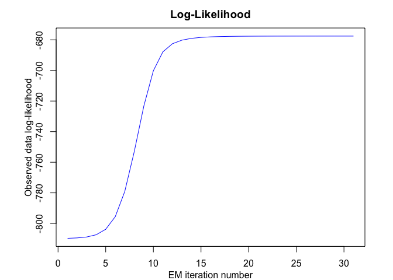

<!-- README.md is generated from README.Rmd. Please edit that file -->

# **MEteorits:** Mixtures-of-ExperTs modEling for cOmplex and non-noRmal dIsTributions

<!-- badges: start -->

[](https://travis-ci.org/fchamroukhi/MEteorits)
<!-- badges: end -->

MEteorits is an open source toolbox (available in R and Matlab)
containing several original and flexible mixtures-of-experts models to
model, cluster and classify heteregenous data in many complex situations
where the data are distributed according to non-normal and possibly
skewed distributions, and when they might be corrupted by atypical
observations. The toolbox also contains sparse mixture-of-experts models
for high-dimensional data.

Our (dis-)covered meteorits are for instance the following ones:

  - NMoE (Normal Mixtures-of-Experts);
  - tMoE (t Mixtures-of-Experts);
  - SNMoE (Skew-Normal Mixtures-of-Experts);
  - StMoE (Skew t Mixtures-of-Experts).

The models and algorithms are developped and written in Matlab by Faicel
Chamroukhi, and translated and designed into R packages by Florian
Lecocq, Marius Bartcus and Faicel Chamroukhi.

# Installation

You can install the development version of MEteorits from
[GitHub](https://github.com/fchamroukhi/MEteorits) with:

``` r
# install.packages("devtools")
devtools::install_github("fchamroukhi/MEteorits")
```

To build *vignettes* for examples of usage, type the command below
instead:

``` r
# install.packages("devtools")
devtools::install_github("fchamroukhi/MEteorits", 
                         build_opts = c("--no-resave-data", "--no-manual"), 
                         build_vignettes = TRUE)
```

Use the following command to display vignettes:

``` r
browseVignettes("meteorits")
```

# Usage

``` r
library(meteorits)
```

<details>

<summary>NMoE</summary>

``` r
# Application to a simulated data set

n <- 500 # Size of the sample
alphak <- matrix(c(0, 8), ncol = 1) # Parameters of the gating network
betak <- matrix(c(0, -2.5, 0, 2.5), ncol = 2) # Regression coefficients of the experts
sigmak <- c(1, 1) # Standard deviations of the experts
x <- seq.int(from = -1, to = 1, length.out = n) # Inputs (predictors)

# Generate sample of size n
sample <- sampleUnivNMoE(alphak = alphak, betak = betak, sigmak = sigmak, x = x)
y <- sample$y

K <- 2 # Number of regressors/experts
p <- 1 # Order of the polynomial regression (regressors/experts)
q <- 1 # Order of the logistic regression (gating network)

nmoe <- emNMoE(X = x, Y = y, K = K, p = p, q = q, verbose = TRUE)
#> EM NMoE: Iteration: 1 | log-likelihood: -873.347722205235
#> EM NMoE: Iteration: 2 | log-likelihood: -873.29616420207
#> EM NMoE: Iteration: 3 | log-likelihood: -873.198366442032
#> EM NMoE: Iteration: 4 | log-likelihood: -872.964614885115
#> EM NMoE: Iteration: 5 | log-likelihood: -872.374176512339
#> EM NMoE: Iteration: 6 | log-likelihood: -870.878225846662
#> EM NMoE: Iteration: 7 | log-likelihood: -867.195721705172
#> EM NMoE: Iteration: 8 | log-likelihood: -858.812761528406
#> EM NMoE: Iteration: 9 | log-likelihood: -842.546140181459
#> EM NMoE: Iteration: 10 | log-likelihood: -817.84259088567
#> EM NMoE: Iteration: 11 | log-likelihood: -790.094308177876
#> EM NMoE: Iteration: 12 | log-likelihood: -768.234037385928
#> EM NMoE: Iteration: 13 | log-likelihood: -756.214264773854
#> EM NMoE: Iteration: 14 | log-likelihood: -750.628654742565
#> EM NMoE: Iteration: 15 | log-likelihood: -747.911735267028
#> EM NMoE: Iteration: 16 | log-likelihood: -746.486513697465
#> EM NMoE: Iteration: 17 | log-likelihood: -745.70690897988
#> EM NMoE: Iteration: 18 | log-likelihood: -745.269241204422
#> EM NMoE: Iteration: 19 | log-likelihood: -745.016583384725
#> EM NMoE: Iteration: 20 | log-likelihood: -744.865854801815
#> EM NMoE: Iteration: 21 | log-likelihood: -744.772757501241
#> EM NMoE: Iteration: 22 | log-likelihood: -744.713285766778
#> EM NMoE: Iteration: 23 | log-likelihood: -744.674091432343
#> EM NMoE: Iteration: 24 | log-likelihood: -744.647522967482
#> EM NMoE: Iteration: 25 | log-likelihood: -744.629056318815
#> EM NMoE: Iteration: 26 | log-likelihood: -744.615934218933
#> EM NMoE: Iteration: 27 | log-likelihood: -744.606427800299
#> EM NMoE: Iteration: 28 | log-likelihood: -744.599423992895
#> EM NMoE: Iteration: 29 | log-likelihood: -744.594188415726
#> EM NMoE: Iteration: 30 | log-likelihood: -744.59022543731
#> EM NMoE: Iteration: 31 | log-likelihood: -744.587193493753
#> EM NMoE: Iteration: 32 | log-likelihood: -744.584852633312
#> EM NMoE: Iteration: 33 | log-likelihood: -744.583031303875
#> EM NMoE: Iteration: 34 | log-likelihood: -744.581604886212
#> EM NMoE: Iteration: 35 | log-likelihood: -744.580481545883
#> EM NMoE: Iteration: 36 | log-likelihood: -744.579592734631
#> EM NMoE: Iteration: 37 | log-likelihood: -744.578886700303

nmoe$summary()
#> ------------------------------------------
#> Fitted Normal Mixture-of-Experts model
#> ------------------------------------------
#> 
#> NMoE model with K = 2 experts:
#> 
#>  log-likelihood df       AIC       BIC       ICL
#>       -744.5789  8 -752.5789 -769.4373 -823.4939
#> 
#> Clustering table (Number of observations in each expert):
#> 
#>   1   2 
#> 252 248 
#> 
#> Regression coefficients:
#> 
#>     Beta(k = 1) Beta(k = 2)
#> 1     0.2016835  0.03027325
#> X^1   2.8121364 -2.72920923
#> 
#> Variances:
#> 
#>  Sigma2(k = 1) Sigma2(k = 2)
#>       1.104942      1.005117

nmoe$plot()
```



``` r
# Application to a real data set

data("tempanomalies")
x <- tempanomalies$Year
y <- tempanomalies$AnnualAnomaly

K <- 2 # Number of regressors/experts
p <- 1 # Order of the polynomial regression (regressors/experts)
q <- 1 # Order of the logistic regression (gating network)

nmoe <- emNMoE(X = x, Y = y, K = K, p = p, q = q, verbose = TRUE)
#> EM NMoE: Iteration: 1 | log-likelihood: 49.9861152724084
#> EM NMoE: Iteration: 2 | log-likelihood: 53.5029373232839
#> EM NMoE: Iteration: 3 | log-likelihood: 60.4792932937743
#> EM NMoE: Iteration: 4 | log-likelihood: 68.3370839648939
#> EM NMoE: Iteration: 5 | log-likelihood: 72.6247281110876
#> EM NMoE: Iteration: 6 | log-likelihood: 74.5893171305048
#> EM NMoE: Iteration: 7 | log-likelihood: 76.0216406880375
#> EM NMoE: Iteration: 8 | log-likelihood: 77.4773546318229
#> EM NMoE: Iteration: 9 | log-likelihood: 79.1307229380875
#> EM NMoE: Iteration: 10 | log-likelihood: 81.173092889243
#> EM NMoE: Iteration: 11 | log-likelihood: 83.9406014466104
#> EM NMoE: Iteration: 12 | log-likelihood: 87.8652960092682
#> EM NMoE: Iteration: 13 | log-likelihood: 92.4096929138985
#> EM NMoE: Iteration: 14 | log-likelihood: 95.0955457697666
#> EM NMoE: Iteration: 15 | log-likelihood: 95.9447672116977
#> EM NMoE: Iteration: 16 | log-likelihood: 96.2253703846554
#> EM NMoE: Iteration: 17 | log-likelihood: 96.3520842513528
#> EM NMoE: Iteration: 18 | log-likelihood: 96.4359343977277
#> EM NMoE: Iteration: 19 | log-likelihood: 96.5099955855865
#> EM NMoE: Iteration: 20 | log-likelihood: 96.5855692347406
#> EM NMoE: Iteration: 21 | log-likelihood: 96.6672882510115
#> EM NMoE: Iteration: 22 | log-likelihood: 96.7573716531057
#> EM NMoE: Iteration: 23 | log-likelihood: 96.8567649133904
#> EM NMoE: Iteration: 24 | log-likelihood: 96.9653290867478
#> EM NMoE: Iteration: 25 | log-likelihood: 97.0817897222968
#> EM NMoE: Iteration: 26 | log-likelihood: 97.2037607789632
#> EM NMoE: Iteration: 27 | log-likelihood: 97.3280077648292
#> EM NMoE: Iteration: 28 | log-likelihood: 97.4510062582478
#> EM NMoE: Iteration: 29 | log-likelihood: 97.569726129558
#> EM NMoE: Iteration: 30 | log-likelihood: 97.6824308796757
#> EM NMoE: Iteration: 31 | log-likelihood: 97.7892322379491
#> EM NMoE: Iteration: 32 | log-likelihood: 97.8921779215118
#> EM NMoE: Iteration: 33 | log-likelihood: 97.9947795732188
#> EM NMoE: Iteration: 34 | log-likelihood: 98.101123984777
#> EM NMoE: Iteration: 35 | log-likelihood: 98.2148545426073
#> EM NMoE: Iteration: 36 | log-likelihood: 98.3383756094805
#> EM NMoE: Iteration: 37 | log-likelihood: 98.4725879710762
#> EM NMoE: Iteration: 38 | log-likelihood: 98.6172552453603
#> EM NMoE: Iteration: 39 | log-likelihood: 98.7718118566088
#> EM NMoE: Iteration: 40 | log-likelihood: 98.9361550804989
#> EM NMoE: Iteration: 41 | log-likelihood: 99.1111976508573
#> EM NMoE: Iteration: 42 | log-likelihood: 99.2991016173421
#> EM NMoE: Iteration: 43 | log-likelihood: 99.5034495612258
#> EM NMoE: Iteration: 44 | log-likelihood: 99.7296479578917
#> EM NMoE: Iteration: 45 | log-likelihood: 99.9857924348834
#> EM NMoE: Iteration: 46 | log-likelihood: 100.284103230351
#> EM NMoE: Iteration: 47 | log-likelihood: 100.642648838823
#> EM NMoE: Iteration: 48 | log-likelihood: 101.084647537043
#> EM NMoE: Iteration: 49 | log-likelihood: 101.620967512491
#> EM NMoE: Iteration: 50 | log-likelihood: 102.177646267985
#> EM NMoE: Iteration: 51 | log-likelihood: 102.595692211771
#> EM NMoE: Iteration: 52 | log-likelihood: 102.69317695636
#> EM NMoE: Iteration: 53 | log-likelihood: 102.721795276236
#> EM NMoE: Iteration: 54 | log-likelihood: 102.721802441494

nmoe$summary()
#> ------------------------------------------
#> Fitted Normal Mixture-of-Experts model
#> ------------------------------------------
#> 
#> NMoE model with K = 2 experts:
#> 
#>  log-likelihood df     AIC      BIC      ICL
#>        102.7218  8 94.7218 83.07118 83.18239
#> 
#> Clustering table (Number of observations in each expert):
#> 
#>  1  2 
#> 84 52 
#> 
#> Regression coefficients:
#> 
#>       Beta(k = 1)  Beta(k = 2)
#> 1   -12.667270847 -42.36289731
#> X^1   0.006474796   0.02149308
#> 
#> Variances:
#> 
#>  Sigma2(k = 1) Sigma2(k = 2)
#>     0.01352325    0.01193067

nmoe$plot()
```


</details>

<details>

<summary>TMoE</summary>

``` r
# Application to a simulated data set

n <- 500 # Size of the sample
alphak <- matrix(c(0, 8), ncol = 1) # Parameters of the gating network
betak <- matrix(c(0, -2.5, 0, 2.5), ncol = 2) # Regression coefficients of the experts
sigmak <- c(0.5, 0.5) # Standard deviations of the experts
nuk <- c(5, 7) # Degrees of freedom of the experts network t densities
x <- seq.int(from = -1, to = 1, length.out = n) # Inputs (predictors)

# Generate sample of size n
sample <- sampleUnivTMoE(alphak = alphak, betak = betak, sigmak = sigmak, 
                         nuk = nuk, x = x)
y <- sample$y

K <- 2 # Number of regressors/experts
p <- 1 # Order of the polynomial regression (regressors/experts)
q <- 1 # Order of the logistic regression (gating network)

tmoe <- emTMoE(X = x, Y = y, K = K, p = p, q = q, verbose = TRUE)
#> EM - tMoE: Iteration: 1 | log-likelihood: -511.738681562882
#> EM - tMoE: Iteration: 2 | log-likelihood: -509.680296070648
#> EM - tMoE: Iteration: 3 | log-likelihood: -509.623815252034
#> EM - tMoE: Iteration: 4 | log-likelihood: -509.600536278794
#> EM - tMoE: Iteration: 5 | log-likelihood: -509.577815775116
#> EM - tMoE: Iteration: 6 | log-likelihood: -509.555056553916
#> EM - tMoE: Iteration: 7 | log-likelihood: -509.532261804268
#> EM - tMoE: Iteration: 8 | log-likelihood: -509.509446311234
#> EM - tMoE: Iteration: 9 | log-likelihood: -509.486669265444
#> EM - tMoE: Iteration: 10 | log-likelihood: -509.463719814635
#> EM - tMoE: Iteration: 11 | log-likelihood: -509.440482209737
#> EM - tMoE: Iteration: 12 | log-likelihood: -509.416800283366
#> EM - tMoE: Iteration: 13 | log-likelihood: -509.392484080205
#> EM - tMoE: Iteration: 14 | log-likelihood: -509.367329597456
#> EM - tMoE: Iteration: 15 | log-likelihood: -509.341158418264
#> EM - tMoE: Iteration: 16 | log-likelihood: -509.313881315797
#> EM - tMoE: Iteration: 17 | log-likelihood: -509.285576616556
#> EM - tMoE: Iteration: 18 | log-likelihood: -509.256545833525
#> EM - tMoE: Iteration: 19 | log-likelihood: -509.227283947714
#> EM - tMoE: Iteration: 20 | log-likelihood: -509.1983323885
#> EM - tMoE: Iteration: 21 | log-likelihood: -509.170085067175
#> EM - tMoE: Iteration: 22 | log-likelihood: -509.142682132543
#> EM - tMoE: Iteration: 23 | log-likelihood: -509.116058653033
#> EM - tMoE: Iteration: 24 | log-likelihood: -509.090109198081
#> EM - tMoE: Iteration: 25 | log-likelihood: -509.064886022889
#> EM - tMoE: Iteration: 26 | log-likelihood: -509.040732001437
#> EM - tMoE: Iteration: 27 | log-likelihood: -509.01824369778
#> EM - tMoE: Iteration: 28 | log-likelihood: -508.998052535117
#> EM - tMoE: Iteration: 29 | log-likelihood: -508.980575920828
#> EM - tMoE: Iteration: 30 | log-likelihood: -508.965909105254
#> EM - tMoE: Iteration: 31 | log-likelihood: -508.953875887673
#> EM - tMoE: Iteration: 32 | log-likelihood: -508.944146351596
#> EM - tMoE: Iteration: 33 | log-likelihood: -508.936342035183
#> EM - tMoE: Iteration: 34 | log-likelihood: -508.930078136446
#> EM - tMoE: Iteration: 35 | log-likelihood: -508.925164726612
#> EM - tMoE: Iteration: 36 | log-likelihood: -508.921244339639
#> EM - tMoE: Iteration: 37 | log-likelihood: -508.918026960158
#> EM - tMoE: Iteration: 38 | log-likelihood: -508.915371316179
#> EM - tMoE: Iteration: 39 | log-likelihood: -508.913172306672
#> EM - tMoE: Iteration: 40 | log-likelihood: -508.911178535051
#> EM - tMoE: Iteration: 41 | log-likelihood: -508.909695454027
#> EM - tMoE: Iteration: 42 | log-likelihood: -508.908338469418
#> EM - tMoE: Iteration: 43 | log-likelihood: -508.907203228447
#> EM - tMoE: Iteration: 44 | log-likelihood: -508.906250434056
#> EM - tMoE: Iteration: 45 | log-likelihood: -508.905404922448
#> EM - tMoE: Iteration: 46 | log-likelihood: -508.904677867042
#> EM - tMoE: Iteration: 47 | log-likelihood: -508.904054669592
#> EM - tMoE: Iteration: 48 | log-likelihood: -508.903510195869
#> EM - tMoE: Iteration: 49 | log-likelihood: -508.903040256408

tmoe$summary()
#> -------------------------------------
#> Fitted t Mixture-of-Experts model
#> -------------------------------------
#> 
#> tMoE model with K = 2 experts:
#> 
#>  log-likelihood df      AIC       BIC       ICL
#>        -508.903 10 -518.903 -539.9761 -539.9825
#> 
#> Clustering table (Number of observations in each expert):
#> 
#>   1   2 
#> 248 252 
#> 
#> Regression coefficients:
#> 
#>     Beta(k = 1) Beta(k = 2)
#> 1     0.2088697   0.1055561
#> X^1   2.7729598  -2.4889713
#> 
#> Variances:
#> 
#>  Sigma2(k = 1) Sigma2(k = 2)
#>      0.3247782     0.4792492

tmoe$plot()
```


``` r
# Application to a real data set

library(MASS)
data("mcycle")
x <- mcycle$times
y <- mcycle$accel

K <- 4 # Number of regressors/experts
p <- 2 # Order of the polynomial regression (regressors/experts)
q <- 1 # Order of the logistic regression (gating network)

tmoe <- emTMoE(X = x, Y = y, K = K, p = p, q = q, verbose = TRUE)
#> EM - tMoE: Iteration: 1 | log-likelihood: -584.859510332039
#> EM - tMoE: Iteration: 2 | log-likelihood: -582.538315912
#> EM - tMoE: Iteration: 3 | log-likelihood: -581.269321708498
#> EM - tMoE: Iteration: 4 | log-likelihood: -578.499477836456
#> EM - tMoE: Iteration: 5 | log-likelihood: -571.237459653379
#> EM - tMoE: Iteration: 6 | log-likelihood: -563.769498186048
#> EM - tMoE: Iteration: 7 | log-likelihood: -560.06687291498
#> EM - tMoE: Iteration: 8 | log-likelihood: -558.914181873409
#> EM - tMoE: Iteration: 9 | log-likelihood: -557.922539928316
#> EM - tMoE: Iteration: 10 | log-likelihood: -556.747935785164
#> EM - tMoE: Iteration: 11 | log-likelihood: -555.651363235387
#> EM - tMoE: Iteration: 12 | log-likelihood: -554.772708599908
#> EM - tMoE: Iteration: 13 | log-likelihood: -554.005911462915
#> EM - tMoE: Iteration: 14 | log-likelihood: -553.321446673554
#> EM - tMoE: Iteration: 15 | log-likelihood: -552.745037809609
#> EM - tMoE: Iteration: 16 | log-likelihood: -552.297924525209
#> EM - tMoE: Iteration: 17 | log-likelihood: -551.976590226357
#> EM - tMoE: Iteration: 18 | log-likelihood: -551.758017386588
#> EM - tMoE: Iteration: 19 | log-likelihood: -551.614091764397
#> EM - tMoE: Iteration: 20 | log-likelihood: -551.520773387476
#> EM - tMoE: Iteration: 21 | log-likelihood: -551.460545704107
#> EM - tMoE: Iteration: 22 | log-likelihood: -551.42160259203
#> EM - tMoE: Iteration: 23 | log-likelihood: -551.396278143691
#> EM - tMoE: Iteration: 24 | log-likelihood: -551.379674704267
#> EM - tMoE: Iteration: 25 | log-likelihood: -551.368679075193
#> EM - tMoE: Iteration: 26 | log-likelihood: -551.36131091535
#> EM - tMoE: Iteration: 27 | log-likelihood: -551.356305866387
#> EM - tMoE: Iteration: 28 | log-likelihood: -551.352852546122
#> EM - tMoE: Iteration: 29 | log-likelihood: -551.350427220964
#> EM - tMoE: Iteration: 30 | log-likelihood: -551.348689718731
#> EM - tMoE: Iteration: 31 | log-likelihood: -551.347417632733
#> EM - tMoE: Iteration: 32 | log-likelihood: -551.346464520609
#> EM - tMoE: Iteration: 33 | log-likelihood: -551.345733207033
#> EM - tMoE: Iteration: 34 | log-likelihood: -551.345158645059
#> EM - tMoE: Iteration: 35 | log-likelihood: -551.34469685986

tmoe$summary()
#> -------------------------------------
#> Fitted t Mixture-of-Experts model
#> -------------------------------------
#> 
#> tMoE model with K = 4 experts:
#> 
#>  log-likelihood df       AIC       BIC       ICL
#>       -551.3447 26 -577.3447 -614.9192 -614.9148
#> 
#> Clustering table (Number of observations in each expert):
#> 
#>  1  2  3  4 
#> 28 37 31 37 
#> 
#> Regression coefficients:
#> 
#>     Beta(k = 1) Beta(k = 2)  Beta(k = 3) Beta(k = 4)
#> 1   -1.03709796 1071.484591 -1957.374827 292.1489177
#> X^1 -0.11203112 -112.678001   122.216537 -12.1474690
#> X^2 -0.00766203    2.670073    -1.861887   0.1246668
#> 
#> Variances:
#> 
#>  Sigma2(k = 1) Sigma2(k = 2) Sigma2(k = 3) Sigma2(k = 4)
#>       1.584107      396.7147      429.5401      574.3546

tmoe$plot()
```


</details>

<details>

<summary>SNMoE</summary>

``` r
# Application to a simulated data set

n <- 500 # Size of the sample
alphak <- matrix(c(0, 8), ncol = 1) # Parameters of the gating network
betak <- matrix(c(0, -2.5, 0, 2.5), ncol = 2) # Regression coefficients of the experts
lambdak <- c(3, 5) # Skewness parameters of the experts
sigmak <- c(1, 1) # Standard deviations of the experts
x <- seq.int(from = -1, to = 1, length.out = n) # Inputs (predictors)

# Generate sample of size n
sample <- sampleUnivSNMoE(alphak = alphak, betak = betak, sigmak = sigmak, 
                          lambdak = lambdak, x = x)
y <- sample$y

K <- 2 # Number of regressors/experts
p <- 1 # Order of the polynomial regression (regressors/experts)
q <- 1 # Order of the logistic regression (gating network)

snmoe <- emSNMoE(X = x, Y = y, K = K, p = p, q = q, verbose = TRUE)
#> EM - SNMoE: Iteration: 1 | log-likelihood: -617.068007158507
#> EM - SNMoE: Iteration: 2 | log-likelihood: -545.145769849362
#> EM - SNMoE: Iteration: 3 | log-likelihood: -542.2628969051
#> EM - SNMoE: Iteration: 4 | log-likelihood: -541.449528945603
#> EM - SNMoE: Iteration: 5 | log-likelihood: -541.040925788997
#> EM - SNMoE: Iteration: 6 | log-likelihood: -540.709073275253
#> EM - SNMoE: Iteration: 7 | log-likelihood: -540.383247463881
#> EM - SNMoE: Iteration: 8 | log-likelihood: -540.046096678089
#> EM - SNMoE: Iteration: 9 | log-likelihood: -539.691601509114
#> EM - SNMoE: Iteration: 10 | log-likelihood: -539.316138233645
#> EM - SNMoE: Iteration: 11 | log-likelihood: -538.916722991087
#> EM - SNMoE: Iteration: 12 | log-likelihood: -538.490755082386
#> EM - SNMoE: Iteration: 13 | log-likelihood: -538.036011836012
#> EM - SNMoE: Iteration: 14 | log-likelihood: -537.550721632596
#> EM - SNMoE: Iteration: 15 | log-likelihood: -537.0336731791
#> EM - SNMoE: Iteration: 16 | log-likelihood: -536.484449265723
#> EM - SNMoE: Iteration: 17 | log-likelihood: -535.903098040997
#> EM - SNMoE: Iteration: 18 | log-likelihood: -535.29041881146
#> EM - SNMoE: Iteration: 19 | log-likelihood: -534.647851853711
#> EM - SNMoE: Iteration: 20 | log-likelihood: -533.977994514428
#> EM - SNMoE: Iteration: 21 | log-likelihood: -533.283779557108
#> EM - SNMoE: Iteration: 22 | log-likelihood: -532.56889630154
#> EM - SNMoE: Iteration: 23 | log-likelihood: -531.83770207303
#> EM - SNMoE: Iteration: 24 | log-likelihood: -531.09483523173
#> EM - SNMoE: Iteration: 25 | log-likelihood: -530.345133590764
#> EM - SNMoE: Iteration: 26 | log-likelihood: -529.593476475395
#> EM - SNMoE: Iteration: 27 | log-likelihood: -528.84439498425
#> EM - SNMoE: Iteration: 28 | log-likelihood: -528.102194462003
#> EM - SNMoE: Iteration: 29 | log-likelihood: -527.370811252779
#> EM - SNMoE: Iteration: 30 | log-likelihood: -526.653678316923
#> EM - SNMoE: Iteration: 31 | log-likelihood: -525.953667787488
#> EM - SNMoE: Iteration: 32 | log-likelihood: -525.273460097328
#> EM - SNMoE: Iteration: 33 | log-likelihood: -524.615982008269
#> EM - SNMoE: Iteration: 34 | log-likelihood: -523.983749007296
#> EM - SNMoE: Iteration: 35 | log-likelihood: -523.378265378798
#> EM - SNMoE: Iteration: 36 | log-likelihood: -522.80114668742
#> EM - SNMoE: Iteration: 37 | log-likelihood: -522.253027118387
#> EM - SNMoE: Iteration: 38 | log-likelihood: -521.734005762379
#> EM - SNMoE: Iteration: 39 | log-likelihood: -521.243526664257
#> EM - SNMoE: Iteration: 40 | log-likelihood: -520.780283099239
#> EM - SNMoE: Iteration: 41 | log-likelihood: -520.342571915396
#> EM - SNMoE: Iteration: 42 | log-likelihood: -519.928352833268
#> EM - SNMoE: Iteration: 43 | log-likelihood: -519.535397162924
#> EM - SNMoE: Iteration: 44 | log-likelihood: -519.161264025483
#> EM - SNMoE: Iteration: 45 | log-likelihood: -518.803426222661
#> EM - SNMoE: Iteration: 46 | log-likelihood: -518.459509302412
#> EM - SNMoE: Iteration: 47 | log-likelihood: -518.127643672151
#> EM - SNMoE: Iteration: 48 | log-likelihood: -517.80692053796
#> EM - SNMoE: Iteration: 49 | log-likelihood: -517.497727651003
#> EM - SNMoE: Iteration: 50 | log-likelihood: -517.201923780748
#> EM - SNMoE: Iteration: 51 | log-likelihood: -516.921652683834
#> EM - SNMoE: Iteration: 52 | log-likelihood: -516.659065423226
#> EM - SNMoE: Iteration: 53 | log-likelihood: -516.415059030605
#> EM - SNMoE: Iteration: 54 | log-likelihood: -516.189292822509
#> EM - SNMoE: Iteration: 55 | log-likelihood: -515.980490211284
#> EM - SNMoE: Iteration: 56 | log-likelihood: -515.786929154211
#> EM - SNMoE: Iteration: 57 | log-likelihood: -515.606850152368
#> EM - SNMoE: Iteration: 58 | log-likelihood: -515.438680915083
#> EM - SNMoE: Iteration: 59 | log-likelihood: -515.280958102392
#> EM - SNMoE: Iteration: 60 | log-likelihood: -515.13255079342
#> EM - SNMoE: Iteration: 61 | log-likelihood: -514.992417580183
#> EM - SNMoE: Iteration: 62 | log-likelihood: -514.859692178367
#> EM - SNMoE: Iteration: 63 | log-likelihood: -514.733627017514
#> EM - SNMoE: Iteration: 64 | log-likelihood: -514.613516836533
#> EM - SNMoE: Iteration: 65 | log-likelihood: -514.498856133833
#> EM - SNMoE: Iteration: 66 | log-likelihood: -514.389239078499
#> EM - SNMoE: Iteration: 67 | log-likelihood: -514.284394129268
#> EM - SNMoE: Iteration: 68 | log-likelihood: -514.184078126136
#> EM - SNMoE: Iteration: 69 | log-likelihood: -514.087875878565
#> EM - SNMoE: Iteration: 70 | log-likelihood: -513.996324372944
#> EM - SNMoE: Iteration: 71 | log-likelihood: -513.909682953124
#> EM - SNMoE: Iteration: 72 | log-likelihood: -513.828048323241
#> EM - SNMoE: Iteration: 73 | log-likelihood: -513.751450367377
#> EM - SNMoE: Iteration: 74 | log-likelihood: -513.679792818572
#> EM - SNMoE: Iteration: 75 | log-likelihood: -513.612814555681
#> EM - SNMoE: Iteration: 76 | log-likelihood: -513.550229912695
#> EM - SNMoE: Iteration: 77 | log-likelihood: -513.4920535517
#> EM - SNMoE: Iteration: 78 | log-likelihood: -513.438057425487
#> EM - SNMoE: Iteration: 79 | log-likelihood: -513.387944307964
#> EM - SNMoE: Iteration: 80 | log-likelihood: -513.341403537754
#> EM - SNMoE: Iteration: 81 | log-likelihood: -513.298137155756
#> EM - SNMoE: Iteration: 82 | log-likelihood: -513.257846555455
#> EM - SNMoE: Iteration: 83 | log-likelihood: -513.22038569898
#> EM - SNMoE: Iteration: 84 | log-likelihood: -513.185367586696
#> EM - SNMoE: Iteration: 85 | log-likelihood: -513.152624509037
#> EM - SNMoE: Iteration: 86 | log-likelihood: -513.121948871854
#> EM - SNMoE: Iteration: 87 | log-likelihood: -513.093144259297
#> EM - SNMoE: Iteration: 88 | log-likelihood: -513.066068013347
#> EM - SNMoE: Iteration: 89 | log-likelihood: -513.040591636964
#> EM - SNMoE: Iteration: 90 | log-likelihood: -513.016598205423
#> EM - SNMoE: Iteration: 91 | log-likelihood: -512.993981142673
#> EM - SNMoE: Iteration: 92 | log-likelihood: -512.972643374293
#> EM - SNMoE: Iteration: 93 | log-likelihood: -512.952496488889
#> EM - SNMoE: Iteration: 94 | log-likelihood: -512.933459564831
#> EM - SNMoE: Iteration: 95 | log-likelihood: -512.915458366994
#> EM - SNMoE: Iteration: 96 | log-likelihood: -512.898424709673
#> EM - SNMoE: Iteration: 97 | log-likelihood: -512.882295133315
#> EM - SNMoE: Iteration: 98 | log-likelihood: -512.867011680632
#> EM - SNMoE: Iteration: 99 | log-likelihood: -512.852521188786
#> EM - SNMoE: Iteration: 100 | log-likelihood: -512.838773695811
#> EM - SNMoE: Iteration: 101 | log-likelihood: -512.825722788636
#> EM - SNMoE: Iteration: 102 | log-likelihood: -512.813325293057
#> EM - SNMoE: Iteration: 103 | log-likelihood: -512.80154214223
#> EM - SNMoE: Iteration: 104 | log-likelihood: -512.790336802491
#> EM - SNMoE: Iteration: 105 | log-likelihood: -512.779675020537
#> EM - SNMoE: Iteration: 106 | log-likelihood: -512.769525846229
#> EM - SNMoE: Iteration: 107 | log-likelihood: -512.759870857004
#> EM - SNMoE: Iteration: 108 | log-likelihood: -512.750665498229
#> EM - SNMoE: Iteration: 109 | log-likelihood: -512.741887667339
#> EM - SNMoE: Iteration: 110 | log-likelihood: -512.73351044257
#> EM - SNMoE: Iteration: 111 | log-likelihood: -512.725510254272
#> EM - SNMoE: Iteration: 112 | log-likelihood: -512.717862108057
#> EM - SNMoE: Iteration: 113 | log-likelihood: -512.710550772552
#> EM - SNMoE: Iteration: 114 | log-likelihood: -512.703557302412
#> EM - SNMoE: Iteration: 115 | log-likelihood: -512.696862303218
#> EM - SNMoE: Iteration: 116 | log-likelihood: -512.690445603096
#> EM - SNMoE: Iteration: 117 | log-likelihood: -512.684293808176
#> EM - SNMoE: Iteration: 118 | log-likelihood: -512.678392017967
#> EM - SNMoE: Iteration: 119 | log-likelihood: -512.672726323379
#> EM - SNMoE: Iteration: 120 | log-likelihood: -512.667283750308
#> EM - SNMoE: Iteration: 121 | log-likelihood: -512.662052211025
#> EM - SNMoE: Iteration: 122 | log-likelihood: -512.657020463348
#> EM - SNMoE: Iteration: 123 | log-likelihood: -512.652178075829
#> EM - SNMoE: Iteration: 124 | log-likelihood: -512.647515394519
#> EM - SNMoE: Iteration: 125 | log-likelihood: -512.643023507364
#> EM - SNMoE: Iteration: 126 | log-likelihood: -512.638694204413
#> EM - SNMoE: Iteration: 127 | log-likelihood: -512.634519934128
#> EM - SNMoE: Iteration: 128 | log-likelihood: -512.630493757326
#> EM - SNMoE: Iteration: 129 | log-likelihood: -512.62660930052
#> EM - SNMoE: Iteration: 130 | log-likelihood: -512.622860710096
#> EM - SNMoE: Iteration: 131 | log-likelihood: -512.619242608123
#> EM - SNMoE: Iteration: 132 | log-likelihood: -512.615750041265
#> EM - SNMoE: Iteration: 133 | log-likelihood: -512.612378457582
#> EM - SNMoE: Iteration: 134 | log-likelihood: -512.609123680634
#> EM - SNMoE: Iteration: 135 | log-likelihood: -512.605982964013
#> EM - SNMoE: Iteration: 136 | log-likelihood: -512.602951404778
#> EM - SNMoE: Iteration: 137 | log-likelihood: -512.600023227461
#> EM - SNMoE: Iteration: 138 | log-likelihood: -512.597199039507
#> EM - SNMoE: Iteration: 139 | log-likelihood: -512.594475153204
#> EM - SNMoE: Iteration: 140 | log-likelihood: -512.591848441312
#> EM - SNMoE: Iteration: 141 | log-likelihood: -512.589316184614
#> EM - SNMoE: Iteration: 142 | log-likelihood: -512.586875926769
#> EM - SNMoE: Iteration: 143 | log-likelihood: -512.584525311645
#> EM - SNMoE: Iteration: 144 | log-likelihood: -512.582263196542
#> EM - SNMoE: Iteration: 145 | log-likelihood: -512.580086556185
#> EM - SNMoE: Iteration: 146 | log-likelihood: -512.577990403528
#> EM - SNMoE: Iteration: 147 | log-likelihood: -512.575973996715
#> EM - SNMoE: Iteration: 148 | log-likelihood: -512.57403703642
#> EM - SNMoE: Iteration: 149 | log-likelihood: -512.572169758111
#> EM - SNMoE: Iteration: 150 | log-likelihood: -512.570375614344
#> EM - SNMoE: Iteration: 151 | log-likelihood: -512.56865389772
#> EM - SNMoE: Iteration: 152 | log-likelihood: -512.567002701332
#> EM - SNMoE: Iteration: 153 | log-likelihood: -512.565420130156
#> EM - SNMoE: Iteration: 154 | log-likelihood: -512.563904596749
#> EM - SNMoE: Iteration: 155 | log-likelihood: -512.562453166415
#> EM - SNMoE: Iteration: 156 | log-likelihood: -512.561063025937
#> EM - SNMoE: Iteration: 157 | log-likelihood: -512.559735302407
#> EM - SNMoE: Iteration: 158 | log-likelihood: -512.558467393287
#> EM - SNMoE: Iteration: 159 | log-likelihood: -512.557257042462
#> EM - SNMoE: Iteration: 160 | log-likelihood: -512.556102215309
#> EM - SNMoE: Iteration: 161 | log-likelihood: -512.555001032678
#> EM - SNMoE: Iteration: 162 | log-likelihood: -512.553951669316
#> EM - SNMoE: Iteration: 163 | log-likelihood: -512.55295227611
#> EM - SNMoE: Iteration: 164 | log-likelihood: -512.552001004239
#> EM - SNMoE: Iteration: 165 | log-likelihood: -512.551096034737
#> EM - SNMoE: Iteration: 166 | log-likelihood: -512.550235593973
#> EM - SNMoE: Iteration: 167 | log-likelihood: -512.549417953511
#> EM - SNMoE: Iteration: 168 | log-likelihood: -512.548641422344
#> EM - SNMoE: Iteration: 169 | log-likelihood: -512.54790392299
#> EM - SNMoE: Iteration: 170 | log-likelihood: -512.547204286246
#> EM - SNMoE: Iteration: 171 | log-likelihood: -512.546541971395
#> EM - SNMoE: Iteration: 172 | log-likelihood: -512.545914621601
#> EM - SNMoE: Iteration: 173 | log-likelihood: -512.545320126557
#> EM - SNMoE: Iteration: 174 | log-likelihood: -512.544755313113
#> EM - SNMoE: Iteration: 175 | log-likelihood: -512.544222444695
#> EM - SNMoE: Iteration: 176 | log-likelihood: -512.543718749443

snmoe$summary()
#> -----------------------------------------------
#> Fitted Skew-Normal Mixture-of-Experts model
#> -----------------------------------------------
#> 
#> SNMoE model with K = 2 experts:
#> 
#>  log-likelihood df       AIC       BIC       ICL
#>       -512.5437 10 -522.5437 -543.6168 -543.7019
#> 
#> Clustering table (Number of observations in each expert):
#> 
#>   1   2 
#> 253 247 
#> 
#> Regression coefficients:
#> 
#>     Beta(k = 1) Beta(k = 2)
#> 1   -0.07363473   0.8798785
#> X^1  2.48568093  -2.6242561
#> 
#> Variances:
#> 
#>  Sigma2(k = 1) Sigma2(k = 2)
#>       1.302472     0.5344057

snmoe$plot()
```


``` r
# Application to a real data set

data("tempanomalies")
x <- tempanomalies$Year
y <- tempanomalies$AnnualAnomaly

K <- 2 # Number of regressors/experts
p <- 1 # Order of the polynomial regression (regressors/experts)
q <- 1 # Order of the logistic regression (gating network)

snmoe <- emSNMoE(X = x, Y = y, K = K, p = p, q = q, verbose = TRUE)
#> EM - SNMoE: Iteration: 1 | log-likelihood: 52.4682624750274
#> EM - SNMoE: Iteration: 2 | log-likelihood: 85.7951968554334
#> EM - SNMoE: Iteration: 3 | log-likelihood: 88.3189609551877
#> EM - SNMoE: Iteration: 4 | log-likelihood: 88.7986800692587
#> EM - SNMoE: Iteration: 5 | log-likelihood: 89.0504553305503
#> EM - SNMoE: Iteration: 6 | log-likelihood: 89.2942482465207
#> EM - SNMoE: Iteration: 7 | log-likelihood: 89.4798171296488
#> EM - SNMoE: Iteration: 8 | log-likelihood: 89.5912945424335
#> EM - SNMoE: Iteration: 9 | log-likelihood: 89.6524156891046
#> EM - SNMoE: Iteration: 10 | log-likelihood: 89.6899102597813
#> EM - SNMoE: Iteration: 11 | log-likelihood: 89.7169824328855
#> EM - SNMoE: Iteration: 12 | log-likelihood: 89.7396537382639
#> EM - SNMoE: Iteration: 13 | log-likelihood: 89.7596463524853
#> EM - SNMoE: Iteration: 14 | log-likelihood: 89.7776157552149
#> EM - SNMoE: Iteration: 15 | log-likelihood: 89.7940923832587
#> EM - SNMoE: Iteration: 16 | log-likelihood: 89.809313352298
#> EM - SNMoE: Iteration: 17 | log-likelihood: 89.8233493963232
#> EM - SNMoE: Iteration: 18 | log-likelihood: 89.8362257820727
#> EM - SNMoE: Iteration: 19 | log-likelihood: 89.8479579689101
#> EM - SNMoE: Iteration: 20 | log-likelihood: 89.8585782818972
#> EM - SNMoE: Iteration: 21 | log-likelihood: 89.8684141478961
#> EM - SNMoE: Iteration: 22 | log-likelihood: 89.8771580963511
#> EM - SNMoE: Iteration: 23 | log-likelihood: 89.8848719654899
#> EM - SNMoE: Iteration: 24 | log-likelihood: 89.8916138639368
#> EM - SNMoE: Iteration: 25 | log-likelihood: 89.8977276563952
#> EM - SNMoE: Iteration: 26 | log-likelihood: 89.9018125644229
#> EM - SNMoE: Iteration: 27 | log-likelihood: 89.9062327839764
#> EM - SNMoE: Iteration: 28 | log-likelihood: 89.909797192892
#> EM - SNMoE: Iteration: 29 | log-likelihood: 89.9130890757216
#> EM - SNMoE: Iteration: 30 | log-likelihood: 89.9160270107986
#> EM - SNMoE: Iteration: 31 | log-likelihood: 89.9191412139302
#> EM - SNMoE: Iteration: 32 | log-likelihood: 89.9215467277483
#> EM - SNMoE: Iteration: 33 | log-likelihood: 89.9236837158094
#> EM - SNMoE: Iteration: 34 | log-likelihood: 89.9259565362564
#> EM - SNMoE: Iteration: 35 | log-likelihood: 89.9279039280049
#> EM - SNMoE: Iteration: 36 | log-likelihood: 89.929824355241
#> EM - SNMoE: Iteration: 37 | log-likelihood: 89.9315683092548
#> EM - SNMoE: Iteration: 38 | log-likelihood: 89.9332853591644
#> EM - SNMoE: Iteration: 39 | log-likelihood: 89.934849789136
#> EM - SNMoE: Iteration: 40 | log-likelihood: 89.9363942344928
#> EM - SNMoE: Iteration: 41 | log-likelihood: 89.9378311752789
#> EM - SNMoE: Iteration: 42 | log-likelihood: 89.9392287794556
#> EM - SNMoE: Iteration: 43 | log-likelihood: 89.9405599679519
#> EM - SNMoE: Iteration: 44 | log-likelihood: 89.9418421032167
#> EM - SNMoE: Iteration: 45 | log-likelihood: 89.9430673638599
#> EM - SNMoE: Iteration: 46 | log-likelihood: 89.9442409411395
#> EM - SNMoE: Iteration: 47 | log-likelihood: 89.9453695702446
#> EM - SNMoE: Iteration: 48 | log-likelihood: 89.9464548327473
#> EM - SNMoE: Iteration: 49 | log-likelihood: 89.9474968344082
#> EM - SNMoE: Iteration: 50 | log-likelihood: 89.9485013432819
#> EM - SNMoE: Iteration: 51 | log-likelihood: 89.9494711871269
#> EM - SNMoE: Iteration: 52 | log-likelihood: 89.9504037764709
#> EM - SNMoE: Iteration: 53 | log-likelihood: 89.9512979893286
#> EM - SNMoE: Iteration: 54 | log-likelihood: 89.9521571205909
#> EM - SNMoE: Iteration: 55 | log-likelihood: 89.9529832481415
#> EM - SNMoE: Iteration: 56 | log-likelihood: 89.9537817479452
#> EM - SNMoE: Iteration: 57 | log-likelihood: 89.9545513819661
#> EM - SNMoE: Iteration: 58 | log-likelihood: 89.9552931236073
#> EM - SNMoE: Iteration: 59 | log-likelihood: 89.9560082305989
#> EM - SNMoE: Iteration: 60 | log-likelihood: 89.9566976454301
#> EM - SNMoE: Iteration: 61 | log-likelihood: 89.9573628475478
#> EM - SNMoE: Iteration: 62 | log-likelihood: 89.9580067779837
#> EM - SNMoE: Iteration: 63 | log-likelihood: 89.9586296767976
#> EM - SNMoE: Iteration: 64 | log-likelihood: 89.9592276307607
#> EM - SNMoE: Iteration: 65 | log-likelihood: 89.9598058288023
#> EM - SNMoE: Iteration: 66 | log-likelihood: 89.9603665046947
#> EM - SNMoE: Iteration: 67 | log-likelihood: 89.9609071422095
#> EM - SNMoE: Iteration: 68 | log-likelihood: 89.9614307183651
#> EM - SNMoE: Iteration: 69 | log-likelihood: 89.9619344676935
#> EM - SNMoE: Iteration: 70 | log-likelihood: 89.9624214230454
#> EM - SNMoE: Iteration: 71 | log-likelihood: 89.9628918126519
#> EM - SNMoE: Iteration: 72 | log-likelihood: 89.9633460885103
#> EM - SNMoE: Iteration: 73 | log-likelihood: 89.963786261943
#> EM - SNMoE: Iteration: 74 | log-likelihood: 89.9642121226177
#> EM - SNMoE: Iteration: 75 | log-likelihood: 89.9646246143254
#> EM - SNMoE: Iteration: 76 | log-likelihood: 89.9650254254268
#> EM - SNMoE: Iteration: 77 | log-likelihood: 89.9654137112048
#> EM - SNMoE: Iteration: 78 | log-likelihood: 89.9657862821948
#> EM - SNMoE: Iteration: 79 | log-likelihood: 89.9661491394872
#> EM - SNMoE: Iteration: 80 | log-likelihood: 89.9665012916899
#> EM - SNMoE: Iteration: 81 | log-likelihood: 89.966842887899
#> EM - SNMoE: Iteration: 82 | log-likelihood: 89.9671747395648
#> EM - SNMoE: Iteration: 83 | log-likelihood: 89.9674952274705
#> EM - SNMoE: Iteration: 84 | log-likelihood: 89.9678055431369
#> EM - SNMoE: Iteration: 85 | log-likelihood: 89.9681055196371
#> EM - SNMoE: Iteration: 86 | log-likelihood: 89.9683961525634
#> EM - SNMoE: Iteration: 87 | log-likelihood: 89.9686787675595
#> EM - SNMoE: Iteration: 88 | log-likelihood: 89.9689526220883
#> EM - SNMoE: Iteration: 89 | log-likelihood: 89.9692174521956
#> EM - SNMoE: Iteration: 90 | log-likelihood: 89.9694759256175
#> EM - SNMoE: Iteration: 91 | log-likelihood: 89.9697275589831
#> EM - SNMoE: Iteration: 92 | log-likelihood: 89.9699732099941
#> EM - SNMoE: Iteration: 93 | log-likelihood: 89.9702130242982
#> EM - SNMoE: Iteration: 94 | log-likelihood: 89.9704443009951
#> EM - SNMoE: Iteration: 95 | log-likelihood: 89.9706685410116
#> EM - SNMoE: Iteration: 96 | log-likelihood: 89.9708861921255
#> EM - SNMoE: Iteration: 97 | log-likelihood: 89.9710985581636
#> EM - SNMoE: Iteration: 98 | log-likelihood: 89.9713062947261
#> EM - SNMoE: Iteration: 99 | log-likelihood: 89.9715065713805
#> EM - SNMoE: Iteration: 100 | log-likelihood: 89.9717013294932
#> EM - SNMoE: Iteration: 101 | log-likelihood: 89.9718917167136
#> EM - SNMoE: Iteration: 102 | log-likelihood: 89.9720777880295
#> EM - SNMoE: Iteration: 103 | log-likelihood: 89.9722570454203
#> EM - SNMoE: Iteration: 104 | log-likelihood: 89.9724305679828
#> EM - SNMoE: Iteration: 105 | log-likelihood: 89.9725989485804
#> EM - SNMoE: Iteration: 106 | log-likelihood: 89.9727642095878
#> EM - SNMoE: Iteration: 107 | log-likelihood: 89.9729241474501
#> EM - SNMoE: Iteration: 108 | log-likelihood: 89.9730799751177
#> EM - SNMoE: Iteration: 109 | log-likelihood: 89.9732331547077
#> EM - SNMoE: Iteration: 110 | log-likelihood: 89.9733800707508
#> EM - SNMoE: Iteration: 111 | log-likelihood: 89.9735245777013
#> EM - SNMoE: Iteration: 112 | log-likelihood: 89.9736665563124
#> EM - SNMoE: Iteration: 113 | log-likelihood: 89.9738055668916
#> EM - SNMoE: Iteration: 114 | log-likelihood: 89.9739399155018
#> EM - SNMoE: Iteration: 115 | log-likelihood: 89.9740714901121
#> EM - SNMoE: Iteration: 116 | log-likelihood: 89.97420016328
#> EM - SNMoE: Iteration: 117 | log-likelihood: 89.9743244488817
#> EM - SNMoE: Iteration: 118 | log-likelihood: 89.9744456433676
#> EM - SNMoE: Iteration: 119 | log-likelihood: 89.9745633761149
#> EM - SNMoE: Iteration: 120 | log-likelihood: 89.9746774864323
#> EM - SNMoE: Iteration: 121 | log-likelihood: 89.9747882765629
#> EM - SNMoE: Iteration: 122 | log-likelihood: 89.9748963703915
#> EM - SNMoE: Iteration: 123 | log-likelihood: 89.9750033248443
#> EM - SNMoE: Iteration: 124 | log-likelihood: 89.9751087102297
#> EM - SNMoE: Iteration: 125 | log-likelihood: 89.97520929337
#> EM - SNMoE: Iteration: 126 | log-likelihood: 89.9753085447368
#> EM - SNMoE: Iteration: 127 | log-likelihood: 89.9754074600387
#> EM - SNMoE: Iteration: 128 | log-likelihood: 89.9755034277637
#> EM - SNMoE: Iteration: 129 | log-likelihood: 89.9755968127575
#> EM - SNMoE: Iteration: 130 | log-likelihood: 89.9756878938167
#> EM - SNMoE: Iteration: 131 | log-likelihood: 89.9757761471746

snmoe$summary()
#> -----------------------------------------------
#> Fitted Skew-Normal Mixture-of-Experts model
#> -----------------------------------------------
#> 
#> SNMoE model with K = 2 experts:
#> 
#>  log-likelihood df      AIC     BIC      ICL
#>        89.97578 10 79.97578 65.4125 65.32644
#> 
#> Clustering table (Number of observations in each expert):
#> 
#>  1  2 
#> 70 66 
#> 
#> Regression coefficients:
#> 
#>       Beta(k = 1)  Beta(k = 2)
#> 1   -14.239443787 -33.81728943
#> X^1   0.007266394   0.01720225
#> 
#> Variances:
#> 
#>  Sigma2(k = 1) Sigma2(k = 2)
#>     0.01830669    0.01759446

snmoe$plot()
```


</details>

<details>

<summary>StMoE</summary>

``` r
# Applicartion to a simulated data set

n <- 500 # Size of the sample
alphak <- matrix(c(0, 8), ncol = 1) # Parameters of the gating network
betak <- matrix(c(0, -2.5, 0, 2.5), ncol = 2) # Regression coefficients of the experts
sigmak <- c(0.5, 0.5) # Standard deviations of the experts
lambdak <- c(3, 5) # Skewness parameters of the experts
nuk <- c(5, 7) # Degrees of freedom of the experts network t densities
x <- seq.int(from = -1, to = 1, length.out = n) # Inputs (predictors)

# Generate sample of size n
sample <- sampleUnivSTMoE(alphak = alphak, betak = betak, sigmak = sigmak, 
                          lambdak = lambdak, nuk = nuk, x = x)
y <- sample$y

K <- 2 # Number of regressors/experts
p <- 1 # Order of the polynomial regression (regressors/experts)
q <- 1 # Order of the logistic regression (gating network)

stmoe <- emStMoE(X = x, Y = y, K = K, p = p, q = q, verbose = TRUE)
#> EM - StMoE: Iteration: 1 | log-likelihood: -433.770636017699
#> EM - StMoE: Iteration: 2 | log-likelihood: -361.646712294147
#> EM - StMoE: Iteration: 3 | log-likelihood: -347.472772240558
#> EM - StMoE: Iteration: 4 | log-likelihood: -336.789164239877
#> EM - StMoE: Iteration: 5 | log-likelihood: -328.378733005768
#> EM - StMoE: Iteration: 6 | log-likelihood: -321.479720124473
#> EM - StMoE: Iteration: 7 | log-likelihood: -315.57400158968
#> EM - StMoE: Iteration: 8 | log-likelihood: -310.323754351074
#> EM - StMoE: Iteration: 9 | log-likelihood: -305.556150352672
#> EM - StMoE: Iteration: 10 | log-likelihood: -301.255905879763
#> EM - StMoE: Iteration: 11 | log-likelihood: -297.485353064147
#> EM - StMoE: Iteration: 12 | log-likelihood: -294.246156605438
#> EM - StMoE: Iteration: 13 | log-likelihood: -291.468325464438
#> EM - StMoE: Iteration: 14 | log-likelihood: -289.054396334554
#> EM - StMoE: Iteration: 15 | log-likelihood: -286.925312739935
#> EM - StMoE: Iteration: 16 | log-likelihood: -285.028541188003
#> EM - StMoE: Iteration: 17 | log-likelihood: -283.328760497202
#> EM - StMoE: Iteration: 18 | log-likelihood: -281.802823020019
#> EM - StMoE: Iteration: 19 | log-likelihood: -280.424465250212
#> EM - StMoE: Iteration: 20 | log-likelihood: -279.176119152824
#> EM - StMoE: Iteration: 21 | log-likelihood: -278.047012451068
#> EM - StMoE: Iteration: 22 | log-likelihood: -277.023658994537
#> EM - StMoE: Iteration: 23 | log-likelihood: -276.092019229296
#> EM - StMoE: Iteration: 24 | log-likelihood: -275.243589273132
#> EM - StMoE: Iteration: 25 | log-likelihood: -274.46968229518
#> EM - StMoE: Iteration: 26 | log-likelihood: -273.764318259432
#> EM - StMoE: Iteration: 27 | log-likelihood: -273.121003175184
#> EM - StMoE: Iteration: 28 | log-likelihood: -272.532959154926
#> EM - StMoE: Iteration: 29 | log-likelihood: -271.996496037603
#> EM - StMoE: Iteration: 30 | log-likelihood: -271.507439167465
#> EM - StMoE: Iteration: 31 | log-likelihood: -271.060065670218
#> EM - StMoE: Iteration: 32 | log-likelihood: -270.650757790098
#> EM - StMoE: Iteration: 33 | log-likelihood: -270.275264743116
#> EM - StMoE: Iteration: 34 | log-likelihood: -269.930499299493
#> EM - StMoE: Iteration: 35 | log-likelihood: -269.614393884505
#> EM - StMoE: Iteration: 36 | log-likelihood: -269.325346776158
#> EM - StMoE: Iteration: 37 | log-likelihood: -269.060733565947
#> EM - StMoE: Iteration: 38 | log-likelihood: -268.818660725011
#> EM - StMoE: Iteration: 39 | log-likelihood: -268.596396132172
#> EM - StMoE: Iteration: 40 | log-likelihood: -268.391794148923
#> EM - StMoE: Iteration: 41 | log-likelihood: -268.203086896869
#> EM - StMoE: Iteration: 42 | log-likelihood: -268.029413260673
#> EM - StMoE: Iteration: 43 | log-likelihood: -267.869375277125
#> EM - StMoE: Iteration: 44 | log-likelihood: -267.721663681856
#> EM - StMoE: Iteration: 45 | log-likelihood: -267.58575419031
#> EM - StMoE: Iteration: 46 | log-likelihood: -267.460180514671
#> EM - StMoE: Iteration: 47 | log-likelihood: -267.343867837743
#> EM - StMoE: Iteration: 48 | log-likelihood: -267.235923353075
#> EM - StMoE: Iteration: 49 | log-likelihood: -267.135588358622
#> EM - StMoE: Iteration: 50 | log-likelihood: -267.04224180936
#> EM - StMoE: Iteration: 51 | log-likelihood: -266.95591211977
#> EM - StMoE: Iteration: 52 | log-likelihood: -266.875645351366
#> EM - StMoE: Iteration: 53 | log-likelihood: -266.801037289376
#> EM - StMoE: Iteration: 54 | log-likelihood: -266.731694830556
#> EM - StMoE: Iteration: 55 | log-likelihood: -266.667124032327
#> EM - StMoE: Iteration: 56 | log-likelihood: -266.606888967664
#> EM - StMoE: Iteration: 57 | log-likelihood: -266.550757975031
#> EM - StMoE: Iteration: 58 | log-likelihood: -266.498704402679
#> EM - StMoE: Iteration: 59 | log-likelihood: -266.450196891209
#> EM - StMoE: Iteration: 60 | log-likelihood: -266.405002426879
#> EM - StMoE: Iteration: 61 | log-likelihood: -266.363058518221
#> EM - StMoE: Iteration: 62 | log-likelihood: -266.32397010749
#> EM - StMoE: Iteration: 63 | log-likelihood: -266.287420031979
#> EM - StMoE: Iteration: 64 | log-likelihood: -266.253149287417
#> EM - StMoE: Iteration: 65 | log-likelihood: -266.220965215793
#> EM - StMoE: Iteration: 66 | log-likelihood: -266.19069859503
#> EM - StMoE: Iteration: 67 | log-likelihood: -266.162034063348
#> EM - StMoE: Iteration: 68 | log-likelihood: -266.134995077965
#> EM - StMoE: Iteration: 69 | log-likelihood: -266.109450274633
#> EM - StMoE: Iteration: 70 | log-likelihood: -266.085286402339
#> EM - StMoE: Iteration: 71 | log-likelihood: -266.062489445004
#> EM - StMoE: Iteration: 72 | log-likelihood: -266.040864856535
#> EM - StMoE: Iteration: 73 | log-likelihood: -266.020339110106
#> EM - StMoE: Iteration: 74 | log-likelihood: -266.000844856434
#> EM - StMoE: Iteration: 75 | log-likelihood: -265.98232011526
#> EM - StMoE: Iteration: 76 | log-likelihood: -265.964690615725
#> EM - StMoE: Iteration: 77 | log-likelihood: -265.947883684156
#> EM - StMoE: Iteration: 78 | log-likelihood: -265.931996737055
#> EM - StMoE: Iteration: 79 | log-likelihood: -265.916852647449
#> EM - StMoE: Iteration: 80 | log-likelihood: -265.902419285858
#> EM - StMoE: Iteration: 81 | log-likelihood: -265.888662661344
#> EM - StMoE: Iteration: 82 | log-likelihood: -265.87554837021
#> EM - StMoE: Iteration: 83 | log-likelihood: -265.863042566715
#> EM - StMoE: Iteration: 84 | log-likelihood: -265.85111713953
#> EM - StMoE: Iteration: 85 | log-likelihood: -265.839977499119
#> EM - StMoE: Iteration: 86 | log-likelihood: -265.829443825582
#> EM - StMoE: Iteration: 87 | log-likelihood: -265.819531075895
#> EM - StMoE: Iteration: 88 | log-likelihood: -265.810144600878
#> EM - StMoE: Iteration: 89 | log-likelihood: -265.801331836481
#> EM - StMoE: Iteration: 90 | log-likelihood: -265.793091872665
#> EM - StMoE: Iteration: 91 | log-likelihood: -265.78544232762
#> EM - StMoE: Iteration: 92 | log-likelihood: -265.778229376641
#> EM - StMoE: Iteration: 93 | log-likelihood: -265.771420479629
#> EM - StMoE: Iteration: 94 | log-likelihood: -265.764973976193
#> EM - StMoE: Iteration: 95 | log-likelihood: -265.758855115317
#> EM - StMoE: Iteration: 96 | log-likelihood: -265.753034661868
#> EM - StMoE: Iteration: 97 | log-likelihood: -265.747487804428
#> EM - StMoE: Iteration: 98 | log-likelihood: -265.742193297011
#> EM - StMoE: Iteration: 99 | log-likelihood: -265.737132782711
#> EM - StMoE: Iteration: 100 | log-likelihood: -265.732290259207
#> EM - StMoE: Iteration: 101 | log-likelihood: -265.727651655092
#> EM - StMoE: Iteration: 102 | log-likelihood: -265.723204492976
#> EM - StMoE: Iteration: 103 | log-likelihood: -265.718937620675
#> EM - StMoE: Iteration: 104 | log-likelihood: -265.714840995926
#> EM - StMoE: Iteration: 105 | log-likelihood: -265.710905976938
#> EM - StMoE: Iteration: 106 | log-likelihood: -265.707124710822
#> EM - StMoE: Iteration: 107 | log-likelihood: -265.703487233136
#> EM - StMoE: Iteration: 108 | log-likelihood: -265.699987858132
#> EM - StMoE: Iteration: 109 | log-likelihood: -265.696621898489
#> EM - StMoE: Iteration: 110 | log-likelihood: -265.693379637453
#> EM - StMoE: Iteration: 111 | log-likelihood: -265.690257194942
#> EM - StMoE: Iteration: 112 | log-likelihood: -265.687249288616
#> EM - StMoE: Iteration: 113 | log-likelihood: -265.684350949884
#> EM - StMoE: Iteration: 114 | log-likelihood: -265.681557495159
#> EM - StMoE: Iteration: 115 | log-likelihood: -265.678864500928
#> EM - StMoE: Iteration: 116 | log-likelihood: -265.676267782074
#> EM - StMoE: Iteration: 117 | log-likelihood: -265.67376337293
#> EM - StMoE: Iteration: 118 | log-likelihood: -265.671347510633
#> EM - StMoE: Iteration: 119 | log-likelihood: -265.669016620408
#> EM - StMoE: Iteration: 120 | log-likelihood: -265.666767302494
#> EM - StMoE: Iteration: 121 | log-likelihood: -265.664596320439
#> EM - StMoE: Iteration: 122 | log-likelihood: -265.662500590586
#> EM - StMoE: Iteration: 123 | log-likelihood: -265.660477172563
#> EM - StMoE: Iteration: 124 | log-likelihood: -265.658523260644
#> EM - StMoE: Iteration: 125 | log-likelihood: -265.65663617586
#> EM - StMoE: Iteration: 126 | log-likelihood: -265.654813358777
#> EM - StMoE: Iteration: 127 | log-likelihood: -265.653055429465
#> EM - StMoE: Iteration: 128 | log-likelihood: -265.651350786134
#> EM - StMoE: Iteration: 129 | log-likelihood: -265.649709347364
#> EM - StMoE: Iteration: 130 | log-likelihood: -265.648119951621
#> EM - StMoE: Iteration: 131 | log-likelihood: -265.646580596428
#> EM - StMoE: Iteration: 132 | log-likelihood: -265.645098082959
#> EM - StMoE: Iteration: 133 | log-likelihood: -265.643661885999
#> EM - StMoE: Iteration: 134 | log-likelihood: -265.642272987969
#> EM - StMoE: Iteration: 135 | log-likelihood: -265.640929681068
#> EM - StMoE: Iteration: 136 | log-likelihood: -265.639553103987
#> EM - StMoE: Iteration: 137 | log-likelihood: -265.638233500396
#> EM - StMoE: Iteration: 138 | log-likelihood: -265.636966394253
#> EM - StMoE: Iteration: 139 | log-likelihood: -265.635747991525
#> EM - StMoE: Iteration: 140 | log-likelihood: -265.63457504157
#> EM - StMoE: Iteration: 141 | log-likelihood: -265.633444729574
#> EM - StMoE: Iteration: 142 | log-likelihood: -265.632354592712
#> EM - StMoE: Iteration: 143 | log-likelihood: -265.631302454506
#> EM - StMoE: Iteration: 144 | log-likelihood: -265.630286373205
#> EM - StMoE: Iteration: 145 | log-likelihood: -265.629309076695
#> EM - StMoE: Iteration: 146 | log-likelihood: -265.628359649467
#> EM - StMoE: Iteration: 147 | log-likelihood: -265.627441175443
#> EM - StMoE: Iteration: 148 | log-likelihood: -265.626552400521
#> EM - StMoE: Iteration: 149 | log-likelihood: -265.625691646412
#> EM - StMoE: Iteration: 150 | log-likelihood: -265.62485515419
#> EM - StMoE: Iteration: 151 | log-likelihood: -265.624049410465
#> EM - StMoE: Iteration: 152 | log-likelihood: -265.623258562812
#> EM - StMoE: Iteration: 153 | log-likelihood: -265.622489642156
#> EM - StMoE: Iteration: 154 | log-likelihood: -265.62174219376
#> EM - StMoE: Iteration: 155 | log-likelihood: -265.621025138837
#> EM - StMoE: Iteration: 156 | log-likelihood: -265.620314619822
#> EM - StMoE: Iteration: 157 | log-likelihood: -265.619633526798
#> EM - StMoE: Iteration: 158 | log-likelihood: -265.618944075466
#> EM - StMoE: Iteration: 159 | log-likelihood: -265.6182693838
#> EM - StMoE: Iteration: 160 | log-likelihood: -265.617609959326
#> EM - StMoE: Iteration: 161 | log-likelihood: -265.616966090237
#> EM - StMoE: Iteration: 162 | log-likelihood: -265.616337859857
#> EM - StMoE: Iteration: 163 | log-likelihood: -265.615725183958
#> EM - StMoE: Iteration: 164 | log-likelihood: -265.615127852853
#> EM - StMoE: Iteration: 165 | log-likelihood: -265.614545569143
#> EM - StMoE: Iteration: 166 | log-likelihood: -265.613977977941
#> EM - StMoE: Iteration: 167 | log-likelihood: -265.613424689527
#> EM - StMoE: Iteration: 168 | log-likelihood: -265.612885295586
#> EM - StMoE: Iteration: 169 | log-likelihood: -265.61235938047
#> EM - StMoE: Iteration: 170 | log-likelihood: -265.611846528799
#> EM - StMoE: Iteration: 171 | log-likelihood: -265.611346330444
#> EM - StMoE: Iteration: 172 | log-likelihood: -265.610858383694
#> EM - StMoE: Iteration: 173 | log-likelihood: -265.610382297173
#> EM - StMoE: Iteration: 174 | log-likelihood: -265.609917690915
#> EM - StMoE: Iteration: 175 | log-likelihood: -265.609464196882
#> EM - StMoE: Iteration: 176 | log-likelihood: -265.609021459104
#> EM - StMoE: Iteration: 177 | log-likelihood: -265.608589133601
#> EM - StMoE: Iteration: 178 | log-likelihood: -265.608166888139
#> EM - StMoE: Iteration: 179 | log-likelihood: -265.607754401912
#> EM - StMoE: Iteration: 180 | log-likelihood: -265.607351365166
#> EM - StMoE: Iteration: 181 | log-likelihood: -265.606957478806
#> EM - StMoE: Iteration: 182 | log-likelihood: -265.606572453992
#> EM - StMoE: Iteration: 183 | log-likelihood: -265.606196011738
#> EM - StMoE: Iteration: 184 | log-likelihood: -265.605827882525
#> EM - StMoE: Iteration: 185 | log-likelihood: -265.605467805924
#> EM - StMoE: Iteration: 186 | log-likelihood: -265.605115530233
#> EM - StMoE: Iteration: 187 | log-likelihood: -265.604770812134
#> EM - StMoE: Iteration: 188 | log-likelihood: -265.604433416363
#> EM - StMoE: Iteration: 189 | log-likelihood: -265.604103115396
#> EM - StMoE: Iteration: 190 | log-likelihood: -265.603779689151
#> EM - StMoE: Iteration: 191 | log-likelihood: -265.603462924703
#> EM - StMoE: Iteration: 192 | log-likelihood: -265.603152616014
#> EM - StMoE: Iteration: 193 | log-likelihood: -265.602848563673
#> EM - StMoE: Iteration: 194 | log-likelihood: -265.602550574653
#> EM - StMoE: Iteration: 195 | log-likelihood: -265.602258462072
#> EM - StMoE: Iteration: 196 | log-likelihood: -265.601972044973
#> EM - StMoE: Iteration: 197 | log-likelihood: -265.601691148104
#> EM - StMoE: Iteration: 198 | log-likelihood: -265.601415601716
#> EM - StMoE: Iteration: 199 | log-likelihood: -265.601145241365
#> EM - StMoE: Iteration: 200 | log-likelihood: -265.600879907724

stmoe$summary()
#> ------------------------------------------
#> Fitted Skew t Mixture-of-Experts model
#> ------------------------------------------
#> 
#> StMoE model with K = 2 experts:
#> 
#>  log-likelihood df       AIC       BIC       ICL
#>       -265.6009 12 -277.6009 -302.8885 -302.9555
#> 
#> Clustering table (Number of observations in each expert):
#> 
#>   1   2 
#> 248 252 
#> 
#> Regression coefficients:
#> 
#>      Beta(k = 1) Beta(k = 2)
#> 1   -0.002166989 -0.06591588
#> X^1  2.527444166 -2.59252579
#> 
#> Variances:
#> 
#>  Sigma2(k = 1) Sigma2(k = 2)
#>      0.2408853     0.5820964

stmoe$plot()
```


``` r
# Applicartion to a real data set

library(MASS)
data("mcycle")
x <- mcycle$times
y <- mcycle$accel

K <- 4 # Number of regressors/experts
p <- 2 # Order of the polynomial regression (regressors/experts)
q <- 1 # Order of the logistic regression (gating network)

stmoe <- emStMoE(X = x, Y = y, K = K, p = p, q = q, verbose = TRUE)
#> EM - StMoE: Iteration: 1 | log-likelihood: -597.624164216672
#> EM - StMoE: Iteration: 2 | log-likelihood: -587.366724093649
#> EM - StMoE: Iteration: 3 | log-likelihood: -584.445101038006
#> EM - StMoE: Iteration: 4 | log-likelihood: -581.898230219076
#> EM - StMoE: Iteration: 5 | log-likelihood: -575.699479136362
#> EM - StMoE: Iteration: 6 | log-likelihood: -569.364330439655
#> EM - StMoE: Iteration: 7 | log-likelihood: -565.234955458333
#> EM - StMoE: Iteration: 8 | log-likelihood: -563.31459899407
#> EM - StMoE: Iteration: 9 | log-likelihood: -562.624152070036
#> EM - StMoE: Iteration: 10 | log-likelihood: -562.306292681415
#> EM - StMoE: Iteration: 11 | log-likelihood: -562.026005197328
#> EM - StMoE: Iteration: 12 | log-likelihood: -561.6977897985
#> EM - StMoE: Iteration: 13 | log-likelihood: -561.369114252396
#> EM - StMoE: Iteration: 14 | log-likelihood: -561.139178656691
#> EM - StMoE: Iteration: 15 | log-likelihood: -561.00003193163
#> EM - StMoE: Iteration: 16 | log-likelihood: -560.894469339303
#> EM - StMoE: Iteration: 17 | log-likelihood: -560.798359558464
#> EM - StMoE: Iteration: 18 | log-likelihood: -560.708602906155
#> EM - StMoE: Iteration: 19 | log-likelihood: -560.626733697287
#> EM - StMoE: Iteration: 20 | log-likelihood: -560.552074965002
#> EM - StMoE: Iteration: 21 | log-likelihood: -560.481423375004
#> EM - StMoE: Iteration: 22 | log-likelihood: -560.411416386632
#> EM - StMoE: Iteration: 23 | log-likelihood: -560.339815974987
#> EM - StMoE: Iteration: 24 | log-likelihood: -560.265533671707
#> EM - StMoE: Iteration: 25 | log-likelihood: -560.187528382718
#> EM - StMoE: Iteration: 26 | log-likelihood: -560.105264965914
#> EM - StMoE: Iteration: 27 | log-likelihood: -560.017996089725
#> EM - StMoE: Iteration: 28 | log-likelihood: -559.924807763401
#> EM - StMoE: Iteration: 29 | log-likelihood: -559.824420504227
#> EM - StMoE: Iteration: 30 | log-likelihood: -559.715323169858
#> EM - StMoE: Iteration: 31 | log-likelihood: -559.595671173613
#> EM - StMoE: Iteration: 32 | log-likelihood: -559.463139523176
#> EM - StMoE: Iteration: 33 | log-likelihood: -559.315837885238
#> EM - StMoE: Iteration: 34 | log-likelihood: -559.15188500193
#> EM - StMoE: Iteration: 35 | log-likelihood: -558.969468940391
#> EM - StMoE: Iteration: 36 | log-likelihood: -558.769831121234
#> EM - StMoE: Iteration: 37 | log-likelihood: -558.563035918041
#> EM - StMoE: Iteration: 38 | log-likelihood: -558.383410568661
#> EM - StMoE: Iteration: 39 | log-likelihood: -558.274167389567
#> EM - StMoE: Iteration: 40 | log-likelihood: -558.228359827415
#> EM - StMoE: Iteration: 41 | log-likelihood: -558.210744218753
#> EM - StMoE: Iteration: 42 | log-likelihood: -558.203268083705
#> EM - StMoE: Iteration: 43 | log-likelihood: -558.199754322575
#> EM - StMoE: Iteration: 44 | log-likelihood: -558.197971024324
#> EM - StMoE: Iteration: 45 | log-likelihood: -558.196980347479
#> EM - StMoE: Iteration: 46 | log-likelihood: -558.196372572662
#> EM - StMoE: Iteration: 47 | log-likelihood: -558.195961055253

stmoe$summary()
#> ------------------------------------------
#> Fitted Skew t Mixture-of-Experts model
#> ------------------------------------------
#> 
#> StMoE model with K = 4 experts:
#> 
#>  log-likelihood df      AIC       BIC       ICL
#>        -558.196 30 -588.196 -631.5512 -631.5474
#> 
#> Clustering table (Number of observations in each expert):
#> 
#>  1  2  3  4 
#> 28 37 31 37 
#> 
#> Regression coefficients:
#> 
#>     Beta(k = 1) Beta(k = 2)  Beta(k = 3) Beta(k = 4)
#> 1   -2.96736989 1006.552201 -1804.355976 294.0714827
#> X^1  0.68959927 -105.606497   111.045248 -12.2217455
#> X^2 -0.06797149    2.479133    -1.662374   0.1254232
#> 
#> Variances:
#> 
#>  Sigma2(k = 1) Sigma2(k = 2) Sigma2(k = 3) Sigma2(k = 4)
#>         11.304      446.1377      574.2014      565.0367

stmoe$plot()
```


</details>

# References

<div id="refs" class="references">

<div id="ref-Chamroukhi-STMoE-2017">

Chamroukhi, F. 2017. Skew-T Mixture of Experts. *Neurocomputing -
Elsevier* 266: 390408. <https://chamroukhi.com/papers/STMoE.pdf>.

</div>

<div id="ref-Chamroukhi-TMoE-2016">

Chamroukhi, F. 2016a. Robust Mixture of Experts Modeling Using the
T-Distribution. *Neural Networks - Elsevier* 79: 2036.
<https://chamroukhi.com/papers/TMoE.pdf>.

</div>

<div id="ref-Chamroukhi-SNMoE-IJCNN-2016">

Chamroukhi, F. 2016b. Skew-Normal Mixture of Experts. In *The
International Joint Conference on Neural Networks (IJCNN)*. Vancouver,
Canada. <https://chamroukhi.com/papers/Chamroukhi-SNMoE-IJCNN2016.pdf>.

</div>

<div id="ref-Chamroukhi-NNMoE-2015">

Chamroukhi, F. 2015a. Non-Normal Mixtures of Experts.
<http://arxiv.org/pdf/1506.06707.pdf>.

</div>

<div id="ref-Chamroukhi-HDR-2015">

Chamroukhi, F. 2015b. Statistical Learning of Latent Data Models for
Complex Data Analysis. Habilitation Thesis (HDR), Universit de Toulon.
<https://chamroukhi.com/FChamroukhi-HDR.pdf>.

</div>

<div id="ref-Chamroukhi_PhD_2010">

Chamroukhi, F. 2010. Hidden Process Regression for Curve Modeling,
Classification and Tracking. Ph.D. Thesis, Universit de Technologie de
Compigne. <https://chamroukhi.com/FChamroukhi-PhD.pdf>.

</div>

<div id="ref-chamroukhi_et_al_NN2009">

Chamroukhi, F., A. Sam, G. Govaert, and P. Aknin. 2009. Time Series
Modeling by a Regression Approach Based on a Latent Process. *Neural
Networks* 22 (5-6): 593602.
<https://chamroukhi.com/papers/Chamroukhi_Neural_Networks_2009.pdf>.

</div>

</div>
